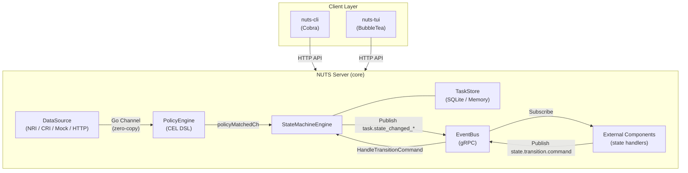
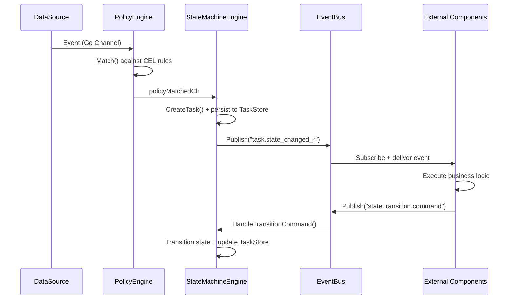

# NUTS

A general-purpose, event-driven task scheduling framework for building reactive automation systems.

## Overview

NUTS is a business-agnostic core framework that decouples **event collection**, **policy matching**, and **task execution** into composable layers. It is designed for scenarios where container lifecycle events (or any other event source) need to trigger configurable, stateful task workflows.

## Architecture



### Data Flow



## Components

| Package | Role | Key Types |
|---------|------|-----------|
| `pkg/core` | Orchestrator — wires all modules together, manages lifecycle | `Core`, `Config` |
| `pkg/datasource` | Event source abstraction with factory pattern | `DataSource`, `DataSourceManager`, `DataSourceFactory` |
| `pkg/policy` | Rule matching engine with DSL support (CEL) | `PolicyEngine`, `Policy`, `PolicyMatch`, `PolicyManager` |
| `pkg/task` | State machine-driven task scheduling and storage | `StateMachineEngine`, `TaskStore`, `Task`, `TimeoutChecker` |
| `pkg/eventbus` | Pub/sub message bus (gRPC server/client, noop) | `EventBus`, `GRPCEventBus`, `EventSerializer` |
| `pkg/component` | Framework for building external state handlers | `Component`, `BaseComponent`, `WorkerPool` |
| `pkg/config` | TOML configuration management | `ConfigManager`, `TOMLConfigManager` |
| `pkg/db` | Generic KV storage abstraction (memory, SQLite) | `DB`, `Factory` |
| `pkg/common` | Shared types: Event, metrics, validators, ID generation | `Event`, `MetricsRecorder` |
| `pkg/log` | Structured logging (Zap-based) | `Logger`, `ZapLogger` |
| `pkg/metrics` | Prometheus metrics with threshold alerting | `PrometheusMetrics`, `AlertMetrics` |
| `pkg/trace` | OpenTelemetry distributed tracing | `InitTracer`, `GetTracer` |
| `pkg/cli` | Cobra-based CLI client | `Execute()` |
| `pkg/tui` | BubbleTea-based terminal UI | `App` |

## Binaries

| Binary | Description |
|--------|-------------|
| `nuts` | Server daemon — core service with HTTP API and gRPC EventBus |
| `nuts-cli` | CLI client — command-line management via HTTP API |
| `nuts-tui` | TUI client — interactive terminal dashboard |
| `component-example` | Example external component demonstrating the component framework |

## Features

- **Interface-first design** — all core components are defined through interfaces, supporting multiple implementations
- **Event-driven architecture** — loose coupling via Go channels (in-process) and gRPC EventBus (cross-process)
- **State machine engine** — configurable task lifecycle with states, transitions, timeouts, and retries
- **Policy engine with CEL** — Google CEL-based rule matching for flexible event filtering
- **Factory pattern** — DataSource, EventBus, DB, and DSL engine all support runtime registration
- **Observability** — Prometheus metrics, OpenTelemetry tracing, structured logging with sampling
- **Dual storage** — in-memory (dev/test) and SQLite (production) backends via `pkg/db`
- **Component framework** — standardized mechanism for building external state handling components with worker pools
- **Graceful shutdown** — atomic double-start/double-stop protection, goroutine wait with configurable grace period

## Quick Start

### Prerequisites

- Go 1.25+
- (Optional) protoc for regenerating protobuf code

### Build

```bash
# Build all binaries
make build

# Or build individually
make build-server    # → build/nuts
make build-cli       # → build/nuts-cli
make build-component-example  # → build/component-example
```

### Run

```bash
# Terminal 1: Start server
./build/nuts --config configs/nuts.toml

# Terminal 2: Use CLI
./build/nuts-cli status
./build/nuts-cli datasource list
./build/nuts-cli policy list

# Terminal 3 (optional): Start TUI
./build/nuts-tui --server tcp://localhost:8080

# Terminal 4 (optional): Run example component
./build/component-example --address tcp://localhost:50051
```

## Configuration

Configuration is TOML-based. See `configs/nuts.toml` for a complete example.

Key sections:

| Section | Description |
|---------|-------------|
| `[global]` | Log level, node ID |
| `[server]` | HTTP listen address (`tcp://` or `unix://`), rate limits |
| `[datasource]` | Active datasource type and per-type config (`mock`, `nri`, `containerd`) |
| `[policy]` | Policy engine type (`cel`), storage backend |
| `[statemachine]` | State definitions, transitions, timeouts, retry rules |
| `[task]` | Task storage (`memory`/`sqlite`), archive retention, scheduler settings |
| `[eventbus]` | EventBus type (`grpc`/`noop`), gRPC listen address |
| `[metrics]` | Prometheus namespace, alert thresholds |
| `[tracing]` | OpenTelemetry OTLP endpoint, sample rate |

## HTTP API

Base URL: `http://localhost:8080`

| Method | Endpoint | Description |
|--------|----------|-------------|
| `GET` | `/api/v1/status` | Service status and uptime |
| `GET/POST` | `/api/v1/tasks` | List tasks / Create task |
| `GET/PUT/DELETE` | `/api/v1/tasks/{id}` | Get / update / delete task |
| `GET` | `/api/v1/statemachine/config` | State machine configuration |
| `GET/POST` | `/api/v1/policies` | List policies / Create policy |
| `GET/PUT/DELETE` | `/api/v1/policies/{id}` | Get / update / delete policy |
| `POST` | `/api/v1/policies/validate` | Validate policy DSL syntax |
| `GET/POST` | `/api/v1/datasources` | List datasources / Create datasource |
| `GET` | `/api/v1/datasources/{id}` | Get datasource details |
| `GET` | `/api/v1/debug/vars` | Runtime debug variables |
| `GET` | `/metrics` | Prometheus metrics (when enabled) |

## Extending NUTS

### Custom DataSource

```go
type MyDataSource struct{}

func (d *MyDataSource) Start(ctx context.Context, eventCh chan<- *common.Event) error { /* ... */ }
func (d *MyDataSource) Stop() error                                                   { /* ... */ }
func (d *MyDataSource) Health() error                                                 { /* ... */ }
func (d *MyDataSource) GetStats() *datasource.DataSourceStats                         { /* ... */ }
func (d *MyDataSource) Ready() <-chan struct{}                                         { /* ... */ }

// Register with factory
datasource.Factory.Register("mytype", parser, validator, creator)
```

### Custom Component (External State Handler)

```go
type MyComponent struct {
    *component.BaseComponent
}

func NewMyComponent(bus eventbus.EventBus) *MyComponent {
    info := component.ComponentInfo{
        Name:         "mycomponent",
        HandlesState: "processing",   // subscribes to task.state_changed_processing
        NextState:    "completed",
        FailureState: "failed",
    }
    comp := &MyComponent{}
    comp.BaseComponent = component.NewBaseComponent(info, config, bus, comp.handleEvent)
    return comp
}

func (c *MyComponent) handleEvent(event *common.Event) error {
    taskID := event.GetPayloadString("task_id")
    // Execute business logic, then publish state transition
    return c.PublishStateTransition(taskID, "processing", "completed", true, "")
}
```

## Testing

```bash
make test            # Run all tests
make test-race       # Run with race detector
make test-coverage   # Generate coverage report (build/coverage.html)
make bench           # Run benchmarks
```

## Project Structure

```
nuts/
├── api/                 # Protobuf definitions and generated code
│   ├── event.proto      # Event type definitions (Pod, Policy, Task, Component payloads)
│   └── eventbus.proto   # gRPC EventBus service definition
├── cmd/
│   ├── nuts/            # Server daemon entry point
│   ├── nuts-cli/        # CLI client entry point
│   ├── nuts-tui/        # TUI client entry point
│   └── component-example/  # Example external component
├── configs/
│   ├── nuts.toml        # Default configuration
│   └── rules.json       # CEL policy rules
├── docs/
│   ├── framework.md     # Detailed framework design document
│   ├── phase-1.md       # Phase 1 implementation plan
│   └── user-guide.md    # User guide
├── pkg/                 # Core packages (see Components table above)
├── scripts/             # Build and utility scripts
├── Makefile             # Build system
└── go.mod               # Go module definition
```

## License

Apache License 2.0
