# 故障分析插件系统架构图

## 1. 系统整体架构

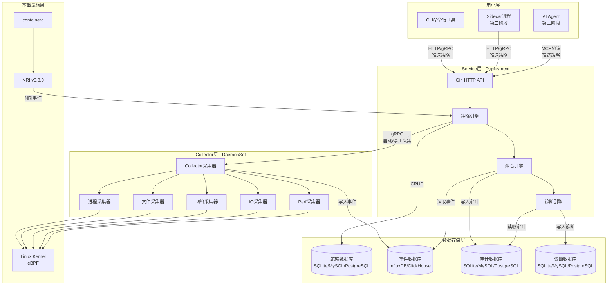

## 2. 数据流向图

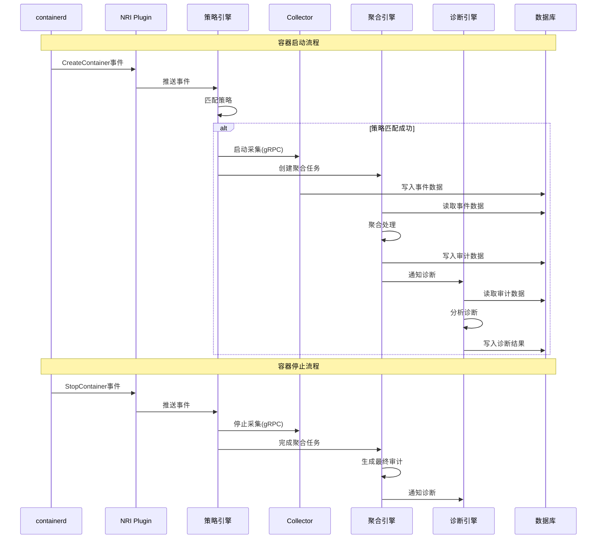

## 3. 策略引擎内部架构

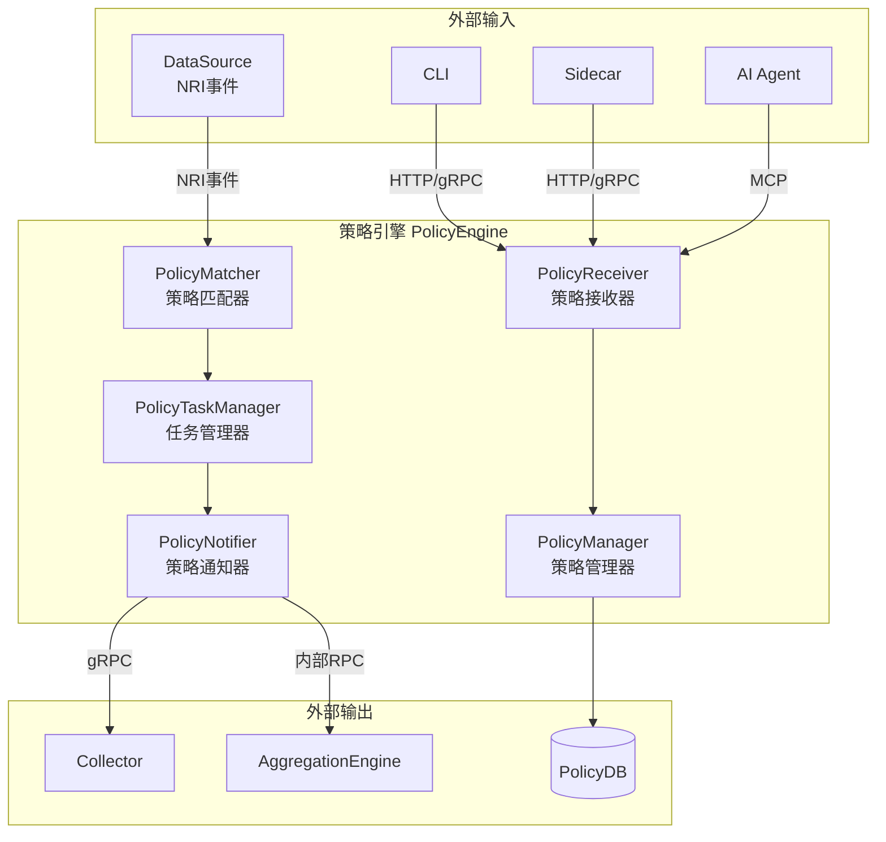

## 4. 任务状态机

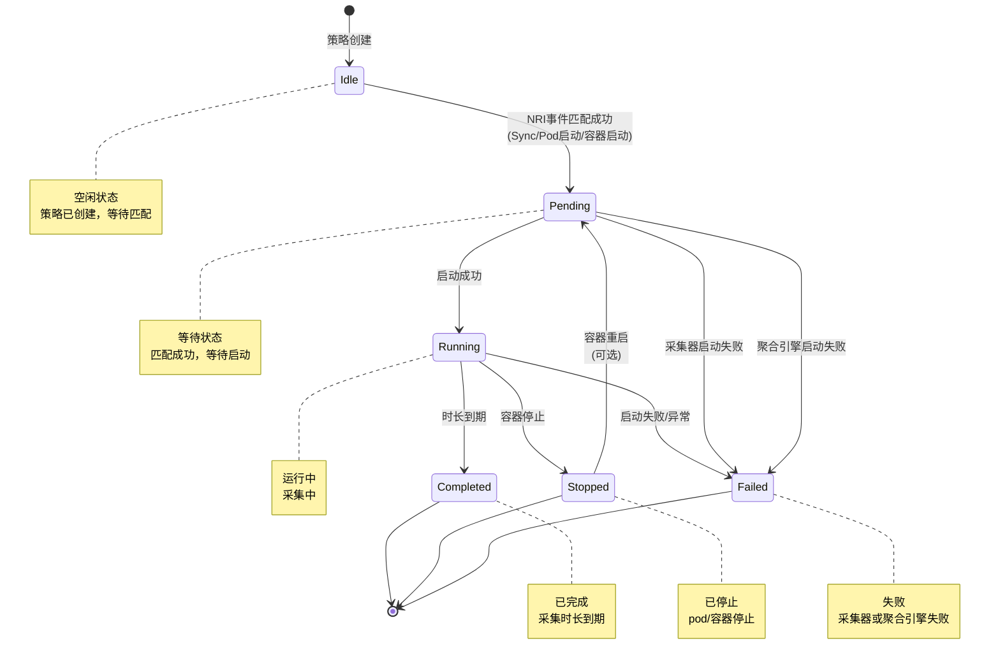

## 5. 采集器架构

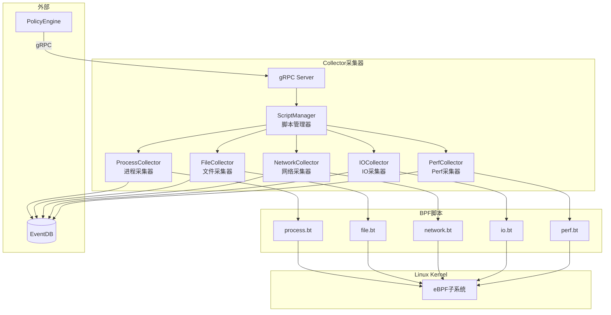

## 6. 聚合引擎架构

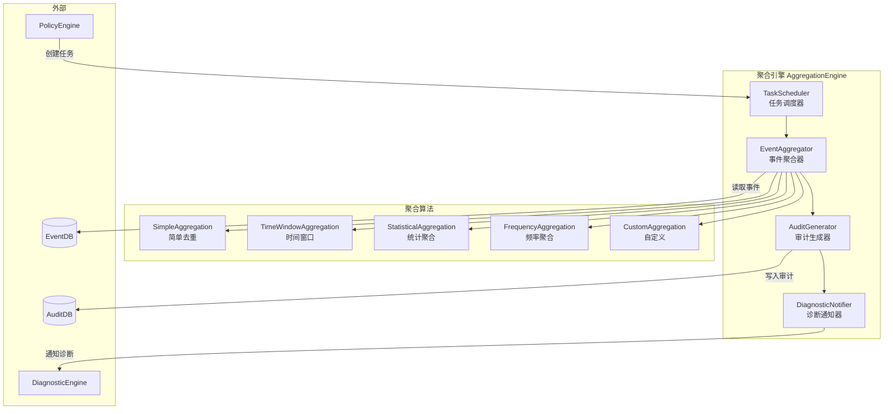

## 7. 诊断引擎架构

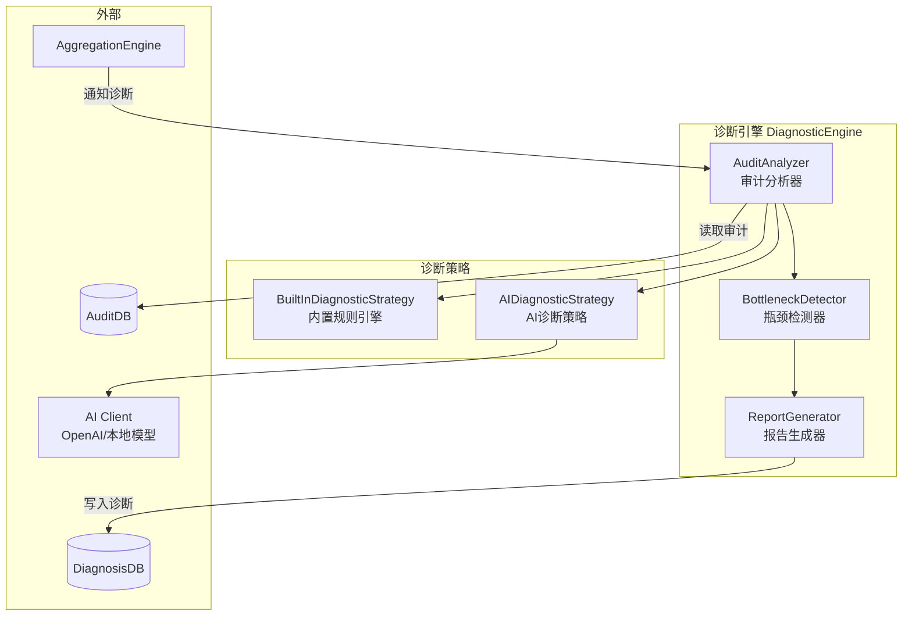

## 8. 部署架构

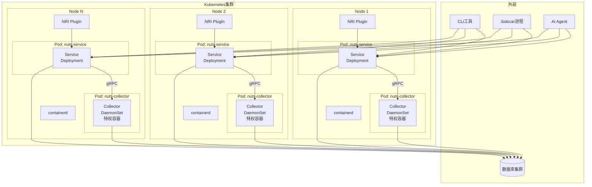

## 9. 接口关系图

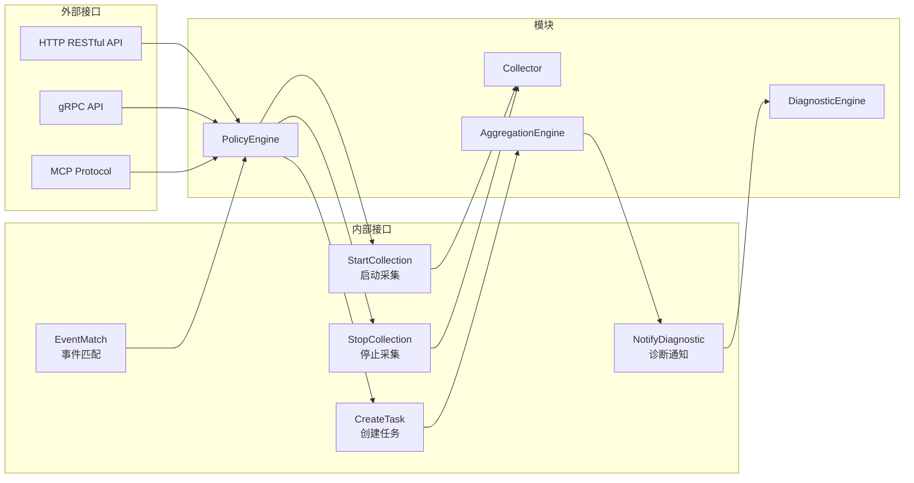

## 10. 数据库架构

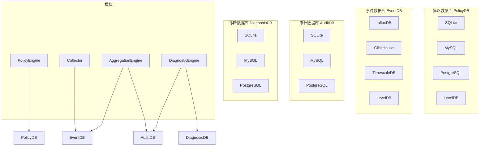

## 11. 开发阶段演进图

```mermaid
graph TB
    subgraph "第一阶段: CLI策略推送 (2个月)"
        CLI1[CLI工具]
        Service1[Service基础框架]
        PolicyEngine1[策略引擎]
        PolicyDB1[(策略数据库)]
    end

    subgraph "第二阶段: Sidecar进程 (1.5个月)"
        NRI[NRI集成]
        DataSource[DataSource模块]
        Collector[Collector采集器]
        AggregationEngine[聚合引擎]
        EventDB[(事件数据库)]
        AuditDB[(审计数据库)]
    end

    subgraph "第三阶段: AI Agent集成 (2个月)"
        DiagnosticEngine[诊断引擎]
        AIAgent[AI Agent]
        DiagnosisDB[(诊断数据库)]
        MCP[MCP协议]
    end

    %% 阶段演进
    第一阶段 --> 第二阶段
    第二阶段 --> 第三阶段

```

## 12. NRI事件处理流程

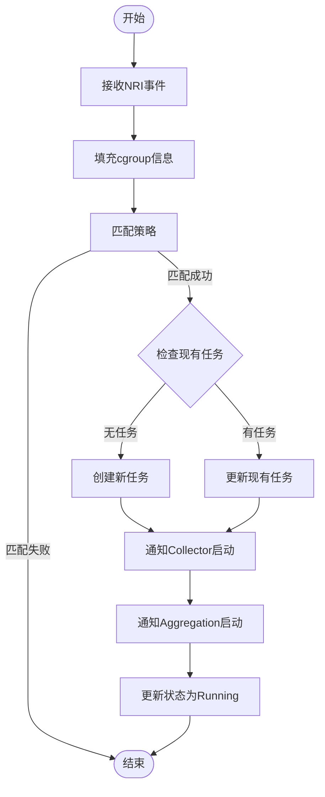

## 13. cgroup获取策略流程

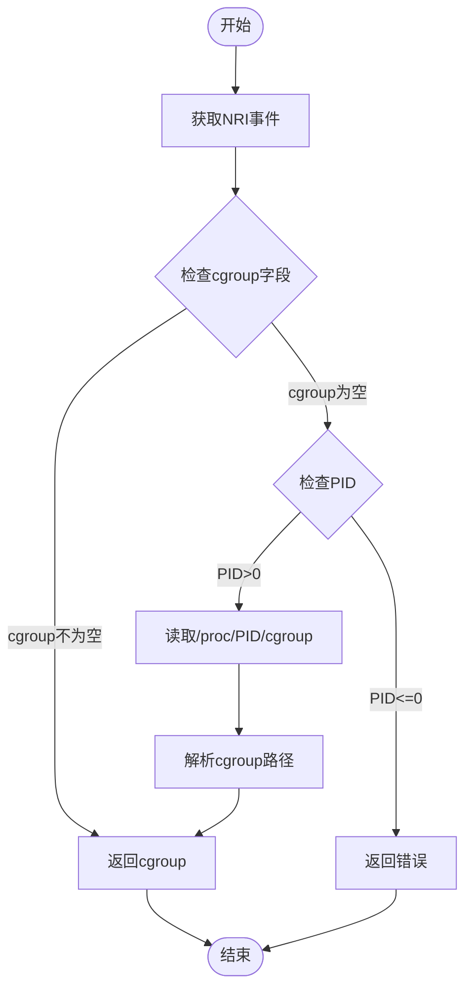

## 14. 错误处理流程

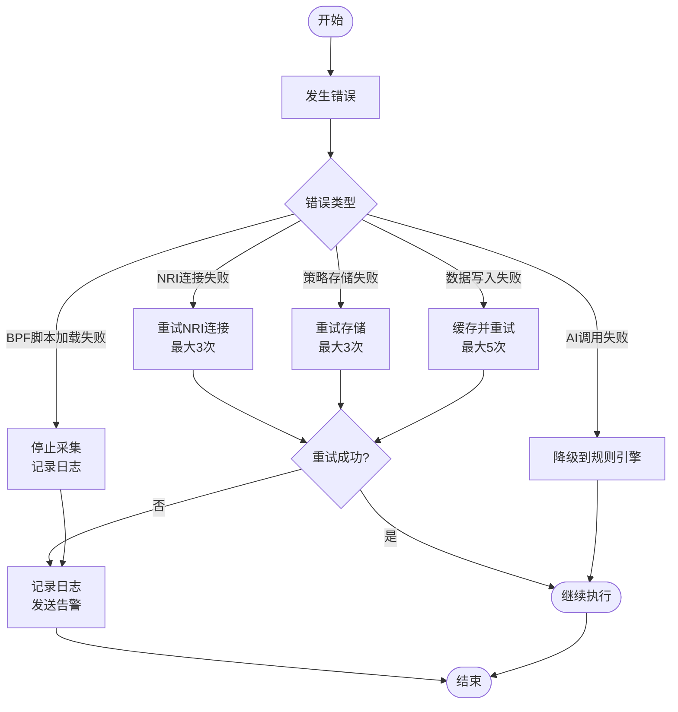

## 图例说明

- **白色背景**：所有模块使用默认白色背景
- **黑色文字**：所有文字使用默认黑色
- **简洁风格**：移除所有颜色填充，采用简洁的黑白风格
