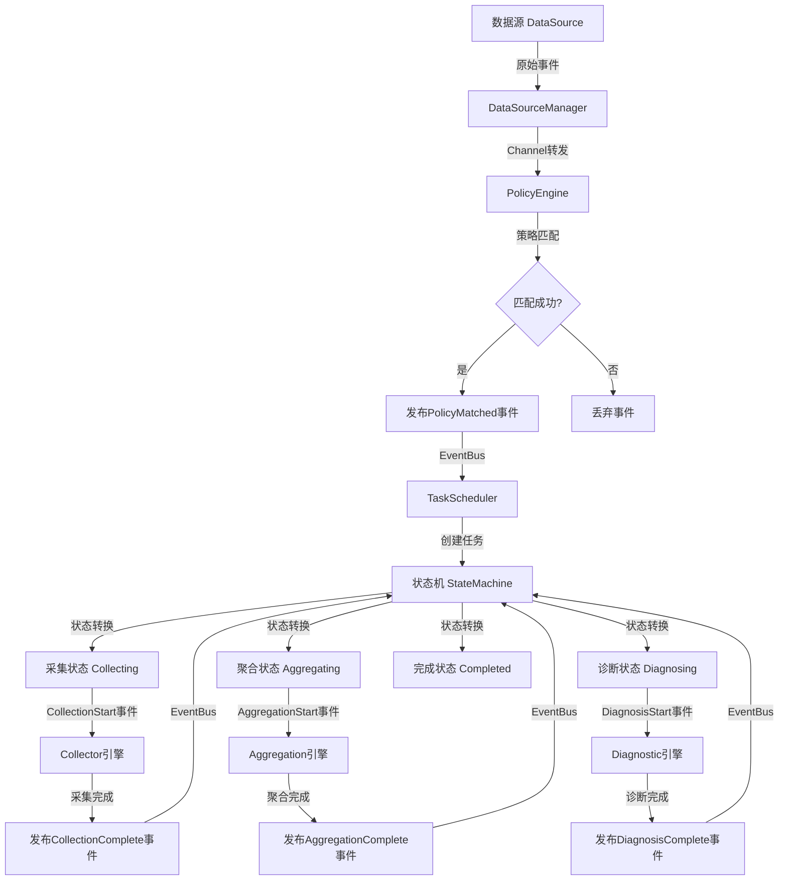

# NUTS 数据流程文档

## 文档说明

本文档描述NUTS框架从数据源到状态转换的完整数据流程，包括事件转换、策略匹配、任务调度、状态机转换等关键环节。

---

## 一、整体流程概览



---

## 二、数据源事件生成与转换

### 2.1 数据源启动

**流程**：
1. DataSourceManager从配置文件读取active字段，确定使用的数据源（如nri、docker）
2. DataSourceManager调用对应数据源的工厂方法创建数据源实例
3. DataSourceManager调用DataSource.Start()启动数据源
4. 数据源开始监听外部事件（如NRI插件监听容器事件，Docker SDK监听Docker事件）

### 2.2 事件生成

**NRI数据源示例**：
```go
// pkg/datasource/nri/nri.go
plugin.OnStart(func(r *api.RunPodSandboxRequest) {
    event := Event{
        Type:      "CreateContainer",
        Timestamp: time.Now(),
        Metadata: map[string]interface{}{
            "container_id":  r.Config.PodSandboxId,
            "pod_id":        r.Config.PodSandboxId,
            "pod_name":      r.Config.PodName,
            "namespace":     r.Config.PodNamespace,
            "cgroup_id":     ds.fillCgroup(r.Pid),
            "pid":           r.Pid,
            "raw_data":      r,
        },
    }
    ds.eventCh <- event
})
```

**Docker数据源示例**：
```go
// pkg/datasource/docker/docker.go
for dockerEvent := range events {
    var eventType string
    switch dockerEvent.Action {
    case "start":
        eventType = "StartContainer"
    case "die":
        eventType = "StopContainer"
    }

    container, _ := ds.client.ContainerInspect(ctx, dockerEvent.Actor.ID)

    event := Event{
        Type:      eventType,
        Timestamp: time.Unix(dockerEvent.Time, 0),
        Metadata: map[string]interface{}{
            "container_id": dockerEvent.Actor.ID,
            "cgroup_id":   fmt.Sprintf("/proc/%d/cgroup", container.State.Pid),
            "pid":         container.State.Pid,
            "raw_data":    dockerEvent,
        },
    }
    ds.eventCh <- event
}
```

### 2.3 事件标准化

**设计原则**：
- 所有数据源产生的事件转换为统一的Event格式
- 包含Type、Timestamp、Metadata等标准字段
- 保留raw_data字段存储原始数据，便于调试

**统一事件格式**：
```go
type Event struct {
    Type      string                 // 事件类型：CreateContainer、StopContainer等
    Timestamp time.Time              // 事件时间戳
    Metadata  map[string]interface{} // 标准化元数据
}
```

---

## 三、数据源与策略引擎交互

### 3.1 混合架构通信

**进程内通信流程**：
1. DataSourceManager调用DataSource.Subscribe()获取数据源事件channel
2. DataSourceManager订阅数据源事件channel
3. DataSourceManager将事件通过内部channel转发给PolicyEngine
4. PolicyEngine接收事件后调用MatchAll()进行策略匹配

**实现示例**：
```go
// pkg/datasource/manager.go
func (m *DataSourceManagerImpl) Start() error {
    // 启动数据源
    if err := m.active.Start(); err != nil {
        return err
    }

    // 订阅数据源事件
    sourceCh := m.active.Subscribe()

    // 启动事件转发goroutine
    go func() {
        for event := range sourceCh {
            // 转发给策略引擎
            if m.policyEngine != nil {
                m.eventCh <- event
            }
        }
    }()

    return nil
}
```

### 3.2 PolicyEngine订阅事件

```go
// pkg/policy/engine.go
func (e *PolicyEngineImpl) Subscribe(eventCh <-chan *common.Event) {
    e.mu.Lock()
    defer e.mu.Unlock()
    e.eventCh = eventCh

    // 启动事件处理goroutine
    go e.processEvents()
}
```

---

## 四、策略匹配

### 4.1 策略定义

**策略结构**：
```go
type Policy struct {
    ID         string                 // 策略ID
    Name       string                 // 策略名称
    DSL        string                 // DSL规则
    TaskConfig map[string]interface{} // 匹配成功后的任务配置
}
```

**DSL规则示例**：
```
event.Type == "CreateContainer" && event.Metadata.namespace == "production"
```

### 4.2 策略匹配流程

**流程**：
1. PolicyEngine从channel接收数据源事件
2. PolicyEngine调用MatchAll()方法，遍历所有策略
3. 对每个策略，调用DSLEngine.Evaluate()进行匹配
4. 匹配成功后，记录MatchResult

**实现示例**：
```go
// pkg/policy/engine.go
func (e *PolicyEngineImpl) processEvents() {
    for {
        select {
        case event := <-e.eventCh:
            // 匹配策略
            results, err := e.MatchAll(event)
            if err != nil {
                log.Printf("MatchAll error: %v", err)
                continue
            }

            // 发布匹配成功的事件
            for _, result := range results {
                if result.Matched {
                    e.publishMatchedEvent(event, result)
                }
            }
        case <-e.stopCh:
            return
        }
    }
}

func (e *PolicyEngineImpl) MatchAll(event *common.Event) ([]*MatchResult, error) {
    e.mu.RLock()
    defer e.mu.RUnlock()

    var results []*MatchResult
    for _, policy := range e.policies {
        matched, err := e.dslEngine.Evaluate(event.Metadata)
        if err != nil {
            continue
        }

        results = append(results, &MatchResult{
            PolicyID:   policy.ID,
            Matched:    matched,
            TaskConfig: policy.TaskConfig,
        })
    }

    return results, nil
}
```

### 4.3 发布匹配成功事件

**事件格式**：
```go
matchedEvent := &common.Event{
    ID:        uuid.New().String(),
    Type:      "PolicyMatched",
    Topic:     "policy.matched",
    Timestamp: time.Now(),
    Payload: map[string]interface{}{
        "original_event": event,
        "policy_id":      result.PolicyID,
        "task_config":    result.TaskConfig,
    },
}
```

**发布到EventBus**：
```go
if err := e.eventBus.Publish("policy.matched", matchedEvent); err != nil {
    log.Printf("Publish PolicyMatched event error: %v", err)
}
```

---

## 五、任务创建与调度

### 5.1 TaskScheduler订阅事件

```go
// pkg/scheduler/scheduler.go
func (s *TaskScheduler) SubscribeEvents() {
    // 订阅策略匹配事件
    policyMatchedCh := s.eventBus.Subscribe("policy.matched")
    go func() {
        for event := range policyMatchedCh {
            s.handlePolicyMatched(event)
        }
    }()

    // 订阅引擎完成事件
    taskCompletedCh := s.eventBus.Subscribe("task.completed")
    go func() {
        for event := range taskCompletedCh {
            s.handleTaskCompleted(event)
        }
    }()
}
```

### 5.2 任务创建

**流程**：
1. TaskScheduler接收到PolicyMatched事件
2. 从事件中提取task_config
3. 生成全局唯一任务ID（使用Snowflake算法）
4. 创建Task对象
5. 初始化状态机，初始状态为Pending

**实现示例**：
```go
// pkg/scheduler/scheduler.go
func (s *TaskScheduler) handlePolicyMatched(event *common.Event) {
    taskConfig := event.Payload["task_config"].(map[string]interface{})
    
    task := &Task{
        ID:        id.GenerateTaskID(),
        CgroupID:  taskConfig["cgroup_id"].(string),
        PolicyID:  event.Payload["policy_id"].(string),
        Duration:  taskConfig["duration"].(int),
        Metrics:   taskConfig["metrics"].([]string),
        Status:    "Pending",
        CreatedAt: time.Now(),
    }

    // 创建状态机
    stateMachine := s.stateMachineFactory.CreateStateMachine(s.stateMachineConfig)
    stateMachine.SetTask(task)

    // 存储任务和状态机
    s.tasks[task.ID] = task
    s.stateMachines[task.ID] = stateMachine

    // 触发状态转换到Collecting
    stateMachine.Transition(Event{Type: "TaskCreated"})
}
```

### 5.3 Snowflake ID生成

**算法特点**：
- 全局唯一
- 趋势递增
- 高性能
- 无需数据库协调

**实现**：
```go
// pkg/common/id/snowflake.go
func (s *Snowflake) Generate() int64 {
    s.mutex.Lock()
    defer s.mutex.Unlock()

    timestamp := time.Now().UnixMilli()

    if timestamp == s.lastTimestamp {
        s.sequence = (s.sequence + 1) & maxSequence
        if s.sequence == 0 {
            timestamp = s.waitNextMillis(s.lastTimestamp)
        }
    } else {
        s.sequence = 0
    }

    s.lastTimestamp = timestamp

    return (timestamp << timestampShift) |
           (s.nodeID << nodeIDShift) |
           s.sequence
}
```

---

## 六、状态机转换

### 6.1 状态机配置

**状态定义**：
```go
type StateMachineConfig struct {
    InitialState string
    States       map[string]StateConfig
    Transitions  map[string][]TransitionConfig
}

type StateConfig struct {
    Handler string
}

type TransitionConfig struct {
    Event string
    To    string
}
```

**示例配置**：
```go
config := &StateMachineConfig{
    InitialState: "Pending",
    States: map[string]StateConfig{
        "Pending":     {Handler: "PendingHandler"},
        "Collecting":  {Handler: "CollectingHandler"},
        "Aggregating": {Handler: "AggregatingHandler"},
        "Diagnosing":  {Handler: "DiagnosingHandler"},
        "Completed":   {Handler: "CompletedHandler"},
    },
    Transitions: map[string][]TransitionConfig{
        "Pending": {
            {Event: "TaskCreated", To: "Collecting"},
        },
        "Collecting": {
            {Event: "CollectionComplete", To: "Aggregating"},
        },
        "Aggregating": {
            {Event: "AggregationComplete", To: "Diagnosing"},
        },
        "Diagnosing": {
            {Event: "DiagnosisComplete", To: "Completed"},
        },
    },
}
```

### 6.2 状态转换流程

**流程**：
1. 状态机接收事件
2. 查找当前状态对应的转换规则
3. 执行当前状态的OnExit()方法
4. 执行目标状态的OnEnter()方法
5. 更新当前状态

**实现示例**：
```go
// pkg/scheduler/state_machine_impl.go
func (sm *StateMachineImpl) Transition(event Event) error {
    sm.mutex.Lock()
    defer sm.mutex.Unlock()

    currentState := sm.currentState
    currentName := currentState.GetName()

    transition := sm.findTransition(currentName, event.Type)
    if transition == nil {
        return fmt.Errorf("no transition defined from %s for event %s", currentName, event.Type)
    }

    targetState := sm.states[transition.To]
    if targetState == nil {
        return fmt.Errorf("target state '%s' not found", transition.To)
    }

    return sm.executeTransition(transition, targetState, event)
}

func (sm *StateMachineImpl) executeTransition(transition *TransitionConfig, targetState *State, event Event) error {
    currentState := sm.currentState

    // 执行当前状态的OnExit
    if err := currentState.OnExit(&StateContext{
        CurrentState:  currentState,
        PreviousState: currentState,
        Event:         event,
    }); err != nil {
        return fmt.Errorf("state exit failed: %w", err)
    }

    // 执行目标状态的OnEnter
    if err := targetState.OnEnter(&StateContext{
        CurrentState:  targetState,
        PreviousState: currentState,
        Event:         event,
    }); err != nil {
        return fmt.Errorf("state enter failed: %w", err)
    }

    sm.currentState = targetState
    return nil
}
```

---

## 七、引擎插件执行

### 7.1 Collecting状态

**OnEnter实现**：
```go
// pkg/scheduler/handlers/collecting.go
func (h *CollectingStateHandler) OnEnter(ctx *StateContext) error {
    event := eventbus.Event{
        Type: "CollectionStart",
        Payload: map[string]interface{}{
            "task_id":   ctx.Task.ID,
            "cgroup_id": ctx.Task.CgroupID,
            "policy_id": ctx.Task.PolicyID,
            "duration":  ctx.Task.Duration,
            "metrics":   ctx.Task.Metrics,
        },
    }
    return h.eventBus.Publish("collection", event)
}
```

**Collector引擎执行**：
1. Collector订阅collection主题
2. 接收CollectionStart事件
3. 根据cgroup_id采集指标数据
4. 持续采集duration秒
5. 发布CollectionComplete事件

### 7.2 Aggregating状态

**OnEnter实现**：
```go
// pkg/scheduler/handlers/aggregating.go
func (h *AggregatingStateHandler) OnEnter(ctx *StateContext) error {
    event := eventbus.Event{
        Type: "AggregationStart",
        Payload: map[string]interface{}{
            "task_id":   ctx.Task.ID,
            "cgroup_id": ctx.Task.CgroupID,
        },
    }
    return h.eventBus.Publish("aggregation", event)
}
```

**Aggregation引擎执行**：
1. AggregationEngine订阅aggregation主题
2. 接收AggregationStart事件
3. 从数据库查询采集的数据
4. 进行聚合计算（平均值、最大值、最小值等）
5. 发布AggregationComplete事件

### 7.3 Diagnosing状态

**OnEnter实现**：
```go
// pkg/scheduler/handlers/diagnosing.go
func (h *DiagnosingStateHandler) OnEnter(ctx *StateContext) error {
    event := eventbus.Event{
        Type: "DiagnosisStart",
        Payload: map[string]interface{}{
            "task_id":   ctx.Task.ID,
            "cgroup_id": ctx.Task.CgroupID,
        },
    }
    return h.eventBus.Publish("diagnosis", event)
}
```

**Diagnostic引擎执行**：
1. DiagnosticEngine订阅diagnosis主题
2. 接收DiagnosisStart事件
3. 从数据库查询聚合数据
4. 应用诊断规则（如CPU使用率超过阈值）
5. 生成诊断报告
6. 发布DiagnosisComplete事件

### 7.4 Completed状态

**OnEnter实现**：
```go
// pkg/scheduler/handlers/completed.go
func (h *CompletedStateHandler) OnEnter(ctx *StateContext) error {
    // 更新任务状态
    ctx.Task.Status = "Completed"
    ctx.Task.CompletedAt = time.Now()

    // 持久化任务结果
    if err := h.taskStorage.Save(ctx.Task); err != nil {
        return err
    }

    return nil
}
```

---

## 八、事件总线通信

### 8.1 跨进程事件流

**EventBus架构**：
- **服务端**：TaskScheduler管理EventBus服务端
- **客户端**：Collector、AggregationEngine、DiagnosticEngine作为客户端连接

**事件主题**：
- `policy.matched` - 策略匹配成功事件
- `collection` - 采集相关事件
- `aggregation` - 聚合相关事件
- `diagnosis` - 诊断相关事件
- `task.completed` - 任务完成事件

### 8.2 gRPC EventBus实现（单节点）

**适用场景**：单节点部署，无需额外基础设施

**特点**：
- 强类型定义（Protocol Buffers）
- 流式通信支持
- 天然支持跨进程通信
- 易于调试和监控

### 8.3 Redis EventBus实现（多节点）

**适用场景**：多节点部署，已有Redis基础设施

**特点**：
- 利用Redis Pub/Sub机制
- 支持分布式部署
- 性能较好，延迟低
- 消息不持久化

### 8.4 Kafka EventBus实现（大规模）

**适用场景**：大规模分布式部署，需要高吞吐量和持久化

**特点**：
- 支持分布式部署
- 高吞吐量，持久化存储
- 支持消费者组，实现负载均衡

---

## 九、完整数据流示例

### 9.1 场景：生产环境容器启动触发采集

**步骤1：数据源产生事件**
```
NRI数据源检测到容器启动
↓
生成CreateContainer事件
{
    Type: "CreateContainer",
    Timestamp: 2024-01-01T10:00:00Z,
    Metadata: {
        container_id: "abc123",
        pod_id: "pod-xyz",
        pod_name: "my-app",
        namespace: "production",
        cgroup_id: "/proc/1234/cgroup",
        pid: 1234
    }
}
```

**步骤2：DataSourceManager转发事件**
```
DataSourceManager接收NRI事件
↓
通过Channel转发给PolicyEngine
```

**步骤3：PolicyEngine匹配策略**
```
PolicyEngine接收事件
↓
执行DSL规则: event.Type == "CreateContainer" && event.Metadata.namespace == "production"
↓
匹配成功
↓
发布PolicyMatched事件到EventBus
{
    Type: "PolicyMatched",
    Topic: "policy.matched",
    Payload: {
        original_event: {...},
        policy_id: "prod-collect-policy",
        task_config: {
            cgroup_id: "/proc/1234/cgroup",
            duration: 60,
            metrics: ["cpu", "memory", "io"]
        }
    }
}
```

**步骤4：TaskScheduler创建任务**
```
TaskScheduler订阅policy.matched主题
↓
接收PolicyMatched事件
↓
生成任务ID: 1234567890123456789
↓
创建Task对象
↓
初始化状态机，初始状态: Pending
↓
触发TaskCreated事件
```

**步骤5：状态转换到Collecting**
```
状态机接收TaskCreated事件
↓
执行Pending状态OnExit
↓
执行Collecting状态OnEnter
↓
发布CollectionStart事件到EventBus
{
    Type: "CollectionStart",
    Topic: "collection",
    Payload: {
        task_id: "1234567890123456789",
        cgroup_id: "/proc/1234/cgroup",
        duration: 60,
        metrics: ["cpu", "memory", "io"]
    }
}
```

**步骤6：Collector执行采集**
```
Collector订阅collection主题
↓
接收CollectionStart事件
↓
启动eBPF采集器
↓
采集/proc/1234/cgroup的cpu、memory、io指标
↓
持续60秒
↓
数据写入数据库
↓
发布CollectionComplete事件到EventBus
{
    Type: "CollectionComplete",
    Topic: "collection",
    Payload: {
        task_id: "1234567890123456789"
    }
}
```

**步骤7：状态转换到Aggregating**
```
状态机接收CollectionComplete事件
↓
执行Collecting状态OnExit
↓
执行Aggregating状态OnEnter
↓
发布AggregationStart事件到EventBus
```

**步骤8：AggregationEngine执行聚合**
```
AggregationEngine订阅aggregation主题
↓
接收AggregationStart事件
↓
从数据库查询采集数据
↓
计算平均值、最大值、最小值
↓
聚合结果写入数据库
↓
发布AggregationComplete事件到EventBus
```

**步骤9：状态转换到Diagnosing**
```
状态机接收AggregationComplete事件
↓
执行Aggregating状态OnExit
↓
执行Diagnosing状态OnEnter
↓
发布DiagnosisStart事件到EventBus
```

**步骤10：DiagnosticEngine执行诊断**
```
DiagnosticEngine订阅diagnosis主题
↓
接收DiagnosisStart事件
↓
从数据库查询聚合数据
↓
应用诊断规则
↓
生成诊断报告
↓
发布DiagnosisComplete事件到EventBus
```

**步骤11：状态转换到Completed**
```
状态机接收DiagnosisComplete事件
↓
执行Diagnosing状态OnExit
↓
执行Completed状态OnEnter
↓
更新任务状态为Completed
↓
持久化任务结果
```

---

## 十、性能优化

### 10.1 进程内通信优化

**Channel通信优势**：
- 零拷贝，数据在内存中直接传递
- 无序列化开销
- 无网络延迟
- 适合高频数据源（如NRI监控）

### 10.2 EventBus性能优化

**gRPC优化**：
- 使用流式通信，减少连接建立开销
- Protobuf序列化，高效且跨语言

**Redis优化**：
- Pub/Sub机制，低延迟
- 连接池复用

**Kafka优化**：
- 批量发送消息
- 消费者组负载均衡
- 持久化存储，支持重放

### 10.3 状态机优化

**并发处理**：
- 每个任务独立状态机
- 状态转换使用读写锁
- 事件处理异步化

---

## 十一、错误处理

### 11.1 数据源错误

**错误场景**：
- 数据源连接失败
- 数据源事件channel阻塞

**处理策略**：
- 重试机制
- 降级到备用数据源
- 记录错误日志

### 11.2 策略匹配错误

**错误场景**：
- DSL规则解析失败
- DSL执行超时

**处理策略**：
- 跳过失败策略
- 记录错误日志
- 告警通知

### 11.3 状态机错误

**错误场景**：
- 状态转换失败
- 状态处理器执行失败

**处理策略**：
- 回滚到上一个状态
- 标记任务为Failed
- 记录错误日志

### 11.4 引擎插件错误

**错误场景**：
- 插件连接EventBus失败
- 插件执行超时

**处理策略**：
- 重试机制
- 超时取消任务
- 记录错误日志

---

## 十二、监控与调试

### 12.1 事件追踪

**TraceID机制**：
- 每个事件携带TraceID
- 跨组件追踪事件流转
- 便于问题定位

### 12.2 指标监控

**关键指标**：
- 数据源事件速率
- 策略匹配成功率
- 任务执行时长
- 状态转换次数
- EventBus消息延迟

### 12.3 日志记录

**日志级别**：
- DEBUG：详细的事件流转
- INFO：关键状态转换
- WARN：策略匹配失败
- ERROR：任务执行失败

---

## 附录

### A. 配置示例

**数据源配置**：
```yaml
datasource:
  active: "nri"
  nri:
    socket_path: "/var/run/nri.sock"
  docker:
    host: "unix:///var/run/docker.sock"
```

**EventBus配置**：
```yaml
eventbus:
  type: "grpc"
  address: "localhost:9090"
```

**引擎配置**：
```yaml
engines:
  collector:
    enabled: true
    eventbus:
      type: "grpc"
      address: "localhost:9090"
    config:
      interval: 60
```

### B. 接口定义

**DataSource接口**：
```go
type DataSource interface {
    Name() string
    Start() error
    Stop() error
    Subscribe() <-chan Event
}
```

**PolicyEngine接口**：
```go
type PolicyEngine interface {
    Subscribe(eventCh <-chan *common.Event)
    MatchAll(event *common.Event) ([]*MatchResult, error)
}
```

**EventBus接口**：
```go
type EventBus interface {
    Publish(topic string, event Event) error
    Subscribe(topic string) <-chan Event
    Unsubscribe(topic string) error
    Close() error
}
```
