# NUTS 通用框架设计文档

## 前言

### 文档目录

| 章节                                 | 内容概述                                               |
| ---------------------------------- | -------------------------------------------------- |
| [一、通用数据结构定义](#一通用数据结构定义)           | Event统一结构定义、TraceID传播机制                            |
| [二、数据源接口抽象设计](#二数据源接口抽象设计)         | DataSource接口、自动重连、缓冲背压、健康检查整合                      |
| [三、策略引擎接口抽象设计](#三策略引擎接口抽象设计)       | PolicyEngine、DSLEngine接口、规则匹配流程、工厂配置设计             |
| [四、任务调度模块设计](#四任务调度模块设计)           | TaskScheduler、StateMachine、IDGenerator、任务生命周期、资源限制 |
| [五、工作流编排模块设计](#五工作流编排模块设计)         | Workflow DAG编排、拓扑排序、状态双轨制、并行执行                   |
| [六、EventBus通信层设计](#六eventbus通信层设计) | EventBus接口、gRPC/Redis/Kafka实现、事件序列化、限流背压           |
| [七、配置管理设计](#七配置管理设计)               | ConfigManager接口、热更新、配置验证                           |
| [八、目录结构设计](#八目录结构设计)               | 标准Go项目目录结构                                         |
| [九、启动流程设计](#九启动流程设计)               | 组件初始化顺序、依赖关系、Graceful Shutdown                     |
| [十、错误处理设计](#十错误处理设计)               | 错误类型、错误码定义、错误传播机制                                  |
| [十一、健康检查与监控](#十一健康检查与监控)             | HealthChecker接口、HealthRegistry、健康检查实现、Prometheus指标 |
| [十二、日志设计](#十二日志设计)                 | Logger接口、日志配置、结构化日志                                |
| [十三、完整配置示例](#十三完整配置示例)             | nuts.toml完整示例及字段说明                                 |
| [十四、安全设计](#十四安全设计)                 | TLS加密、配置加密、权限控制                                    |
| [十五、测试指导](#十五测试指导)                 | Mock实现、单元测试、集成测试、压力测试                              |
| [十六、CLI工具开发](#十六cli工具开发)           | 命令行工具结构、使用示例、核心功能实现                           |

### 设计思路

NUTS通用框架是一个与业务逻辑无关的核心框架，用于构建基于事件驱动的任务调度系统。

**核心设计原则**：

1. **接口抽象优先**：所有核心组件通过接口定义，支持多种实现
2. **事件驱动架构**：基于事件总线实现组件间松耦合通信
3. **配置驱动**：通过配置文件控制行为，减少硬编码
4. **工厂模式**：使用工厂注册模式支持动态扩展
5. **开闭原则**：对扩展开放，对修改关闭

**架构特点**：

- **单进程部署**：数据源、策略引擎、任务调度在同一进程内
- **混合通信**：
  - 数据源 → 策略引擎：通过Go Channel直接通信（零拷贝，高性能）
  - 策略引擎 → 任务调度：通过EventBus通信（gRPC默认，可扩展Redis/Kafka）
  - 任务调度内部：状态机通过EventBus驱动
- **单实例生效**：每个模块支持多种实现，但同一时刻只有一个生效

**框架定位**：

- 与具体业务逻辑无关
- 提供通用的数据源、策略引擎、任务调度基础设施
- 支持单进程部署，通过EventBus支持分布式扩展
- 可通过插件机制扩展具体实现

### 整体架构

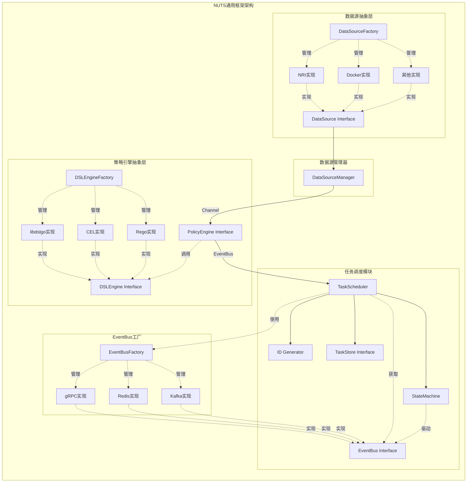
```mermaid
graph LR
    subgraph NUTS通用框架架构
        subgraph 数据源抽象层
            DS[DataSource Interface]
            DSF[DataSourceFactory]
            DSF -.管理.-> DS1[NRI实现]
            DSF -.管理.-> DS2[Docker实现]
            DSF -.管理.-> DS3[其他实现]
            DS1 -.实现.-> DS
            DS2 -.实现.-> DS
            DS3 -.实现.-> DS
        end

        subgraph 数据源管理器
            DSM[DataSourceManager]
        end

        subgraph 策略引擎抽象层
            PE[PolicyEngine Interface]
            DSE[DSLEngine Interface]
            DSEF[DSLEngineFactory]
            DSEF -.管理.-> DE1[libdslgo实现]
            DSEF -.管理.-> DE2[CEL实现]
            DSEF -.管理.-> DE3[Rego实现]
            DE1 -.实现.-> DSE
            DE2 -.实现.-> DSE
            DE3 -.实现.-> DSE
        end

        subgraph 任务调度模块
            TS[TaskScheduler]
            SM[StateMachine]
            IDG[ID Generator]
            TStore[TaskStore Interface]
            EB[EventBus Interface]
        end

        subgraph EventBus工厂
            EBF[EventBusFactory]
            EBF -.管理.-> EB1[gRPC实现]
            EBF -.管理.-> EB2[Redis实现]
            EBF -.管理.-> EB3[Kafka实现]
            EB1 -.实现.-> EB
            EB2 -.实现.-> EB
            EB3 -.实现.-> EB
        end
    end

    DS --> DSM
    DSM -->|Channel| PE
    PE -.调用.-> DSE
    PE -->|EventBus| TS
    TS --> SM
    TS --> IDG
    TS --> TStore
    TS -.获取.-> EB
    SM -.驱动.-> EB
    TS -.使用.-> EBF
```

### 核心组件

1. **数据源抽象层**：提供DataSource接口和DataSourceFactory，工厂管理具体数据源实现（NRI、Docker等）
2. **策略引擎抽象层**：提供PolicyEngine接口和DSLEngine接口，DSLEngineFactory管理具体DSL引擎实现（libdslgo、CEL、Rego等）
3. **任务调度模块**：TaskScheduler作为核心调度器，包含StateMachine、TaskStore、IDGenerator，通过接口使用EventBus，实现任务全生命周期管理

### 数据流

```
数据源（如NRI） → Channel → 策略引擎（规则匹配） → EventBus(gRPC) → 任务调度（创建任务） → 状态机（EventBus驱动）
```

### 设计优势

- **业务无关**：框架与具体业务逻辑解耦，可复用于不同场景
- **可扩展**：通过接口抽象和工厂模式支持动态扩展
- **可配置**：通过配置文件控制行为，无需修改代码
- **高性能**：进程内使用Channel避免序列化开销
- **可扩展**：通过EventBus支持分布式部署

---

## 一、通用数据结构定义

### 1.1 统一Event结构

为了确保各模块使用统一的事件格式，定义通用的Event结构。

```go
// pkg/common/event.go
package common

import "time"

// Event 统一事件结构
type Event struct {
    // ID 事件ID
    ID string `json:"id"`

    // Type 事件类型
    Type string `json:"type"`

    // Topic 事件主题
    Topic string `json:"topic"`

    // Timestamp 时间戳
    Timestamp time.Time `json:"timestamp"`

    // Payload 事件载荷
    Payload map[string]interface{} `json:"payload"`

    // TraceID 链路追踪ID
    TraceID string `json:"trace_id,omitempty"`

    // Source 事件来源
    Source string `json:"source,omitempty"`

    // Version 事件版本（用于版本管理）
    Version string `json:"version,omitempty"`
}
```

### 1.1.1 通用API响应结构

各模块对外提供HTTP API时，使用统一的响应格式。

```go
// pkg/common/api.go
package common

import "time"

// APIResponse 统一API响应结构
type APIResponse struct {
    // Code 业务状态码（非HTTP状态码）
    Code int `json:"code"`

    // Message 人类可读的消息
    Message string `json:"message"`

    // Data 响应数据（成功时）
    Data interface{} `json:"data,omitempty"`

    // RequestID 请求追踪ID
    RequestID string `json:"request_id"`

    // Timestamp 响应时间戳
    Timestamp time.Time `json:"timestamp"`
}

// APIError 错误详情（失败时Data字段使用此类型）
type APIError struct {
    // Code 错误码
    Code int `json:"code"`

    // Message 错误消息
    Message string `json:"message"`

    // Field 相关字段（校验错误时使用）
    Field string `json:"field,omitempty"`

    // Details 详细错误信息
    Details string `json:"details,omitempty"`
}

// Success 构造成功响应
func Success(data interface{}) *APIResponse {
    return &APIResponse{
        Code:      0,
        Message:   "success",
        Data:      data,
        RequestID: GetRequestID(),
        Timestamp: time.Now(),
    }
}

// Error 构造错误响应
func Error(code int, message string) *APIResponse {
    return &APIResponse{
        Code:      code,
        Message:   message,
        RequestID: GetRequestID(),
        Timestamp: time.Now(),
    }
}

// Errorf 构造带格式的错误响应
func Errorf(code int, format string, args ...interface{}) *APIResponse {
    return Error(code, fmt.Sprintf(format, args...))
}

// GetRequestID 从context中获取或生成RequestID
func GetRequestID() string {
    // 实现略：从context获取，不存在则生成UUID
    return GenerateUUID()
}
```

### 1.1.2 通用元数据结构

嵌入到各业务结构，提供统一的创建/更新时间、版本控制等能力。

```go
// pkg/common/metadata.go
package common

import "time"

// Metadata 通用元数据（嵌入到各业务结构）
type Metadata struct {
    // ID 唯一标识
    ID string `json:"id"`

    // CreatedAt 创建时间
    CreatedAt time.Time `json:"created_at"`

    // UpdatedAt 更新时间
    UpdatedAt time.Time `json:"updated_at"`

    // CreatedBy 创建者
    CreatedBy string `json:"created_by,omitempty"`

    // UpdatedBy 更新者
    UpdatedBy string `json:"updated_by,omitempty"`

    // Version 乐观锁版本号
    Version int64 `json:"version"`

    // Labels 标签（用于筛选）
    Labels map[string]string `json:"labels,omitempty"`

    // Annotations 注解（非筛选元数据）
    Annotations map[string]string `json:"annotations,omitempty"`
}

// BeforeCreate 创建前自动填充
func (m *Metadata) BeforeCreate() {
    if m.ID == "" {
        m.ID = GenerateUUID()
    }
    now := time.Now()
    m.CreatedAt = now
    m.UpdatedAt = now
    m.Version = 1
}

// BeforeUpdate 更新前自动填充
func (m *Metadata) BeforeUpdate() {
    m.UpdatedAt = time.Now()
    m.Version++
}

// GenerateUUID 生成UUID（简化实现）
func GenerateUUID() string {
    // 实际使用 github.com/google/uuid
    return uuid.New().String()
}
```

### 1.2 框架错误码定义

统一定义框架级错误码，避免各模块重复冲突。

```go
// pkg/common/errorcode.go
package common

// ErrorCode 错误码定义
type ErrorCode int

const (
    // 成功
    CodeSuccess ErrorCode = 0

    // 系统级错误 (1-999)
    CodeInternalError      ErrorCode = 1  // 内部错误
    CodeInvalidParam       ErrorCode = 2  // 参数错误
    CodeUnauthorized       ErrorCode = 3  // 未授权
    CodeForbidden          ErrorCode = 4  // 禁止访问
    CodeNotFound           ErrorCode = 5  // 资源不存在
    CodeAlreadyExists      ErrorCode = 6  // 资源已存在
    CodeServiceUnavailable ErrorCode = 7  // 服务不可用
    CodeTimeout            ErrorCode = 8  // 超时
    CodeRateLimited        ErrorCode = 9  // 限流

    // 数据源错误 (1000-1999)
    CodeDataSourceNotFound    ErrorCode = 1000 // 数据源不存在
    CodeDataSourceConnectFail ErrorCode = 1001 // 数据源连接失败
    CodeDataSourceAuthFail    ErrorCode = 1002 // 数据源认证失败
    CodeDataSourceTimeout     ErrorCode = 1003 // 数据源超时

    // 策略引擎错误 (2000-2999)
    CodePolicyNotFound    ErrorCode = 2000 // 策略不存在
    CodePolicyInvalidDSL  ErrorCode = 2001 // DSL语法错误
    CodePolicyCompileFail ErrorCode = 2002 // 策略编译失败

    // 任务调度错误 (3000-3999)
    CodeTaskNotFound        ErrorCode = 3000 // 任务不存在
    CodeTaskInvalidState    ErrorCode = 3001 // 任务状态无效
    CodeTaskCreateFail      ErrorCode = 3002 // 任务创建失败
    CodeTaskResourceExhaust ErrorCode = 3003 // 任务资源耗尽

    // EventBus错误 (4000-4999)
    CodeEventBusConnectFail ErrorCode = 4000 // EventBus连接失败
    CodeEventPublishFail    ErrorCode = 4001 // 事件发布失败

    // 配置错误 (5000-5999)
    CodeConfigInvalid   ErrorCode = 5000 // 配置无效
    CodeConfigMissing   ErrorCode = 5001 // 配置缺失
    CodeConfigParseFail ErrorCode = 5002 // 配置解析失败
)

// ErrorCodeToHTTPStatus 错误码转HTTP状态码
func ErrorCodeToHTTPStatus(code ErrorCode) int {
    switch {
    case code == CodeSuccess:
        return 200
    case code == CodeInvalidParam:
        return 400
    case code == CodeUnauthorized:
        return 401
    case code == CodeForbidden:
        return 403
    case code == CodeNotFound:
        return 404
    case code == CodeAlreadyExists:
        return 409
    case code == CodeRateLimited:
        return 429
    case code >= CodeInternalError && code < 1000:
        return 500
    default:
        return 500
    }
}

// String 返回错误码描述
func (c ErrorCode) String() string {
    switch c {
    case CodeSuccess:
        return "success"
    case CodeInternalError:
        return "internal error"
    case CodeNotFound:
        return "resource not found"
    case CodeDataSourceNotFound:
        return "datasource not found"
    case CodeTaskNotFound:
        return "task not found"
    default:
        return "unknown error"
    }
}
```

### 1.3 资源引用结构

统一各模块对Pod/Container/Node等资源的引用格式。

```go
// pkg/common/resource.go
package common

// ResourceRef 通用资源引用
type ResourceRef struct {
    // Kind 资源类型（Pod/Container/Node等）
    Kind string `json:"kind"`

    // Name 资源名称
    Name string `json:"name"`

    // Namespace 命名空间（可选）
    Namespace string `json:"namespace,omitempty"`

    // UID 资源唯一ID
    UID string `json:"uid,omitempty"`
}

// PodRef Pod资源引用
type PodRef struct {
    Name      string            `json:"name"`
    Namespace string            `json:"namespace"`
    UID       string            `json:"uid"`
    NodeName  string            `json:"node_name,omitempty"`
    IP        string            `json:"ip,omitempty"`
    Labels    map[string]string `json:"labels,omitempty"`
}

// ContainerRef 容器资源引用
type ContainerRef struct {
    Name    string `json:"name"`
    ID      string `json:"id"` // 运行时容器ID
    Image   string `json:"image"`
    Runtime string `json:"runtime"` // docker/containerd等
    PodRef  PodRef `json:"pod,omitempty"`
}

// NodeRef 节点资源引用
type NodeRef struct {
    Name   string            `json:"name"`
    UID    string            `json:"uid"`
    IP     string            `json:"ip"`
    Labels map[string]string `json:"labels,omitempty"`
}
```

### 1.4 通用工具函数

```go
// pkg/common/utils.go
package common

import "strings"

// TruncateString 截断字符串（用于日志/展示）
func TruncateString(s string, maxLen int) string {
    if len(s) <= maxLen {
        return s
    }
    return s[:maxLen] + "..."
}

// DeepCopy 深度拷贝map（避免引用共享）
func DeepCopy(src map[string]interface{}) map[string]interface{} {
    dst := make(map[string]interface{}, len(src))
    for k, v := range src {
        // 简化实现，实际需递归处理嵌套map/slice
        dst[k] = v
    }
    return dst
}

// MergeMaps 合并多个map（后面的覆盖前面的）
func MergeMaps(maps ...map[string]string) map[string]string {
    result := make(map[string]string)
    for _, m := range maps {
        for k, v := range m {
            result[k] = v
        }
    }
    return result
}

// ContainsString 检查字符串是否在切片中
func ContainsString(slice []string, str string) bool {
    for _, s := range slice {
        if s == str {
            return true
        }
    }
    return false
}

// RemoveEmptyStrings 移除空字符串
func RemoveEmptyStrings(slice []string) []string {
    result := make([]string, 0, len(slice))
    for _, s := range slice {
        if strings.TrimSpace(s) != "" {
            result = append(result, s)
        }
    }
    return result
}
```

---

## 二、数据源接口抽象设计

### 2.1 设计目标

为了支持多种数据源（NRI、Docker SDK、containerd SDK等），需要对数据源进行接口抽象，实现以下目标：

1. **统一接口**：定义统一的数据源接口，屏蔽底层实现差异
2. **可配置性**：通过配置文件选择和配置数据源
3. **可扩展性**：支持动态添加新的数据源实现
4. **数据标准化**：统一不同数据源的事件格式
5. **高可用性**：支持自动重连、健康检查、优雅关闭
6. **流量控制**：支持事件缓冲、背压控制、防止内存溢出

### 2.2 整体架构流程

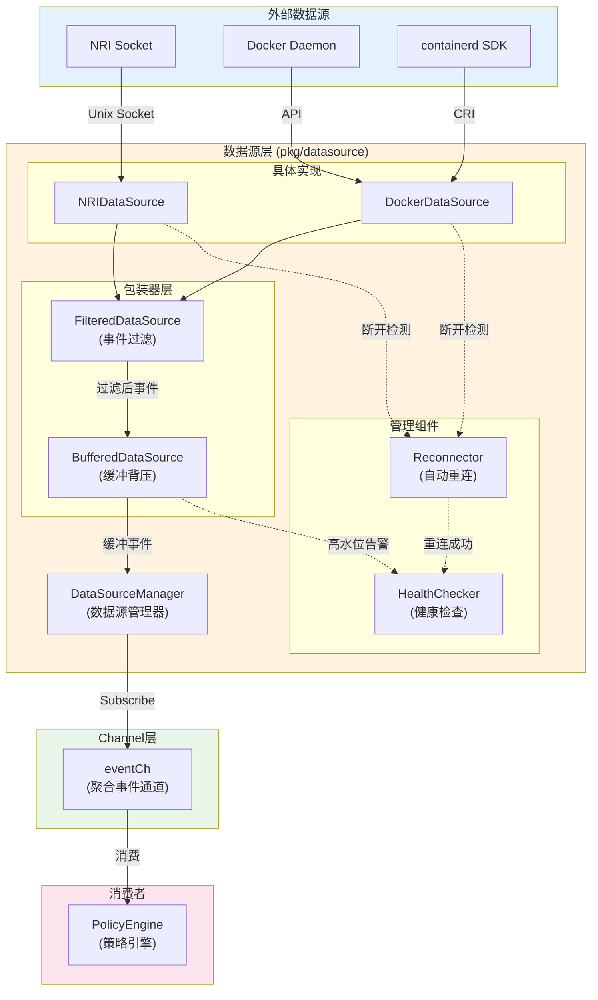
```mermaid
flowchart TB
    subgraph External["外部数据源"]
        NRI["NRI Socket"]
        Docker["Docker Daemon"]
        Containerd["containerd SDK"]
    end

    subgraph DataSourceLayer["数据源层 (pkg/datasource)"]
        direction TB

        subgraph Impl["具体实现"]
            NRIDS["NRIDataSource"]
            DockerDS["DockerDataSource"]
        end

        subgraph Wrapper["包装器层"]
            Filter["FilteredDataSource\n(事件过滤)"]
            Buffer["BufferedDataSource\n(缓冲背压)"]
        end

        subgraph Management["管理组件"]
            Reconn["Reconnector\n(自动重连)"]
            Health["HealthChecker\n(健康检查)"]
        end

        DSM["DataSourceManager\n(数据源管理器)"]
    end

    subgraph ChannelLayer["Channel层"]
        EventCh["eventCh\n(聚合事件通道)"]
    end

    subgraph Consumer["消费者"]
        PE["PolicyEngine\n(策略引擎)"]
    end

    NRI -->|"Unix Socket"| NRIDS
    Docker -->|"API"| DockerDS
    Containerd -->|"CRI"| DockerDS

    NRIDS --> Filter
    DockerDS --> Filter

    Filter -->|"过滤后事件"| Buffer
    Buffer -->|"缓冲事件"| DSM

    Buffer -.->|"高水位告警"| Health
    NRIDS -.->|"断开检测"| Reconn
    DockerDS -.->|"断开检测"| Reconn
    Reconn -.->|"重连成功"| Health

    DSM -->|"Subscribe"| EventCh
    EventCh -->|"消费"| PE

    style External fill:#e3f2fd
    style DataSourceLayer fill:#fff3e0
    style ChannelLayer fill:#e8f5e9
    style Consumer fill:#fce4ec
```

**流程说明**：

1. **外部数据源**：NRI Socket、Docker Daemon等产生原始事件
2. **事件过滤层**：`FilteredDataSource`根据HTTP API配置的规则过滤事件
3. **缓冲背压层**：`BufferedDataSource`提供有界队列，防止内存溢出
4. **管理组件**：`Reconnector`自动重连，`HealthChecker`监控健康状态
5. **聚合通道**：`DataSourceManager`将事件汇聚到统一Channel
6. **消费者**：`PolicyEngine`订阅Channel进行策略匹配

### 2.3 核心设计思路

#### 2.3.1 健康检查与自愈设计

**问题**：数据源（如NRI socket、Docker daemon）可能因网络波动、重启等原因断开连接，如果框架不能及时发现并恢复，将导致事件丢失。

**设计思路**：

1. **实现HealthChecker接口**：DataSource实现 `CheckHealth()`方法，返回连接状态、缓冲使用率等健康信息
2. **主动健康检查**：通过定期调用 `CheckHealth()`检测连接状态，而非被动等待错误
3. **自动重连机制**：当健康检查发现连接断开时，自动触发指数退避重连
4. **状态透明**：暴露 `StatusReconnecting`状态，让上层了解当前处于重连中

**优势**：

- 无需人工介入即可恢复连接
- 指数退避避免重连风暴
- 与框架整体健康检查体系一致

#### 2.3.2 事件缓冲与背压设计

**问题**：

- PolicyEngine匹配慢时，数据源会被阻塞
- 事件洪峰时可能导致内存溢出或事件丢失
- 没有明确的流量控制策略

**设计思路**：

1. **单数据源缓冲**：
   - 虽然框架只支持单个数据源生效，但数据源内部仍需要缓冲队列
   - 有界队列（可配置大小）防止内存溢出
   - 通过BufferedDataSource包装器为任何数据源添加缓冲能力
2. **背压控制**：
   - 高水位线（如80%）：触发告警或降级，数据源进入degraded状态
   - 低水位线（如20%）：恢复正常处理
   - 多策略支持：丢弃最旧/丢弃最新/阻塞/拒绝
3. **指标暴露**：缓冲使用率、丢弃事件数等可观测指标

**优势**：

- 解耦数据源生产和PolicyEngine消费的速度差异
- 防止内存溢出（有界队列）
- 可配置的策略适应不同场景（实时性优先vs完整性优先）

#### 2.3.3 单数据源缓冲隔离设计

**问题**：框架设计为同一时刻仅有一种数据源生效，但不同数据源实现可能有不同的缓冲需求。

**设计思路**：

1. **包装器模式**：通过BufferedDataSource包装器为具体数据源实现添加缓冲能力
2. **配置隔离**：每个数据源类型有独立的缓冲配置（大小、策略等）
3. **健康状态关联**：缓冲高水位会触发数据源健康状态降级（degraded），但不会阻塞数据源
4. **灵活替换**：切换数据源时，新数据源独立拥有自己的缓冲配置，互不影响

**优势**：

- 保持单数据源生效的简化设计
- 为不同数据源提供独立的缓冲保护
- 切换数据源时缓冲配置互不干扰

#### 2.3.4 优雅关闭设计

**问题**：直接调用 `Stop()`可能导致inflight事件丢失，数据源突然断开可能导致下游处理不完整。

**设计思路**：

1. **两阶段关闭**：
   - 阶段一：Pause()停止接收新事件，但保持连接
   - 阶段二：等待缓冲队列清空（带超时）
   - 阶段三：Stop()关闭连接
2. **事件持久化考虑**：虽然框架不负责持久化，但提供"等待缓冲清空"机制，给下游处理留出时间
3. **超时机制**：避免无限等待，超时后强制关闭

**优势**：

- 减少事件丢失
- 给PolicyEngine留出处理时间
- 可控的关闭过程（可配置超时时间）

#### 2.3.5 事件过滤设计

**核心设计**：过滤规则**仅通过HTTP API动态管理**，无需配置文件。运维人员通过REST API实时添加/更新/删除规则，立即生效，服务无需重启。

**问题**：PolicyEngine可能只需要特定类型的事件（如只关心容器创建），如果所有事件都通过Channel传递，浪费资源。

**解决思路**：

1. **源头过滤**：在数据源层面过滤，而非传递到PolicyEngine后再丢弃
2. **HTTP API管理**：规则通过REST接口动态配置，不依赖配置文件
3. **包装器模式**：通过`FilteredDataSource`包装原有数据源，透明接入

**过滤机制**：

```go
// 过滤规则定义（HTTP API传入）
type FilterRule struct {
    RuleID        string            `json:"rule_id"`         // 规则唯一标识
    EventTypes    []string          `json:"event_types"`     // 事件类型白名单
    Namespaces    []string          `json:"namespaces"`      // 命名空间白名单
    LabelSelector map[string]string `json:"label_selector"`  // 标签选择器
    NamePattern   string            `json:"name_pattern"`    // 资源名称正则
}

// FilteredDataSource 包装器实现过滤
type FilteredDataSource struct {
    inner DataSource   // 被包装的数据源
    rules []FilterRule // 规则列表（通过HTTP API增删改）
}

// 事件进入Channel前执行过滤
func (f *FilteredDataSource) Watch(ctx context.Context) (<-chan *common.Event, error) {
    innerCh, _ := f.inner.Watch(ctx)
    filteredCh := make(chan *common.Event, 100)

    go func() {
        for event := range innerCh {
            // 无规则时全部通过，否则检查是否匹配任一规则
            if len(f.rules) == 0 || f.matchAnyRule(event) {
                filteredCh <- event
            }
        }
    }()
    return filteredCh, nil
}

// 规则匹配：规则内AND（所有条件满足），规则间OR（满足任一规则）
func (f *FilteredDataSource) matchAnyRule(event *common.Event) bool {
    for _, rule := range f.rules {
        if matchRule(event, rule) {
            return true
        }
    }
    return false
}

// matchRule 单条规则匹配（规则内所有条件为AND关系）
func matchRule(event *common.Event, rule FilterRule) bool {
    // 1. 事件类型匹配（空列表表示匹配所有）
    if len(rule.EventTypes) > 0 {
        if !contains(rule.EventTypes, event.Type) {
            return false
        }
    }

    // 2. 命名空间匹配（空列表表示匹配所有）
    if len(rule.Namespaces) > 0 {
        ns := getStringFromPayload(event.Payload, "namespace")
        if !contains(rule.Namespaces, ns) {
            return false
        }
    }

    // 3. 标签选择器匹配（空map表示匹配所有）
    if len(rule.LabelSelector) > 0 {
        labels := getMapFromPayload(event.Payload, "labels")
        if !matchLabelSelector(labels, rule.LabelSelector) {
            return false
        }
    }

    // 4. 名称正则匹配（空字符串表示匹配所有）
    if rule.NamePattern != "" {
        name := getStringFromPayload(event.Payload, "name")
        if !matchPattern(name, rule.NamePattern) {
            return false
        }
    }

    return true
}
```

**`matchRule` 详细设计思路**：

**1. 匹配逻辑设计（AND关系）**

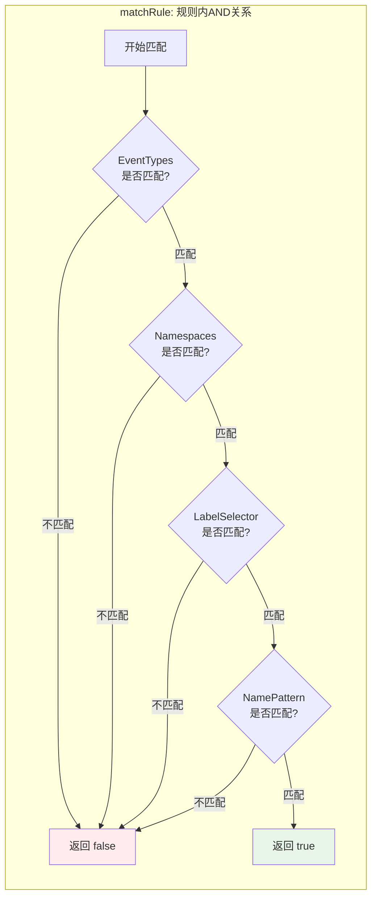
```mermaid
flowchart LR
    subgraph "matchRule: 规则内AND关系"
        A["开始匹配"] --> B{"EventTypes\n是否匹配?"}
        B -->|不匹配| F["返回 false"]
        B -->|匹配| C{"Namespaces\n是否匹配?"}
        C -->|不匹配| F
        C -->|匹配| D{"LabelSelector\n是否匹配?"}
        D -->|不匹配| F
        D -->|匹配| E{"NamePattern\n是否匹配?"}
        E -->|不匹配| F
        E -->|匹配| G["返回 true"]
    end

    style F fill:#ffebee
    style G fill:#e8f5e9
```

**匹配规则说明**：

| 匹配逻辑 | 说明 |
|---------|------|
| **AND关系** | 规则内所有条件必须**全部满足**才能通过 |
| **短路返回** | 任一条件不匹配立即返回 `false`，不再检查后续条件 |
| **空值处理** | 条件为空（空数组/空map/空字符串）时视为**匹配所有**，跳过检查 |

**2. 各条件匹配细节**

| 条件 | 匹配逻辑 | 空值处理 | 性能考虑 |
|------|---------|---------|---------|
| `EventTypes` | 精确字符串匹配 | 空数组=匹配所有 | O(n)，n为类型数量（通常<10） |
| `Namespaces` | 精确字符串匹配 | 空数组=匹配所有 | O(n)，n为命名空间数量 |
| `LabelSelector` | map包含关系检查 | 空map=匹配所有 | O(m)，m为标签数量（通常<5） |
| `NamePattern` | 正则表达式匹配 | 空字符串=匹配所有 | 预编译正则，避免重复编译 |

**3. 关键辅助函数**

```go
// contains 字符串是否在列表中
func contains(list []string, target string) bool {
    for _, s := range list {
        if s == target {
            return true
        }
    }
    return false
}

// matchLabelSelector 检查labels是否包含所有要求的标签
// 规则：rule.Labels是子集关系，labels必须包含rule中所有键值对
func matchLabelSelector(labels, ruleLabels map[string]string) bool {
    for k, v := range ruleLabels {
        if labels[k] != v {
            return false
        }
    }
    return true
}

// matchPattern 正则匹配（预编译优化）
var patternCache = make(map[string]*regexp.Regexp)
var patternMu sync.RWMutex

func matchPattern(name, pattern string) bool {
    patternMu.RLock()
    re, ok := patternCache[pattern]
    patternMu.RUnlock()
    if !ok {
        // 懒加载编译
        var err error
        re, err = regexp.Compile(pattern)
        if err != nil {
            return false  // 无效正则视为不匹配
        }
        patternMu.Lock()
        patternCache[pattern] = re
        patternMu.Unlock()
    }
    return re.MatchString(name)
}
```

**4. 设计决策说明**

**为什么规则内是AND关系？**
- 符合"白名单"直觉：用户指定多个条件是想缩小范围
- 示例：`{types:["ContainerStart"], ns:["prod"]}` = 只关心prod命名空间的容器启动

**为什么规则间是OR关系？**
- 支持多场景并行：一个数据源可以服务多个独立场景
- 示例：规则A关心容器事件，规则B关心Pod事件，两者独立生效

**5. 性能优化策略**

| 优化点 | 实现方式 | 效果 |
|--------|---------|------|
| 短路返回 | 任一条件不匹配立即返回false | 减少无效计算 |
| 空值跳过 | 条件为空时不检查 | 避免无谓遍历 |
| 正则缓存 | 使用sync.Map缓存编译后的正则 | 避免重复编译开销 |
| 快速路径 | 无规则时直接放行 | 零开销旁路 |

**HTTP API 接口**：

```
PUT    /api/v1/datasource/{type}/filter      # 添加/更新过滤规则
DELETE /api/v1/datasource/{type}/filter/{id}  # 删除过滤规则
GET    /api/v1/datasource/{type}/filter       # 查询当前规则
```

**使用示例**：

```bash
# 添加规则：只接收production命名空间的容器事件
curl -X PUT http://localhost:8080/api/v1/datasource/nri/filter \
  -H "Content-Type: application/json" \
  -d '{
    "rule_id": "prod-containers",
    "event_types": ["ContainerStart", "ContainerStop"],
    "namespaces": ["production"]
  }'
```

**与策略引擎的区别**：

|          | 数据源过滤               | 策略引擎         |
| -------- | ------------------- | ------------ |
| **触发方式** | HTTP API配置规则        | DSL规则文件      |
| **判断依据** | 事件元数据（类型/namespace） | 事件完整内容+复杂表达式 |
| **目的**   | 减少无效事件传递            | 决定是否触发任务     |
| **复杂度**  | 简单静态条件              | 动态DSL表达式     |

**FilterController 实现**：

```go
// pkg/datasource/filter_controller.go
type FilterController struct {
    manager *DataSourceManager
    mu      sync.RWMutex
}

// ApplyFilterRule 应用过滤规则（HTTP Handler）
func (fc *FilterController) ApplyFilterRule(w http.ResponseWriter, r *http.Request) {
    var req struct {
        Action string     `json:"action"`          // add/update/delete
        RuleID string     `json:"rule_id"`         // 规则唯一标识
        Rule   FilterRule `json:"rule"`            // 过滤规则内容
    }
    if err := json.NewDecoder(r.Body).Decode(&req); err != nil {
        http.Error(w, err.Error(), http.StatusBadRequest)
        return
    }

    fc.mu.Lock()
    defer fc.mu.Unlock()

    dsType := mux.Vars(r)["type"]  // 从URL获取数据源类型
    source := fc.manager.GetDataSource(dsType)
    if source == nil {
        http.Error(w, "datasource not found", http.StatusNotFound)
        return
    }

    // 获取或创建过滤包装器
    filteredDS := fc.getOrCreateFilteredSource(source)

    // 执行操作
    switch req.Action {
    case "add":
        err = filteredDS.AddRule(req.RuleID, req.Rule)
    case "update":
        err = filteredDS.UpdateRule(req.RuleID, req.Rule)
    case "delete":
        err = filteredDS.DeleteRule(req.RuleID)
    default:
        http.Error(w, "invalid action", http.StatusBadRequest)
        return
    }

    if err != nil {
        http.Error(w, err.Error(), http.StatusInternalServerError)
        return
    }

    log.Printf("Filter rule %s: %s.%s", req.Action, dsType, req.RuleID)
    w.WriteHeader(http.StatusOK)
}
```

**规则持久化设计**：

虽然规则通过HTTP API动态管理，但**生产环境必须保证规则在重启后不丢失**。

```go
// FilterRuleStore 规则持久化存储接口
type FilterRuleStore interface {
    // SaveRules 保存指定数据源的所有规则
    SaveRules(dsType string, rules []FilterRule) error

    // LoadRules 加载指定数据源的所有规则
    LoadRules(dsType string) ([]FilterRule, error)
}

// FilterController 增强版（带持久化）
type FilterController struct {
    manager *DataSourceManager
    store   FilterRuleStore  // 持久化存储（如BoltDB、SQLite、etcd等）
    mu      sync.RWMutex
}

// Init 启动时从持久化存储加载规则
func (fc *FilterController) Init() error {
    // 遍历所有已注册的数据源类型
    for dsType := range fc.manager.GetRegisteredTypes() {
        rules, err := fc.store.LoadRules(dsType)
        if err != nil {
            return fmt.Errorf("load filter rules for %s: %w", dsType, err)
        }

        source := fc.manager.GetDataSource(dsType)
        if source == nil {
            continue
        }

        filteredDS := fc.getOrCreateFilteredSource(source)
        for _, rule := range rules {
            filteredDS.AddRule(rule.RuleID, rule)
        }
    }
    return nil
}

// ApplyFilterRule 应用过滤规则（自动持久化）
func (fc *FilterController) ApplyFilterRule(w http.ResponseWriter, r *http.Request) {
    // ... 原有逻辑 ...

    // 操作成功后持久化到存储
    dsType := mux.Vars(r)["type"]
    filteredDS := fc.getOrCreateFilteredSource(source)
    allRules := filteredDS.GetAllRules()

    if err := fc.store.SaveRules(dsType, allRules); err != nil {
        log.Printf("Failed to persist filter rules: %v", err)
        // 持久化失败不阻断API响应，但需告警
    }

    w.WriteHeader(http.StatusOK)
}
```

**持久化策略对比**：

| 存储类型 | 适用场景 | 优缺点 |
|----------|----------|--------|
| **BoltDB** | 单节点部署 | 嵌入式、无需外部依赖、性能好 |
| **SQLite** | 简单多节点 | 文件共享、工具链完善 |
| **etcd** | 分布式集群 | 高可用、Watch机制、但引入复杂度 |
| **ConfigMap** | Kubernetes环境 | 原生支持、但更新延迟大 |

**推荐配置**：

```toml
[datasource.filter]
# 持久化存储类型：boltdb/sqlite/etcd
storage_type = "boltdb"
# 持久化文件路径（boltdb/sqlite时使用）
storage_path = "/var/lib/nuts/filter_rules.db"
# 自动保存间隔（秒），0表示立即保存
auto_save_interval = 0
```

**与6.6配置热更新的关系**：
- 过滤规则**不通过**配置文件管理（第6章）
- 规则**通过HTTP API管理**，但**自动持久化**到独立存储
- 框架启动时从持久化存储加载，而非从配置文件读取

### 2.4 接口设计

#### 2.4.1 增强的DataSource接口

```go
// pkg/datasource/interface.go
package datasource

import (
    "context"
    "time"

    "github.com/sig-cloudnative/nuts/pkg/common"
)

// DataSourceStatus 数据源状态
type DataSourceStatus int

const (
    StatusStopped DataSourceStatus = iota
    StatusRunning
    StatusPaused          // 暂停状态（停止接收新事件）
    StatusReconnecting    // 重连中
    StatusError
)

// DataSourceStats 数据源统计信息
type DataSourceStats struct {
    TotalEvents        int64         // 总事件数
    EventsPerSecond    float64       // 每秒事件数
    ConnectionUptime   time.Duration // 连接持续时间
    ReconnectCount     int           // 重连次数
    LastEventTime      time.Time     // 最后事件时间
    BufferUsage        float64       // 缓冲使用率（0-1）
    DroppedEvents      int64         // 丢弃事件数（背压导致）
}

// DataSource 增强的数据源接口
type DataSource interface {
    // 基础生命周期
    Start() error
    Stop() error

    // 订阅事件（返回带缓冲的channel）
    Subscribe() <-chan *common.Event

    // 元数据
    GetName() string
    GetStatus() DataSourceStatus
    SetStatus(status DataSourceStatus)  // 允许状态机改变状态

    // 扩展生命周期控制
    Pause() error                       // 暂停接收新事件（用于优雅关闭第一阶段）
    Resume() error                      // 恢复接收事件
    Reconfigure(config map[string]interface{}) error  // 动态重载配置

    // 统计信息
    GetStats() DataSourceStats

    // 健康检查（实现common.HealthChecker接口）
    CheckHealth(ctx context.Context) common.HealthCheckResult
}
```

#### 2.4.4 Event构造与字段映射规范

**问题**：不同数据源（NRI、Docker等）产生的原始数据格式各异，需要统一映射到`common.Event`结构。

**Event构造原则**：

```go
// EventBuilder Event构造器
type EventBuilder struct {
    sourceType string  // 数据源类型：nri/docker等
    nodeID     string  // 节点标识
}

// Build 从原始数据构造common.Event
func (eb *EventBuilder) Build(rawData interface{}) (*common.Event, error) {
    event := &common.Event{
        ID:        eb.generateEventID(),
        Timestamp: time.Now(),
        Source:    eb.sourceType,
        Version:   "1.0",
        Payload:   make(map[string]interface{}),
    }

    // 根据数据源类型提取字段
    switch eb.sourceType {
    case "nri":
        eb.fillFromNRI(event, rawData.(*nri.Event))
    case "docker":
        eb.fillFromDocker(event, rawData.(*docker.Event))
    default:
        return nil, fmt.Errorf("unknown source type: %s", eb.sourceType)
    }

    return event, nil
}

// fillFromNRI 从NRI事件填充字段
func (eb *EventBuilder) fillFromNRI(event *common.Event, nriEvent *nri.Event) {
    // Type字段：映射NRI事件类型
    event.Type = nriEvent.Type
    event.Topic = nriEvent.Type

    // TraceID
    if nriEvent.Context != nil && nriEvent.Context.TraceID != "" {
        event.TraceID = nriEvent.Context.TraceID
    } else {
        event.TraceID = eb.generateTraceID()
    }

    // Payload字段：提取关键运行时信息
    event.Payload["cgroup_id"] = nriEvent.CgroupID
    event.Payload["pod_uid"] = nriEvent.PodUID
    event.Payload["pod_name"] = nriEvent.PodName
    event.Payload["pod_namespace"] = nriEvent.Namespace
    event.Payload["container_id"] = nriEvent.ContainerID
    event.Payload["container_name"] = nriEvent.ContainerName
    event.Payload["labels"] = nriEvent.Labels
    event.Payload["annotations"] = nriEvent.Annotations
}

// fillFromDocker 从Docker事件填充字段
func (eb *EventBuilder) fillFromDocker(event *common.Event, dockerEvent *docker.Event) {
    event.Type = eb.mapDockerEventType(dockerEvent.Action)
    event.Topic = event.Type
    event.TraceID = eb.generateTraceID()

    event.Payload["container_id"] = dockerEvent.ID
    event.Payload["container_name"] = dockerEvent.Actor.Attributes["name"]
    event.Payload["image"] = dockerEvent.From
    event.Payload["labels"] = dockerEvent.Actor.Attributes
}

// mapDockerEventType 映射Docker事件类型到统一类型
func (eb *EventBuilder) mapDockerEventType(dockerAction string) string {
    switch dockerAction {
    case "start":
        return "ContainerStart"
    case "stop", "die", "kill":
        return "ContainerStop"
    case "create":
        return "ContainerCreate"
    case "destroy":
        return "ContainerDestroy"
    default:
        return "ContainerEvent"
    }
}
```

**统一Event字段规范**：

| 字段 | 来源 | 必填 | 说明 |
|------|------|------|------|
| `ID` | 自动生成 | 是 | UUID，全局唯一 |
| `Type` | 数据源映射 | 是 | 统一类型：`ContainerStart`/`ContainerStop`/etc |
| `Topic` | 默认=Type | 否 | 可被过滤规则覆盖 |
| `Timestamp` | 自动生成 | 是 | 事件构造时间 |
| `Source` | 数据源类型 | 是 | `nri`/`docker`/`containerd` |
| `TraceID` | 提取或生成 | 否 | 链路追踪ID |
| `Payload` | 数据源提取 | 是 | 标准化字段见下表 |

**Payload标准化字段**：

| 字段名 | NRI来源 | Docker来源 |
|--------|---------|------------|
| `cgroup_id` | 直接提供 | 需计算 |
| `pod_uid` | 直接提供 | 标签推断 |
| `pod_name` | 直接提供 | 标签推断 |
| `container_id` | 直接提供 | 直接提供 |
| `container_name` | 直接提供 | 直接提供 |
| `labels` | 直接提供 | 直接提供 |
| `pid` | 直接提供 | 需inspect |

**Event构造流程**：

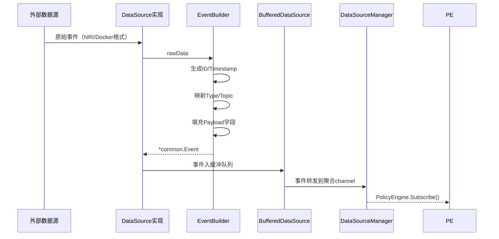
```mermaid
sequenceDiagram
    participant Ext as 外部数据源
    participant DS as DataSource实现
    participant EB as EventBuilder
    participant Buf as BufferedDataSource
    participant DSM as DataSourceManager

    Ext ->> DS: 原始事件（NRI/Docker格式）
    DS ->> EB: rawData
    EB ->> EB: 生成ID/Timestamp
    EB ->> EB: 映射Type/Topic
    EB ->> EB: 填充Payload字段
    EB -->> DS: *common.Event
    DS ->> Buf: 事件入缓冲队列
    Buf ->> DSM: 事件转发到聚合channel
    DSM -->> PE: PolicyEngine.Subscribe()
```

```go
// BufferConfig 缓冲配置
type BufferConfig struct {
    Size            int     // 缓冲队列大小
    HighWaterMark   float64 // 高水位线（默认0.8）
    LowWaterMark    float64 // 低水位线（默认0.2）
}

// DropPolicy 缓冲满时的处理策略
type DropPolicy int

const (
    DropPolicyDropOldest DropPolicy = iota  // 丢弃最旧事件（适合关注最新状态）
    DropPolicyDropNewest                     // 丢弃最新事件（适合关注历史完整性）
    DropPolicyBlock                          // 阻塞等待（可能阻塞数据源，谨慎使用）
    DropPolicyReject                         // 直接拒绝，返回错误
)
```

#### 2.4.3 事件过滤配置

```go
// EventFilter 事件过滤器配置
type EventFilter struct {
    EventTypes   []string               // 允许的事件类型（空表示全部）
    Namespaces   []string               // 允许的namespace（空表示全部）
    Labels       map[string]string      // 必须匹配的标签
    PayloadMatch map[string]interface{} // Payload字段匹配
}
```

### 2.5 关键组件实现

#### 2.5.1 自动重连管理器（Reconnector）

**设计思路**：通过独立的重连管理器，将重连逻辑与数据源实现解耦。

```go
// pkg/datasource/reconnector.go
package datasource

import (
    "context"
    "math"
    "time"

    "github.com/sig-cloudnative/nuts/pkg/common"
)

// ReconnectConfig 重连配置
type ReconnectConfig struct {
    Enabled             bool          // 是否启用自动重连
    MaxRetries          int           // 最大重试次数（-1表示无限）
    InitialInterval     time.Duration // 初始重试间隔
    MaxInterval         time.Duration // 最大重试间隔（指数退避上限）
    Multiplier          float64       // 退避倍数
    HealthCheckInterval time.Duration // 健康检查间隔
}

// Reconnector 自动重连管理器
type Reconnector struct {
    dataSource     DataSource
    config         ReconnectConfig
    stopCh         chan struct{}
    reconnectCount int
}

// NewReconnector 创建重连管理器
func NewReconnector(ds DataSource, config ReconnectConfig) *Reconnector {
    return &Reconnector{
        dataSource: ds,
        config:     config,
        stopCh:     make(chan struct{}),
    }
}

// Start 启动重连监控
func (r *Reconnector) Start() {
    go r.healthCheckLoop()
}

// healthCheckLoop 健康检查循环
func (r *Reconnector) healthCheckLoop() {
    ticker := time.NewTicker(r.config.HealthCheckInterval)
    defer ticker.Stop()

    for {
        select {
        case <-ticker.C:
            result := r.dataSource.CheckHealth(context.Background())
            if result.Status == common.HealthStatusDown {
                r.handleDisconnect()
            }
        case <-r.stopCh:
            return
        }
    }
}

// handleDisconnect 处理断连
func (r *Reconnector) handleDisconnect() {
    // 设置重连状态
    r.dataSource.SetStatus(StatusReconnecting)

    // 指数退避重连
    interval := r.config.InitialInterval

    for attempt := 0; r.config.MaxRetries < 0 || attempt < r.config.MaxRetries; attempt++ {
        // 尝试重新连接
        if err := r.attemptReconnect(); err == nil {
            r.reconnectCount++
            return
        }

        time.Sleep(interval)
        interval = time.Duration(math.Min(
            float64(interval)*r.config.Multiplier,
            float64(r.config.MaxInterval),
        ))
    }

    // 重连失败，进入错误状态
    r.dataSource.SetStatus(StatusError)
}

// attemptReconnect 尝试重连
func (r *Reconnector) attemptReconnect() error {
    r.dataSource.Stop()
    time.Sleep(100 * time.Millisecond)
    return r.dataSource.Start()
}

// Stop 停止重连监控
func (r *Reconnector) Stop() {
    close(r.stopCh)
}
```

#### 2.5.2 缓冲数据源包装器

**设计思路**：通过包装器模式为任何DataSource添加缓冲能力，不改变原有实现。

```go
// pkg/datasource/buffer.go
package datasource

import (
    "context"
    "time"

    "github.com/sig-cloudnative/nuts/pkg/common"
)

// BufferedDataSource 带缓冲的数据源包装器
type BufferedDataSource struct {
    source      DataSource
    buffer      chan *common.Event
    config      BufferConfig
    dropPolicy  DropPolicy
    metrics     common.MetricsCollector
}

// NewBufferedDataSource 创建带缓冲的数据源
func NewBufferedDataSource(
    source DataSource,
    config BufferConfig,
    dropPolicy DropPolicy,
    metrics common.MetricsCollector,
) *BufferedDataSource {
    return &BufferedDataSource{
        source:     source,
        buffer:     make(chan *common.Event, config.Size),
        config:     config,
        dropPolicy: dropPolicy,
        metrics:    metrics,
    }
}

// Subscribe 返回带缓冲的事件channel
func (bds *BufferedDataSource) Subscribe() <-chan *common.Event {
    outputCh := make(chan *common.Event)
    sourceCh := bds.source.Subscribe()

    // 接收事件到缓冲队列
    go func() {
        for event := range sourceCh {
            if err := bds.push(event); err != nil {
                bds.metrics.IncrementCounter("datasource_events_dropped", map[string]string{
                    "source": bds.source.GetName(),
                    "reason": "buffer_full",
                })
            }
        }
    }()

    // 从缓冲队列消费事件
    go func() {
        for event := range bds.buffer {
            outputCh <- event
        }
        close(outputCh)
    }()

    return outputCh
}

// push 推送事件到缓冲队列
func (bds *BufferedDataSource) push(event *common.Event) error {
    switch bds.dropPolicy {
    case DropPolicyDropOldest:
        select {
        case bds.buffer <- event:
            return nil
        default:
            <-bds.buffer  // 丢弃最旧
            bds.buffer <- event
            return nil
        }
    case DropPolicyDropNewest:
        select {
        case bds.buffer <- event:
            return nil
        default:
            return fmt.Errorf("buffer full, dropping event")
        }
    case DropPolicyBlock:
        bds.buffer <- event
        return nil
    case DropPolicyReject:
        select {
        case bds.buffer <- event:
            return nil
        default:
            return fmt.Errorf("buffer full, event rejected")
        }
    default:
        return fmt.Errorf("unknown drop policy")
    }
}

// CheckHealth 健康检查（整合缓冲状态）
func (bds *BufferedDataSource) CheckHealth(ctx context.Context) common.HealthCheckResult {
    bufferUsage := float64(len(bds.buffer)) / float64(cap(bds.buffer))
    sourceHealth := bds.source.CheckHealth(ctx)

    status := sourceHealth.Status
    if bufferUsage > bds.config.HighWaterMark && status == common.HealthStatusUp {
        status = common.HealthStatusDegraded
    }

    return common.HealthCheckResult{
        Name:    "datasource-" + bds.source.GetName(),
        Status:  status,
        Details: map[string]interface{}{
            "source_status":   sourceHealth.Status,
            "buffer_usage":    bufferUsage,
            "buffer_size":     len(bds.buffer),
            "buffer_capacity": cap(bds.buffer),
        },
        Timestamp: time.Now(),
    }
}

// 委托其他方法到源数据源
func (bds *BufferedDataSource) Start() error { return bds.source.Start() }
func (bds *BufferedDataSource) Stop() error   { return bds.source.Stop() }
func (bds *BufferedDataSource) Pause() error  { return bds.source.Pause() }
func (bds *BufferedDataSource) Resume() error { return bds.source.Resume() }
func (bds *BufferedDataSource) GetName() string { return bds.source.GetName() }
func (bds *BufferedDataSource) GetStatus() DataSourceStatus { return bds.source.GetStatus() }
func (bds *BufferedDataSource) SetStatus(s DataSourceStatus) { bds.source.SetStatus(s) }
func (bds *BufferedDataSource) GetStats() DataSourceStats { return bds.source.GetStats() }
func (bds *BufferedDataSource) Reconfigure(c map[string]interface{}) error { 
    return bds.source.Reconfigure(c) 
}
```

#### 2.5.3 增强的数据源管理器

**设计思路**：整合单数据源、健康检查、重连管理、优雅关闭的统一管理器。支持注册多个数据源实现，但同一时刻仅有一个数据源生效。

**数据源切换流程**：

1. **前置检查**：确认目标数据源已注册，当前激活数据源不是目标
2. **旧数据源优雅停止**（30秒超时）：
   - 停止重连监控（避免切换过程中触发重连）
   - 调用Pause()暂停接收新事件
   - 等待缓冲队列清空（带超时保护）
   - 调用Stop()完全停止
3. **新数据源启动**：
   - 启动数据源实例
   - 启动重连监控（如启用）
   - 启动事件转发goroutine
4. **事件连续性保证**：所有数据源事件汇聚到统一的`eventCh`，订阅者无需感知切换

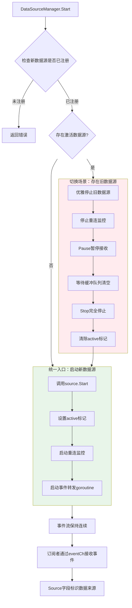
```mermaid
flowchart TD
    A[DataSourceManager.Start] --> B{检查新数据源是否已注册}
    B -->|未注册| C[返回错误]
    B -->|已注册| D{存在激活数据源?}

    subgraph SwitchOld["切换场景：存在旧数据源"]
        direction TB
        E[优雅停止旧数据源] --> E1[停止重连监控]
        E1 --> E2[Pause暂停接收]
        E2 --> E3[等待缓冲队列清空]
        E3 --> E4[Stop完全停止]
        E4 --> E5[清除active标记]
    end

    subgraph StartNew["统一入口：启动新数据源"]
        direction TB
        F1[调用source.Start] --> F2[设置active标记]
        F2 --> F3[启动重连监控]
        F3 --> F4[启动事件转发goroutine]
    end

    D -->|是| SwitchOld
    D -->|否| StartNew
    E5 --> StartNew

    StartNew --> G[事件流保持连续]
    G --> G1[订阅者通过eventCh接收事件]
    G1 --> G2[Source字段标识数据来源]

    style SwitchOld fill:#ffebee
    style StartNew fill:#e8f5e9
```

**流程说明**：

`DataSourceManager.Start(name string)` 方法的 `name` 参数指定了**要启动的新数据源**（如"nri"或"docker"），流程根据当前状态判断是否为切换场景：

| 调用场景 | dsm.active状态 | 执行路径 | 说明 |
|---------|---------------|---------|------|
| **首次启动** | 空字符串 | 否 → 直接启动新数据源 | 如 `Start("nri")` 启动nri |
| **切换数据源** | 已激活其他数据源 | 是 → 先停旧再启新 | 如 `Start("docker")` 停止nri，启动docker |

> ⚠️ **关键点**：流程图中的"新数据源"就是 `Start(name)` 方法的 `name` 参数，由调用方指定要启动哪个已注册的数据源。

**关键设计要点**：

- **互斥锁管理**：切换期间使用`mu.Unlock()/mu.Lock()`释放锁，避免优雅关闭时阻塞其他操作
- **零事件丢失**：缓冲队列等待机制确保旧数据源缓冲的事件被处理完毕
- **单活跃约束**：`active`字段保证任何时候最多只有一个数据源在运行
- **透明切换**：上层订阅者通过统一的`Subscribe()`接口接收事件，无需关心底层切换

```go
// pkg/datasource/manager.go
package datasource

import (
    "context"
    "sync"
    "time"

    "github.com/sig-cloudnative/nuts/pkg/common"
)

// DataSourceManager 增强的数据源管理器
type DataSourceManager struct {
    mu           sync.RWMutex
    sources      map[string]DataSource    // 注册的数据源实现（仅一个生效）
    active       string                   // 当前激活的数据源名称
    reconnectors map[string]*Reconnector  // 重连管理器
    healthReg    *common.HealthRegistry   // 健康检查注册表
    eventCh      chan *common.Event       // 事件channel

    // 默认配置
    bufferConfig  BufferConfig
    dropPolicy    DropPolicy
    reconnectCfg  ReconnectConfig
    metrics       common.MetricsCollector
}

// NewDataSourceManager 创建数据源管理器
func NewDataSourceManager(
    healthReg *common.HealthRegistry,
    metrics common.MetricsCollector,
) *DataSourceManager {
    return &DataSourceManager{
        sources:       make(map[string]DataSource),
        active:        "",
        reconnectors:  make(map[string]*Reconnector),
        healthReg:     healthReg,
        eventCh:       make(chan *common.Event, 1000),
        bufferConfig:  BufferConfig{Size: 100, HighWaterMark: 0.8, LowWaterMark: 0.2},
        dropPolicy:    DropPolicyDropOldest,
        reconnectCfg: ReconnectConfig{
            Enabled:             true,
            MaxRetries:          -1,
            InitialInterval:     1 * time.Second,
            MaxInterval:         30 * time.Second,
            Multiplier:          2,
            HealthCheckInterval: 10 * time.Second,
        },
        metrics: metrics,
    }
}

// Register 注册数据源（自动包装缓冲和健康检查）
func (dsm *DataSourceManager) Register(name string, source DataSource) error {
    dsm.mu.Lock()
    defer dsm.mu.Unlock()

    // 包装为带缓冲的数据源
    bufferedSource := NewBufferedDataSource(source, dsm.bufferConfig, dsm.dropPolicy, dsm.metrics)
    dsm.sources[name] = bufferedSource

    // 注册健康检查
    if hc, ok := interface{}(bufferedSource).(common.HealthChecker); ok {
        dsm.healthReg.Register(hc)
    }

    return nil
}

// Start 启动指定数据源（自动启用重连）
// 同一时间只能有一个数据源生效，启动新数据源会自动停止旧数据源
func (dsm *DataSourceManager) Start(name string) error {
    dsm.mu.Lock()
    defer dsm.mu.Unlock()

    source, ok := dsm.sources[name]
    if !ok {
        return fmt.Errorf("datasource not found: %s", name)
    }

    // 如果已有激活的数据源，先停止它
    if dsm.active != "" && dsm.active != name {
        dsm.mu.Unlock()
        dsm.Stop(dsm.active, 30*time.Second)
        dsm.mu.Lock()
    }

    if err := source.Start(); err != nil {
        return err
    }

    dsm.active = name

    // 启动重连监控
    if dsm.reconnectCfg.Enabled {
        reconnector := NewReconnector(source, dsm.reconnectCfg)
        reconnector.Start()
        dsm.reconnectors[name] = reconnector
    }

    // 启动事件转发
    go dsm.forwardEvents(name, source)

    return nil
}

// forwardEvents 转发事件到聚合channel
func (dsm *DataSourceManager) forwardEvents(name string, source DataSource) {
    eventCh := source.Subscribe()
    for event := range eventCh {
        if event.Source == "" {
            event.Source = name
        }

        select {
        case dsm.eventCh <- event:
        default:
            dsm.metrics.IncrementCounter("datasource_manager_dropped", nil)
        }
    }
}

// Stop 优雅关闭指定数据源
func (dsm *DataSourceManager) Stop(name string, timeout time.Duration) error {
    dsm.mu.Lock()
    source, ok := dsm.sources[name]
    reconn, hasReconn := dsm.reconnectors[name]

    // 清除active标记
    if dsm.active == name {
        dsm.active = ""
    }

    dsm.mu.Unlock()

    if !ok {
        return fmt.Errorf("datasource not found: %s", name)
    }

    // 1. 停止重连监控
    if hasReconn {
        reconn.Stop()
    }

    // 2. 暂停接收新事件
    source.Pause()

    // 3. 等待缓冲队列清空（带超时）
    ctx, cancel := context.WithTimeout(context.Background(), timeout)
    defer cancel()

    done := make(chan struct{})
    go func() {
        for {
            stats := source.GetStats()
            if stats.BufferUsage == 0 {
                close(done)
                return
            }
            time.Sleep(100 * time.Millisecond)
        }
    }()

    select {
    case <-done:
    case <-ctx.Done():
        // 超时，强制继续
    }

    // 4. 停止数据源
    return source.Stop()
}

// Subscribe 订阅聚合事件流
func (dsm *DataSourceManager) Subscribe() <-chan *common.Event {
    return dsm.eventCh
}

// StopAll 关闭所有数据源（包括当前激活的）
func (dsm *DataSourceManager) StopAll(timeout time.Duration) {
    dsm.mu.Lock()
    dsm.active = ""  // 清除激活标记
    names := make([]string, 0, len(dsm.sources))
    for name := range dsm.sources {
        names = append(names, name)
    }
    dsm.mu.Unlock()

    for _, name := range names {
        dsm.Stop(name, timeout)
    }
}

// GetActive 获取当前激活的数据源名称
func (dsm *DataSourceManager) GetActive() string {
    dsm.mu.RLock()
    defer dsm.mu.RUnlock()
    return dsm.active
}
```

### 2.6 配置设计

数据源模块遵循第六章的工厂模式配置设计，使用TOML格式，通过`type`字段指定数据源类型。

```toml
# nuts.toml 数据源配置段示例

[datasource]
type = "nri"  # 数据源类型：nri/docker/...

[datasource.nri]
socket_path = "/var/run/nri.sock"
buffer_size = 1000
buffer_high_water_mark = 0.8
drop_policy = "oldest"      # oldest/newest/block/reject
reconnect_enabled = true
reconnect_max_retries = -1  # -1表示无限重试
reconnect_interval = "1s"
reconnect_max_interval = "30s"

```

**配置解析方式**：

1. 主程序读取完整TOML文件，提取`[datasource]`段内容
2. 将配置字符串传递给`datasource.Factory.Create(configStr)`
3. Factory自动从配置中提取`type`字段，选择对应的解析器和创建器
4. 数据源工厂注册表根据类型创建对应的数据源实例

**数据源工厂注册**：

```go
// 在datasource包的init()中自动注册
func init() {
    // 注册NRI数据源
    Factory.Register("nri", parseNRIConfig, validateNRIConfig)
    dataSourceCreators["nri"] = createNRIManager

    // 注册Docker数据源
    Factory.Register("docker", parseDockerConfig, validateDockerConfig)
    dataSourceCreators["docker"] = createDockerManager
}
```

**第三方扩展**：

```go
// 外部包可注册自定义数据源
import "github.com/sig-cloudnative/nuts/pkg/datasource"

datasource.RegisterDataSource("mock", parseMockConfig, validateMockConfig, createMockManager)
```

### 2.7 目录结构

```
pkg/datasource/
├── interface.go          # 数据源接口定义（继承HealthChecker）
├── manager.go            # 增强的数据源管理器（单数据源、缓冲、优雅关闭）
├── factory.go            # 数据源工厂
├── reconnector.go        # 自动重连管理器（NEW）
├── buffer.go             # 事件缓冲与背压控制（NEW）
└── filter.go             # 事件过滤（可选）
```

### 2.8 数据源健康检查设计

数据源模块内置健康检查机制，实现对连接状态的自动监控和故障恢复。

#### 2.8.1 健康检查实现

所有数据源通过实现 `CheckHealth()`方法提供健康状态：

```go
// CheckHealth 实现HealthChecker接口
func (ds *NriDataSource) CheckHealth(ctx context.Context) common.HealthCheckResult {
    // 检查socket连接状态
    connState := ds.checkConnection()

    // 检查缓冲使用率
    bufferUsage := ds.getBufferUsage()

    // 确定健康状态
    status := common.HealthStatusUp
    if connState == ConnectionDisconnected {
        status = common.HealthStatusDown
    } else if bufferUsage > 0.8 {
        status = common.HealthStatusDegraded
    }

    return common.HealthCheckResult{
        Name:    "datasource-nri",
        Status:  status,
        Message: getStatusMessage(connState, bufferUsage),
        Details: map[string]interface{}{
            "connection_state": connState.String(),
            "buffer_usage":     bufferUsage,
            "total_events":     ds.stats.TotalEvents,
        },
        Timestamp: time.Now(),
    }
}
```

#### 2.8.2 健康状态分级

| 状态         | 含义  | 触发条件             | 自动恢复               |
| ---------- | --- | ---------------- | ------------------ |
| `up`       | 正常  | 连接正常，缓冲低水位       | -                  |
| `degraded` | 降级  | 缓冲高水位(>80%)或连接波动 | 是（缓冲降低后恢复）         |
| `down`     | 断开  | 连接断开             | 是（Reconnector自动重连） |
| `error`    | 错误  | 重连失败超过最大重试次数     | 否（需人工介入）           |

#### 2.8.3 自动注册机制

DataSourceManager在注册数据源时自动将其加入健康检查体系：

```go
func (dsm *DataSourceManager) Register(name string, source DataSource) error {
    // ... 包装缓冲 ...

    // 自动注册健康检查
    if hc, ok := interface{}(bufferedSource).(common.HealthChecker); ok {
        dsm.healthReg.Register(hc)
    }

    return nil
}
```

#### 2.8.4 健康检查驱动重连

Reconnector利用健康检查实现自动故障恢复：

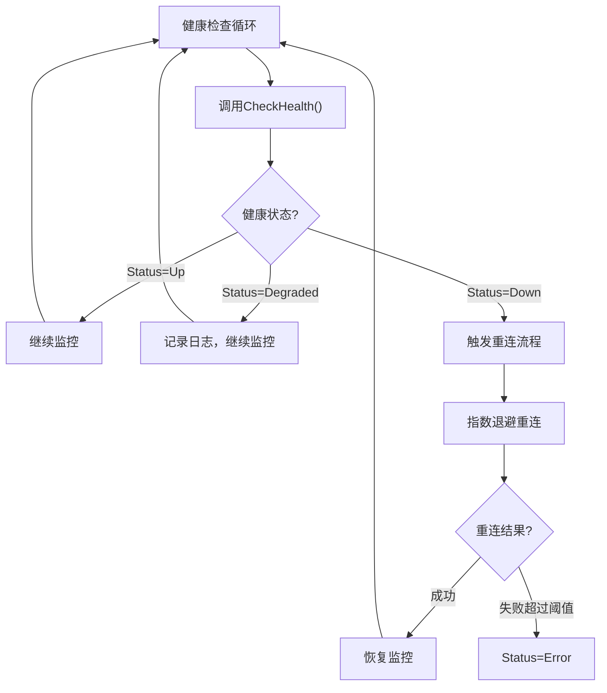
```mermaid
flowchart TD
    A["健康检查循环"] --> B["调用CheckHealth()"]
    B --> C{"健康状态?"}

    C -->|Status=Up| D["继续监控"]
    C -->|Status=Degraded| E["记录日志，继续监控"]
    C -->|Status=Down| F["触发重连流程"]

    D --> A
    E --> A

    F --> G["指数退避重连"]
    G --> H{"重连结果?"}

    H -->|成功| I["恢复监控"] --> A
    H -->|失败超过阈值| J["Status=Error"]
```

### 2.9 数据源与策略引擎交互流程

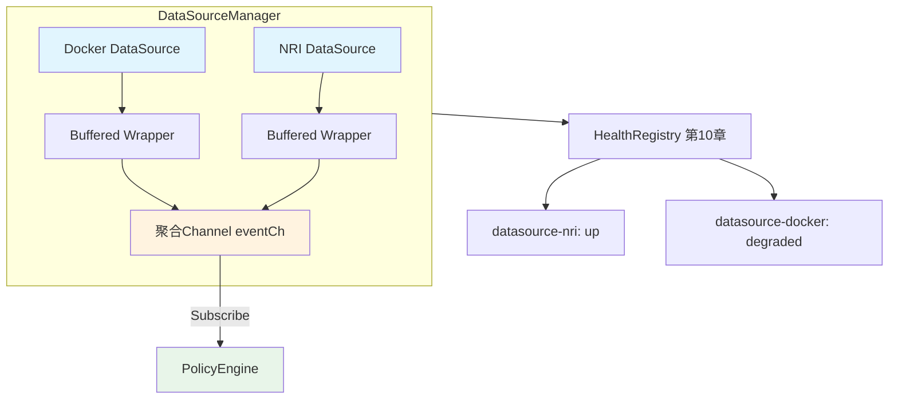
```mermaid
flowchart TB
    subgraph DSM[DataSourceManager]
        direction TB
        DS1[NRI DataSource] --> BW1[Buffered Wrapper]
        DS2[Docker DataSource] --> BW2[Buffered Wrapper]
        BW1 --> EC[聚合Channel eventCh]
        BW2 --> EC
    end

    EC -->|Subscribe| PE[PolicyEngine]

    DSM --> HR[HealthRegistry 第10章]
    HR --> H1[datasource-nri: up]
    HR --> H2[datasource-docker: degraded]

    style DS1 fill:#e1f5fe
    style DS2 fill:#e1f5fe
    style EC fill:#fff3e0
    style PE fill:#e8f5e9
```

**交互流程**：

1. **注册阶段**：通过 `Register()`注册数据源，自动包装BufferedDataSource并注册到HealthRegistry
2. **启动阶段**：通过 `Start()`启动数据源，同时启动Reconnector进行健康监控
3. **运行阶段**：
   - 数据源事件 → 缓冲队列 → 聚合channel → PolicyEngine
   - Reconnector定期检查健康状态，异常时触发重连
4. **关闭阶段**：通过 `Stop()`执行优雅关闭（Pause → 等待缓冲清空 → Stop）

---

## 三、策略引擎接口抽象设计

### 3.1 设计目标

为了支持不同的策略DSL引擎（如libdslgo、CEL、Rego等），需要对策略引擎进行接口抽象，实现以下目标：

1. **DSL引擎可插拔**：支持不同的DSL引擎实现
2. **策略配置通用化**：策略配置不包含特定业务字段
3. **职责单一**：策略引擎只负责DSL解析和匹配，不负责业务通知
4. **事件驱动**：匹配成功后通过事件总线发布事件，TaskScheduler订阅事件

### 3.2 整体架构流程

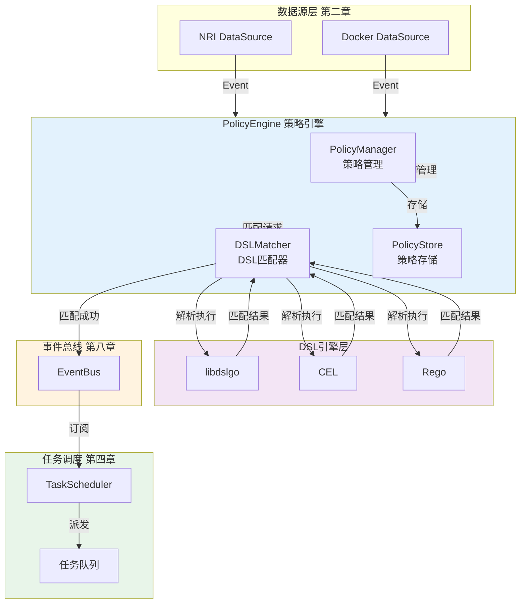
```mermaid
flowchart TB
    subgraph DS[数据源层 第二章]
        DS1[NRI DataSource]
        DS2[Docker DataSource]
    end

    subgraph PE[PolicyEngine 策略引擎]
        direction TB
        PM[PolicyManager<br/>策略管理]
        DM[DSLMatcher<br/>DSL匹配器]
        PS[PolicyStore<br/>策略存储]
    end

    subgraph DSL[DSL引擎层]
        DSL1[libdslgo]
        DSL2[CEL]
        DSL3[Rego]
    end

    subgraph EB[事件总线 第八章]
        EB1[EventBus]
    end

    subgraph TS[任务调度 第四章]
        TS1[TaskScheduler]
        TS2[任务队列]
    end

    DS1 -->|Event| PE
    DS2 -->|Event| PE

    PE -->|加载/管理| PM
    PM -->|存储| PS
    PE -->|匹配请求| DM
    DM -->|解析执行| DSL1
    DM -->|解析执行| DSL2
    DM -->|解析执行| DSL3
    DSL1 -->|匹配结果| DM
    DSL2 -->|匹配结果| DM
    DSL3 -->|匹配结果| DM

    DM -->|匹配成功| EB1
    EB1 -->|订阅| TS1
    TS1 -->|派发| TS2

    style PE fill:#e3f2fd
    style DSL fill:#f3e5f5
    style EB fill:#fff3e0
    style TS fill:#e8f5e9
```

**架构流程说明**：

1. **事件输入**：来自第二章DataSourceManager的聚合事件流
2. **策略管理**：PolicyManager通过HTTP API接收策略CRUD操作，存储到PolicyStore
3. **DSL匹配**：DSLMatcher根据策略的`type`字段选择对应的DSL引擎执行匹配
4. **引擎执行**：支持libdslgo、CEL、Rego等多种DSL引擎，通过统一接口调用
5. **事件发布**：匹配成功后，PolicyEngine通过EventBus发布`PolicyMatchedEvent`
6. **任务调度**：TaskScheduler订阅匹配事件，根据TaskConfig创建并派发任务

### 3.3 接口设计

```go
// pkg/policy/interface.go
package policy

import "github.com/sig-cloudnative/nuts/pkg/common"

// Policy 策略结构（通用化）
type Policy struct {
    ID         string
    Name       string
    DSL        string              // DSL规则
    TaskConfig map[string]interface{}  // 通用任务配置
    Metadata   map[string]interface{}  // 元数据
    CreatedAt  time.Time
    UpdatedAt  time.Time
}

// PolicyReceiver 策略接收器接口
type PolicyReceiver interface {
    // Receive 接收策略
    Receive(policy *Policy) error

    // Update 更新策略
    Update(policy *Policy) error

    // Delete 删除策略
    Delete(id string) error

    // Get 获取策略
    Get(id string) (*Policy, error)

    // List 列出所有策略
    List() ([]*Policy, error)
}

// PolicyMatcher 策略匹配器接口
type PolicyMatcher interface {
    // Match 匹配事件是否符合策略
    Match(event *common.Event, policy *Policy) (bool, string, error)
}

// PolicyEngine 策略引擎接口
type PolicyEngine interface {
    PolicyReceiver
    PolicyMatcher

    // ParseDSL 解析DSL规则
    ParseDSL(dsl string) error

    // MatchAll 匹配事件是否符合所有策略
    MatchAll(event *common.Event) ([]*MatchResult, error)

    // Subscribe 订阅数据源事件
    // 通过channel接收DataSourceManager转发的事件
    Subscribe(eventCh <-chan *common.Event)
}

// MatchResult 匹配结果
type MatchResult struct {
    PolicyID   string
    Matched    bool
    Reason     string
    TaskConfig map[string]interface{}  // 策略的任务配置
}
```

#### 3.3.1 Event处理与字段访问规范

**问题**：策略引擎接收`common.Event`，但DSL规则如何访问Event的各个字段？需要明确映射规范。

**Event字段访问规范**：

```go
// EventAccessor Event字段访问器
// 为DSL引擎提供统一的事件字段访问接口
type EventAccessor struct {
    event *common.Event
}

// ToMap 将Event转换为DSL可访问的map结构
func (ea *EventAccessor) ToMap() map[string]interface{} {
    return map[string]interface{}{
        // 基础字段
        "id":         ea.event.ID,
        "type":       ea.event.Type,
        "topic":      ea.event.Topic,
        "timestamp":  ea.event.Timestamp.Unix(),
        "trace_id":   ea.event.TraceID,
        "source":     ea.event.Source,
        "version":    ea.event.Version,

        // Payload字段（展开到顶层方便访问）
        "cgroup_id":       getString(ea.event.Payload, "cgroup_id"),
        "pod_uid":         getString(ea.event.Payload, "pod_uid"),
        "pod_name":        getString(ea.event.Payload, "pod_name"),
        "pod_namespace":   getString(ea.event.Payload, "pod_namespace"),
        "container_id":    getString(ea.event.Payload, "container_id"),
        "container_name":  getString(ea.event.Payload, "container_name"),
        "image":           getString(ea.event.Payload, "image"),
        "pid":             getInt(ea.event.Payload, "pid"),
        "ppid":            getInt(ea.event.Payload, "ppid"),

        // 保留原始payload用于复杂访问
        "payload":    ea.event.Payload,
        "labels":     getMap(ea.event.Payload, "labels"),
        "annotations": getMap(ea.event.Payload, "annotations"),
    }
}

// getString 安全获取字符串字段
func getString(m map[string]interface{}, key string) string {
    if v, ok := m[key]; ok {
        if s, ok := v.(string); ok {
            return s
        }
    }
    return ""
}

// getInt 安全获取整数字段
func getInt(m map[string]interface{}, key string) int {
    if v, ok := m[key]; ok {
        switch i := v.(type) {
        case int:
            return i
        case int64:
            return int(i)
        case float64:
            return int(i)
        }
    }
    return 0
}

// getMap 安全获取map字段
func getMap(m map[string]interface{}, key string) map[string]string {
    if v, ok := m[key]; ok {
        if m, ok := v.(map[string]string); ok {
            return m
        }
        // 尝试转换map[string]interface{}
        if mi, ok := v.(map[string]interface{}); ok {
            result := make(map[string]string)
            for k, v := range mi {
                if s, ok := v.(string); ok {
                    result[k] = s
                }
            }
            return result
        }
    }
    return nil
}
```

**DSL规则中的字段访问示例**：

```go
// libdslgo 规则示例
// 访问展开后的顶层字段
dslRule := `
pod.namespace == "production" &&
container.name.startsWith("nginx") &&
event.type == "ContainerStart"
`

// CEL 规则示例
// 访问labels（map类型）
celRule := `
labels["app"] == "web-server" &&
pod_name.startsWith("frontend-") &&
timestamp > now() - 3600  // 最近1小时的事件
`

// Rego 规则示例
// 访问完整payload
regoRule := `
package nuts.policy

default allow = false

allow {
    input.payload.command == "/bin/bash"
    input.labels["risk"] == "high"
    input.annotations["privileged"] == "true"
}
`
```

**Event处理流程**：

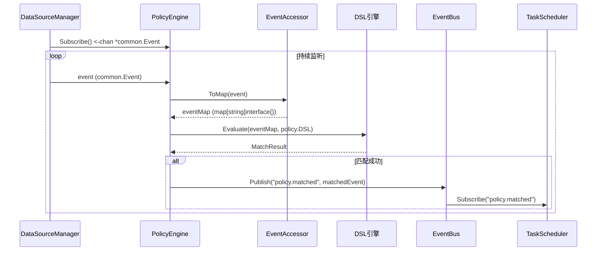
```mermaid
sequenceDiagram
    participant DSM as DataSourceManager
    participant PE as PolicyEngine
    participant EA as EventAccessor
    participant DSL as DSL引擎
    participant EB as EventBus
    participant TS as TaskScheduler

    DSM ->> PE: Subscribe() <-chan *common.Event

    loop 持续监听
        DSM ->> PE: event (common.Event)

        PE ->> EA: ToMap(event)
        EA -->> PE: eventMap (map[string]interface{})

        PE ->> DSL: Evaluate(eventMap, policy.DSL)
        DSL -->> PE: MatchResult

        alt 匹配成功
            PE ->> EB: Publish("policy.matched", matchedEvent)
            EB ->> TS: Subscribe("policy.matched")
        end
    end
```

**关键设计点**：

1. **字段展开**：将常用的Payload字段（如pod_name、container_id）展开到顶层，方便DSL规则直接访问
2. **类型安全**：EventAccessor提供类型转换，避免DSL引擎处理`interface{}`的复杂性
3. **原始Payload保留**：复杂场景下DSL仍可访问完整的`payload`字段
4. **时间戳转换**：将Go的`time.Time`转换为Unix时间戳（秒），便于DSL进行数值比较

**PolicyEngine实现参考**：

```go
// DefaultPolicyEngine 默认策略引擎实现
type DefaultPolicyEngine struct {
    dslEngine    dsl.DSLEngine
    policies     map[string]*Policy
    eventBus     common.EventBus
    mu           sync.RWMutex
}

// Subscribe 实现事件订阅与处理
func (pe *DefaultPolicyEngine) Subscribe(eventCh <-chan *common.Event) {
    go func() {
        for event := range eventCh {
            // 1. 转换Event为DSL可访问的map
            accessor := &EventAccessor{event: event}
            eventMap := accessor.ToMap()

            // 2. 遍历所有策略进行匹配
            pe.mu.RLock()
            policies := make([]*Policy, 0, len(pe.policies))
            for _, p := range pe.policies {
                policies = append(policies, p)
            }
            pe.mu.RUnlock()

            for _, policy := range policies {
                // 3. DSL匹配
                matched, reason, err := pe.Match(event, policy)
                if err != nil {
                    log.Printf("Policy match error: %v", err)
                    continue
                }

                if matched {
                    // 4. 构造匹配成功事件并发布
                    matchedEvent := pe.buildMatchedEvent(event, policy, reason)
                    if err := pe.eventBus.Publish("policy.matched", matchedEvent); err != nil {
                        log.Printf("Publish matched event error: %v", err)
                    }
                }
            }
        }
    }()
}

// buildMatchedEvent 构造策略匹配成功事件
func (pe *DefaultPolicyEngine) buildMatchedEvent(
    sourceEvent *common.Event,
    policy *Policy,
    reason string,
) *common.Event {
    return &common.Event{
        ID:        GenerateUUID(),
        Type:      "policy.matched",
        Topic:     "policy.matched",
        Timestamp: time.Now(),
        Source:    "policy-engine",
        TraceID:   sourceEvent.TraceID,
        Payload: map[string]interface{}{
            // 关键字段提取（用于TaskScheduler）
            "cgroup_id":       sourceEvent.Payload["cgroup_id"],
            "pod_name":        sourceEvent.Payload["pod_name"],
            "pod_namespace":   sourceEvent.Payload["pod_namespace"],
            "container_id":    sourceEvent.Payload["container_id"],
            "container_name":  sourceEvent.Payload["container_name"],

            // 策略信息
            "policy_id":   policy.ID,
            "policy_name": policy.Name,
            "match_reason": reason,

            // 任务配置（TaskScheduler使用）
            "task_config": policy.TaskConfig,

            // 原始事件引用（可选，用于追溯）
            "source_event_id": sourceEvent.ID,
        },
    }
}
```

### 3.4 DSL引擎接口抽象

为了支持不同的DSL引擎（libdslgo、CEL、Rego等），需要对DSL引擎进行接口抽象。

```go
// pkg/dsl/interface.go
package dsl

import "github.com/sig-cloudnative/nuts/pkg/policy"

// EvaluationResult 评估结果
type EvaluationResult struct {
    Matched   bool                   `json:"matched"`
    RuleID    string                 `json:"rule_id"`
    RuleName  string                 `json:"rule_name"`
    Output    string                 `json:"output"`
    Variables map[string]interface{} `json:"variables"`
    Error     error                  `json:"error"`
}

// DSLEngine DSL引擎接口
type DSLEngine interface {
    // Init 初始化引擎
    Init(config map[string]interface{}) error

    // Name 引擎名称
    Name() string

    // Validate 验证规则语法
    Validate(rule string) error

    // AddRule 添加规则
    AddRule(rule string) error

    // GetRule 获取规则
    GetRule(ruleID string) (string, error)

    // UpdateRule 更新规则
    UpdateRule(rule string) error

    // DeleteRule 删除规则
    DeleteRule(ruleID string) error

    // ListRules 列出所有规则
    ListRules() ([]*policy.Policy, error)

    // Evaluate 评估事件是否符合规则
    Evaluate(event map[string]interface{}) ([]*EvaluationResult, error)

    // Close 关闭引擎
    Close() error
}
```

### 3.5 DSL引擎工厂

DSL引擎模块遵循第六章的工厂模式配置设计，通过`type`字段指定DSL引擎类型。

```go
// pkg/dsl/factory.go
package dsl

import "github.com/sig-cloudnative/nuts/pkg/common"

// Factory DSL引擎工厂（包级别单例）
var Factory = &DSLEngineFactory{
    BaseFactory: common.NewBaseFactory(),
}

type DSLEngineFactory struct {
    *common.BaseFactory
}

// init 自动注册内置DSL引擎类型
func init() {
    Factory.Register("libdslgo", parseLibDSLGoConfig, validateLibDSLGoConfig)

    // 注册内置creator
    dslCreators["libdslgo"] = func(cfg interface{}) (DSLEngine, error) {
        return NewLibDSLGoEngine(cfg.(*LibDSLGoConfig))
    }
}

// Create 根据配置创建DSL引擎
func (f *DSLEngineFactory) Create(configStr string) (DSLEngine, error) {
    typeName, err := f.GetTypeFromConfig(configStr)
    if err != nil {
        return nil, err
    }

    cfg, err := f.Parse(typeName, configStr)
    if err != nil {
        return nil, err
    }

    creator, ok := dslCreators[typeName]
    if !ok {
        return nil, fmt.Errorf("unsupported dsl engine type: %s", typeName)
    }
    return creator(cfg)
}

// RegisterDSLEngine 允许第三方注册自定义DSL引擎
func RegisterDSLEngine(typeName string, parser common.ConfigParserFunc, validator common.ValidatorFunc, creator DSLCreator) {
    Factory.Register(typeName, parser, validator)
    dslCreators[typeName] = creator
}

type DSLCreator func(cfg interface{}) (DSLEngine, error)

var dslCreators = make(map[string]DSLCreator)

// LibDSLGoConfig libdslgo配置
type LibDSLGoConfig struct {
    Type string `toml:"type"`
    // 其他配置字段...
}

func parseLibDSLGoConfig(configStr string) (interface{}, error) {
    var cfg LibDSLGoConfig
    _, err := toml.Decode(configStr, &cfg)
    return &cfg, err
}

func validateLibDSLGoConfig(cfg interface{}) error {
    // 校验逻辑...
    return nil
}
```

### 3.6 PolicyEngine工厂

PolicyEngine模块遵循第六章的工厂模式配置设计。

```go
// pkg/policy/factory.go
package policy

import "github.com/sig-cloudnative/nuts/pkg/common"

// Factory 策略引擎工厂（包级别单例）
var Factory = &PolicyEngineFactory{
    BaseFactory: common.NewBaseFactory(),
}

type PolicyEngineFactory struct {
    *common.BaseFactory
}

// init 自动注册内置策略引擎类型
func init() {
    Factory.Register("default", parsePolicyConfig, validatePolicyConfig)

    // 注册内置creator
    policyCreators["default"] = func(cfg interface{}) (PolicyEngine, error) {
        return NewDefaultPolicyEngine(cfg.(*PolicyEngineConfig))
    }
}

// Create 根据配置创建策略引擎
func (f *PolicyEngineFactory) Create(configStr string) (PolicyEngine, error) {
    typeName, err := f.GetTypeFromConfig(configStr)
    if err != nil {
        return nil, err
    }

    cfg, err := f.Parse(typeName, configStr)
    if err != nil {
        return nil, err
    }

    creator, ok := policyCreators[typeName]
    if !ok {
        return nil, fmt.Errorf("unsupported policy engine type: %s", typeName)
    }

    engine, err := creator(cfg)
    if err != nil {
        return nil, err
    }

    // 加载规则文件
    config := cfg.(*PolicyEngineConfig)
    if err := engine.LoadRules(config.RuleFile); err != nil {
        return nil, fmt.Errorf("load rules: %w", err)
    }

    return engine, nil
}

// RegisterPolicyEngine 允许第三方注册自定义策略引擎
func RegisterPolicyEngine(typeName string, parser common.ConfigParserFunc, validator common.ValidatorFunc, creator PolicyCreator) {
    Factory.Register(typeName, parser, validator)
    policyCreators[typeName] = creator
}

type PolicyCreator func(cfg interface{}) (PolicyEngine, error)

var policyCreators = make(map[string]PolicyCreator)

// PolicyEngineConfig 策略引擎配置
type PolicyEngineConfig struct {
    Type     string `toml:"type"`
    RuleFile string `toml:"rule_file"`
}

func parsePolicyConfig(configStr string) (interface{}, error) {
    var cfg PolicyEngineConfig
    _, err := toml.Decode(configStr, &cfg)
    return &cfg, err
}

func validatePolicyConfig(cfg interface{}) error {
    c := cfg.(*PolicyEngineConfig)
    if c.RuleFile == "" {
        return fmt.Errorf("policy.rule_file is required")
    }
    return nil
}
```

### 3.7 配置设计

策略引擎模块遵循第六章的工厂模式配置设计。

```toml
# nuts.toml 策略引擎配置段示例

[policy]
type = "default"
rule_file = "/etc/nuts/policies.toml"
```

**配置说明**：

| 字段        | 类型     | 必填  | 说明             |
| --------- | ------ | --- | -------------- |
| type      | string | 是   | 策略引擎类型：default |
| rule_file | string | 是   | 策略规则文件路径       |

### 3.8 目录结构

```
pkg/policy/
├── interface.go          # 策略引擎接口定义
├── engine.go             # PolicyEngine实现
├── factory.go            # PolicyEngine工厂
└── config.go             # 配置定义和解析

pkg/dsl/
├── interface.go          # DSL引擎接口定义
├── factory.go            # DSL引擎工厂
└── config.go             # 配置定义和解析
```

### 3.9 设计优势

1. **职责单一**：策略引擎只负责DSL解析和匹配，不负责业务通知
2. **通用化配置**：Policy结构使用TaskConfig传递通用配置
3. **事件驱动**：匹配成功后通过EventBus发布事件
4. **DSL可插拔**：支持不同的DSL引擎实现

### 3.10 事件Payload设计原则

PolicyEngine发布匹配成功事件时，**不应该转发完整的原始事件数据**（原始事件可能包含大量监控数据），而应该**提取关键字段**构建精简的Payload：

**推荐包含的字段**：

- **任务标识字段**：cgroup_id, pod_name, container_id, pid等
- **策略相关字段**：policy_id, policy_name
- **任务配置**：task_config（来自Policy.TaskConfig）
- **时间戳**：event_timestamp

**示例Payload结构**：

```go
// PolicyMatchedEvent Payload示例
map[string]interface{}{
    "cgroup_id":    event.Payload["cgroup_id"],
    "pod_name":     event.Payload["pod_name"],
    "container_id": event.Payload["container_id"],
    "policy_id":    result.PolicyID,
    "task_config":  result.TaskConfig,
    "source_event_id": event.ID,  // 原始事件ID，用于追溯
    "timestamp":    time.Now(),
}
```

**设计理由**：

1. **减少网络传输**：EventBus（gRPC/Redis/Kafka）传输精简数据，提高效率
2. **降低存储压力**：TaskStore不需要存储完整的原始监控数据
3. **关注点分离**：TaskScheduler只关心创建任务所需的字段

---

## 四、任务调度模块设计

### 4.1 TaskScheduler接口设计

#### 4.1.1 接口定义

```go
// pkg/scheduler/interface.go
package scheduler

import "github.com/sig-cloudnative/nuts/pkg/common"

// TaskScheduler 任务调度器接口
type TaskScheduler interface {
    // CreateTask 创建任务
    CreateTask(task *Task) error

    // GetTask 获取任务
    GetTask(id string) (*Task, error)

    // UpdateTask 更新任务
    UpdateTask(task *Task) error

    // DeleteTask 删除任务
    DeleteTask(id string) error

    // ListTasks 列出任务
    ListTasks(filter *TaskFilter) ([]*Task, error)

    // Start 启动调度器
    Start() error

    // Stop 停止调度器
    Stop() error

    // GetStateMachine 获取状态机
    GetStateMachine() StateMachine

    // GetEventBus 获取事件总线
    GetEventBus() eventbus.EventBus
}
```

#### 4.1.2 Task结构定义

```go
// pkg/scheduler/task.go
package scheduler

import "time"

// Task 任务定义
type Task struct {
    ID          string                 `json:"id"`
    PolicyID    string                 `json:"policy_id"`
    State       string                 `json:"state"`
    Metadata    map[string]interface{} `json:"metadata"`
    CreatedAt   time.Time              `json:"created_at"`
    UpdatedAt   time.Time              `json:"updated_at"`
    StartedAt   *time.Time             `json:"started_at,omitempty"`
    CompletedAt *time.Time             `json:"completed_at,omitempty"`
}

// TaskFilter 任务查询过滤器
type TaskFilter struct {
    State    string
    PolicyID string
    Limit    int
    Offset   int
}
```

#### 4.1.3 任务存储接口

TaskScheduler依赖TaskStore接口进行任务的持久化存储。

```go
// TaskStore 任务存储接口
type TaskStore interface {
    // Get 获取任务
    Get(id string) (*Task, error)

    // Create 创建任务
    Create(task *Task) error

    // Update 更新任务
    Update(task *Task) error

    // Delete 删除任务
    Delete(id string) error

    // List 列出任务
    List(filter TaskFilter) ([]*Task, error)

    // Count 获取任务数量
    Count(filter TaskFilter) (int, error)

    // UpdateState 更新任务状态
    UpdateState(id string, state TaskState) error

    // UpdateStateWithRecord 更新任务状态并记录详细信息
    UpdateStateWithRecord(id string, state TaskState, triggeredBy, reason string) error

    // GetStateHistory 获取任务状态历史
    GetStateHistory(id string) ([]StateTransitionRecord, error)

    // UpdateResult 更新任务结果
    UpdateResult(id string, result *TaskResult) error
}
```

**设计说明**：

- TaskStore与TaskScheduler分离，便于替换不同的存储实现（内存、数据库、缓存等）
- 存储实现需要保证并发安全
- 框架不限制具体存储介质，由实现者决定

#### 4.1.4 双存储架构（DualStore）

为了支持任务的生命周期管理，NUTS采用了双存储架构：

```go
// DefaultTaskScheduler 支持双存储
type DefaultTaskScheduler struct {
    queue        TaskQueue
    store        TaskStore // active store (running tasks)
    archiveStore TaskStore // archive store (optional, for completed/failed/cancelled/timeout)
    // ...
}
```

**存储分工**：

- **Active Store**：存储活跃任务（pending、running、validating、processing等）
- **Archive Store**：存储归档任务（completed、failed、cancelled、timeout等终态任务）

#### 4.1.5 组合存储（CombinedStore）

CombinedStore 提供了对 Active 和 Archive 存储的统一访问：

```go
// CombinedStore 搜索两个存储
type CombinedStore struct {
    activeStore  TaskStore
    archiveStore TaskStore
}

// Get 先查 active，再查 archive
func (s *CombinedStore) Get(id string) (*Task, error) {
    task, err := s.activeStore.Get(id)
    if err == nil {
        return task, nil
    }
    
    if s.archiveStore != nil {
        task, err = s.archiveStore.Get(id)
        if err == nil {
            return task, nil
        }
    }
    
    return nil, err
}
```

**特殊处理**：

- 当需要重试已归档的任务时（failed → pending），CombinedStore 会：
  1. 从 archive store 获取任务
  2. 更新状态为 pending
  3. 将任务移回 active store
  4. 从 archive store 删除

#### 4.1.6 任务归档机制

任务归档由 TaskScheduler 的 `handleTaskError` 方法触发：

```go
// 检查重试次数，超过最大值则归档
const maxRetries = 3
if task.RetryCount > maxRetries {
    // 超过最大重试次数，立即归档
    s.archiveTask(task)
}

// archiveTask 将任务从 active store 移动到 archive store
func (s *DefaultTaskScheduler) archiveTask(task *Task) {
    if s.archiveStore == nil {
        return // 未配置归档存储，任务保留在 active store
    }
    
    // 获取最新状态
    latest, err := s.store.Get(task.ID)
    if err != nil {
        return // 任务可能已被删除
    }
    
    // 写入归档存储
    if err := s.archiveStore.Create(latest); err == nil {
        // 归档成功后从 active store 删除
        s.store.Delete(task.ID)
    }
}
```

**归档策略**：

1. **自动归档**：任务失败次数超过 `maxRetries`（默认3次）
2. **手动归档**：组件可以主动调用归档接口
3. **保留策略**：通过配置设置归档任务的保留时间

### 4.2 分布式ID生成设计

#### 4.2.1 设计目标

1. **全局唯一**：在分布式环境下保证ID唯一
2. **时间有序**：ID包含时间信息，便于排序和查询
3. **高性能**：不依赖外部存储，本地生成
4. **场景通用**：同时支持单机和分布式场景

#### 4.2.2 方案选择

**推荐方案：雪花算法（Snowflake）**

**算法结构**：

```
0 | 00000000000000000000000000000000000000000 | 0000000000 | 000000000000
  |                    41位时间戳                  |  10位节点ID  | 12位序列号
```

**各部分说明**：

- **1位符号位**：始终为0
- **41位时间戳**：毫秒级，可用69年（从1970年开始）
- **10位节点ID**：支持1024个节点
- **12位序列号**：每毫秒可生成4096个ID

#### 4.2.3 节点ID分配机制

**单机部署**：节点ID固定为0

**分布式部署**：通过配置文件或环境变量指定节点ID

#### 4.2.4 ID生成器接口

```go
// pkg/common/id/interface.go
package id

// IDGenerator ID生成器接口
type IDGenerator interface {
    // Init 初始化生成器
    Init(config map[string]interface{}) error

    // Generate 生成唯一ID
    Generate() (string, error)

    // Validate 验证ID合法性
    Validate(id string) (*IDInfo, error)
}

// IDInfo ID信息
type IDInfo struct {
    Timestamp int64
    NodeID    int64
    Sequence  int64
}
```

具体实现（如Snowflake算法）请参考plugin.md文档。

#### 4.2.5 ID生成器工厂

```go
// pkg/id/factory.go
package id

import "github.com/sig-cloudnative/nuts/pkg/common"

// Factory ID生成器工厂（包级别单例）
var Factory = &IDGeneratorFactory{
    BaseFactory: common.NewBaseFactory(),
}

type IDGeneratorFactory struct {
    *common.BaseFactory
}

// IDGeneratorCreator ID生成器创建器函数类型
type IDGeneratorCreator func(cfg interface{}) (IDGenerator, error)

// idGeneratorCreators ID生成器创建器注册表
var idGeneratorCreators = make(map[string]IDGeneratorCreator)

// Create 根据配置创建ID生成器
func (f *IDGeneratorFactory) Create(configStr string) (IDGenerator, error) {
    typeName, err := f.GetTypeFromConfig(configStr)
    if err != nil {
        return nil, err
    }

    cfg, err := f.Parse(typeName, configStr)
    if err != nil {
        return nil, err
    }

    creator, ok := idGeneratorCreators[typeName]
    if !ok {
        return nil, fmt.Errorf("unsupported id generator type: %s", typeName)
    }
    return creator(cfg)
}

// RegisterIDGenerator 注册ID生成器
func RegisterIDGenerator(typeName string, parser common.ConfigParserFunc, validator common.ValidatorFunc, creator IDGeneratorCreator) {
    Factory.Register(typeName, parser, validator)
    idGeneratorCreators[typeName] = creator
}

// init 注册默认ID生成器
func init() {
    Factory.Register("snowflake", parseSnowflakeConfig, validateSnowflakeConfig)
    idGeneratorCreators["snowflake"] = func(cfg interface{}) (IDGenerator, error) {
        return NewSnowflakeGenerator(cfg.(*SnowflakeConfig))
    }
}
```

### 4.3 状态机引擎设计

#### 4.3.1 设计目标

1. **事件驱动**：通过 EventBus 接收状态转换命令
2. **配置化**：通过配置文件定义状态转换规则
3. **幂等性**：支持重复的状态转换命令
4. **并发安全**：处理多个任务的状态转换

#### 4.3.2 StateMachineEngine 接口

```go
// StateMachineEngine 状态机引擎接口
type StateMachineEngine interface {
    // CreateTask 创建任务并启动状态机
    CreateTask(ctx context.Context, spec TaskSpec) (*Task, error)

    // HandleTransitionCommand 处理状态切换命令（来自外部组件）
    HandleTransitionCommand(ctx context.Context, cmd TransitionCommand) error

    // GetTaskState 获取任务当前状态
    GetTaskState(taskID string) (TaskState, error)

    // GetStateMachineConfig 获取状态机配置（供组件查询）
    GetStateMachineConfig() *StateMachineConfig

    // GetTaskHistory 获取任务历史（追踪用）
    GetTaskHistory(taskID string) ([]StateTransitionRecord, error)
}

// TaskSpec 任务创建规范
type TaskSpec struct {
    ID          string
    Name        string
    Description string
    Action      string
    Parameters  map[string]interface{}
    Priority    int
    Timeout     int
    Metadata    map[string]string
}

// TransitionCommand 状态切换命令
type TransitionCommand struct {
    TaskID        string
    CurrentState  TaskState
    TargetState   TaskState
    Action        string
    Result        *CommandResult
    ComponentInfo ComponentInfo
}

// CommandResult 命令执行结果
type CommandResult struct {
    Success bool
    Message string
    Data    map[string]interface{}
}

// ComponentInfo 组件信息
type ComponentInfo struct {
    Name    string
    Version string
    State   string
}
```

#### 4.3.3 DefaultStateMachineEngine 实现

```go
// DefaultStateMachineEngine 默认状态机引擎实现
type DefaultStateMachineEngine struct {
    store             TaskStore
    config            *StateMachineConfig
    transitionHandler TransitionHandler
    logger            log.Logger
}

// HandleTransitionCommand 处理状态转换命令
func (e *DefaultStateMachineEngine) HandleTransitionCommand(ctx context.Context, cmd TransitionCommand) error {
    // 1. 获取任务
    task, err := e.store.Get(cmd.TaskID)
    if err != nil {
        return fmt.Errorf("task not found: %w", err)
    }

    // 2. 幂等性检查：如果任务已在目标状态，直接返回成功
    if task.State == cmd.TargetState {
        return nil
    }

    // 3. 校验当前状态是否匹配
    if task.State != cmd.CurrentState {
        return fmt.Errorf("state mismatch: expected %s, got %s", cmd.CurrentState, task.State)
    }

    // 4. 校验转换是否允许
    if !e.config.IsTransitionAllowed(string(cmd.CurrentState), string(cmd.TargetState)) {
        return fmt.Errorf("transition not allowed: %s -> %s", cmd.CurrentState, cmd.TargetState)
    }

    // 5. 使用 TransitionHandler 处理转换
    can, err := e.transitionHandler.CanTransition(cmd.CurrentState, cmd.TargetState, task)
    if err != nil {
        return fmt.Errorf("transition check failed: %w", err)
    }
    if !can {
        return fmt.Errorf("transition rejected by handler: %s -> %s", cmd.CurrentState, cmd.TargetState)
    }

    // 6. 更新任务状态
    triggeredBy := "system"
    if cmd.ComponentInfo.Name != "" {
        triggeredBy = cmd.ComponentInfo.Name
    }
    reason := "state transition command"
    if cmd.Result != nil && cmd.Result.Message != "" {
        reason = cmd.Result.Message
    }

    if err := e.store.UpdateStateWithRecord(task.ID, cmd.TargetState, triggeredBy, reason); err != nil {
        return fmt.Errorf("update state: %w", err)
    }

    return nil
}
```

#### 4.3.4 状态机配置

状态机配置通过 `nuts.toml` 文件定义：

```toml
[statemachine]
name = "task-lifecycle"
initial_state = "pending"

[statemachine.states.pending]
description = "Task is pending execution"
timeout = "30s"
auto_retry = false

[statemachine.states.validating]
description = "Task is being validated"
timeout = "60s"
auto_retry = true

[statemachine.states.processing]
description = "Task is being processed"
timeout = "5m"
auto_retry = true

[statemachine.states.completed]
description = "Task completed successfully"
timeout = "0s"
auto_retry = false

[statemachine.states.failed]
description = "Task failed"
timeout = "0s"
auto_retry = false

# 转换规则
[[statemachine.transitions]]
from = "pending"
to = "validating"
allowed = true

[[statemachine.transitions]]
from = "validating"
to = "processing"
allowed = true

[[statemachine.transitions]]
from = "validating"
to = "failed"
allowed = true

[[statemachine.transitions]]
from = "validating"
to = "pending"
allowed = true

[[statemachine.transitions]]
from = "processing"
to = "completed"
allowed = true

[[statemachine.transitions]]
from = "processing"
to = "failed"
allowed = true

[[statemachine.transitions]]
from = "failed"
to = "pending"
allowed = true
```

#### 4.3.5 状态转换流程

1. **组件发布命令**：组件通过 EventBus 发布 `state.transition.command` 事件
2. **Core 接收命令**：Core 的 `handleStateTransitionCommand` 接收事件
3. **状态检查**：检查任务是否存在及当前状态
4. **引擎处理**：调用 `StateMachineEngine.HandleTransitionCommand`
5. **状态更新**：通过 TaskStore 更新任务状态并记录历史
6. **事件发布**：发布状态变更事件

#### 4.3.6 重试机制

重试机制由多个组件协作完成：

1. **FailoverComponent**：监听失败状态，发布重试命令
2. **TimeoutChecker**：检查超时任务，发布重试或失败命令
3. **TaskScheduler**：管理重试次数，超过限制则归档

```go
// FailoverComponent 发布重试命令
event := common.NewEvent("RetryTask", "state.transition.command", "failover")
event.SetPayload("task_id", taskID)
event.SetPayload("current_state", "failed")
event.SetPayload("target_state", "pending")
event.SetPayload("action", "failover")
event.SetPayload("success", true)
event.SetPayload("message", "retry attempt")
c.EventBus.Publish("state.transition.command", event)
```

#### 4.3.7 并发控制

状态机引擎通过以下机制保证并发安全：

1. **Store 层面**：TaskStore 实现保证并发安全
2. **幂等性**：重复的状态转换命令不会产生副作用
3. **原子性**：状态更新是原子操作
4. **版本控制**：Task 包含 Version 字段支持乐观锁

```go
// StateMachineFactory 状态机工厂
type StateMachineFactory struct {
    handlers map[string]StateHandler
    eventBus eventbus.EventBus
    config   *StateMachineConfig
}

// NewStateMachineFactory 创建状态机工厂
// config: 从配置文件加载的状态机配置
func NewStateMachineFactory(eventBus eventbus.EventBus, config *StateMachineConfig) *StateMachineFactory

// RegisterHandler 注册状态处理器
func (f *StateMachineFactory) RegisterHandler(name string, handler StateHandler)

// CreateStateMachineForTask 为指定任务创建状态机实例
// 每个任务拥有独立的状态机实例，初始状态由配置中的InitialState决定
func (f *StateMachineFactory) CreateStateMachineForTask(taskID string) (StateMachine, error)
```

**创建流程**：

1. 加载状态机配置文件（statemachine.toml）
2. 使用配置创建StateMachineFactory
3. 注册所有StateHandler实现
4. 创建任务时，调用CreateStateMachineForTask(taskID)为任务创建独立的状态机
5. 状态机初始状态自动设置为InitialState

#### 4.3.5 职责分工

**配置文件负责**（静态配置）：

- 状态定义：状态名称、处理器名称
- 转换规则：from状态、to状态、触发事件

**代码负责**（动态逻辑）：

- StateHandler：状态的进入/退出行为（业务逻辑）

#### 4.3.6 状态机配置文件示例

```toml
# statemachine.toml
[statemachine]
name = "task-lifecycle"
initial_state = "pending"

[statemachine.states]
pending = { handler = "PendingStateHandler" }
running = { handler = "RunningStateHandler" }
completed = { handler = "CompletedStateHandler" }
failed = { handler = "FailedStateHandler" }

[[statemachine.transitions]]
from = "pending"
to = "running"
event = "StartTask"
call = "OnTaskStart"

[[statemachine.transitions]]
from = "running"
to = "completed"
event = "TaskSuccess"
call = "OnTaskComplete"

[[statemachine.transitions]]
from = "running"
to = "failed"
event = "TaskFailure"
call = "OnTaskFail"

[[statemachine.transitions]]
from = "failed"
to = "pending"
event = "RetryTask"
call = "OnTaskRetry"
```

#### 4.3.7 配置字段调用时机

**`states.handler` 调用时机**：

`handler` 指定状态处理器，在以下时机被调用：

| 时机         | 调用方法                        | 说明                  |
| ---------- | --------------------------- | ------------------- |
| **进入状态时**  | `StateHandler.OnEnter(ctx)` | 任务进入该状态时执行初始化逻辑     |
| **退出状态时**  | `StateHandler.OnExit(ctx)`  | 任务离开该状态时执行清理逻辑      |
| **状态持续期间** | `StateHandler.Execute(ctx)` | 在该状态持续期间执行的业务逻辑（可选） |

**`transitions.call` 调用时机**：

`call` 指定状态转换时执行的函数，在以下时机被调用：

| 时机          | 说明                                             |
| ----------- | ---------------------------------------------- |
| **状态转换执行时** | 在 `from` 状态的 `OnExit` 之后，`to` 状态的 `OnEnter` 之前 |
| **条件**      | 当前状态匹配 `from` 且收到匹配的 `event` 事件                |

**完整调用顺序**：

```
1. 原状态 StateHandler.OnExit(ctx)
   ↓
2. transitions.call 函数执行
   ↓
3. 新状态 StateHandler.OnEnter(ctx)
   ↓
4. StateChangeCallback 回调（同步Task.State到存储）
```

**示例**：`pending → running` 转换（event=StartTask）

```
1. PendingStateHandler.OnExit()      // 离开pending状态
   ↓
2. OnTaskStart()                     // transitions.call：通知任务开始
   ↓
3. RunningStateHandler.OnEnter()     // 进入running状态，分配执行资源
   ↓
4. 回调：更新Task.State="running"到TaskStore
```

### 4.5 任务生命周期事件

框架定义标准的任务生命周期事件，便于各组件间通信和外部监听。

```go
// pkg/scheduler/events.go
package scheduler

// 任务生命周期事件类型常量
const (
    // TaskCreated 任务创建事件
    // 触发时机：TaskScheduler.CreateTask成功创建任务后
    // 事件payload包含完整Task结构
    EventTaskCreated = "task.created"

    // TaskStateChanged 任务状态变更事件
    // 触发时机：状态机状态转换成功后
    // 事件payload包含：task_id, old_state, new_state, timestamp
    EventTaskStateChanged = "task.state_changed"

    // TaskCompleted 任务完成事件
    // 触发时机：任务进入终态（completed/failed/cancelled）
    // 事件payload包含：task_id, final_state, duration
    EventTaskCompleted = "task.completed"

    // TaskDeleted 任务删除事件
    // 触发时机：TaskScheduler.DeleteTask成功删除任务后
    // 事件payload包含：task_id
    EventTaskDeleted = "task.deleted"
)

// TaskEventPayload 任务事件载荷
type TaskEventPayload struct {
    TaskID    string                 `json:"task_id"`
    State     string                 `json:"state,omitempty"`
    OldState  string                 `json:"old_state,omitempty"`
    NewState  string                 `json:"new_state,omitempty"`
    Timestamp int64                  `json:"timestamp"`
    Metadata  map[string]interface{} `json:"metadata,omitempty"`
}
```

**事件发布机制**：

- TaskScheduler负责发布任务生命周期事件到EventBus
- 状态机状态变更回调中触发TaskStateChanged事件
- 其他组件可订阅这些事件进行相应处理

### 4.6 任务调度流程

#### 4.6.1 任务创建流程

当PolicyEngine匹配成功并发布 `policy.matched`事件后：

```
1. TaskScheduler订阅policy.matched事件
   ↓
2. 收到事件，从精简的Payload中提取关键字段：
      - cgroup_id/pod_name/container_id（任务标识）
      - policy_id（关联策略）
      - task_config（任务执行配置）
   ↓
3. 生成Task ID，创建Task结构：
      - Metadata包含cgroup_id/pod_name等标识
      - State=initial_state
   ↓
4. 调用TaskStore.Save保存任务
   ↓
5. 调用StateMachineFactory.CreateStateMachineForTask(taskID)
   ↓
6. 设置状态变更回调：同步更新Task.State到TaskStore
   ↓
7. 在内存中维护taskID->stateMachine映射
   ↓
8. 发布TaskCreated事件到EventBus
   ↓
9. 根据配置决定是否立即触发首次状态转换
```

**注意**：TaskScheduler收到的 `policy.matched`事件Payload是精简过的（参见3.8节），只包含创建任务所需的必要字段，不包含完整的原始监控数据。

#### 4.6.2 任务状态转换流程

```
1. 业务事件到达（通过EventBus订阅）
   ↓
2. TaskScheduler根据事件内容找到对应任务的StateMachine
   ↓
3. 调用StateMachine.Transition(event)
   ↓
4. StateMachine验证转换规则（from->to, event匹配）
   ↓
5. 执行原状态的OnExit
   ↓
6. 执行转换配置中的Call函数
   ↓
7. 执行新状态的OnEnter
   ↓
8. 触发StateChangeCallback
   ↓
9. TaskScheduler回调中更新Task.State并保存到TaskStore
   ↓
10. 发布TaskStateChanged事件
```

#### 4.6.3 任务完成与销毁流程

```
1. 状态机进入终态（completed/failed/cancelled）
   ↓
2. 执行终态的OnEnter
   ↓
3. 触发StateChangeCallback，更新Task.State
   ↓
4. 设置Task.CompletedAt
   ↓
5. 保存到TaskStore
   ↓
6. 发布TaskCompleted事件
   ↓
7. 延迟一段时间后（可配置）从内存中移除StateMachine
   ↓
8. 可选择保留或删除TaskStore中的记录
```

#### 4.3.7 根本性并发解决方案：Actor模型重构

**问题本质**：当前设计允许多个goroutine同时访问StateMachine（通过Transition方法），导致所有并发控制复杂且容易出错。

**根本方案**：每个StateMachine一个独立的goroutine（Actor），所有状态变更通过消息队列顺序处理，从根本上消除共享状态竞争。

**重构设计**：

```go
// StateMachineActor Actor模式状态机实现
type StateMachineActor struct {
    taskID       string
    currentState State
    config       *StateMachineConfig
    handlers     map[string]StateHandler

    // Actor核心：消息队列
    commandCh chan StateCommand
    queryCh   chan StateQuery

    // 生命周期控制
    ctx    context.Context
    cancel context.CancelFunc
    wg     sync.WaitGroup

    // 外部回调（异步通知，非阻塞）
    stateChangeCallback StateChangeCallback

    // 持久化接口（同步写入保证一致性）
    store TaskStore
}

// StateCommand 状态机命令（写操作）
type StateCommand struct {
    Type      CommandType              // Transition/Stop/Timeout
    Event     *common.Event            // Transition用
    ResultCh  chan<- CommandResult     // 异步返回结果
}

type CommandType int

const (
    CmdTransition CommandType = iota
    CmdForceStop
    CmdTimeout
)

// StateQuery 状态机查询（读操作）
type StateQuery struct {
    Type     QueryType
    ResultCh chan<- QueryResult
}

type QueryType int

const (
    QueryCurrentState QueryType = iota
    QueryTaskInfo
)

// ==================== 对外接口（线程安全） ====================

// NewStateMachineActor 创建并启动Actor
func NewStateMachineActor(
    taskID string,
    initialState State,
    config *StateMachineConfig,
    store TaskStore,
    callback StateChangeCallback,
) *StateMachineActor {
    ctx, cancel := context.WithCancel(context.Background())

    actor := &StateMachineActor{
        taskID:              taskID,
        currentState:        initialState,
        config:              config,
        handlers:            make(map[string]StateHandler),
        commandCh:           make(chan StateCommand, 100),
        queryCh:             make(chan StateQuery, 10),
        ctx:                 ctx,
        cancel:              cancel,
        stateChangeCallback: callback,
        store:               store,
    }

    // 启动Actor goroutine
    actor.wg.Add(1)
    go actor.run()

    return actor
}

// RequestTransition 请求状态转换（异步，等待结果）
func (a *StateMachineActor) RequestTransition(event *common.Event) error {
    resultCh := make(chan CommandResult, 1)

    cmd := StateCommand{
        Type:     CmdTransition,
        Event:    event,
        ResultCh: resultCh,
    }

    // 发送到Actor队列（非阻塞，队列满时返回错误）
    select {
    case a.commandCh <- cmd:
    case <-time.After(5 * time.Second):
        return fmt.Errorf("state machine actor busy, command queue full")
    }

    // 等待执行结果
    select {
    case result := <-resultCh:
        return result.Error
    case <-time.After(30 * time.Second):
        return fmt.Errorf("state transition timeout")
    }
}

// GetCurrentState 获取当前状态（只读查询）
func (a *StateMachineActor) GetCurrentState() (State, error) {
    resultCh := make(chan QueryResult, 1)

    query := StateQuery{
        Type:     QueryCurrentState,
        ResultCh: resultCh,
    }

    select {
    case a.queryCh <- query:
    case <-time.After(5 * time.Second):
        return nil, fmt.Errorf("query timeout")
    }

    result := <-resultCh
    return result.State, result.Error
}

// Stop 优雅停止Actor
func (a *StateMachineActor) Stop() error {
    a.cancel()
    a.wg.Wait()
    return nil
}

// ==================== Actor内部（单goroutine，无锁） ====================

// run Actor主循环（单goroutine顺序执行所有命令）
func (a *StateMachineActor) run() {
    defer a.wg.Done()

    for {
        select {
        case <-a.ctx.Done():
            return

        case cmd := <-a.commandCh:
            // 顺序处理写命令，无并发竞争
            a.handleCommand(cmd)

        case query := <-a.queryCh:
            // 顺序处理读查询
            a.handleQuery(query)
        }
    }
}

// handleCommand 处理命令（在Actor goroutine内执行，单线程安全）
func (a *StateMachineActor) handleCommand(cmd StateCommand) {
    var result CommandResult

    switch cmd.Type {
    case CmdTransition:
        result = a.doTransition(cmd.Event)
    case CmdForceStop:
        result = a.doForceStop()
    case CmdTimeout:
        result = a.doTimeout()
    }

    // 返回结果
    select {
    case cmd.ResultCh <- result:
    case <-time.After(1 * time.Second):
        // 调用方已超时，忽略
    }
}

// doTransition 执行状态转换（单线程环境，无需锁）
func (a *StateMachineActor) doTransition(event *common.Event) CommandResult {
    oldState := a.currentState
    oldStateName := oldState.GetName()

    // 查找状态转换规则
    transition := a.findTransition(oldStateName, event.Type)
    if transition == nil {
        return CommandResult{Error: fmt.Errorf("no transition for %s -> %s", oldStateName, event.Type)}
    }

    newState := a.getState(transition.To)

    // ========== 关键：事务化状态转换 ==========

    // Step 1: 执行OnExit（失败可回滚）
    ctx := &StateContext{
        Task:          nil, // 从store获取
        CurrentState:  oldState,
        PreviousState: nil,
        Event:         event,
    }

    if err := oldState.OnExit(ctx); err != nil {
        return CommandResult{Error: fmt.Errorf("OnExit failed: %w", err)}
    }

    // Step 2: 持久化新状态（存储层原子操作）
    // 使用乐观锁：只有当前状态等于oldState时才更新
    if err := a.store.UpdateState(a.taskID, transition.To, oldStateName); err != nil {
        // 存储失败，回滚OnExit（可能需要补偿操作）
        oldState.OnEnter(ctx) // 尝试回到原状态
        return CommandResult{Error: fmt.Errorf("persist state failed: %w", err)}
    }

    // Step 3: 更新内存状态（只有存储成功后才更新）
    a.currentState = newState

    // Step 4: 执行OnEnter（失败怎么办？已进入新状态，记录错误继续）
    ctx.PreviousState = oldState
    ctx.CurrentState = newState
    if err := newState.OnEnter(ctx); err != nil {
        // OnEnter失败，但状态已变更，记录错误不阻止流程
        // 可进入"错误"子状态或发送告警
        log.Printf("[StateMachine %s] OnEnter failed for state %s: %v", a.taskID, transition.To, err)
    }

    // Step 5: 异步通知回调（不阻塞状态机）
    if a.stateChangeCallback != nil {
        go a.stateChangeCallback(a.taskID, oldStateName, transition.To)
    }

    return CommandResult{Success: true}
}

// handleQuery 处理查询（只读，直接访问当前状态）
func (a *StateMachineActor) handleQuery(query StateQuery) {
    var result QueryResult

    switch query.Type {
    case QueryCurrentState:
        result = QueryResult{State: a.currentState}
    case QueryTaskInfo:
        // 从store获取完整任务信息
        task, err := a.store.Get(a.taskID)
        result = QueryResult{Task: task, Error: err}
    }

    query.ResultCh <- result
}

// CommandResult / QueryResult 定义
type CommandResult struct {
    Success  bool
    Error    error
    NewState string
}

type QueryResult struct {
    State State
    Task  *Task
    Error error
}
```

**重构后的并发模型**：

```mermaid
sequenceDiagram
    participant Main as TaskScheduler
    participant Actor as StateMachineActor
    participant Queue as commandCh
    participant Store as TaskStore

    Main ->> Actor: RequestTransition(event)
    Actor ->> Queue: enqueue Command{Type:Transition}
    Main -->> Main: 阻塞等待ResultCh

    loop Actor Goroutine (单线程)
        Queue ->> Actor: dequeue Command
        Actor ->> Actor: doTransition()
        Actor ->> Store: UpdateState() 乐观锁
        Store -->> Actor: success/fail
        Actor ->> Actor: update currentState
        Actor ->> Main: ResultCh <- result
    end

    Main ->> Main: 返回结果

    Note over Actor,Store: 所有状态变更顺序执行，无锁竞争
    Note over Main,Actor: 外部调用通过Channel异步化，天然线程安全
```

**根本解决的核心机制**：

| 原设计问题 | Actor模型解决方案 |
|-----------|------------------|
| 多goroutine同时调用Transition | 所有命令入队列，单goroutine顺序处理 |
| Transition非原子（OnExit/变更/OnEnter） | 存储层乐观锁 + 失败回滚 |
| 锁的生命周期管理复杂 | 无需外部锁，Channel作为天然同步机制 |
| 回调与存储竞态 | 先写存储成功后再更新内存，回调异步非阻塞 |
| 超时与正常转换竞争 | 超时作为Command入队，由Actor顺序判断当前状态 |

**乐观锁存储实现**：

```go
// TaskStore 支持乐观锁的存储接口
type TaskStore interface {
    // UpdateState 原子性更新状态（乐观锁）
    // expectedState: 期望的当前状态（版本号机制）
    // newState: 目标状态
    // 返回错误如果是ErrStateMismatch表示状态已被其他操作变更
    UpdateState(taskID, newState, expectedState string) error
}

// 内存实现示例
func (s *MemoryTaskStore) UpdateState(taskID, newState, expectedState string) error {
    s.mu.Lock()
    defer s.mu.Unlock()

    task, ok := s.tasks[taskID]
    if !ok {
        return ErrTaskNotFound
    }

    // 乐观锁检查
    if task.State != expectedState {
        return ErrStateMismatch  // 状态已被变更，需要重试或放弃
    }

    task.State = newState
    task.UpdatedAt = time.Now()
    task.Version++  // 版本号递增

    return nil
}
```

**与旧设计的对比优势**：

1. **根本无锁**：不需要taskLocks映射，每个Actor内部无共享状态
2. **天然顺序性**：Channel保证事件处理的FIFO顺序
3. **故障隔离**：单个Actor崩溃不影响其他任务
4. **可观测性**：Actor队列长度可作为背压指标
5. **优雅关闭**：通过context取消，等待队列处理完毕

### 4.7 并发控制

**设计原则**：

1. **每个任务独立**：每个任务拥有独立的状态机实例，不同任务间的状态转换互不干扰
2. **单任务串行**：同一任务的状态转换必须串行执行，避免竞态条件
3. **存储层并发安全**：TaskStore实现需要保证并发安全，支持多任务同时读写

**并发控制机制**：

```go
// TaskScheduler内部可为每个任务维护互斥锁
type TaskScheduler struct {
    // taskLocks 任务级锁，key: taskID
    taskLocks map[string]*sync.Mutex

    // stateMachines 任务状态机实例映射
    stateMachines map[string]StateMachine
}

// 状态转换时获取任务级锁
func (ts *TaskScheduler) handleStateTransition(taskID string, event *Event) error {
    lock := ts.getTaskLock(taskID)
    lock.Lock()
    defer lock.Unlock()

    sm := ts.stateMachines[taskID]
    return sm.Transition(event)
}
```

### 4.7.1 熔断器设计（Circuit Breaker）

**问题场景**：当TaskScheduler因任务积压、资源耗尽或下游依赖故障时，继续接收新任务会导致级联故障。

**熔断器状态机**：

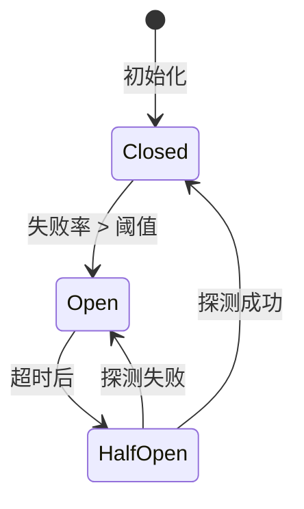
```mermaid
stateDiagram-v2
    [*] --> Closed: 初始化
    Closed --> Open: 失败率 > 阈值
    Open --> HalfOpen: 超时后
    HalfOpen --> Closed: 探测成功
    HalfOpen --> Open: 探测失败
```

**熔断器配置**：

```go
// CircuitBreakerConfig 熔断器配置
type CircuitBreakerConfig struct {
    // 失败率阈值（如0.5表示50%）
    FailureThreshold float64

    // 统计窗口大小
    WindowSize time.Duration

    // 最小请求数（低于此值不触发熔断）
    MinRequests int

    // Open状态持续时间
    Timeout time.Duration

    // HalfOpen状态允许的最大探测请求数
    MaxHalfOpenRequests int
}

// CircuitBreaker 熔断器接口
type CircuitBreaker interface {
    // Allow 判断是否允许请求通过
    Allow() bool

    // RecordSuccess 记录成功
    RecordSuccess()

    // RecordFailure 记录失败
    RecordFailure()

    // State 获取当前状态
    State() CircuitState
}

type CircuitState int

const (
    StateClosed CircuitState = iota    // 正常通过
    StateOpen                          // 熔断，拒绝请求
    StateHalfOpen                      // 半开，允许探测
)
```

**TaskScheduler集成熔断器**：

```go
// TaskScheduler集成熔断器
type TaskScheduler struct {
    // ... 其他字段

    // circuitBreaker 熔断器实例
    circuitBreaker CircuitBreaker

    // 熔断器统计指标
    cbMetrics *CircuitBreakerMetrics
}

// handlePolicyMatched 处理策略匹配事件（带熔断保护）
func (ts *TaskScheduler) handlePolicyMatched(eventCh <-chan *common.Event) {
    for event := range eventCh {
        // 1. 检查熔断器状态
        if !ts.circuitBreaker.Allow() {
            ts.logger.Warn("circuit breaker open, dropping event",
                zap.String("topic", "policy.matched"))
            ts.metrics.IncrementCounter("circuit_breaker_rejected", nil)
            continue
        }

        // 2. 尝试创建任务
        err := ts.handleMatchedEvent(event)

        // 3. 记录熔断器统计
        if err != nil {
            ts.circuitBreaker.RecordFailure()
            ts.logger.Error("handle matched event failed",
                zap.Error(err),
                zap.String("circuit_state", ts.circuitBreaker.State().String()))
        } else {
            ts.circuitBreaker.RecordSuccess()
        }
    }
}

// handleMatchedEvent 处理匹配事件的具体逻辑
func (ts *TaskScheduler) handleMatchedEvent(event *common.Event) error {
    // 解析Payload获取TaskConfig
    var payload struct {
        PolicyID   string                 `json:"policy_id"`
        TaskConfig map[string]interface{} `json:"task_config"`
        Metadata   map[string]string      `json:"metadata"`
    }

    if err := json.Unmarshal(event.Payload, &payload); err != nil {
        return fmt.Errorf("unmarshal payload: %w", err)
    }

    // 创建任务（可能因资源限制失败）
    _, err := ts.CreateTask(payload.TaskConfig, payload.Metadata)
    return err
}
```

**熔断触发条件**：

| 场景 | 失败类型 | 说明 |
|------|----------|------|
| 资源不足 | `ErrMaxTasksReached` | 达到MaxConcurrentTasks或MaxTotalTasks |
| 存储故障 | `ErrTaskStoreUnavailable` | TaskStore.Save/Update失败 |
| 状态机故障 | `ErrStateMachineCreate` | StateMachineFactory.Create失败 |
| 超时 | `ErrTaskCreateTimeout` | 任务创建超时 |

**设计优势**：

1. **快速失败**：熔断期间新任务立即拒绝，避免队列积压
2. **自动恢复**：超时后自动进入HalfOpen状态探测
3. **无损降级**：被拒绝的任务可通过重试机制由其他实例处理（如用户所说多实例场景不存在，则任务会被记录为失败）
4. **可观测**：熔断器状态可导出为metrics，便于监控

### 4.8 资源限制与回收机制

#### 4.8.1 任务生命周期管理

**最大任务数限制**：

```go
// TaskScheduler资源限制配置
type SchedulerLimits struct {
    // 最大并发任务数
    MaxConcurrentTasks int

    // 最大任务总数（包括pending、running、completed等所有状态）
    MaxTotalTasks int

    // 单个任务最大生命周期（0表示无限制）
    MaxTaskLifetime time.Duration

    // 任务完成后的保留时间（之后可从TaskStore删除）
    CompletedTaskRetention time.Duration
}

// TaskScheduler实现资源限制
type TaskScheduler struct {
    // ...
    limits SchedulerLimits

    // 当前活跃任务数
    activeTasks atomic.Int32

    // 任务创建时间记录（用于生命周期管理）
    taskCreatedAt map[string]time.Time
}

// CreateTask 创建任务（带资源限制检查）
func (ts *TaskScheduler) CreateTask(task *Task) error {
    // 1. 检查最大任务数限制
    if ts.activeTasks.Load() >= int32(ts.limits.MaxConcurrentTasks) {
        return fmt.Errorf("max concurrent tasks reached: %d", ts.limits.MaxConcurrentTasks)
    }

    // 2. 检查总任务数限制
    totalTasks, _ := ts.taskStore.Count()
    if ts.limits.MaxTotalTasks > 0 && totalTasks >= ts.limits.MaxTotalTasks {
        return fmt.Errorf("max total tasks reached: %d", ts.limits.MaxTotalTasks)
    }

    // 3. 创建任务
    // ...

    ts.activeTasks.Add(1)
    ts.taskCreatedAt[task.ID] = time.Now()
    return nil
}
```

#### 4.8.2 cgroups资源隔离实现

**目标**：限制单个任务可使用的CPU、内存、IO资源，防止任务失控影响系统稳定。

**cgroups v1 vs v2 适配**：

```go
// CgroupManager cgroups管理器接口
type CgroupManager interface {
    // CreateCgroup 为任务创建cgroup
    CreateCgroup(taskID string, limits ResourceLimits) error

    // DeleteCgroup 删除任务cgroup
    DeleteCgroup(taskID string) error

    // GetStats 获取任务资源使用统计
    GetStats(taskID string) (*ResourceStats, error)

    // ApplyToProcess 将进程加入任务cgroup
    ApplyToProcess(taskID string, pid int) error
}

// ResourceLimits 资源限制配置
type ResourceLimits struct {
    // CPU限制
    CPUQuota  int64   // CPU配额（微秒）-1表示不限制
    CPUPeriod uint64  // 配额周期（微秒）默认100000
    CPUShares uint64  // CPU份额（相对权重）默认1024

    // 内存限制
    MemoryLimit     int64 // 内存硬限制（字节）-1表示不限制
    MemorySoftLimit int64 // 内存软限制（字节）
    SwapLimit       int64 // Swap限制（字节）-1表示不限制

    // IO限制（cgroups v1: blkio, v2: io）
    IOReadBPS  map[string]uint64 // 设备路径 -> 读取BPS限制
    IOWriteBPS map[string]uint64 // 设备路径 -> 写入BPS限制
}

// CgroupV1Manager cgroups v1实现（Linux < 5.5或手动启用）
type CgroupV1Manager struct {
    rootPath string // /sys/fs/cgroup
}

func (m *CgroupV1Manager) CreateCgroup(taskID string, limits ResourceLimits) error {
    cgroupPath := filepath.Join(m.rootPath, "nuts", taskID)

    // 创建各子系统目录
    subsystems := []string{"cpu", "memory", "blkio"}
    for _, subsys := range subsystems {
        path := filepath.Join(m.rootPath, subsys, "nuts", taskID)
        if err := os.MkdirAll(path, 0755); err != nil {
            return fmt.Errorf("create cgroup %s: %w", subsys, err)
        }
    }

    // 设置CPU限制
    if limits.CPUQuota > 0 {
        quotaPath := filepath.Join(m.rootPath, "cpu", "nuts", taskID, "cpu.cfs_quota_us")
        if err := os.WriteFile(quotaPath, []byte(strconv.FormatInt(limits.CPUQuota, 10)), 0644); err != nil {
            return fmt.Errorf("set cpu quota: %w", err)
        }
        periodPath := filepath.Join(m.rootPath, "cpu", "nuts", taskID, "cpu.cfs_period_us")
        os.WriteFile(periodPath, []byte(strconv.FormatUint(limits.CPUPeriod, 10)), 0644)
    }

    // 设置内存限制
    if limits.MemoryLimit > 0 {
        memPath := filepath.Join(m.rootPath, "memory", "nuts", taskID, "memory.limit_in_bytes")
        if err := os.WriteFile(memPath, []byte(strconv.FormatInt(limits.MemoryLimit, 10)), 0644); err != nil {
            return fmt.Errorf("set memory limit: %w", err)
        }
    }

    return nil
}

func (m *CgroupV1Manager) ApplyToProcess(taskID string, pid int) error {
    pidStr := strconv.Itoa(pid)
    subsystems := []string{"cpu", "memory", "blkio"}

    for _, subsys := range subsystems {
        procsFile := filepath.Join(m.rootPath, subsys, "nuts", taskID, "cgroup.procs")
        if err := os.WriteFile(procsFile, []byte(pidStr), 0644); err != nil {
            return fmt.Errorf("add pid to %s cgroup: %w", subsys, err)
        }
    }
    return nil
}

// CgroupV2Manager cgroups v2实现（Linux >= 5.5统一层级）
type CgroupV2Manager struct {
    rootPath string // /sys/fs/cgroup
}

func (m *CgroupV2Manager) CreateCgroup(taskID string, limits ResourceLimits) error {
    cgroupPath := filepath.Join(m.rootPath, "nuts", taskID)

    // v2统一层级，只需创建一次
    if err := os.MkdirAll(cgroupPath, 0755); err != nil {
        return fmt.Errorf("create cgroup: %w", err)
    }

    // 启用所需控制器
    subtreeControl := filepath.Join(cgroupPath, "cgroup.subtree_control")
    controllers := []string{"+cpu", "+memory", "+io"}
    for _, ctrl := range controllers {
        os.WriteFile(subtreeControl, []byte(ctrl), 0644) // 忽略错误，可能已启用
    }

    // 设置CPU限制（v2使用cpu.max）
    if limits.CPUQuota > 0 {
        cpuMaxPath := filepath.Join(cgroupPath, "cpu.max")
        content := fmt.Sprintf("%d %d", limits.CPUQuota, limits.CPUPeriod)
        if err := os.WriteFile(cpuMaxPath, []byte(content), 0644); err != nil {
            return fmt.Errorf("set cpu.max: %w", err)
        }
    }

    // 设置内存限制（v2使用memory.max）
    if limits.MemoryLimit > 0 {
        memMaxPath := filepath.Join(cgroupPath, "memory.max")
        if err := os.WriteFile(memMaxPath, []byte(strconv.FormatInt(limits.MemoryLimit, 10)), 0644); err != nil {
            return fmt.Errorf("set memory.max: %w", err)
        }
    }

    // 设置IO限制（v2使用io.max）
    if len(limits.IOReadBPS) > 0 || len(limits.IOWriteBPS) > 0 {
        ioMaxPath := filepath.Join(cgroupPath, "io.max")
        var lines []string
        for dev, bps := range limits.IOReadBPS {
            lines = append(lines, fmt.Sprintf("%s rbps=%d", dev, bps))
        }
        for dev, bps := range limits.IOWriteBPS {
            lines = append(lines, fmt.Sprintf("%s wbps=%d", dev, bps))
        }
        if len(lines) > 0 {
            content := strings.Join(lines, "\n")
            if err := os.WriteFile(ioMaxPath, []byte(content), 0644); err != nil {
                return fmt.Errorf("set io.max: %w", err)
            }
        }
    }

    return nil
}

func (m *CgroupV2Manager) ApplyToProcess(taskID string, pid int) error {
    procsFile := filepath.Join(m.rootPath, "nuts", taskID, "cgroup.procs")
    return os.WriteFile(procsFile, []byte(strconv.Itoa(pid)), 0644)
}
```

**自动检测与适配**：

```go
// DetectCgroupVersion 检测系统cgroups版本
func DetectCgroupVersion() (int, error) {
    // 检查是否存在v2统一层级
    if _, err := os.Stat("/sys/fs/cgroup/cgroup.controllers"); err == nil {
        return 2, nil
    }
    // 检查是否存在v1的memory子系统
    if _, err := os.Stat("/sys/fs/cgroup/memory/memory.limit_in_bytes"); err == nil {
        return 1, nil
    }
    return 0, fmt.Errorf("no supported cgroup version found")
}

// NewCgroupManager 工厂函数，自动检测版本
func NewCgroupManager() (CgroupManager, error) {
    version, err := DetectCgroupVersion()
    if err != nil {
        return nil, err
    }

    switch version {
    case 1:
        return &CgroupV1Manager{rootPath: "/sys/fs/cgroup"}, nil
    case 2:
        return &CgroupV2Manager{rootPath: "/sys/fs/cgroup"}, nil
    default:
        return nil, fmt.Errorf("unsupported cgroup version: %d", version)
    }
}
```

**与TaskScheduler集成**：

```go
// TaskScheduler集成cgroups
type TaskScheduler struct {
    // ... 其他字段

    cgroupMgr CgroupManager  // cgroups管理器（可选，nil表示不隔离）
}

// StateMachine回调中应用cgroup
func (ts *TaskScheduler) onTaskRunning(taskID string) {
    if ts.cgroupMgr == nil {
        return
    }

    // 获取任务配置中的资源限制
    task, _ := ts.taskStore.Get(taskID)
    if task == nil || task.ResourceLimits == nil {
        return
    }

    // 创建cgroup
    if err := ts.cgroupMgr.CreateCgroup(taskID, *task.ResourceLimits); err != nil {
        ts.logger.Error("Failed to create cgroup", zap.Error(err))
        // 不阻断任务执行，但记录告警
        return
    }

    // 将任务相关进程加入cgroup（由具体执行器调用）
    // 例如：ts.cgroupMgr.ApplyToProcess(taskID, taskPID)
}

// 任务结束时清理cgroup
func (ts *TaskScheduler) onTaskCompleted(taskID string) {
    if ts.cgroupMgr == nil {
        return
    }

    if err := ts.cgroupMgr.DeleteCgroup(taskID); err != nil {
        ts.logger.Warn("Failed to delete cgroup", zap.Error(err))
    }
}
```

**cgroups v1 vs v2 对比**：

| 特性 | cgroups v1 | cgroups v2 |
|------|------------|------------|
| 层级结构 | 多层级（每个子系统独立） | 单一层级（统一树） |
| 控制器启用 | 自动 | 需写入cgroup.subtree_control |
| CPU限制 | cpu.cfs_quota_us / cpu.cfs_period_us | cpu.max（组合值） |
| 内存限制 | memory.limit_in_bytes | memory.max |
| IO限制 | blkio.throttle.read_bps_device | io.max |
| 进程迁移 | 需逐个加入各子系统 | 只需加入一次 |
| 检测方式 | /sys/fs/cgroup/memory存在 | /sys/fs/cgroup/cgroup.controllers存在 |

**配置示例**：

```toml
[scheduler.resources]
# 启用cgroups隔离
enable_cgroups = true
# 指定cgroups版本（auto/1/2），auto自动检测
cgroup_version = "auto"
# cgroup根目录（默认/sys/fs/cgroup）
cgroup_root = "/sys/fs/cgroup"

# 默认资源限制（任务未指定时使用）
[scheduler.resources.defaults]
cpu_quota = 100000    # 100ms per 100ms = 1 CPU
cpu_period = 100000
memory_limit = 536870912  # 512MB
```

#### 4.8.3 任务超时与强制终止

```go
// TaskTimeoutManager 任务超时管理器
type TaskTimeoutManager struct {
    scheduler *TaskScheduler
    interval  time.Duration
    stopCh    chan struct{}
}

// Start 启动超时检查循环
func (tm *TaskTimeoutManager) Start() {
    ticker := time.NewTicker(tm.interval)
    defer ticker.Stop()

    for {
        select {
        case <-ticker.C:
            tm.checkTimeouts()
        case <-tm.stopCh:
            return
        }
    }
}

// checkTimeouts 检查并处理超时任务
func (tm *TaskTimeoutManager) checkTimeouts() {
    tm.scheduler.mu.RLock()
    taskIDs := make([]string, 0, len(tm.scheduler.taskCreatedAt))
    for taskID := range tm.scheduler.taskCreatedAt {
        taskIDs = append(taskIDs, taskID)
    }
    tm.scheduler.mu.RUnlock()

    now := time.Now()
    for _, taskID := range taskIDs {
        task, _ := tm.scheduler.taskStore.Get(taskID)
        if task == nil {
            continue
        }

        // 检查任务是否超时
        if tm.scheduler.limits.MaxTaskLifetime > 0 {
            elapsed := now.Sub(task.CreatedAt)
            if elapsed > tm.scheduler.limits.MaxTaskLifetime {
                // 强制终止任务
                tm.scheduler.forceTerminateTask(taskID, "timeout")
            }
        }
    }
}

// forceTerminateTask 强制终止任务
func (ts *TaskScheduler) forceTerminateTask(taskID, reason string) error {
    sm, err := ts.getStateMachine(taskID)
    if err != nil {
        return err
    }

    // 触发强制终止状态转换
    return sm.Transition(&common.Event{
        Type: "ForceTerminate",
        Payload: map[string]interface{}{
            "reason": reason,
            "timestamp": time.Now(),
        },
    })
}
```

#### 4.8.3 状态机内存回收

**问题**：已完成的Task，其StateMachine实例仍驻留在内存中，导致内存泄漏。

**解决方案**：

```go
// StateMachineManager 状态机生命周期管理器
type StateMachineManager struct {
    scheduler *TaskScheduler

    // 可回收状态机队列
    recyclableSMs chan string  // taskID

    // 配置
    retentionTime time.Duration  // 终态后保留时间
    maxInMemory   int            // 内存中最大状态机数
}

// StartGC 启动状态机垃圾回收
func (sm *StateMachineManager) StartGC() {
    // 1. 定时清理已完成任务的状态机
    go sm.periodicCleanup()

    // 2. 内存压力时主动回收
    go sm.memoryPressureGC()
}

// periodicCleanup 定期清理终态状态机
func (sm *StateMachineManager) periodicCleanup() {
    ticker := time.NewTicker(5 * time.Minute)
    defer ticker.Stop()

    for range ticker.C {
        sm.cleanupFinalStateMachines()
    }
}

// cleanupFinalStateMachines 清理终态状态机
func (sm *StateMachineManager) cleanupFinalStateMachines() {
    sm.scheduler.mu.Lock()
    defer sm.scheduler.mu.Unlock()

    now := time.Now()
    finalStates := map[string]bool{"completed": true, "failed": true, "cancelled": true}

    for taskID, stateMachine := range sm.scheduler.stateMachines {
        currentState := stateMachine.GetCurrentState()

        // 检查是否处于终态
        if _, isFinal := finalStates[string(currentState)]; !isFinal {
            continue
        }

        // 检查保留时间
        task, _ := sm.scheduler.taskStore.Get(taskID)
        if task == nil || task.CompletedAt == nil {
            continue
        }

        retention := now.Sub(*task.CompletedAt)
        if retention > sm.retentionTime {
            // 从内存中移除状态机
            delete(sm.scheduler.stateMachines, taskID)
            delete(sm.scheduler.taskLocks, taskID)
            delete(sm.scheduler.taskCreatedAt, taskID)
            sm.scheduler.activeTasks.Add(-1)

            // 可选择从TaskStore删除（取决于保留策略）
            // sm.scheduler.taskStore.Delete(taskID)
        }
    }
}

// memoryPressureGC 内存压力时GC
func (sm *StateMachineManager) memoryPressureGC() {
    // 监听系统内存或自定义信号
    // 当内存超过阈值时，优先回收 oldest 的终态任务状态机
}
```

#### 4.8.4 资源使用监控

```go
// ResourceMonitor 资源监控器
type ResourceMonitor struct {
    scheduler *TaskScheduler
    metrics   common.MetricsCollector
}

// Report 上报资源使用情况
func (rm *ResourceMonitor) Report() {
    rm.scheduler.mu.RLock()
    inMemorySMs := len(rm.scheduler.stateMachines)
    rm.scheduler.mu.RUnlock()

    // 上报指标
    rm.metrics.RecordGauge("scheduler_active_tasks", float64(rm.scheduler.activeTasks.Load()), nil)
    rm.metrics.RecordGauge("scheduler_in_memory_statemachines", float64(inMemorySMs), nil)

    // 告警检查
    if inMemorySMs > rm.scheduler.limits.MaxConcurrentTasks {
        // 触发告警：内存中状态机过多
    }
}
```

### 4.9 目录结构

```
pkg/scheduler/
├── interface.go          # TaskScheduler、StateMachine、TaskStore接口定义
├── task.go               # Task结构定义
├── events.go             # 任务生命周期事件定义
└── state_machine.go      # StateMachine配置结构
```

---

## 五、工作流编排模块设计

### 5.1 设计目标

工作流编排模块负责将多个任务组织成有向无环图（DAG），实现复杂的业务逻辑编排。主要设计目标包括：

1. **DAG编排**：支持有向无环图结构的任务依赖关系
2. **并行执行**：自动识别无依赖任务并行执行
3. **状态管理**：双层状态机制（DAG层+任务层）
4. **失败处理**：支持重试、失败传播策略
5. **可视化**：支持工作流定义的可视化编辑

### 5.2 核心概念

| 概念 | 说明 | 对应代码 |
|------|------|----------|
| **Workflow** | 工作流定义，包含节点和边 | `pkg/workflow/interface.go` |
| **DAG** | 有向无环图数据结构 | `pkg/workflow/dag.go` |
| **Node** | DAG中的任务节点 | `pkg/workflow/interface.go` |
| **NodeState** | 节点执行状态（Pending/Ready/Running/Completed/Failed） | `pkg/workflow/executor.go` |
| **Execution** | 一次工作流执行的运行时实例 | `pkg/workflow/interface.go` |

### 5.3 DAG执行引擎架构

#### 5.3.1 分层架构

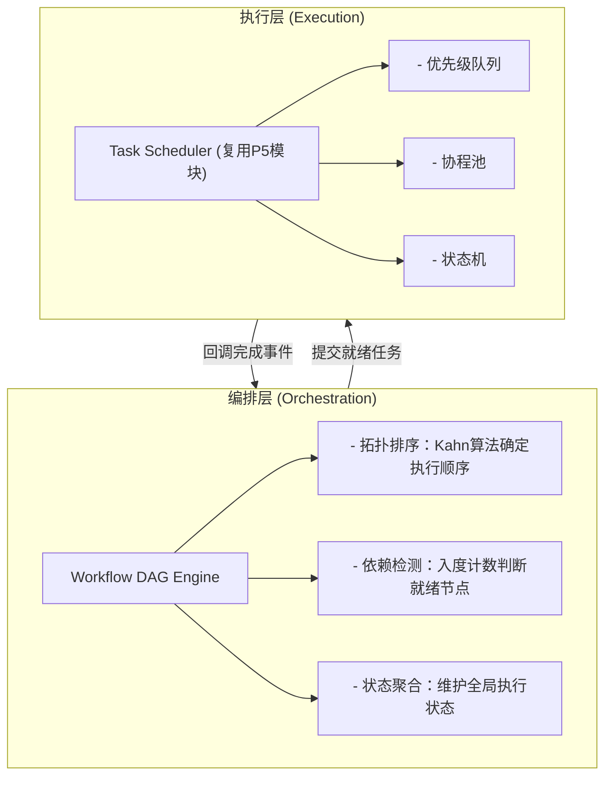
```mermaid
graph TB
    subgraph 编排层["编排层 (Orchestration)"]
        DAG["Workflow DAG Engine"]
        D1["- 拓扑排序：Kahn算法确定执行顺序"]
        D2["- 依赖检测：入度计数判断就绪节点"]
        D3["- 状态聚合：维护全局执行状态"]
        DAG --> D1
        DAG --> D2
        DAG --> D3
    end
    
    subgraph 执行层["执行层 (Execution)"]
        TS["Task Scheduler (复用P5模块)"]
        T1["- 优先级队列"]
        T2["- 协程池"]
        T3["- 状态机"]
        TS --> T1
        TS --> T2
        TS --> T3
    end
    
    编排层 -->|"提交就绪任务"| 执行层
    执行层 -->|"回调完成事件"| 编排层
```

#### 5.3.2 状态双轨制

**DAG节点状态**（编排视角）：
```go
const (
    NodeStatePending    // 等待依赖完成
    NodeStateReady      // 依赖完成，可提交执行
    NodeStateRunning    // 已提交到Scheduler
    NodeStateCompleted  // 执行成功
    NodeStateFailed     // 执行失败
    NodeStateCancelled  // 被取消
)
```

**Task状态**（执行视角）：
```go
const (
    TaskStatePending    // 在队列中等待
    TaskStateScheduled  // 已分配执行器
    TaskStateRunning    // 正在执行
    TaskStateCompleted  // 执行完成
    TaskStateFailed     // 执行失败
    TaskStateCancelled  // 被取消
    TaskStateTimeout    // 执行超时
)
```

**状态映射**：

| DAG NodeState | 方向 | TaskScheduler TaskState |
|:-------------|:----:|:------------------------|
| Pending | → | (无任务，未提交) |
| Ready | → | Submitted → Pending |
| Running | ← | Running |
| Completed | ← | Completed |
| Failed | ← | Failed / Timeout / Cancelled |

### 5.4 事件驱动执行循环

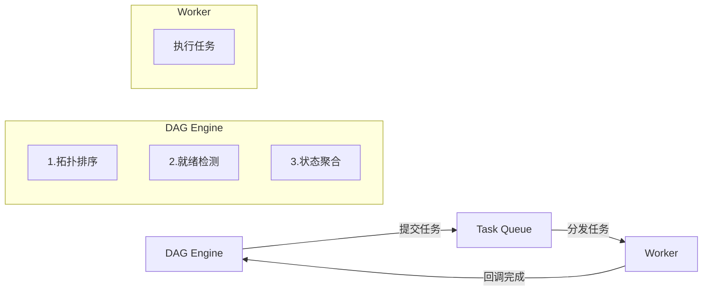
```mermaid
flowchart LR
    DE["DAG Engine"]
    TQ["Task Queue"]
    WK["Worker"]
    
    DE -->|"提交任务"| TQ
    TQ -->|"分发任务"| WK
    WK -->|"回调完成"| DE
    
    subgraph DAG_Engine["DAG Engine"]
        D1["1.拓扑排序"]
        D2["2.就绪检测"]
        D3["3.状态聚合"]
    end
    
    subgraph Worker["Worker"]
        W1["执行任务"]
    end
```

**执行流程**：
1. DAG Engine 通过拓扑排序确定执行顺序
2. 检测就绪节点（所有依赖已完成）
3. 将就绪节点转换为 Task 提交到 Scheduler
4. Scheduler 执行完成后回调通知 DAG Engine
5. DAG Engine 更新状态并检测新的就绪节点
6. 循环直到所有节点完成

### 5.5 关键算法

#### 5.5.1 Kahn拓扑排序
```go
func (dag *DAG) TopologicalSort() ([]string, error) {
    result := []string{}
    queue := make([]string, 0)
    
    // 找到所有入度为0的节点
    for id, node := range dag.Nodes {
        if node.InDegree == 0 {
            queue = append(queue, id)
        }
    }
    
    for len(queue) > 0 {
        // 取出一个节点
        current := queue[0]
        queue = queue[1:]
        result = append(result, current)
        
        // 减少子节点入度
        for _, childID := range dag.Nodes[current].Children {
            dag.Nodes[childID].InDegree--
            if dag.Nodes[childID].InDegree == 0 {
                queue = append(queue, childID)
            }
        }
    }
    
    return result, nil
}
```

#### 5.5.2 环检测
```go
func (dag *DAG) WouldFormCycle(from, to string) bool {
    visited := make(map[string]bool)
    
    var dfs func(node string) bool
    dfs = func(node string) bool {
        if node == from {
            return true // 发现回到起点，形成环
        }
        visited[node] = true
        
        for _, parent := range dag.Nodes[node].Parents {
            if !visited[parent] && dfs(parent) {
                return true
            }
        }
        return false
    }
    
    return dfs(to)
}
```

### 5.6 文件结构

```
pkg/workflow/
├── interface.go          # Workflow/Node/Execution 接口定义
├── dag.go               # DAG数据结构和算法
├── parser.go            # YAML/JSON工作流解析器
├── builder.go           # 链式API构建器
├── executor.go          # DAG执行引擎
├── manager.go           # WorkflowManager实现
├── http.go              # HTTP REST API
├── store.go             # 工作流存储接口
└── integration_test.go  # 集成测试
```

### 5.7 使用示例

```go
// 使用构建器创建工作流
workflow, _ := workflow.NewWorkflowBuilder("deploy", "Deploy Service").
    WithTimeout(600).
    AddTask("build", "Build", "exec", map[string]interface{}{
        "command": "make build",
    }).
    AddTask("test", "Test", "exec", map[string]interface{}{
        "command": "make test",
    }).
    AddTask("deploy", "Deploy", "restart", map[string]interface{}{
        "service": "my-service",
    }).
    AddDependency("build", "test").
    AddDependency("test", "deploy").
    Build()

// 执行工作流
execution, _ := engine.Execute(ctx, workflow)

// 查询状态
status, _ := engine.GetStatus(execution.ID)
fmt.Printf("Progress: %.2f%%\n", status.Progress)
```

---

## 六、EventBus通信层设计

### 5.1 设计目标

为了支持单机和分布式部署场景，需要对事件总线进行接口抽象。

1. **统一接口**：定义统一的事件总线接口，屏蔽底层实现差异
2. **多实现支持**：支持gRPC、Redis、Kafka等多种实现
3. **事件序列化**：定义统一的事件序列化格式（protobuf）
4. **订阅发布**：支持主题订阅和发布模式

### 6.2 事件序列化接口设计

**设计原则**：不同EventBus实现（gRPC、Redis、Kafka）可能有不同的序列化需求和传输格式。框架层面只定义序列化接口，**具体序列化格式由各实现决定**。

#### 6.2.1 序列化器接口

```go
// pkg/eventbus/serializer.go
package eventbus

import "github.com/sig-cloudnative/nuts/pkg/common"

// EventSerializer 事件序列化器接口
// 各EventBus实现（gRPC/Redis/Kafka）实现此接口，定义自己的序列化格式
type EventSerializer interface {
    // Serialize 将Event序列化为字节数组
    // 实现者根据场景需求选择字段和格式
    Serialize(event *common.Event) ([]byte, error)

    // Deserialize 将字节数组反序列化为Event
    Deserialize(data []byte) (*common.Event, error)

    // ContentType 返回序列化格式标识（如 "application/protobuf", "application/json"）
    ContentType() string
}
```

#### 6.2.2 实现示例：gRPC场景

gRPC场景下推荐使用Protobuf，但字段可根据需求裁剪：

```protobuf
// pkg/eventbus/grpc/proto/event.proto
syntax = "proto3";

package nuts.eventbus.grpc;

option go_package = "github.com/sig-cloudnative/nuts/pkg/eventbus/grpc/proto";

import "google/protobuf/struct.proto";

// GrpcEvent gRPC传输用的事件定义
// 字段根据gRPC场景需求精简，可自定义
message GrpcEvent {
    string id = 1;
    string type = 2;
    string topic = 3;
    // Payload按需序列化，可能只包含关键字段（参见3.8节）
    google.protobuf.Struct payload = 4;
    int64 timestamp = 5;
    // gRPC场景下trace_id用于链路追踪，其他字段可选
    string trace_id = 6;
}
```

```go
// pkg/eventbus/grpc/serializer.go
package grpc

import (
    "github.com/sig-cloudnative/nuts/pkg/common"
    "github.com/sig-cloudnative/nuts/pkg/eventbus"
    "github.com/sig-cloudnative/nuts/pkg/eventbus/grpc/proto"
    "google.golang.org/protobuf/types/known/structpb"
)

// GrpcSerializer gRPC序列化器实现
type GrpcSerializer struct{}

func (s *GrpcSerializer) Serialize(e *common.Event) ([]byte, error) {
    // 根据gRPC场景需求，选择需要的字段
    // 可能只序列化关键字段，省略version/source等
    payload, _ := structpb.NewStruct(e.Payload)

    grpcEvent := &proto.GrpcEvent{
        Id:        e.ID,
        Type:      e.Type,
        Topic:     e.Topic,
        Payload:   payload,
        Timestamp: e.Timestamp.UnixMilli(),
        TraceId:   e.TraceID,
    }

    return proto.Marshal(grpcEvent)
}

func (s *GrpcSerializer) Deserialize(data []byte) (*common.Event, error) {
    grpcEvent := &proto.GrpcEvent{}
    if err := proto.Unmarshal(data, grpcEvent); err != nil {
        return nil, err
    }

    return &common.Event{
        ID:        grpcEvent.Id,
        Type:      grpcEvent.Type,
        Topic:     grpcEvent.Topic,
        Payload:   grpcEvent.Payload.AsMap(),
        Timestamp: time.UnixMilli(grpcEvent.Timestamp),
        TraceID:   grpcEvent.TraceId,
    }, nil
}

func (s *GrpcSerializer) ContentType() string {
    return "application/x-protobuf"
}

// 确保GrpcSerializer实现EventSerializer接口
var _ eventbus.EventSerializer = (*GrpcSerializer)(nil)
```

#### 6.2.3 实现示例：Redis场景

Redis场景下可能使用JSON或MessagePack，字段也可不同：

```go
// pkg/eventbus/redis/serializer.go
package redis

import (
    "encoding/json"
    "github.com/sig-cloudnative/nuts/pkg/common"
    "github.com/sig-cloudnative/nuts/pkg/eventbus"
)

// RedisEvent Redis传输用的事件结构
// 可根据Redis场景需求定义不同字段
type RedisEvent struct {
    ID        string                 `json:"id"`
    Type      string                 `json:"type"`
    Topic     string                 `json:"topic"`
    Payload   map[string]interface{} `json:"payload"`
    Timestamp int64                  `json:"ts"`  // 字段名可简化
    // Redis场景可能不需要trace_id，或者添加ttl字段
    TTL int `json:"ttl,omitempty"`
}

// RedisSerializer Redis序列化器实现
type RedisSerializer struct{}

func (s *RedisSerializer) Serialize(e *common.Event) ([]byte, error) {
    redisEvent := &RedisEvent{
        ID:        e.ID,
        Type:      e.Type,
        Topic:     e.Topic,
        Payload:   e.Payload,  // Payload已按3.8节精简
        Timestamp: e.Timestamp.UnixMilli(),
        TTL:       3600,  // Redis场景添加TTL
    }
    return json.Marshal(redisEvent)
}

func (s *RedisSerializer) Deserialize(data []byte) (*common.Event, error) {
    redisEvent := &RedisEvent{}
    if err := json.Unmarshal(data, redisEvent); err != nil {
        return nil, err
    }

    return &common.Event{
        ID:        redisEvent.ID,
        Type:      redisEvent.Type,
        Topic:     redisEvent.Topic,
        Payload:   redisEvent.Payload,
        Timestamp: time.UnixMilli(redisEvent.Timestamp),
    }, nil
}

func (s *RedisSerializer) ContentType() string {
    return "application/json"
}

var _ eventbus.EventSerializer = (*RedisSerializer)(nil)
```

#### 6.2.4 设计优势

1. **场景化字段定义**：gRPC、Redis、Kafka可根据各自场景需求定义不同的Event结构和字段
2. **灵活的序列化格式**：gRPC可用Protobuf，Redis可用JSON，Kafka可用Avro，互不干扰
3. **按需裁剪字段**：各实现可根据传输特点选择需要的字段（如Redis可省略trace_id，添加TTL）
4. **统一的抽象层**：框架层面只依赖 `EventSerializer`接口，不关心具体实现

### 6.3 接口设计

```go
// pkg/eventbus/interface.go
package eventbus

import "github.com/sig-cloudnative/nuts/pkg/common"

// EventBus 事件总线接口
type EventBus interface {
    // Publish 发布事件
    Publish(topic string, event *common.Event) error

    // Subscribe 订阅事件
    Subscribe(topic string) <-chan *common.Event

    // Unsubscribe 取消订阅
    Unsubscribe(topic string) error

    // Close 关闭事件总线
    Close() error
}
```

### 6.4 EventBus工厂

EventBus模块遵循第六章的工厂模式配置设计，通过`type`字段指定EventBus实现类型。

```go
// pkg/eventbus/factory.go
package eventbus

import "github.com/sig-cloudnative/nuts/pkg/common"

// Factory EventBus工厂（包级别单例）
var Factory = &EventBusFactory{
    BaseFactory: common.NewBaseFactory(),
}

type EventBusFactory struct {
    *common.BaseFactory
}

// init 自动注册内置EventBus类型
func init() {
    Factory.Register("grpc", parseGRPCConfig, validateGRPCConfig)
    Factory.Register("redis", parseRedisConfig, validateRedisConfig)
    Factory.Register("kafka", parseKafkaConfig, validateKafkaConfig)

    // 注册内置creator
    eventBusCreators["grpc"] = func(cfg interface{}) (EventBus, error) {
        return NewGRPCEventBus(cfg.(*GRPCConfig))
    }
    eventBusCreators["redis"] = func(cfg interface{}) (EventBus, error) {
        return NewRedisEventBus(cfg.(*RedisConfig))
    }
    eventBusCreators["kafka"] = func(cfg interface{}) (EventBus, error) {
        return NewKafkaEventBus(cfg.(*KafkaConfig))
    }
}

// Create 根据配置创建EventBus
func (f *EventBusFactory) Create(configStr string) (EventBus, error) {
    typeName, err := f.GetTypeFromConfig(configStr)
    if err != nil {
        return nil, err
    }

    cfg, err := f.Parse(typeName, configStr)
    if err != nil {
        return nil, err
    }

    creator, ok := eventBusCreators[typeName]
    if !ok {
        return nil, fmt.Errorf("unsupported eventbus type: %s", typeName)
    }
    return creator(cfg)
}

// RegisterEventBus 允许第三方注册自定义EventBus实现
func RegisterEventBus(typeName string, parser common.ConfigParserFunc, validator common.ValidatorFunc, creator EventBusCreator) {
    Factory.Register(typeName, parser, validator)
    eventBusCreators[typeName] = creator
}

type EventBusCreator func(cfg interface{}) (EventBus, error)

var eventBusCreators = make(map[string]EventBusCreator)
```

### 6.5 配置设计

```toml
# nuts.toml EventBus配置段示例

[eventbus]
type = "grpc"  # grpc/redis/kafka

[eventbus.grpc]
addr = "localhost:50051"
tls_enabled = false

# TLS配置（可选）
[eventbus.grpc.tls]
cert_file = "/etc/nuts/certs/grpc.crt"
key_file = "/etc/nuts/certs/grpc.key"

# Redis配置示例
# [eventbus.redis]
# addr = "localhost:6379"
# password = ""
# db = 0

# Kafka配置示例
# [eventbus.kafka]
# brokers = ["localhost:9092"]
# topic = "nuts-events"
```

**配置结构体**：

```go
// GRPCConfig gRPC EventBus配置
type GRPCConfig struct {
    Type       string     `toml:"type"`
    Addr       string     `toml:"addr"`
    TLSEnabled bool       `toml:"tls_enabled"`
    TLS        *TLSConfig `toml:"tls,omitempty"`
}

type TLSConfig struct {
    CertFile string `toml:"cert_file"`
    KeyFile  string `toml:"key_file"`
    CAFile   string `toml:"ca_file"`
}

// 解析和校验函数
func parseGRPCConfig(configStr string) (interface{}, error) {
    var cfg GRPCConfig
    _, err := toml.Decode(configStr, &cfg)
    return &cfg, err
}

func validateGRPCConfig(cfg interface{}) error {
    c := cfg.(*GRPCConfig)
    if c.Addr == "" {
        return fmt.Errorf("grpc.addr is required")
    }
    return nil
}
```

### 6.6 基于gRPC的EventBus实现设计

#### 6.6.1 gRPC服务定义

```protobuf
// pkg/eventbus/grpc/proto/eventbus.proto
syntax = "proto3";

package nuts.eventbus;

option go_package = "github.com/sig-cloudnative/nuts/pkg/eventbus/grpc/proto";

// EventBusService gRPC事件总线服务
service EventBusService {
    // Subscribe 订阅主题流
    // 客户端发起订阅请求，服务端持续推送匹配的事件
    rpc Subscribe(SubscribeRequest) returns (stream Event);

    // Publish 发布事件
    rpc Publish(PublishRequest) returns (PublishResponse);

    // Unsubscribe 取消订阅
    rpc Unsubscribe(UnsubscribeRequest) returns (UnsubscribeResponse);
}

// SubscribeRequest 订阅请求
message SubscribeRequest {
    string client_id = 1;           // 订阅者唯一标识（用于管理订阅关系）
    repeated string topics = 2;     // 订阅的主题列表（支持通配符）
    // 可选：事件过滤条件
    EventFilter filter = 3;
}

// EventFilter 事件过滤条件
message EventFilter {
    // 只接收特定类型的事件
    repeated string event_types = 1;
    // 只接收包含特定字段的事件
    map<string, string> required_fields = 2;
    // 例如：只接收特定cgroup的事件
    // required_fields["cgroup_id"] = "xxx"
}

// Event gRPC传输的事件结构
message Event {
    string id = 1;
    string type = 2;
    string topic = 3;
    bytes payload = 4;              // 序列化后的Payload（由EventSerializer处理）
    int64 timestamp = 5;
    string trace_id = 6;
    string source = 7;
}

// PublishRequest 发布请求
message PublishRequest {
    string topic = 1;
    Event event = 2;
}

// PublishResponse 发布响应
message PublishResponse {
    bool success = 1;
    string message = 2;
}

// UnsubscribeRequest 取消订阅请求
message UnsubscribeRequest {
    string client_id = 1;
    repeated string topics = 2;
}

message UnsubscribeResponse {
    bool success = 1;
}
```

#### 6.6.2 Topic命名规范

**命名格式**：`{domain}.{resource}.{action}` 或 `{domain}.{action}`

| 类型     | 格式示例                                                               | 说明          |
| ------ | ------------------------------------------------------------------ | ----------- |
| 策略事件   | `policy.matched`                                                   | 策略匹配成功      |
| 任务生命周期 | `task.created`, `task.state_changed`, `task.completed`             | 任务状态变化      |
| 任务控制   | `task.command.pause`, `task.command.resume`, `task.command.cancel` | 控制命令        |
| 业务事件   | `container.created`, `container.stopped`                           | 容器相关（数据源产生） |
| 状态机触发  | `state.start`, `state.stop`, `state.retry`                         | 触发状态转换      |

**通配符支持**：

- `task.*` - 匹配所有task相关topic
- `task.command.*` - 匹配所有task命令
- `*.created` - 匹配所有创建事件

#### 6.6.3 gRPC EventBus实现

```go
// pkg/eventbus/grpc/grpc.go
package grpc

import (
    "context"
    "io"
    "sync"

    "github.com/sig-cloudnative/nuts/pkg/common"
    "github.com/sig-cloudnative/nuts/pkg/eventbus"
    "github.com/sig-cloudnative/nuts/pkg/eventbus/grpc/proto"
)

// GrpcEventBus gRPC事件总线实现
type GrpcEventBus struct {
    client     proto.EventBusServiceClient
    serializer eventbus.EventSerializer

    // 订阅管理
    subscriptions map[string]*subscription  // key: topic
    mu            sync.RWMutex

    // 接收到的event channel
    eventCh chan *common.Event
}

type subscription struct {
    clientID string
    topics   []string
    stream   proto.EventBusService_SubscribeClient
    cancel   context.CancelFunc
}

// NewGrpcEventBus 创建gRPC事件总线
func NewGrpcEventBus(addr string, serializer eventbus.EventSerializer) (*GrpcEventBus, error) {
    // 建立gRPC连接...
}

// Publish 发布事件
func (eb *GrpcEventBus) Publish(topic string, event *common.Event) error {
    // 1. 序列化Payload
    payloadBytes, err := eb.serializer.Serialize(event)
    if err != nil {
        return err
    }

    // 2. 构建gRPC Event
    grpcEvent := &proto.Event{
        Id:        event.ID,
        Type:      event.Type,
        Topic:     topic,
        Payload:   payloadBytes,
        Timestamp: event.Timestamp.UnixMilli(),
        TraceId:   event.TraceID,
        Source:    event.Source,
    }

    // 3. 发送给gRPC服务端
    req := &proto.PublishRequest{
        Topic: topic,
        Event: grpcEvent,
    }

    _, err = eb.client.Publish(context.Background(), req)
    return err
}

// Subscribe 订阅主题
func (eb *GrpcEventBus) Subscribe(topic string) <-chan *common.Event {
    eb.mu.Lock()
    defer eb.mu.Unlock()

    // 如果已经订阅过，直接返回
    if sub, ok := eb.subscriptions[topic]; ok {
        return eb.eventCh
    }

    // 创建订阅上下文
    ctx, cancel := context.WithCancel(context.Background())

    // 发起gRPC订阅
    stream, err := eb.client.Subscribe(ctx, &proto.SubscribeRequest{
        ClientId: generateClientID(),
        Topics:   []string{topic},
    })
    if err != nil {
        cancel()
        return nil
    }

    // 保存订阅关系
    eb.subscriptions[topic] = &subscription{
        clientID: generateClientID(),
        topics:   []string{topic},
        stream:   stream,
        cancel:   cancel,
    }

    // 启动goroutine接收事件
    go eb.receiveEvents(stream)

    return eb.eventCh
}

// receiveEvents 持续接收gRPC流事件
func (eb *GrpcEventBus) receiveEvents(stream proto.EventBusService_SubscribeClient) {
    for {
        grpcEvent, err := stream.Recv()
        if err == io.EOF {
            return
        }
        if err != nil {
            // 处理错误...
            return
        }

        // 反序列化为common.Event
        event := &common.Event{
            ID:        grpcEvent.Id,
            Type:      grpcEvent.Type,
            Topic:     grpcEvent.Topic,
            Timestamp: time.UnixMilli(grpcEvent.Timestamp),
            TraceID:   grpcEvent.TraceId,
            Source:    grpcEvent.Source,
        }

        // 反序列化Payload
        event.Payload = make(map[string]interface{})
        // ... 反序列化逻辑

        // 发送到channel
        eb.eventCh <- event
    }
}
```

#### 6.6.4 事件发布流程详解

**PolicyEngine发布 `policy.matched`事件**：

```go
// 1. 构建精简的Payload（参见3.8节）
payload := map[string]interface{}{
    "cgroup_id":    originalEvent.Payload["cgroup_id"],
    "pod_name":     originalEvent.Payload["pod_name"],
    "container_id": originalEvent.Payload["container_id"],
    "policy_id":    matchResult.PolicyID,
    "task_config":  matchResult.TaskConfig,
}

// 2. 创建Event
event := &common.Event{
    ID:        idGenerator.Generate(),
    Type:      "policy.matched",  // 也是topic的一部分
    Topic:     "policy.matched",
    Payload:   payload,
    Timestamp: time.Now(),
    TraceID:   originalEvent.TraceID,  // 保持链路追踪
    Source:    "policy-engine",
}

// 3. 发布
eventBus.Publish("policy.matched", event)
```

**TaskScheduler发布 `task.state_changed`事件**：

```go
// 在StateChangeCallback中
func (ts *TaskScheduler) onStateChange(taskID, oldState, newState string) {
    event := &common.Event{
        ID:        idGenerator.Generate(),
        Type:      "task.state_changed",
        Topic:     "task.state_changed",
        Payload: map[string]interface{}{
            "task_id":   taskID,
            "old_state": oldState,
            "new_state": newState,
            "timestamp": time.Now(),
        },
        Timestamp: time.Now(),
        Source:    "task-scheduler",
    }

    eventBus.Publish("task.state_changed", event)
}
```

#### 6.6.5 事件订阅与路由机制

**TaskScheduler订阅处理**：

```go
// TaskScheduler启动时订阅
func (ts *TaskScheduler) Start() error {
    // 订阅策略匹配事件
    policyCh := ts.eventBus.Subscribe("policy.matched")
    go ts.handlePolicyMatched(policyCh)

    // 订阅任务控制命令
    cmdCh := ts.eventBus.Subscribe("task.command.*")
    go ts.handleTaskCommand(cmdCh)

    // 订阅状态机触发事件（从配置加载）
    for _, transition := range stateMachineConfig.Transitions {
        // 订阅每个transition.event对应的topic
        eventCh := ts.eventBus.Subscribe("state." + transition.Event)
        go ts.handleStateTrigger(eventCh)
    }

    return nil
}

// 处理policy.matched事件
func (ts *TaskScheduler) handlePolicyMatched(ch <-chan *common.Event) {
    for event := range ch {
        // 提取Payload中的关键字段
        cgroupID := event.Payload["cgroup_id"]
        policyID := event.Payload["policy_id"]
        taskConfig := event.Payload["task_config"]

        // 创建任务
        task := &Task{
            ID:       ts.idGenerator.Generate(),
            PolicyID: policyID,
            State:    ts.stateMachineConfig.InitialState,
            Metadata: map[string]interface{}{
                "cgroup_id": cgroupID,
                // ...
            },
        }

        // 保存、创建状态机...
    }
}

// 处理任务控制命令
func (ts *TaskScheduler) handleTaskCommand(ch <-chan *common.Event) {
    for event := range ch {
        // event.Type可能是 "task.command.pause", "task.command.cancel"等
        command := extractCommand(event.Type)  // pause/cancel/resume
        taskID := event.Payload["task_id"]

        // 找到对应任务的状态机
        sm, err := ts.getStateMachine(taskID)
        if err != nil {
            continue
        }

        // 根据命令触发状态转换
        switch command {
        case "pause":
            sm.Transition(&common.Event{Type: "PauseTask"})
        case "cancel":
            sm.Transition(&common.Event{Type: "CancelTask"})
        }
    }
}
```

#### 6.6.6 事件过滤与匹配

**基于gRPC的过滤实现**：

```go
// 订阅时添加过滤条件
func (ts *TaskScheduler) SubscribeWithFilter() {
    // 只接收特定cgroup的事件
    filter := &proto.EventFilter{
        RequiredFields: map[string]string{
            "cgroup_id": "target_cgroup_id",
        },
    }

    // gRPC服务端根据filter过滤后推送
    stream, _ := eb.client.Subscribe(ctx, &proto.SubscribeRequest{
        Topics:   []string{"policy.matched"},
        Filter:   filter,
    })
}
```

#### 6.6.7 事件交互总结

**完整交互流程**：

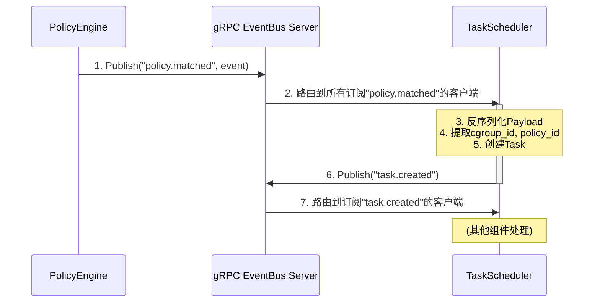
```mermaid
sequenceDiagram
    participant PE as PolicyEngine
    participant EB as gRPC EventBus Server
    participant TS as TaskScheduler

    PE->>EB: 1. Publish("policy.matched", event)
    EB->>TS: 2. 路由到所有订阅"policy.matched"的客户端
    activate TS
    Note over TS: 3. 反序列化Payload<br/>4. 提取cgroup_id, policy_id<br/>5. 创建Task
    TS->>EB: 6. Publish("task.created")
    deactivate TS
    EB->>TS: 7. 路由到订阅"task.created"的客户端
    Note over TS: (其他组件处理)
```

**关键设计点**：

1. **Topic驱动**：通过topic名称路由事件，实现发布-订阅解耦
2. **Payload精简**：只传输必要字段（3.8节），减少网络开销
3. **gRPC流式订阅**：服务端持续推送，客户端实时接收
4. **事件过滤**：服务端支持基于字段过滤，减少客户端处理压力

### 6.7 目录结构

```
pkg/eventbus/
├── interface.go          # EventBus、EventSerializer接口定义
├── factory.go            # EventBus工厂
├── serializer.go         # 序列化器接口（5.2.1节）
└── grpc/                 # gRPC实现
    ├── grpc.go           # GrpcEventBus实现
    ├── server.go         # gRPC服务端实现
    └── proto/            # protobuf定义
        └── eventbus.proto
```

### 6.8 限流与背压机制

**问题场景**：数据源（如NRI）在高负载时可能产生事件洪峰，导致：

- PolicyEngine匹配队列溢出
- EventBus消息积压
- TaskScheduler任务创建过快

**解决方案**：多级限流与背压机制。

#### 6.8.1 Token Bucket限流器

```go
// pkg/common/ratelimiter.go
package common

// RateLimiter 限流器接口
type RateLimiter interface {
    // Allow 检查是否允许通过，返回true表示通过
    Allow() bool

    // AllowN 检查是否允许N个请求通过
    AllowN(n int) bool

    // Wait 阻塞等待直到允许通过（带超时）
    Wait(ctx context.Context) error
}

// TokenBucket 令牌桶限流器实现
type TokenBucket struct {
    rate       float64   // 每秒产生令牌数
    burst      int       // 桶容量（突发流量）
    tokens     float64   // 当前令牌数
    lastUpdate time.Time // 上次更新时间
    mu         sync.Mutex
}

// NewTokenBucket 创建令牌桶限流器
// rate: 每秒允许的请求数
// burst: 桶容量，允许突发流量
func NewTokenBucket(rate float64, burst int) *TokenBucket {
    return &TokenBucket{
        rate:       rate,
        burst:      burst,
        tokens:     float64(burst),
        lastUpdate: time.Now(),
    }
}

// Allow 实现限流检查
func (tb *TokenBucket) Allow() bool {
    tb.mu.Lock()
    defer tb.mu.Unlock()

    // 更新令牌数
    now := time.Now()
    elapsed := now.Sub(tb.lastUpdate).Seconds()
    tb.tokens += elapsed * tb.rate
    if tb.tokens > float64(tb.burst) {
        tb.tokens = float64(tb.burst)
    }
    tb.lastUpdate = now

    // 检查是否有可用令牌
    if tb.tokens >= 1 {
        tb.tokens--
        return true
    }
    return false
}

// Wait 阻塞等待直到允许通过
func (tb *TokenBucket) Wait(ctx context.Context) error {
    for {
        if tb.Allow() {
            return nil
        }

        select {
        case <-ctx.Done():
            return ctx.Err()
        case <-time.After(10 * time.Millisecond): // 轮询间隔
            continue
        }
    }
}
```

#### 6.8.2 数据源限流

```go
// pkg/datasource/ratelimited.go
package datasource

// RateLimitedDataSource 带限流的数据源包装器
type RateLimitedDataSource struct {
    source      DataSource
    rateLimiter common.RateLimiter
    dropPolicy  DropPolicy  // 超限时的处理策略
}

// DropPolicy 限流超限处理策略
type DropPolicy int

const (
    DropPolicyDrop DropPolicy = iota  // 直接丢弃
    DropPolicyBlock                    // 阻塞等待
    DropPolicyBuffer                   // 缓冲（可能OOM，谨慎使用）
)

// EmitEvent 带限流的事件发送
func (rds *RateLimitedDataSource) EmitEvent(event *common.Event) error {
    switch rds.dropPolicy {
    case DropPolicyDrop:
        if !rds.rateLimiter.Allow() {
            // 超限丢弃，记录日志
            return fmt.Errorf("rate limit exceeded, event dropped")
        }
        return rds.source.EmitEvent(event)

    case DropPolicyBlock:
        ctx, cancel := context.WithTimeout(context.Background(), 5*time.Second)
        defer cancel()
        if err := rds.rateLimiter.Wait(ctx); err != nil {
            return fmt.Errorf("rate limit wait timeout: %w", err)
        }
        return rds.source.EmitEvent(event)

    default:
        return rds.source.EmitEvent(event)
    }
}
```

#### 6.8.3 PolicyEngine背压

```go
// pkg/policy/backpressure.go
package policy

// BackpressureController 背压控制器
type BackpressureController struct {
    pendingQueue chan *common.Event  // 待匹配事件队列
    maxPending   int                // 最大队列长度
    rateLimiter  common.RateLimiter // 匹配速率限制
}

// NewBackpressureController 创建背压控制器
func NewBackpressureController(maxPending int, matchRate float64) *BackpressureController {
    return &BackpressureController{
        pendingQueue: make(chan *common.Event, maxPending),
        maxPending:   maxPending,
        rateLimiter:  common.NewTokenBucket(matchRate, int(matchRate)),
    }
}

// SubmitEvent 提交事件（可能阻塞或丢弃）
func (bc *BackpressureController) SubmitEvent(event *common.Event) error {
    select {
    case bc.pendingQueue <- event:
        // 成功入队
        return nil
    default:
        // 队列已满，背压拒绝
        return fmt.Errorf("backpressure: pending queue full (%d)", bc.maxPending)
    }
}

// ProcessLoop 处理循环（由独立goroutine执行）
func (bc *BackpressureController) ProcessLoop(handler func(*common.Event)) {
    for event := range bc.pendingQueue {
        // 应用限流
        ctx, cancel := context.WithTimeout(context.Background(), 10*time.Second)
        if err := bc.rateLimiter.Wait(ctx); err != nil {
            cancel()
            continue
        }
        cancel()

        // 处理事件
        handler(event)
    }
}
```

#### 6.8.4 EventBus流控

```go
// pkg/eventbus/flowcontrol.go
package eventbus

// FlowControlledEventBus 带流控的事件总线包装器
type FlowControlledEventBus struct {
    inner       EventBus
    publishLimiter common.RateLimiter
    subscribeBuffer map[string]chan *common.Event  // 每个订阅者的缓冲
}

// Publish 带流控的发布
func (fceb *FlowControlledEventBus) Publish(topic string, event *common.Event) error {
    if !fceb.publishLimiter.Allow() {
        return fmt.Errorf("publish rate limit exceeded for topic: %s", topic)
    }
    return fceb.inner.Publish(topic, event)
}

// Subscribe 带缓冲的订阅
func (fceb *FlowControlledEventBus) Subscribe(topic string, bufferSize int) <-chan *common.Event {
    ch := make(chan *common.Event, bufferSize)
    fceb.subscribeBuffer[topic] = ch

    // 启动goroutine转发事件
    innerCh := fceb.inner.Subscribe(topic)
    go func() {
        for event := range innerCh {
            select {
            case ch <- event:
            default:
                // 缓冲满，丢弃旧事件或阻塞（取决于策略）
                <-ch  // 丢弃最旧事件
                ch <- event
            }
        }
    }()

    return ch
}
```

#### 6.8.5 配置示例

```toml
# nuts.toml 流控配置示例

# 数据源流控（在datasource.type对应的配置段中）
[datasource.nri]
rate_limit = 1000        # 每秒最大事件数
burst_size = 200         # 突发容量
drop_policy = "drop"     # drop/block/buffer

# 策略引擎背压（在调度器配置中）
[scheduler]
max_pending_events = 10000   # 最大待匹配事件数
match_rate_limit = 500       # 每秒最大匹配次数

# EventBus流控（在eventbus.type对应的配置段中）
[eventbus.grpc]
publish_rate_limit = 2000     # 每秒最大发布数
subscribe_buffer_size = 100   # 订阅者缓冲大小
```

#### 6.8.6 量化参数设计指南

**Token Bucket参数计算**：

```go
// RateConfig 限流参数配置
type RateConfig struct {
    // Rate: 每秒处理速率，根据系统容量设定
    // Burst: 突发容量，通常为Rate的10%-20%

    // 计算原则：
    // 1. Rate >= 平均负载 * 1.2（预留20%余量）
    // 2. Burst >= 峰值负载持续秒数 * Rate
    // 3. 内存限制：Burst * 单个事件内存占用 < 可用内存的10%
}
```

**场景化配置推荐**：

| 部署场景 | 数据源Rate | Burst | PolicyEngine Rate | Burst | EventBus Rate | Burst |
|----------|------------|-------|-------------------|-------|---------------|-------|
| **开发测试** | 100 | 20 | 50 | 10 | 200 | 40 |
| **小规模生产**<br/>(<100节点) | 1000 | 200 | 500 | 100 | 2000 | 400 |
| **中规模生产**<br/>(100-1000节点) | 5000 | 1000 | 2500 | 500 | 10000 | 2000 |
| **大规模生产**<br/>(>1000节点) | 20000 | 4000 | 10000 | 2000 | 50000 | 10000 |
| **高实时性**<br/>(监控场景) | 50000 | 5000 | 25000 | 2500 | 100000 | 10000 |

**内存占用估算**：

```go
// 内存计算公式
// 总内存 ≈ DataSourceBuffer + PolicyEngineQueue + EventBusBuffer

// DataSourceBuffer = Burst * EventSize (Event通常<1KB)
// 示例：Burst=1000, EventSize=512B → 约512KB

// PolicyEngineQueue = maxPending * (EventSize + Overhead)
// Overhead约200B，示例：maxPending=10000 → 约7MB

// EventBusBuffer = Subscribers * bufferSize * EventSize
// 示例：10订阅者 * 100缓冲 * 512B → 约512KB

// 总内存预算（中规模场景）：
// 512KB + 7MB + 512KB ≈ 8MB（可忽略）
// 但如果Event包含大Payload（如完整容器状态），需重新计算
```

**背压触发阈值**：

```toml
# 多级背压触发点配置
[backpressure]
# 第一级：队列使用率>80%，开始日志告警
warning_threshold = 0.8

# 第二级：队列使用率>90%，丢弃低优先级事件
drop_threshold = 0.9
drop_policy = "oldest"  # oldest/newest/random

# 第三级：队列使用率>95%，触发熔断（见4.7.1节）
circuit_breaker_threshold = 0.95

# 恢复阈值：队列使用率<70%时解除告警
recovery_threshold = 0.7
```

**动态调整策略**：

```go
// AdaptiveRateLimiter 自适应限流器
type AdaptiveRateLimiter struct {
    baseRate    float64     // 基础速率
    maxRate     float64     // 最大速率
    minRate     float64     // 最小速率
    currentRate float64     // 当前速率

    // 根据系统负载动态调整
    cpuThreshold    float64  // CPU使用率阈值（如0.8）
    memoryThreshold float64  // 内存使用率阈值（如0.85）
}

// Allow 自适应限流检查
func (arl *AdaptiveRateLimiter) Allow() bool {
    // 获取系统负载
    cpuUsage := getCPUUsage()
    memUsage := getMemoryUsage()

    // 根据负载调整速率
    if cpuUsage > arl.cpuThreshold || memUsage > arl.memoryThreshold {
        // 高负载时降速（每次降低10%）
        arl.currentRate = math.Max(arl.currentRate*0.9, arl.minRate)
    } else if cpuUsage < 0.5 && memUsage < 0.6 {
        // 低负载时提速（每次提升5%）
        arl.currentRate = math.Min(arl.currentRate*1.05, arl.maxRate)
    }

    // 使用调整后的速率进行限流判断
    // ... TokenBucket逻辑，使用arl.currentRate作为rate
    return arl.tokenBucket.AllowWithRate(arl.currentRate)
}
```

**生产环境推荐配置**：

```toml
# 生产环境限流配置（中规模场景，500节点）
[datasource.nri]
# 节点数500 * 平均每节点事件10/s = 5000/s，预留20%
rate_limit = 6000
burst_size = 1200  # 20%突发
# 队列满时丢弃旧数据，保证实时性
drop_policy = "oldest"

[scheduler.backpressure]
# 待匹配队列：支持10秒堆积（6000*10=60000）
max_pending_events = 60000
# 匹配速率：数据源速率的80%（假设20%事件被过滤）
match_rate_limit = 4800
match_burst = 960

[eventbus.grpc]
# 发布速率：考虑多订阅者，设置较高
publish_rate_limit = 10000
publish_burst = 2000
# 订阅者缓冲：足够应对瞬时峰值
subscribe_buffer_size = 500

[backpressure.alerts]
# 队列使用率达到80%触发告警
queue_usage_warning = 0.8
# 连续5秒超过阈值才触发（避免抖动）
alert_cooldown_seconds = 5
```

**限流监控指标**：

| 指标名称 | 类型 | 说明 | 告警阈值 |
|----------|------|------|----------|
| `rate_limiter_rejected` | Counter | 被限流拒绝的请求数 | >100/秒 |
| `rate_limiter_allowed` | Counter | 通过限流的请求数 | N/A |
| `backpressure_queue_size` | Gauge | 背压队列当前长度 | >max*0.8 |
| `backpressure_wait_time` | Histogram | 背压等待时间 | P99>1s |
| `circuit_breaker_state` | Gauge | 熔断器状态(0=closed,1=open,2=half-open) | =1 |
| `adaptive_rate_current` | Gauge | 自适应限流当前速率 | <base*0.5 |

---

## 七、配置管理设计

### 6.1 设计思路

框架采用**工厂模式+注册机制**的配置管理策略：

1. **单文件管理**：所有模块配置存放在一个TOML文件中
2. **主程序分发**：主程序读取TOML，提取各模块配置段，以字符串形式传递给对应模块的Factory
3. **工厂模式**：每个模块提供Factory，Factory内部注册各种配置解析器和实例创建器
4. **注册机制**：新增类型时只需向Factory注册解析函数，无需修改原有代码

**优势**：

- 配置集中管理，便于运维
- 符合开闭原则：新增类型无需修改原有代码
- 强类型保证，编译期检查
- 支持第三方扩展：外部包可注册自定义实现

### 6.2 全局配置结构

```toml
# nuts.toml - 全局配置文件

# 全局设置
[global]
log_level = "info"
data_dir = "/var/lib/nuts"

# 数据源模块配置（第二章）
[datasource]
type = "nri"  # 数据源类型，Factory根据此类型选择解析器

[datasource.nri]
socket_path = "/var/run/nri.sock"
buffer_size = 1000
reconnect_enabled = true

# 策略引擎模块配置（第三章）
[policy]
type = "libdslgo"
rule_file = "/etc/nuts/policies.toml"

# 任务调度模块配置（第四章）
[scheduler]
max_concurrent_tasks = 100
task_timeout = "30m"

[scheduler.statemachine]
config_file = "/etc/nuts/statemachine.toml"

# 事件总线模块配置（第五章）
[eventbus]
type = "grpc"
addr = "localhost:50051"
tls_enabled = false
```

### 6.3 主程序配置加载流程

```go
// cmd/nuts/main.go
package main

import (
    "github.com/BurntSushi/toml"
    "github.com/sig-cloudnative/nuts/pkg/datasource"
    "github.com/sig-cloudnative/nuts/pkg/eventbus"
    "github.com/sig-cloudnative/nuts/pkg/scheduler"
    "github.com/sig-cloudnative/nuts/pkg/policy"
)

// GlobalConfig 主程序只解析顶层结构，获取各模块配置字符串
type GlobalConfig struct {
    Global     map[string]string      `toml:"global"`
    Datasource map[string]interface{} `toml:"datasource"`
    Policy     map[string]interface{} `toml:"policy"`
    Scheduler  map[string]interface{} `toml:"scheduler"`
    EventBus   map[string]interface{} `toml:"eventbus"`
    ID         map[string]interface{} `toml:"id"`
}

func main() {
    // 1. 读取完整配置文件
    var globalCfg GlobalConfig
    if _, err := toml.DecodeFile("/etc/nuts/nuts.toml", &globalCfg); err != nil {
        log.Fatal("load config failed:", err)
    }

    // 2. 将各模块配置序列化为TOML字符串
    dsConfig := mustMarshalTOML(globalCfg.Datasource)
    policyConfig := mustMarshalTOML(globalCfg.Policy)
    schedulerConfig := mustMarshalTOML(globalCfg.Scheduler)
    ebConfig := mustMarshalTOML(globalCfg.EventBus)
    idConfig := mustMarshalTOML(globalCfg.ID)

    // 3. 使用Factory创建各模块实例（Factory内部根据type字段选择实现）
    dsManager, err := datasource.Factory.Create(dsConfig)
    if err != nil {
        log.Fatal("init datasource failed:", err)
    }

    policyEngine, err := policy.Factory.Create(policyConfig)
    if err != nil {
        log.Fatal("init policy engine failed:", err)
    }

    taskScheduler, err := scheduler.Factory.Create(schedulerConfig)
    if err != nil {
        log.Fatal("init scheduler failed:", err)
    }

    eventBus, err := eventbus.Factory.Create(ebConfig)
    if err != nil {
        log.Fatal("init eventbus failed:", err)
    }

    idGen, err := id.Factory.Create(idConfig)
    if err != nil {
        log.Fatal("init id generator failed:", err)
    }

    // 4. 启动各模块...
}

func mustMarshalTOML(v interface{}) string {
    var buf bytes.Buffer
    encoder := toml.NewEncoder(&buf)
    if err := encoder.Encode(v); err != nil {
        log.Fatal("marshal config failed:", err)
    }
    return buf.String()
}
```

### 6.4 工厂模式设计规范

#### 6.4.1 工厂基础接口

```go
// pkg/common/config_factory.go
package common

import (
    "fmt"
    "sync"
)

// ConfigParser 配置解析器接口
type ConfigParser interface {
    // Parse 解析配置字符串为具体配置结构体
    Parse(configStr string) (interface{}, error)
    // Validate 校验配置是否有效
    Validate(cfg interface{}) error
}

// ConfigParserFunc 配置解析器函数类型
type ConfigParserFunc func(configStr string) (interface{}, error)

// ValidatorFunc 校验器函数类型
type ValidatorFunc func(cfg interface{}) error

// BaseFactory 基础工厂结构（各模块工厂可嵌入）
type BaseFactory struct {
    mu      sync.RWMutex
    parsers map[string]ConfigParserFunc  // type -> parser
    validators map[string]ValidatorFunc    // type -> validator
}

// NewBaseFactory 创建基础工厂
func NewBaseFactory() *BaseFactory {
    return &BaseFactory{
        parsers:    make(map[string]ConfigParserFunc),
        validators: make(map[string]ValidatorFunc),
    }
}

// Register 注册配置解析器
func (f *BaseFactory) Register(typeName string, parser ConfigParserFunc, validator ValidatorFunc) {
    f.mu.Lock()
    defer f.mu.Unlock()
    f.parsers[typeName] = parser
    f.validators[typeName] = validator
}

// GetTypeFromConfig 从TOML配置中提取type字段
func (f *BaseFactory) GetTypeFromConfig(configStr string) (string, error) {
    var cfg struct {
        Type string `toml:"type"`
    }
    if _, err := toml.Decode(configStr, &cfg); err != nil {
        return "", fmt.Errorf("decode config for type: %w", err)
    }
    if cfg.Type == "" {
        return "", fmt.Errorf("config type is required")
    }
    return cfg.Type, nil
}

// Parse 根据type选择对应解析器解析配置
func (f *BaseFactory) Parse(typeName string, configStr string) (interface{}, error) {
    f.mu.RLock()
    parser, ok := f.parsers[typeName]
    f.mu.RUnlock()

    if !ok {
        return nil, fmt.Errorf("unsupported type: %s", typeName)
    }

    cfg, err := parser(configStr)
    if err != nil {
        return nil, fmt.Errorf("parse config for type %s: %w", typeName, err)
    }

    // 校验
    if validator, ok := f.validators[typeName]; ok {
        if err := validator(cfg); err != nil {
            return nil, fmt.Errorf("validate config for type %s: %w", typeName, err)
        }
    }

    return cfg, nil
}

// SupportedTypes 返回支持的类型列表
func (f *BaseFactory) SupportedTypes() []string {
    f.mu.RLock()
    defer f.mu.RUnlock()

    types := make([]string, 0, len(f.parsers))
    for t := range f.parsers {
        types = append(types, t)
    }
    return types
}
```

#### 6.4.2 数据源模块工厂示例

```go
// pkg/datasource/factory.go
package datasource

import (
    "github.com/BurntSushi/toml"
    "github.com/sig-cloudnative/nuts/pkg/common"
)

// Factory 数据源工厂（包级别单例）
var Factory = &DataSourceFactory{
    BaseFactory: common.NewBaseFactory(),
}

// DataSourceFactory 数据源工厂
type DataSourceFactory struct {
    *common.BaseFactory
}

// init 自动注册内置数据源类型
func init() {
    // 注册NRI数据源
    Factory.Register("nri", parseNRIConfig, validateNRIConfig)
    // 注册Docker数据源
    Factory.Register("docker", parseDockerConfig, validateDockerConfig)
}

// Create 根据配置创建数据源管理器
func (f *DataSourceFactory) Create(configStr string) (*DataSourceManager, error) {
    // 1. 获取类型
    typeName, err := f.GetTypeFromConfig(configStr)
    if err != nil {
        return nil, err
    }

    // 2. 解析配置
    cfg, err := f.Parse(typeName, configStr)
    if err != nil {
        return nil, err
    }

    // 3. 从注册表获取creator创建实例
    creator, ok := dataSourceCreators[typeName]
    if !ok {
        return nil, fmt.Errorf("unsupported datasource type: %s", typeName)
    }
    return creator(cfg)
}

// RegisterDataSource 允许第三方注册自定义数据源（公开API）
func RegisterDataSource(typeName string, parser common.ConfigParserFunc, validator common.ValidatorFunc, creator DataSourceCreator) {
    Factory.Register(typeName, parser, validator)
    dataSourceCreators[typeName] = creator
}

// 内置解析函数

func parseNRIConfig(configStr string) (interface{}, error) {
    var cfg NRIConfig
    if _, err := toml.Decode(configStr, &cfg); err != nil {
        return nil, err
    }
    // 设置默认值
    if cfg.BufferSize == 0 {
        cfg.BufferSize = 1000
    }
    if cfg.BufferHighWaterMark == 0 {
        cfg.BufferHighWaterMark = 0.8
    }
    if cfg.DropPolicy == "" {
        cfg.DropPolicy = "oldest"
    }
    return &cfg, nil
}

func validateNRIConfig(cfg interface{}) error {
    c := cfg.(*NRIConfig)
    if c.SocketPath == "" {
        return fmt.Errorf("nri.socket_path is required")
    }
    if c.BufferSize < 0 {
        return fmt.Errorf("nri.buffer_size must be >= 0")
    }
    return nil
}

func parseDockerConfig(configStr string) (interface{}, error) {
    var cfg DockerConfig
    if _, err := toml.Decode(configStr, &cfg); err != nil {
        return nil, err
    }
    return &cfg, nil
}

func validateDockerConfig(cfg interface{}) error {
    c := cfg.(*DockerConfig)
    if c.Host == "" {
        return fmt.Errorf("docker.host is required")
    }
    return nil
}

// 配置结构体

type NRIConfig struct {
    Type                string        `toml:"type"`
    SocketPath          string        `toml:"socket_path"`
    BufferSize          int           `toml:"buffer_size"`
    BufferHighWaterMark float64       `toml:"buffer_high_water_mark"`
    DropPolicy          string        `toml:"drop_policy"`
    ReconnectEnabled    bool          `toml:"reconnect_enabled"`
    ReconnectMaxRetries int           `toml:"reconnect_max_retries"`
    ReconnectInterval   time.Duration `toml:"reconnect_interval"`
    Filter              EventFilter   `toml:"filter"`
}

type DockerConfig struct {
    Type   string `toml:"type"`
    Host   string `toml:"host"`
}

type EventFilter struct {
    EventTypes []string `toml:"event_types"`
    Namespaces []string `toml:"namespaces"`
}

// 内部creator映射
var dataSourceCreators = make(map[string]DataSourceCreator)

type DataSourceCreator func(cfg interface{}) (*DataSourceManager, error)

func init() {
    dataSourceCreators["nri"] = func(cfg interface{}) (*DataSourceManager, error) {
        return createNRIManager(cfg.(*NRIConfig))
    }
    dataSourceCreators["docker"] = func(cfg interface{}) (*DataSourceManager, error) {
        return createDockerManager(cfg.(*DockerConfig))
    }
}

func createNRIManager(cfg *NRIConfig) (*DataSourceManager, error) {
    // 创建NRI数据源管理器
    dsm := &DataSourceManager{
        active: cfg.Type,
        // ... 根据cfg初始化
    }
    return dsm, nil
}

func createDockerManager(cfg *DockerConfig) (*DataSourceManager, error) {
    // 创建Docker数据源管理器
    dsm := &DataSourceManager{
        active: cfg.Type,
        // ... 根据cfg初始化
    }
    return dsm, nil
}
```

#### 6.4.3 EventBus工厂示例

```go
// pkg/eventbus/factory.go
package eventbus

import (
    "github.com/BurntSushi/toml"
    "github.com/sig-cloudnative/nuts/pkg/common"
)

// Factory EventBus工厂（包级别单例）
var Factory = &EventBusFactory{
    BaseFactory: common.NewBaseFactory(),
}

// EventBusFactory EventBus工厂
type EventBusFactory struct {
    *common.BaseFactory
}

// init 自动注册内置EventBus类型
func init() {
    Factory.Register("grpc", parseGRPCConfig, validateGRPCConfig)
    Factory.Register("redis", parseRedisConfig, validateRedisConfig)
    Factory.Register("kafka", parseKafkaConfig, validateKafkaConfig)
}

// Create 根据配置创建EventBus
func (f *EventBusFactory) Create(configStr string) (EventBus, error) {
    typeName, err := f.GetTypeFromConfig(configStr)
    if err != nil {
        return nil, err
    }

    cfg, err := f.Parse(typeName, configStr)
    if err != nil {
        return nil, err
    }

    // 从注册表获取creator创建实例
    creator, ok := eventBusCreators[typeName]
    if !ok {
        return nil, fmt.Errorf("unsupported eventbus type: %s", typeName)
    }
    return creator(cfg)
}

// RegisterEventBus 允许第三方注册自定义EventBus实现
func RegisterEventBus(typeName string, parser common.ConfigParserFunc, validator common.ValidatorFunc, creator EventBusCreator) {
    Factory.Register(typeName, parser, validator)
    eventBusCreators[typeName] = creator
}

type EventBusCreator func(cfg interface{}) (EventBus, error)

var eventBusCreators = make(map[string]EventBusCreator)

func init() {
    // 注册内置EventBus creator
    eventBusCreators["grpc"] = func(cfg interface{}) (EventBus, error) {
        return NewGRPCEventBus(cfg.(*GRPCConfig))
    }
    eventBusCreators["redis"] = func(cfg interface{}) (EventBus, error) {
        return NewRedisEventBus(cfg.(*RedisConfig))
    }
    eventBusCreators["kafka"] = func(cfg interface{}) (EventBus, error) {
        return NewKafkaEventBus(cfg.(*KafkaConfig))
    }
}

// 配置结构体和解析函数

type GRPCConfig struct {
    Type       string     `toml:"type"`
    Addr       string     `toml:"addr"`
    TLSEnabled bool       `toml:"tls_enabled"`
    TLS        *TLSConfig `toml:"tls,omitempty"`
}

type TLSConfig struct {
    CertFile string `toml:"cert_file"`
    KeyFile  string `toml:"key_file"`
    CAFile   string `toml:"ca_file"`
}

type RedisConfig struct {
    Type     string `toml:"type"`
    Addr     string `toml:"addr"`
    Password string `toml:"password"`
    DB       int    `toml:"db"`
}

type KafkaConfig struct {
    Type      string   `toml:"type"`
    Brokers   []string `toml:"brokers"`
    Topic     string   `toml:"topic"`
}

func parseGRPCConfig(configStr string) (interface{}, error) {
    var cfg GRPCConfig
    _, err := toml.Decode(configStr, &cfg)
    return &cfg, err
}

func validateGRPCConfig(cfg interface{}) error {
    c := cfg.(*GRPCConfig)
    if c.Addr == "" {
        return fmt.Errorf("grpc.addr is required")
    }
    return nil
}

func parseRedisConfig(configStr string) (interface{}, error) {
    var cfg RedisConfig
    _, err := toml.Decode(configStr, &cfg)
    return &cfg, err
}

func validateRedisConfig(cfg interface{}) error {
    c := cfg.(*RedisConfig)
    if c.Addr == "" {
        return fmt.Errorf("redis.addr is required")
    }
    return nil
}

func parseKafkaConfig(configStr string) (interface{}, error) {
    var cfg KafkaConfig
    _, err := toml.Decode(configStr, &cfg)
    return &cfg, err
}

func validateKafkaConfig(cfg interface{}) error {
    c := cfg.(*KafkaConfig)
    if len(c.Brokers) == 0 {
        return fmt.Errorf("kafka.brokers is required")
    }
    return nil
}
```

#### 6.4.4 Scheduler工厂示例

```go
// pkg/scheduler/factory.go
package scheduler

import (
    "github.com/BurntSushi/toml"
    "github.com/sig-cloudnative/nuts/pkg/common"
)

// Factory 调度器工厂（包级别单例）
var Factory = &SchedulerFactory{
    BaseFactory: common.NewBaseFactory(),
}

type SchedulerFactory struct {
    *common.BaseFactory
}

// init 注册调度器配置解析器
func init() {
    Factory.Register("default", parseSchedulerConfig, validateSchedulerConfig)
    schedulerCreators["default"] = func(cfg interface{}) (*TaskScheduler, error) {
        return NewTaskScheduler(cfg.(*SchedulerConfig))
    }
}

// Create 创建调度器
func (f *SchedulerFactory) Create(configStr string) (*TaskScheduler, error) {
    typeName, err := f.GetTypeFromConfig(configStr)
    if err != nil {
        return nil, err
    }

    cfg, err := f.Parse(typeName, configStr)
    if err != nil {
        return nil, err
    }

    // 从注册表获取creator创建实例
    creator, ok := schedulerCreators[typeName]
    if !ok {
        return nil, fmt.Errorf("unsupported scheduler type: %s", typeName)
    }
    return creator(cfg)
}

// SchedulerCreator 调度器创建器函数类型
type SchedulerCreator func(cfg interface{}) (*TaskScheduler, error)

// schedulerCreators 调度器创建器注册表
var schedulerCreators = make(map[string]SchedulerCreator)

// RegisterScheduler 允许第三方注册自定义调度器
func RegisterScheduler(typeName string, parser common.ConfigParserFunc, validator common.ValidatorFunc, creator SchedulerCreator) {
    Factory.Register(typeName, parser, validator)
    schedulerCreators[typeName] = creator
}

type SchedulerConfig struct {
    Type               string             `toml:"type"`
    MaxConcurrentTasks int                `toml:"max_concurrent_tasks"`
    TaskTimeout        time.Duration      `toml:"task_timeout"`
    StateMachine       StateMachineConfig `toml:"statemachine"`
}

type StateMachineConfig struct {
    ConfigFile string `toml:"config_file"`
}

func parseSchedulerConfig(configStr string) (interface{}, error) {
    var cfg SchedulerConfig
    if _, err := toml.Decode(configStr, &cfg); err != nil {
        return nil, err
    }
    // 设置默认值
    if cfg.MaxConcurrentTasks == 0 {
        cfg.MaxConcurrentTasks = 100
    }
    return &cfg, nil
}

func validateSchedulerConfig(cfg interface{}) error {
    c := cfg.(*SchedulerConfig)
    if c.MaxConcurrentTasks < 0 {
        return fmt.Errorf("scheduler.max_concurrent_tasks must be >= 0")
    }
    return nil
}
```

### 6.5 第三方扩展注册示例

```go
// 第三方包（如 github.com/example/nuts-datasource-mock）
package main

import (
    "github.com/BurntSushi/toml"
    "github.com/sig-cloudnative/nuts/pkg/datasource"
)

// MockDataSourceConfig Mock数据源配置
type MockDataSourceConfig struct {
    Type      string `toml:"type"`
    EventFile string `toml:"event_file"`  // 从文件加载模拟事件
    Loop      bool   `toml:"loop"`        // 是否循环播放
}

func init() {
    // 注册Mock数据源到数据源工厂
    datasource.RegisterDataSource(
        "mock",  // 类型名
        parseMockConfig,  // 解析函数
        validateMockConfig,  // 校验函数
        createMockDataSource,  // 创建函数
    )
}

func parseMockConfig(configStr string) (interface{}, error) {
    var cfg MockDataSourceConfig
    _, err := toml.Decode(configStr, &cfg)
    return &cfg, err
}

func validateMockConfig(cfg interface{}) error {
    c := cfg.(*MockDataSourceConfig)
    if c.EventFile == "" {
        return fmt.Errorf("mock.event_file is required")
    }
    return nil
}

func createMockDataSource(cfg interface{}) (*datasource.DataSourceManager, error) {
    // 创建Mock数据源...
    return &datasource.DataSourceManager{}, nil
}
```

### 6.6 配置热更新设计

各模块通过Factory重新解析配置实现热更新：

```go
// pkg/datasource/manager.go

// ReloadConfig 热更新配置
func (dsm *DataSourceManager) ReloadConfig(configStr string) error {
    // 1. 使用Factory重新解析配置
    typeName, err := datasource.Factory.GetTypeFromConfig(configStr)
    if err != nil {
        return err
    }

    newCfg, err := datasource.Factory.Parse(typeName, configStr)
    if err != nil {
        return err
    }

    // 2. 对比配置变化，应用更新
    dsm.mu.Lock()
    defer dsm.mu.Unlock()

    // 如果类型改变，需要重启数据源
    if typeName != dsm.active {
        // 停止旧的
        if dsm.active != "" {
            dsm.stopCurrent()
        }
        // 启动新的（使用Factory创建新实例）
        newManager, err := datasource.Factory.Create(configStr)
        if err != nil {
            return err
        }
        *dsm = *newManager
        return nil
    }

    // 类型未变，更新配置参数
    dsm.applyConfigChanges(newCfg)
    return nil
}
```

主程序热更新流程：

```go
// 监听配置文件变化
watcher, _ := fsnotify.NewWatcher()
watcher.Add("/etc/nuts/nuts.toml")

for event := range watcher.Events {
    if event.Op&fsnotify.Write == fsnotify.Write {
        // 重新读取配置
        var newCfg GlobalConfig
        toml.DecodeFile("/etc/nuts/nuts.toml", &newCfg)

        // 通知各模块更新（Factory会自动处理类型判断）
        dsManager.ReloadConfig(mustMarshalTOML(newCfg.Datasource))
        scheduler.ReloadConfig(mustMarshalTOML(newCfg.Scheduler))
        // ... 其他模块
    }
}
```

### 6.7 目录结构

```
pkg/
├── common/
│   └── config_factory.go    # 基础工厂接口和BaseFactory
├── datasource/
│   ├── factory.go           # 数据源工厂（注册解析器和创建器）
│   ├── manager.go           # 数据源管理器
│   └── ...
├── eventbus/
│   ├── factory.go           # EventBus工厂
│   ├── grpc.go
│   ├── redis.go
│   └── ...
├── scheduler/
│   ├── factory.go           # 调度器工厂
│   └── ...
└── policy/
    ├── factory.go           # 策略引擎工厂
    └── ...
```

**设计要点**：

1. **注册优于Switch**：新增类型只需调用`Register()`，无需修改工厂代码
2. **延迟绑定**：类型到实现的映射在运行时通过注册表确定
3. **类型安全**：各模块Config结构体强类型，解析函数返回`interface{}`由调用方断言
4. **开放扩展**：第三方包可通过`RegisterXXX()`API注册自定义实现

### 6.7 目录结构

```
pkg/
├── datasource/
│   ├── config.go        # 数据源配置定义、ParseConfig、ValidateConfig
│   └── ...
├── eventbus/
│   ├── config.go        # EventBus配置定义
│   └── ...
├── scheduler/
│   ├── config.go        # 调度器配置定义
│   └── ...
├── policy/
│   ├── config.go        # 策略引擎配置定义
│   └── ...
└── common/
    └── config.go        # 共享的配置工具函数
```

---

## 八、目录结构设计

```
nuts/
├── cmd/                          # 主程序入口
│   └── service/                  # Service主程序
│       └── main.go
├── pkg/                          # 可复用库
│   ├── bootstrap/                # 启动和退出管理
│   │   ├── bootstrap.go            # 启动流程
│   │   └── shutdown.go             # 优雅退出管理
│   ├── common/                     # 通用数据结构
│   │   ├── event.go                # Event结构定义
│   │   ├── errors.go               # 错误类型定义
│   │   ├── health.go               # 健康检查接口
│   │   ├── metrics.go              # 指标收集接口
│   │   └── logger.go               # 日志接口
│   ├── config/                     # 配置管理
│   │   ├── interface.go            # ConfigManager接口
│   │   ├── manager.go              # 配置管理器实现
│   │   ├── hotreload.go            # 热更新实现
│   │   └── validator.go            # 配置验证器
│   ├── datasource/                 # 数据源库
│   │   ├── interface.go            # 数据源接口定义
│   │   ├── manager.go              # 数据源管理器
│   │   └── factory.go              # 数据源工厂
│   ├── policy/                     # 策略引擎库
│   │   ├── interface.go            # 策略接口定义
│   │   ├── engine.go               # PolicyEngine实现
│   │   └── factory.go              # PolicyEngine工厂
│   ├── dsl/                        # DSL引擎库
│   │   ├── interface.go            # DSL引擎接口定义
│   │   └── factory.go              # DSL引擎工厂
│   ├── scheduler/                  # 任务调度库
│   │   ├── interface.go            # 调度器接口定义
│   │   ├── scheduler.go            # TaskScheduler实现
│   │   ├── state_machine.go        # 状态机实现
│   │   ├── task.go                 # Task结构定义
│   │   ├── events.go               # 任务生命周期事件
│   │   └── health.go               # 健康检查实现
│   ├── eventbus/                   # 事件总线
│   │   ├── interface.go            # 事件总线接口
│   │   ├── serializer.go           # 序列化器接口
│   │   ├── factory.go              # 工厂注册
│   │   └── grpc/                   # gRPC实现
│   │       ├── grpc.go             # GrpcEventBus实现
│   │       ├── server.go           # gRPC服务端
│   │       └── proto/              # protobuf定义
│   │           └── eventbus.proto
│   ├── health/                     # 健康检查HTTP服务（可选）
│   │   └── server.go               # 健康检查端点
│   └── id/                         # ID生成器
│       ├── interface.go            # ID生成器接口
│       └── factory.go              # ID生成器工厂
├── proto/                        # Protobuf定义
│   └── event.proto               # Event定义
├── configs/                      # 配置文件
│   └── nuts.toml                 # 主配置文件
└── docs/                         # 文档
    └── framework.md             # 通用框架设计文档
```

---

## 九、启动流程设计

### 8.1 组件初始化顺序

框架各组件的启动遵循以下顺序（考虑依赖关系）：

```
1. Config（配置加载）
   ↓
2. IDGenerator（ID生成器）- 依赖Config获取节点ID
   ↓
3. EventBus（事件总线）- 依赖Config获取连接信息
   ↓
4. StateMachineFactory（状态机工厂）- 依赖Config加载配置，依赖EventBus
   ↓
5. TaskScheduler（任务调度器）- 依赖IDGenerator, EventBus, StateMachineFactory
   ↓
6. DSLEngine（DSL引擎）- 依赖Config获取引擎类型
   ↓
7. PolicyEngine（策略引擎）- 依赖DSLEngine, EventBus
   ↓
8. DataSourceManager（数据源管理器）- 依赖DataSourceFactory, 需要PolicyEngine订阅
   ↓
9. DataSource（数据源）- 依赖Config，启动后发送事件给Manager
```

**关键修正**：

- StateMachineFactory先于TaskScheduler创建（TaskScheduler使用工厂创建状态机实例）
- 实际运行时，StateMachine实例由TaskScheduler在创建任务时动态创建，不是启动时创建

### 8.1.1 启动失败回滚机制

**问题场景**：组件启动是顺序执行的，如果第5个组件启动失败，前面4个已启动的组件需要优雅停止，避免资源泄漏。

**回滚策略**：

```go
// Bootstrapper 启动管理器
type Bootstrapper struct {
    components []Component
    started    []Component  // 已启动的组件列表（用于回滚）
    mu         sync.Mutex
}

type Component struct {
    Name   string
    Init   func() error
    Start  func() error
    Stop   func() error
    Deps   []string  // 依赖的组件名称
}

// Run 执行启动流程（带回滚）
func (b *Bootstrapper) Run() error {
    // 1. 按依赖顺序排序组件
    ordered, err := b.topologicalSort()
    if err != nil {
        return fmt.Errorf("dependency resolution failed: %w", err)
    }

    // 2. 顺序初始化并启动
    for _, comp := range ordered {
        // 初始化
        if err := comp.Init(); err != nil {
            return fmt.Errorf("init %s failed: %w", comp.Name, err)
        }

        // 启动
        if err := comp.Start(); err != nil {
            // 启动失败，回滚已启动的组件
            log.Printf("Start %s failed: %v, rolling back...", comp.Name, err)
            b.rollback()
            return fmt.Errorf("start %s failed: %w", comp.Name, err)
        }

        // 记录已启动组件
        b.mu.Lock()
        b.started = append(b.started, comp)
        b.mu.Unlock()

        log.Printf("Component %s started successfully", comp.Name)
    }

    return nil
}

// rollback 回滚已启动的组件（逆序停止）
func (b *Bootstrapper) rollback() {
    b.mu.Lock()
    defer b.mu.Unlock()

    // 逆序停止（后启动的先停止）
    for i := len(b.started) - 1; i >= 0; i-- {
        comp := b.started[i]

        // 设置超时上下文
        ctx, cancel := context.WithTimeout(context.Background(), 30*time.Second)

        // 使用channel异步停止，防止阻塞
        done := make(chan error, 1)
        go func() {
            done <- comp.Stop()
        }()

        select {
        case err := <-done:
            if err != nil {
                log.Printf("Rollback stop %s failed: %v", comp.Name, err)
            } else {
                log.Printf("Rollback stop %s success", comp.Name)
            }
        case <-ctx.Done():
            log.Printf("Rollback stop %s timeout", comp.Name)
        }

        cancel()
    }

    // 清空已启动列表
    b.started = b.started[:0]
}
```

**回滚级别与策略**：

```go
// RollbackPolicy 回滚策略
type RollbackPolicy int

const (
    // RollbackNone 不回滚，仅记录错误（开发调试模式）
    RollbackNone RollbackPolicy = iota

    // RollbackPartial 部分回滚：停止当前失败的组件，保留已成功组件
    // 适用场景：非核心组件失败（如监控），核心功能仍可运行
    RollbackPartial

    // RollbackFull 完全回滚：停止所有已启动组件，系统进入未启动状态
    // 适用场景：核心组件失败（如TaskScheduler、PolicyEngine）
    RollbackFull

    // RollbackGraceful 优雅降级：标记失败组件为不可用，其他组件继续运行
    // 适用场景：多实例部署，单个DataSource失败
    RollbackGraceful
)

// Bootstrapper增强版
type Bootstrapper struct {
    components []Component
    started    []Component
    policy     RollbackPolicy
    coreComponents []string  // 核心组件列表
}

// RunWithPolicy 带策略的启动
func (b *Bootstrapper) RunWithPolicy() error {
    for _, comp := range b.components {
        if err := comp.Start(); err != nil {
            switch b.policy {
            case RollbackNone:
                log.Printf("Ignore error from %s: %v", comp.Name, err)
                continue

            case RollbackPartial:
                if b.isCoreComponent(comp.Name) {
                    b.rollback()  // 核心组件失败，完全回滚
                    return err
                }
                // 非核心组件，仅跳过，继续启动其他组件
                log.Printf("Skip non-core component %s", comp.Name)
                continue

            case RollbackFull:
                b.rollback()
                return err

            case RollbackGraceful:
                b.markComponentUnavailable(comp.Name)
                log.Printf("Mark %s as unavailable, continuing...", comp.Name)
                continue
            }
        }
        b.started = append(b.started, comp)
    }
    return nil
}

// isCoreComponent 判断是否是核心组件
func (b *Bootstrapper) isCoreComponent(name string) bool {
    for _, core := range b.coreComponents {
        if core == name {
            return true
        }
    }
    return false
}
```

**启动阶段错误处理决策树**：

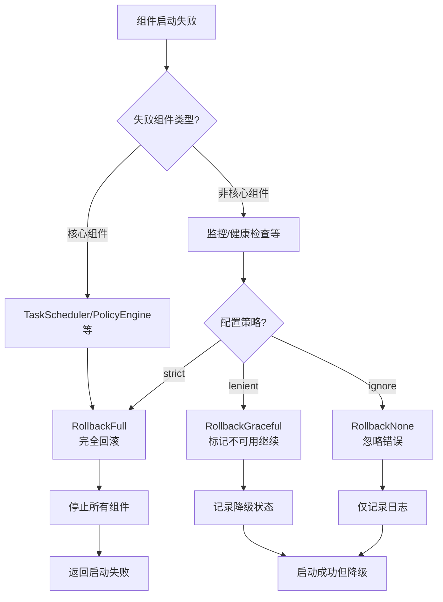
```mermaid
flowchart TD
    A[组件启动失败] --> B{失败组件类型?}

    B -->|核心组件| C[TaskScheduler/PolicyEngine等]
    B -->|非核心组件| D[监控/健康检查等]

    C --> E[RollbackFull<br/>完全回滚]
    D --> F{配置策略?}

    F -->|strict| E
    F -->|lenient| G[RollbackGraceful<br/>标记不可用继续]
    F -->|ignore| H[RollbackNone<br/>忽略错误]

    E --> I[停止所有组件]
    G --> J[记录降级状态]
    H --> K[仅记录日志]

    I --> L[返回启动失败]
    J --> M[启动成功但降级]
    K --> M
```

**配置示例**：

```toml
[bootstrap]
# 启动失败回滚策略：strict/lenient/ignore
rollback_policy = "strict"

# 核心组件列表（strict模式下失败会导致完全回滚）
core_components = ["EventBus", "TaskScheduler", "PolicyEngine", "DataSourceManager"]

# 回滚超时时间（每个组件停止的最大等待时间）
rollback_timeout_seconds = 30

# 启动超时（整个启动过程的最大时间）
bootstrap_timeout_seconds = 120

# 启动重试次数（针对可恢复错误，如网络连接失败）
start_retry_count = 3
start_retry_interval_seconds = 5
```

**启动状态机**：

```go
// BootstrapState 启动状态
type BootstrapState int

const (
    StateUninitialized BootstrapState = iota  // 未初始化
    StateInitializing                         // 初始化中
    StateInitialized                          // 初始化完成
    StateStarting                             // 启动中
    StateRunning                              // 运行中（所有核心组件启动成功）
    StateDegraded                             // 降级运行（部分非核心组件失败）
    StateFailed                               // 启动失败（已回滚或未启动）
    StateStopping                             // 停止中
    StateStopped                              // 已停止
)

type Bootstrapper struct {
    state BootstrapState
    // ...
}

// GetState 获取当前启动状态
func (b *Bootstrapper) GetState() BootstrapState {
    return b.state
}

// 状态转换
// Uninitialized -> Initializing -> Initialized -> Starting -> Running/Degraded/Failed
// Running/Degraded -> Stopping -> Stopped
```

**日志与诊断**：

```go
// BootstrapLogger 启动日志记录器
type BootstrapLogger struct {
    startTime time.Time
    events    []BootstrapEvent
}

type BootstrapEvent struct {
    Timestamp time.Time
    Component string
    Action    string  // init/start/stop/rollback
    State     string  // success/failure
    Error     error
    Duration  time.Duration
}

// LogEvent 记录启动事件
func (bl *BootstrapLogger) LogEvent(comp, action, state string, err error) {
    event := BootstrapEvent{
        Timestamp: time.Now(),
        Component: comp,
        Action:    action,
        State:     state,
        Error:     err,
        Duration:  time.Since(bl.startTime),
    }
    bl.events = append(bl.events, event)

    // 输出结构化日志
    if err != nil {
        log.Printf("[BOOTSTRAP] %s %s failed: %v (elapsed: %v)",
            comp, action, err, event.Duration)
    } else {
        log.Printf("[BOOTSTRAP] %s %s success (elapsed: %v)",
            comp, action, event.Duration)
    }
}

// GenerateReport 生成启动报告（用于故障诊断）
func (bl *BootstrapLogger) GenerateReport() string {
    var buf bytes.Buffer
    buf.WriteString("=== Bootstrap Report ===\n")
    buf.WriteString(fmt.Sprintf("Total Duration: %v\n", time.Since(bl.startTime)))
    buf.WriteString("\nEvent Sequence:\n")

    for _, evt := range bl.events {
        status := "✓"
        if evt.Error != nil {
            status = "✗"
        }
        buf.WriteString(fmt.Sprintf("  %s [%s] %s %s (%v)\n",
            status, evt.Timestamp.Format("15:04:05"),
            evt.Component, evt.Action, evt.Duration))
        if evt.Error != nil {
            buf.WriteString(fmt.Sprintf("      Error: %v\n", evt.Error))
        }
    }

    return buf.String()
}
```

### 8.2 组件依赖关系

| 组件                  | 依赖                                         | 说明                         |
| ------------------- | ------------------------------------------ | -------------------------- |
| Config              | 无                                          | 首先加载，为其他组件提供配置             |
| IDGenerator         | Config                                     | 从配置获取节点ID等参数               |
| EventBus            | Config                                     | 从配置获取EventBus类型和地址         |
| StateMachineFactory | Config, EventBus                           | 从配置加载状态机配置，需要EventBus驱动    |
| TaskScheduler       | IDGenerator, EventBus, StateMachineFactory | 依赖工厂创建状态机实例                |
| DSLEngine           | Config                                     | 从配置获取DSL引擎类型               |
| PolicyEngine        | DSLEngine, EventBus                        | 需要DSL引擎进行匹配，EventBus发布事件   |
| DataSourceManager   | DataSourceFactory, PolicyEngine            | 需要工厂创建数据源，PolicyEngine订阅事件 |
| DataSource          | Config, DataSourceManager                  | 从配置获取参数，向Manager发送事件       |

### 8.3 启动接口

各组件应实现统一的启动接口：

```go
// Starter 启动器接口
type Starter interface {
    // Init 初始化组件
    Init(config map[string]interface{}) error

    // Start 启动组件
    Start() error

    // Stop 停止组件
    Stop() error
}
```

### 8.4 启动流程示例

```go
// 伪代码示例（展示启动顺序）
func Bootstrap(configPath string) error {
    // 1. 读取完整TOML配置文件
    var globalCfg GlobalConfig
    if _, err := toml.DecodeFile(configPath, &globalCfg); err != nil {
        return fmt.Errorf("load config: %w", err)
    }

    // 2. 将各模块配置序列化为TOML字符串
    dsConfig := mustMarshalTOML(globalCfg.Datasource)
    policyConfig := mustMarshalTOML(globalCfg.Policy)
    schedulerConfig := mustMarshalTOML(globalCfg.Scheduler)
    ebConfig := mustMarshalTOML(globalCfg.EventBus)
    idConfig := mustMarshalTOML(globalCfg.ID)

    // 3. 创建ID生成器（Factory根据type字段自动选择实现）
    idGen, err := id.Factory.Create(idConfig)

    // 4. 创建EventBus（Factory根据type字段自动选择实现）
    eventBus, err := eventbus.Factory.Create(ebConfig)

    // 5. 创建TaskScheduler（Factory根据type字段自动选择实现）
    taskScheduler, err := scheduler.Factory.Create(schedulerConfig)

    // 6. 创建StateMachine（从独立配置文件加载）
    smConfigFile := globalCfg.Scheduler.StateMachine.ConfigFile
    stateMachine, err := scheduler.LoadStateMachine(smConfigFile)

    // 7. 创建DSLEngine（Factory根据type字段自动选择实现）
    dslEngine, err := dsl.Factory.Create(policyConfig)

    // 8. 创建PolicyEngine（Factory根据type字段自动选择实现）
    policyEngine, err := policy.Factory.Create(policyConfig)
    policyEngine.SetDSLEngine(dslEngine)
    policyEngine.SetEventBus(eventBus)

    // 9. 创建DataSource（Factory根据type字段自动选择实现）
    dsManager, err := datasource.Factory.Create(dsConfig)
    dsManager.SetPolicyEngine(policyEngine)

    // 10. 启动各组件（按顺序）
    if err := idGen.Init(); err != nil { ... }
    if err := eventBus.Init(); err != nil { ... }
    // ... 依次初始化其他组件

    // 11. 订阅数据源事件（建立Channel通信）
    eventCh := dsManager.Subscribe()
    policyEngine.Subscribe(eventCh)

    // 12. 启动数据源
    return dsManager.Start()
}
```

### 8.5 优雅退出设计

**设计目标**：

- 保证正在处理的任务不中断
- 按依赖顺序反向停止组件
- 设置超时避免无限等待

**停止顺序**（与启动顺序相反）：

```
1. DataSource（停止接收新事件）
   ↓
2. DataSourceManager（等待Channel中事件处理完成）
   ↓
3. PolicyEngine（停止匹配，等待发布中的事件完成）
   ↓
4. DSLEngine（清理资源）
   ↓
5. TaskScheduler（关键步骤）
   ├─ 5.1 停止接受新任务（policy.matched事件）
   ├─ 5.2 等待现有任务到达终态（或超时）
   ├─ 5.3 保存任务状态到TaskStore
   ├─ 5.4 销毁状态机实例
   └─ 5.5 取消EventBus订阅
   ↓
6. StateMachineFactory（清理资源）
   ↓
7. EventBus（关闭连接，等待消息发送完成）
   ↓
8. IDGenerator（释放资源）
   ↓
9. Config（可选：保存运行时配置变更）
```

**ShutdownManager实现**：

```go
// pkg/bootstrap/shutdown.go
package bootstrap

import (
    "context"
    "sync"
    "time"
)

// ShutdownManager 优雅退出管理器
type ShutdownManager struct {
    components []StoppableComponent
    timeout    time.Duration
}

// StoppableComponent 可停止组件接口
type StoppableComponent interface {
    Name() string
    Stop(ctx context.Context) error
}

// NewShutdownManager 创建退出管理器
func NewShutdownManager(timeout time.Duration) *ShutdownManager {
    return &ShutdownManager{
        components: make([]StoppableComponent, 0),
        timeout:    timeout,
    }
}

// Register 注册组件（按注册顺序的逆序停止）
func (sm *ShutdownManager) Register(component StoppableComponent) {
    sm.components = append(sm.components, component)
}

// Shutdown 执行优雅退出
func (sm *ShutdownManager) Shutdown() error {
    ctx, cancel := context.WithTimeout(context.Background(), sm.timeout)
    defer cancel()

    // 逆序停止组件
    for i := len(sm.components) - 1; i >= 0; i-- {
        comp := sm.components[i]

        done := make(chan error, 1)
        go func() {
            done <- comp.Stop(ctx)
        }()

        select {
        case err := <-done:
            if err != nil {
                // 记录错误但继续停止其他组件
                log.Printf("[%s] stop error: %v", comp.Name(), err)
            }
        case <-ctx.Done():
            return fmt.Errorf("shutdown timeout, [%s] did not stop in time", comp.Name())
        }
    }

    return nil
}
```

**TaskScheduler特殊处理**：

```go
// pkg/scheduler/shutdown.go

// TaskScheduler.Stop 实现优雅停止
func (ts *TaskScheduler) Stop(ctx context.Context) error {
    // 1. 停止接受新任务
    ts.rejectNewTasks.Store(true)

    // 2. 等待活跃任务完成（或超时）
    ticker := time.NewTicker(100 * time.Millisecond)
    defer ticker.Stop()

    for {
        select {
        case <-ctx.Done():
            // 超时，强制保存任务状态
            ts.forceSaveAllTasks()
            return ctx.Err()
        case <-ticker.C:
            if ts.hasActiveTasks() == false {
                // 所有任务已完成
                return nil
            }
        }
    }
}

// hasActiveTasks 检查是否有活跃任务
func (ts *TaskScheduler) hasActiveTasks() bool {
    ts.mu.RLock()
    defer ts.mu.RUnlock()

    for _, sm := range ts.stateMachines {
        state := sm.GetCurrentState()
        if state != "completed" && state != "failed" && state != "cancelled" {
            return true
        }
    }
    return false
}

// forceSaveAllTasks 强制保存所有任务状态
func (ts *TaskScheduler) forceSaveAllTasks() {
    ts.mu.RLock()
    defer ts.mu.RUnlock()

    for taskID, sm := range ts.stateMachines {
        task, _ := ts.taskStore.Get(taskID)
        if task != nil {
            task.State = sm.GetCurrentState()
            task.UpdatedAt = time.Now()
            ts.taskStore.Update(task)
        }
    }
}
```

**信号处理**：

```go
// cmd/service/main.go
func main() {
    // 启动Bootstrap...
    bootstrap := NewBootstrap(configPath)
    if err := bootstrap.Start(); err != nil {
        log.Fatal(err)
    }

    // 创建ShutdownManager
    shutdownMgr := bootstrap.NewShutdownManager(30 * time.Second)

    // 监听系统信号
    sigCh := make(chan os.Signal, 1)
    signal.Notify(sigCh, syscall.SIGINT, syscall.SIGTERM)

    <-sigCh  // 等待信号

    log.Println("Shutting down gracefully...")
    if err := shutdownMgr.Shutdown(); err != nil {
        log.Printf("Shutdown error: %v", err)
    }
}
```

---

## 十、错误处理设计

### 9.1 错误类型定义

框架定义统一的错误类型，便于调用方识别和处理：

```go
// pkg/common/errors.go
package common

import "errors"

// 框架通用错误
var (
    // 配置相关错误
    ErrConfigNotFound     = errors.New("config file not found")
    ErrConfigInvalid      = errors.New("invalid config format")

    // 数据源相关错误
    ErrDataSourceNotFound = errors.New("datasource not found")
    ErrDataSourceExists   = errors.New("datasource already exists")
    ErrDataSourceNotReady = errors.New("datasource not ready")

    // 策略引擎相关错误
    ErrPolicyNotFound     = errors.New("policy not found")
    ErrPolicyInvalid      = errors.New("invalid policy format")
    ErrDSLInvalid         = errors.New("invalid DSL syntax")

    // 任务调度相关错误
    ErrTaskNotFound       = errors.New("task not found")
    ErrTaskStateInvalid   = errors.New("invalid task state transition")

    // EventBus相关错误
    ErrEventBusNotConnected = errors.New("event bus not connected")
    ErrTopicNotFound        = errors.New("topic not found")
)

// FrameworkError 框架错误结构
type FrameworkError struct {
    Code    string
    Message string
    Cause   error
}

func (e *FrameworkError) Error() string {
    if e.Cause != nil {
        return fmt.Sprintf("[%s] %s: %v", e.Code, e.Message, e.Cause)
    }
    return fmt.Sprintf("[%s] %s", e.Code, e.Message)
}

func (e *FrameworkError) Unwrap() error {
    return e.Cause
}
```

### 9.2 错误处理原则

1. **尽早返回**：错误发生后立即返回，避免错误传播
2. **错误包装**：使用 `fmt.Errorf("...: %w", err)`包装错误，保留错误链
3. **错误分类**：使用预定义错误类型，便于调用方判断
4. **日志记录**：在边界处（接口实现、goroutine入口）记录错误

---

## 十一、健康检查与监控

### 10.1 健康检查接口

框架提供统一的健康检查机制，用于监控各组件运行状态。

```go
// pkg/common/health.go
package common

// HealthStatus 健康状态
type HealthStatus string

const (
    HealthStatusUp   HealthStatus = "up"
    HealthStatusDown HealthStatus = "down"
    HealthStatusDegraded HealthStatus = "degraded"
)

// HealthCheckResult 健康检查结果
type HealthCheckResult struct {
    Name      string                 `json:"name"`
    Status    HealthStatus           `json:"status"`
    Message   string                 `json:"message,omitempty"`
    Details   map[string]interface{} `json:"details,omitempty"`
    Timestamp time.Time              `json:"timestamp"`
    Duration  time.Duration          `json:"duration"` // 检查耗时
}

// HealthChecker 健康检查接口
// 各组件实现此接口提供自身健康状态
type HealthChecker interface {
    // Name 返回组件名称
    Name() string

    // CheckHealth 执行健康检查
    CheckHealth(ctx context.Context) HealthCheckResult
}

// HealthRegistry 健康检查注册表
type HealthRegistry struct {
    mu       sync.RWMutex
    checkers map[string]HealthChecker
}

// Register 注册健康检查器
func (r *HealthRegistry) Register(checker HealthChecker) {
    r.mu.Lock()
    defer r.mu.Unlock()
    r.checkers[checker.Name()] = checker
}

// CheckAll 执行所有健康检查
func (r *HealthRegistry) CheckAll(ctx context.Context) []HealthCheckResult {
    r.mu.RLock()
    defer r.mu.RUnlock()

    var results []HealthCheckResult
    for _, checker := range r.checkers {
        result := checker.CheckHealth(ctx)
        results = append(results, result)
    }
    return results
}
```

#### 10.1.1 健康检查聚合视图接口

**问题场景**：运维人员需要一个统一的视图了解系统整体健康状态，而非逐个查询各组件。

**聚合视图设计**：

```go
// HealthAggregator 健康检查聚合器
type HealthAggregator struct {
    registry *HealthRegistry
}

// AggregateHealth 聚合所有组件健康状态
type AggregateHealth struct {
    // 整体状态（最严重者决定）
    OverallStatus HealthStatus `json:"overall_status"`

    // 状态统计
    StatusCounts map[HealthStatus]int `json:"status_counts"`

    // 各组件检查结果
    Components []HealthCheckResult `json:"components"`

    // 关键指标
    KeyMetrics HealthKeyMetrics `json:"key_metrics"`

    // 汇总时间戳
    Timestamp time.Time `json:"timestamp"`

    // 检查总耗时
    TotalDuration time.Duration `json:"total_duration"`
}

type HealthKeyMetrics struct {
    // 数据源指标
    DataSource struct {
        ActiveSources   int `json:"active_sources"`
        TotalEventsIn24h int64 `json:"total_events_24h"`
        DroppedEvents   int64 `json:"dropped_events"`
    } `json:"datasource"`

    // 任务调度指标
    TaskScheduler struct {
        PendingTasks int `json:"pending_tasks"`
        RunningTasks int `json:"running_tasks"`
        FailedTasks24h int `json:"failed_tasks_24h"`
        AvgTaskDurationMs float64 `json:"avg_task_duration_ms"`
    } `json:"task_scheduler"`

    // 策略引擎指标
    PolicyEngine struct {
        ActivePolicies   int `json:"active_policies"`
        MatchRatePerSec  float64 `json:"match_rate_per_sec"`
        AvgMatchLatencyMs float64 `json:"avg_match_latency_ms"`
    } `json:"policy_engine"`

    // EventBus指标
    EventBus struct {
        ActiveSubscribers int `json:"active_subscribers"`
        PublishedEvents24h  int64 `json:"published_events_24h"`
        FailedPublishes24h  int64 `json:"failed_publishes_24h"`
    } `json:"eventbus"`
}

// Aggregate 执行聚合健康检查
func (ha *HealthAggregator) Aggregate(ctx context.Context) *AggregateHealth {
    start := time.Now()

    // 执行所有组件检查
    results := ha.registry.CheckAll(ctx)

    // 计算整体状态（最严重者）
    overallStatus := HealthStatusUp
    statusCounts := make(map[HealthStatus]int)

    for _, result := range results {
        statusCounts[result.Status]++

        // 状态优先级：down > degraded > up
        if result.Status == HealthStatusDown {
            overallStatus = HealthStatusDown
        } else if result.Status == HealthStatusDegraded && overallStatus != HealthStatusDown {
            overallStatus = HealthStatusDegraded
        }
    }

    // 收集关键指标
    metrics := ha.collectKeyMetrics()

    return &AggregateHealth{
        OverallStatus: overallStatus,
        StatusCounts:  statusCounts,
        Components:    results,
        KeyMetrics:    metrics,
        Timestamp:     time.Now(),
        TotalDuration: time.Since(start),
    }
}

// collectKeyMetrics 收集关键业务指标
func (ha *HealthAggregator) collectKeyMetrics() HealthKeyMetrics {
    var metrics HealthKeyMetrics

    // 从各组件的metrics接口收集数据（假设已实现）
    // 实际实现需要通过依赖注入或全局注册表访问各组件

    return metrics
}
```

**HTTP API 聚合视图接口**：

```go
// HealthHandler HTTP健康检查处理器
type HealthHandler struct {
    aggregator *HealthAggregator
}

// AggregateHealthHandler 聚合健康视图接口
func (hh *HealthHandler) AggregateHealthHandler(w http.ResponseWriter, r *http.Request) {
    ctx, cancel := context.WithTimeout(r.Context(), 10*time.Second)
    defer cancel()

    aggregate := hh.aggregator.Aggregate(ctx)

    // 根据Accept头部返回不同格式
    accept := r.Header.Get("Accept")
    if strings.Contains(accept, "text/plain") {
        // 返回人类可读的文本格式
        w.Header().Set("Content-Type", "text/plain")
        w.Write([]byte(formatAggregateText(aggregate)))
        return
    }

    // 默认返回JSON
    w.Header().Set("Content-Type", "application/json")
    json.NewEncoder(w).Encode(aggregate)
}

// formatAggregateText 格式化为人类可读文本
func formatAggregateText(ah *AggregateHealth) string {
    var buf bytes.Buffer

    // 状态颜色
    statusColor := map[HealthStatus]string{
        HealthStatusUp:       "🟢",
        HealthStatusDegraded: "🟡",
        HealthStatusDown:     "🔴",
    }

    buf.WriteString(fmt.Sprintf("=== NUTS Health Status %s ===\n\n",
        statusColor[ah.OverallStatus]))

    buf.WriteString(fmt.Sprintf("Overall Status: %s\n", ah.OverallStatus))
    buf.WriteString(fmt.Sprintf("Check Time: %s\n", ah.Timestamp.Format("2006-01-02 15:04:05")))
    buf.WriteString(fmt.Sprintf("Total Duration: %v\n\n", ah.TotalDuration))

    buf.WriteString("Status Summary:\n")
    for status, count := range ah.StatusCounts {
        buf.WriteString(fmt.Sprintf("  %s %s: %d\n", statusColor[status], status, count))
    }
    buf.WriteString("\n")

    buf.WriteString("Components:\n")
    for _, comp := range ah.Components {
        emoji := statusColor[comp.Status]
        buf.WriteString(fmt.Sprintf("  %s %-20s %s (%v)\n",
            emoji, comp.Name, comp.Status, comp.Duration))
        if comp.Message != "" {
            buf.WriteString(fmt.Sprintf("      └─ %s\n", comp.Message))
        }
    }

    return buf.String()
}
```

**API端点设计**：

```
GET /health                 # 简化视图：仅返回整体状态和HTTP 200/503
GET /health/aggregate       # 完整聚合视图：所有组件详情
GET /health/component/{name} # 单个组件详情
GET /health/ready           # Kubernetes就绪检查：仅核心组件
GET /health/live            # Kubernetes存活检查：进程是否存活
```

**Kubernetes探针适配**：

```go
// KubernetesProbeHandler K8s探针处理器
type KubernetesProbeHandler struct {
    aggregator *HealthAggregator
}

// LivenessHandler 存活检查
// 只要进程还在运行就返回200
func (kph *KubernetesProbeHandler) LivenessHandler(w http.ResponseWriter, r *http.Request) {
    // 简化检查：只要能响应HTTP请求就认为存活
    w.WriteHeader(http.StatusOK)
    w.Write([]byte("alive"))
}

// ReadinessHandler 就绪检查
// 核心组件全部Up才返回200
func (kph *KubernetesProbeHandler) ReadinessHandler(w http.ResponseWriter, r *http.Request) {
    ctx, cancel := context.WithTimeout(r.Context(), 5*time.Second)
    defer cancel()

    aggregate := kph.aggregator.Aggregate(ctx)

    // 检查核心组件状态
    coreComponents := []string{"eventbus", "task-scheduler", "policy-engine", "datasource"}
    for _, comp := range aggregate.Components {
        if !isCoreComponent(comp.Name, coreComponents) {
            continue
        }

        if comp.Status == HealthStatusDown {
            w.WriteHeader(http.StatusServiceUnavailable)
            json.NewEncoder(w).Encode(map[string]string{
                "status":  "not_ready",
                "reason":  fmt.Sprintf("core component %s is down", comp.Name),
                "message": comp.Message,
            })
            return
        }
    }

    w.WriteHeader(http.StatusOK)
    w.Write([]byte("ready"))
}

// StartupHandler 启动探针
// 用于检测应用是否已完成启动
func (kph *KubernetesProbeHandler) StartupHandler(w http.ResponseWriter, r *http.Request) {
    // 检查Bootstrapper状态
    if bootstrapper.GetState() == StateRunning {
        w.WriteHeader(http.StatusOK)
        w.Write([]byte("started"))
        return
    }

    w.WriteHeader(http.StatusServiceUnavailable)
    w.Write([]byte("starting"))
}

func isCoreComponent(name string, coreList []string) bool {
    for _, core := range coreList {
        if strings.Contains(name, core) {
            return true
        }
    }
    return false
}
```

**Prometheus指标导出**：

```go
// PrometheusExporter Prometheus指标导出器
type PrometheusExporter struct {
    aggregator *HealthAggregator
}

// RegisterMetrics 注册Prometheus指标
func (pe *PrometheusExporter) RegisterMetrics() {
    // 组件健康状态（Gauge: 0=down, 1=degraded, 2=up）
    componentHealth := prometheus.NewGaugeVec(
        prometheus.GaugeOpts{
            Name: "nuts_component_health",
            Help: "Health status of components (0=down, 1=degraded, 2=up)",
        },
        []string{"component"},
    )
    prometheus.MustRegister(componentHealth)

    // 健康检查耗时
    checkDuration := prometheus.NewHistogramVec(
        prometheus.HistogramOpts{
            Name:    "nuts_health_check_duration_seconds",
            Help:    "Health check duration",
            Buckets: prometheus.DefBuckets,
        },
        []string{"component"},
    )
    prometheus.MustRegister(checkDuration)

    // 启动定期更新
    go pe.updateLoop(componentHealth, checkDuration)
}

func (pe *PrometheusExporter) updateLoop(health *prometheus.GaugeVec, duration *prometheus.HistogramVec) {
    ticker := time.NewTicker(30 * time.Second)
    defer ticker.Stop()

    for range ticker {
        ctx, cancel := context.WithTimeout(context.Background(), 10*time.Second)
        aggregate := pe.aggregator.Aggregate(ctx)
        cancel()

        for _, comp := range aggregate.Components {
            var value float64
            switch comp.Status {
            case HealthStatusUp:
                value = 2
            case HealthStatusDegraded:
                value = 1
            case HealthStatusDown:
                value = 0
            }
            health.WithLabelValues(comp.Name).Set(value)
            duration.WithLabelValues(comp.Name).Observe(comp.Duration.Seconds())
        }
    }
}
```

**配置示例**：

```toml
[health]
# 健康检查HTTP服务器端口
port = 8081

# 检查间隔（聚合视图的自动刷新间隔）
check_interval_seconds = 30

# 检查超时
check_timeout_seconds = 10

# 核心组件列表（影响就绪检查）
core_components = [
    "eventbus",
    "task-scheduler",
    "policy-engine",
    "datasource-manager"
]

# Prometheus导出配置
[health.prometheus]
enabled = true
path = "/metrics"

# 详细日志
[health.logging]
# 健康状态变更时记录日志
log_status_change = true
# 降级/故障时记录详细组件信息
log_details_on_issue = true
```

### 10.2 各组件健康检查实现

**EventBus健康检查**：

```go
// pkg/eventbus/grpc/health.go
package grpc

func (eb *GrpcEventBus) CheckHealth(ctx context.Context) common.HealthCheckResult {
    start := time.Now()

    // 检查gRPC连接状态
    state := eb.conn.GetState()
    if state != connectivity.Ready {
        return common.HealthCheckResult{
            Name:      "eventbus",
            Status:    common.HealthStatusDown,
            Message:   fmt.Sprintf("connection not ready: %v", state),
            Timestamp: time.Now(),
            Duration:  time.Since(start),
        }
    }

    return common.HealthCheckResult{
        Name:      "eventbus",
        Status:    common.HealthStatusUp,
        Details:   map[string]interface{}{
            "address": eb.addr,
            "subscriptions": len(eb.subscriptions),
        },
        Timestamp: time.Now(),
        Duration:  time.Since(start),
    }
}
```

**TaskScheduler健康检查**：

```go
// pkg/scheduler/health.go
package scheduler

func (ts *TaskScheduler) CheckHealth(ctx context.Context) common.HealthCheckResult {
    start := time.Now()

    ts.mu.RLock()
    activeTasks := len(ts.stateMachines)
    ts.mu.RUnlock()

    // 获取任务统计
    pendingTasks, _ := ts.taskStore.GetByState("pending")
    runningTasks, _ := ts.taskStore.GetByState("running")

    status := common.HealthStatusUp
    if len(runningTasks) > ts.maxConcurrentTasks {
        status = common.HealthStatusDegraded
    }

    return common.HealthCheckResult{
        Name:    "task-scheduler",
        Status:  status,
        Details: map[string]interface{}{
            "active_tasks_in_memory": activeTasks,
            "pending_tasks":          len(pendingTasks),
            "running_tasks":          len(runningTasks),
            "max_concurrent":         ts.maxConcurrentTasks,
        },
        Timestamp: time.Now(),
        Duration:  time.Since(start),
    }
}
```

### 10.3 健康检查端点

**HTTP健康检查端点**（可选组件）：

```go
// pkg/health/server.go
package health

// HealthServer 健康检查HTTP服务
type HealthServer struct {
    registry *common.HealthRegistry
    addr     string
}

// Start 启动HTTP服务
func (s *HealthServer) Start() error {
    http.HandleFunc("/health", s.healthHandler)
    http.HandleFunc("/health/live", s.livenessHandler)   // 存活检查
    http.HandleFunc("/health/ready", s.readinessHandler) // 就绪检查

    return http.ListenAndServe(s.addr, nil)
}

// healthHandler 完整健康检查
func (s *HealthServer) healthHandler(w http.ResponseWriter, r *http.Request) {
    ctx := r.Context()
    results := s.registry.CheckAll(ctx)

    // 聚合状态
    overallStatus := common.HealthStatusUp
    for _, result := range results {
        if result.Status == common.HealthStatusDown {
            overallStatus = common.HealthStatusDown
            break
        }
        if result.Status == common.HealthStatusDegraded {
            overallStatus = common.HealthStatusDegraded
        }
    }

    response := map[string]interface{}{
        "status":    overallStatus,
        "checks":    results,
        "timestamp": time.Now(),
    }

    w.Header().Set("Content-Type", "application/json")
    if overallStatus != common.HealthStatusUp {
        w.WriteHeader(http.StatusServiceUnavailable)
    }
    json.NewEncoder(w).Encode(response)
}

// livenessHandler 存活检查（进程是否运行）
func (s *HealthServer) livenessHandler(w http.ResponseWriter, r *http.Request) {
    w.WriteHeader(http.StatusOK)
    w.Write([]byte(`{"status":"up"}`))
}

// readinessHandler 就绪检查（是否可接收流量）
func (s *HealthServer) readinessHandler(w http.ResponseWriter, r *http.Request) {
    ctx := r.Context()
    results := s.registry.CheckAll(ctx)

    ready := true
    for _, result := range results {
        if result.Status == common.HealthStatusDown {
            ready = false
            break
        }
    }

    if ready {
        w.WriteHeader(http.StatusOK)
    } else {
        w.WriteHeader(http.StatusServiceUnavailable)
    }
    json.NewEncoder(w).Encode(map[string]bool{"ready": ready})
}
```

### 10.4 关键指标监控

**MetricsCollector接口**：

```go
// pkg/common/metrics.go
package common

// MetricsCollector 指标收集器接口
type MetricsCollector interface {
    // IncrementCounter 增加计数器
    IncrementCounter(name string, labels map[string]string)

    // RecordGauge 记录仪表盘值
    RecordGauge(name string, value float64, labels map[string]string)

    // RecordHistogram 记录直方图（如耗时分布）
    RecordHistogram(name string, value float64, labels map[string]string)

    // StartTimer 开始计时器，返回停止函数
    StartTimer(name string, labels map[string]string) func()
}

// 关键指标定义
const (
    // 数据源指标
    MetricEventsReceived = "events_received_total"  // 接收事件总数
    MetricEventsDropped  = "events_dropped_total"   // 丢弃事件数

    // 策略引擎指标
    MetricPoliciesMatched   = "policies_matched_total"    // 匹配成功数
    MetricMatchDuration     = "match_duration_seconds"    // 匹配耗时

    // 任务调度指标
    MetricTasksCreated      = "tasks_created_total"      // 创建任务数
    MetricTasksCompleted    = "tasks_completed_total"    // 完成任务数
    MetricTasksFailed       = "tasks_failed_total"       // 失败任务数
    MetricActiveTasks       = "active_tasks"             // 当前活跃任务数
    MetricTaskStateDuration = "task_state_duration_seconds" // 状态持续时间

    // EventBus指标
    MetricEventsPublished   = "events_published_total"     // 发布事件数
    MetricEventsSubscribed  = "events_subscribed_total"   // 订阅事件数
    MetricPublishDuration   = "publish_duration_seconds"   // 发布耗时
)
```

**指标上报示例**：

```go
// TaskScheduler中记录指标
func (ts *TaskScheduler) CreateTask(task *Task) error {
    timer := ts.metrics.StartTimer(MetricTasksCreated, map[string]string{
        "policy_id": task.PolicyID,
    })
    defer timer()

    // 创建任务...

    ts.metrics.IncrementCounter(MetricTasksCreated, map[string]string{
        "policy_id": task.PolicyID,
        "state": task.State,
    })
    return nil
}
```

---

## 十二、日志设计

### 11.1 日志接口

框架不强制指定日志库，通过接口抽象：

```go
// pkg/common/logger.go
package common

// Logger 日志接口
type Logger interface {
    Debug(msg string, keysAndValues ...interface{})
    Info(msg string, keysAndValues ...interface{})
    Warn(msg string, keysAndValues ...interface{})
    Error(msg string, keysAndValues ...interface{})
    Fatal(msg string, keysAndValues ...interface{})
}

// LoggerFactory 日志工厂
type LoggerFactory func(name string) Logger

// 全局日志工厂变量，由主程序初始化
var GlobalLoggerFactory LoggerFactory

// NewLogger 创建logger实例
func NewLogger(name string) Logger {
    if GlobalLoggerFactory != nil {
        return GlobalLoggerFactory(name)
    }
    // 返回默认no-op logger
    return &noopLogger{}
}
```

### 10.2 日志规范

1. **结构化日志**：使用key-value格式，便于解析
2. **组件标识**：每个组件使用独立logger，标识组件名称
3. **上下文信息**：日志包含trace_id、task_id等上下文
4. **日志级别**：
   - Debug：详细调试信息
   - Info：重要流程节点
   - Warn：警告但不影响功能
   - Error：错误需要处理
   - Fatal：致命错误，程序退出

---

## 十三、完整配置示例

### 12.1 主配置文件

```toml
# nuts.toml

# 全局配置
[global]
log_level = "info"
node_id = 0  # 分布式部署时指定节点ID

# 数据源配置
[datasource]
type = "nri"  # 数据源类型

[datasource.nri]
socket_path = "/var/run/nri.sock"

[datasource.docker]
socket_path = "/var/run/docker.sock"

# 策略引擎配置
[policy]
type = "default"
rule_file = "/etc/nuts/policies.toml"

# 任务调度配置
[scheduler]
type = "default"
max_concurrent_tasks = 100
task_timeout = "30m"

[scheduler.statemachine]
config_file = "/etc/nuts/statemachine.toml"

# 状态机配置（nuts.toml中的状态机配置段）
[statemachine]
name = "task-lifecycle"
initial_state = "pending"

[statemachine.states]
pending = { handler = "PendingStateHandler" }
running = { handler = "RunningStateHandler" }
completed = { handler = "CompletedStateHandler" }
failed = { handler = "FailedStateHandler" }

[[statemachine.transitions]]
from = "pending"
to = "running"
event = "StartTask"
call = "OnTaskStart"

[[statemachine.transitions]]
from = "running"
to = "completed"
event = "TaskSuccess"
call = "OnTaskComplete"

[[statemachine.transitions]]
from = "running"
to = "failed"
event = "TaskFailure"
call = "OnTaskFail"

[[statemachine.transitions]]
from = "failed"
to = "pending"
event = "RetryTask"
call = "OnTaskRetry"

# 事件总线配置
[eventbus]
type = "grpc"  # grpc/redis/kafka

[eventbus.grpc]
addr = "localhost:50051"

# ID生成器配置
[id]
type = "snowflake"
node_id = 0  # 0-1023，分布式时需唯一
```

### 12.2 状态机配置

```toml
# statemachine.toml
[statemachine]
name = "task-lifecycle"
initial_state = "pending"

[statemachine.states]
pending = { handler = "PendingStateHandler" }
running = { handler = "RunningStateHandler" }
completed = { handler = "CompletedStateHandler" }
failed = { handler = "FailedStateHandler" }

[[statemachine.transitions]]
from = "pending"
to = "running"
event = "StartTask"
call = "OnTaskStart"

[[statemachine.transitions]]
from = "running"
to = "completed"
event = "TaskSuccess"
call = "OnTaskComplete"

[[statemachine.transitions]]
from = "running"
to = "failed"
event = "TaskFailure"
call = "OnTaskFail"

[[statemachine.transitions]]
from = "failed"
to = "pending"
event = "RetryTask"
call = "OnTaskRetry"
```

### 12.3 策略配置示例

```toml
# policies.toml
[[policies]]
id = "policy-001"
name = "monitor-nginx-pods"
dsl = """
pod.name.startsWith "nginx" &&
event.type == "ContainerStart"
"""

[policies.task_config]
action = "collect"
duration = "30s"
output = "/var/log/nginx"

[policies.metadata]
description = "监控nginx容器的启动事件"
priority = "high"
```

---

## 十四、安全设计

### 13.1 TLS加密通信

**目标**：保护跨进程通信（如gRPC EventBus）的数据安全。

```go
// pkg/eventbus/grpc/tls.go
package grpc

import (
    "crypto/tls"
    "crypto/x509"
    "os"
)

// TLSConfig TLS配置
type TLSConfig struct {
    Enabled    bool   // 是否启用TLS
    CertFile   string // 服务器证书
    KeyFile    string // 服务器私钥
    CAFile     string // CA证书（用于客户端验证）
    VerifyClient bool // 是否验证客户端证书
}

// NewTLSConfig 创建TLS配置
func NewTLSConfig(cfg *TLSConfig) (*tls.Config, error) {
    if !cfg.Enabled {
        return nil, nil
    }

    // 加载服务器证书
    cert, err := tls.LoadX509KeyPair(cfg.CertFile, cfg.KeyFile)
    if err != nil {
        return nil, fmt.Errorf("load server cert: %w", err)
    }

    tlsConfig := &tls.Config{
        Certificates: []tls.Certificate{cert},
    }

    // 如果启用客户端验证
    if cfg.VerifyClient {
        caCert, err := os.ReadFile(cfg.CAFile)
        if err != nil {
            return nil, fmt.Errorf("load CA cert: %w", err)
        }

        caCertPool := x509.NewCertPool()
        caCertPool.AppendCertsFromPEM(caCert)

        tlsConfig.ClientCAs = caCertPool
        tlsConfig.ClientAuth = tls.RequireAndVerifyClientCert
    }

    return tlsConfig, nil
}
```

**配置示例**：

```toml
# nuts.toml

[eventbus]
type = "grpc"

[eventbus.grpc]
addr = "localhost:50051"
tls_enabled = true

[eventbus.grpc.tls]
cert_file = "/etc/nuts/certs/server.crt"
key_file = "/etc/nuts/certs/server.key"
ca_file = "/etc/nuts/certs/ca.crt"
verify_client = true  # 启用双向认证
```

### 13.2 配置文件加密

**问题**：配置文件中可能包含敏感信息（Redis密码、API Key等）。

**解决方案**：

```go
// pkg/config/secret.go
package config

import (
    "crypto/aes"
    "crypto/cipher"
    "encoding/base64"
)

// SecretManager 敏感信息加密管理器
type SecretManager struct {
    key []byte  // AES-256密钥（从环境变量或密钥管理服务获取）
}

// Decrypt 解密敏感字段
func (sm *SecretManager) Decrypt(ciphertext string) (string, error) {
    data, err := base64.StdEncoding.DecodeString(ciphertext)
    if err != nil {
        return "", err
    }

    block, err := aes.NewCipher(sm.key)
    if err != nil {
        return "", err
    }

    gcm, err := cipher.NewGCM(block)
    if err != nil {
        return "", err
    }

    nonceSize := gcm.NonceSize()
    nonce, ciphertext := data[:nonceSize], data[nonceSize:]

    plaintext, err := gcm.Open(nil, nonce, ciphertext, nil)
    if err != nil {
        return "", err
    }

    return string(plaintext), nil
}

// 配置中使用加密值
// ${ENC:base64encodedciphertext} 表示需要解密的值
```

**配置示例**：

```toml
# nuts.toml

# 敏感信息加密存储（如Redis密码）
[eventbus.redis]
addr = "localhost:6379"
password = "${ENC:base64encodedencryptedpassword}"
```

### 13.3 权限控制（可选）

对于多租户或多用户场景，可以添加简单的权限控制。

```go
// pkg/auth/interface.go
package auth

// Authorization 授权接口
type Authorization interface {
    // CheckPermission 检查是否有权限执行操作
    CheckPermission(subject string, action string, resource string) bool

    // CheckTopicAccess 检查是否有权限订阅/发布topic
    CheckTopicAccess(subject string, topic string, operation Operation) bool
}

type Operation int

const (
    OperationSubscribe Operation = iota
    OperationPublish
)
```

---

## 十五、测试指导

### 14.1 单元测试

**Mock实现**：

```go
// pkg/mock/datasource.go
package mock

// MockDataSource 数据源Mock实现
type MockDataSource struct {
    events chan *common.Event
    closed bool
}

func (m *MockDataSource) Start() error { return nil }
func (m *MockDataSource) Stop() error { 
    m.closed = true
    close(m.events)
    return nil 
}
func (m *MockDataSource) EmitEvent(event *common.Event) error {
    if m.closed {
        return errors.New("datasource closed")
    }
    m.events <- event
    return nil
}

// EmitTestEvent 测试用：发送测试事件
func (m *MockDataSource) EmitTestEvent(eventType string, payload map[string]interface{}) {
    m.events <- &common.Event{
        ID:        "test-" + uuid.New().String(),
        Type:      eventType,
        Timestamp: time.Now(),
        Payload:   payload,
    }
}
```

**测试示例**：

```go
// pkg/scheduler/scheduler_test.go
package scheduler

func TestTaskScheduler_CreateTask(t *testing.T) {
    // 1. 准备Mock组件
    mockStore := mock.NewTaskStore()
    mockIDGen := mock.NewIDGenerator()
    mockEventBus := mock.NewEventBus()
    mockSMFactory := mock.NewStateMachineFactory()

    // 2. 创建Scheduler
    ts, err := NewTaskScheduler(SchedulerConfig{
        MaxConcurrentTasks: 10,
    }, mockStore, mockIDGen, mockEventBus, mockSMFactory)
    require.NoError(t, err)

    // 3. 执行测试
    task := &Task{
        PolicyID: "policy-001",
        State:    "pending",
    }
    err = ts.CreateTask(task)

    // 4. 验证结果
    require.NoError(t, err)
    assert.NotEmpty(t, task.ID)
    assert.Equal(t, "pending", task.State)
    mockStore.AssertTaskCreated(t, task.ID)
}
```

### 14.2 集成测试

```go
// tests/integration/framework_test.go
package integration

func TestFramework_EndToEnd(t *testing.T) {
    // 1. 启动嵌入式服务
    eventBusServer := testutil.StartGRPCEventBusServer(t)
    defer eventBusServer.Stop()

    // 2. 初始化框架组件
    cfg := config.NewTestConfig(t)

    idGen, _ := id.NewIDGenerator("snowflake", cfg)
    eventBus, _ := eventbus.Create("grpc", cfg.GetModule("eventbus"))

    smFactory := scheduler.NewStateMachineFactory(eventBus, testutil.LoadTestSMConfig())
    taskScheduler, _ := scheduler.NewTaskScheduler(cfg.GetModule("scheduler"), 
        testutil.NewMockTaskStore(), idGen, eventBus, smFactory)

    // 3. 启动组件
    require.NoError(t, taskScheduler.Start())
    defer taskScheduler.Stop()

    // 4. 发送测试事件
    mockSource := testutil.NewMockDataSource()
    event := &common.Event{
        Type: "ContainerStart",
        Payload: map[string]interface{}{
            "cgroup_id": "test-cgroup-123",
            "pod_name":  "test-pod",
        },
    }

    // 5. 验证任务被创建
    time.Sleep(100 * time.Millisecond) // 等待处理
    tasks, _ := taskScheduler.ListTasks(&scheduler.TaskFilter{PolicyID: "test-policy"})
    assert.Len(t, tasks, 1)
}
```

### 14.3 压力测试

```go
// tests/benchmark/eventbus_test.go
package benchmark

func BenchmarkEventBus_Publish(b *testing.B) {
    eventBus := testutil.NewEventBus()
    event := testutil.NewTestEvent("benchmark")

    b.ResetTimer()
    for i := 0; i < b.N; i++ {
        eventBus.Publish("benchmark.topic", event)
    }
}

func BenchmarkTaskScheduler_CreateTask(b *testing.B) {
    ts := testutil.NewTaskScheduler()

    b.ResetTimer()
    b.RunParallel(func(pb *testing.PB) {
        for pb.Next() {
            task := testutil.NewTestTask()
            ts.CreateTask(task)
        }
    })
}
```

### 14.4 测试最佳实践

1. **使用 testify**：`require`用于致命断言，`assert`用于非致命断言
2. **并行测试**：使用 `t.Parallel()` 加速测试执行
3. **测试夹具**：使用 `testutil` 包提供常用Mock和工具函数
4. **清理资源**：使用 `defer` 确保资源清理
5. **表驱动测试**：

```go
func TestStateMachine_Transition(t *testing.T) {
    tests := []struct {
        name      string
        fromState string
        event     string
        wantState string
        wantErr   bool
    }{
        {"pending to running", "pending", "StartTask", "running", false},
        {"running to completed", "running", "TaskSuccess", "completed", false},
        {"pending to completed", "pending", "TaskSuccess", "", true},
    }

    for _, tt := range tests {
        t.Run(tt.name, func(t *testing.T) {
            sm := testutil.NewStateMachineWithState(tt.fromState)
            err := sm.Transition(&common.Event{Type: tt.event})

            if tt.wantErr {
                require.Error(t, err)
            } else {
                require.NoError(t, err)
                assert.Equal(t, tt.wantState, sm.GetCurrentState())
            }
        })
    }
}
```

---

## 十五、性能指标与部署方案

### 15.1 性能指标体系（SLA）

**核心性能指标（SLO）**：

| 指标类别 | 指标名称 | P50目标 | P95目标 | P99目标 | 测量方式 |
|----------|----------|---------|---------|---------|----------|
| **延迟** | 事件处理端到端延迟 | <10ms | <50ms | <100ms | Event.timestamp到Task创建时间 |
| **延迟** | 策略匹配延迟 | <5ms | <20ms | <50ms | PolicyEngine.Match()耗时 |
| **延迟** | 任务调度延迟 | <5ms | <10ms | <20ms | 事件接收到任务状态机创建 |
| **吞吐** | 事件处理吞吐量 | - | - | 10000 eps | 数据源每秒处理事件数 |
| **吞吐** | 策略匹配吞吐量 | - | - | 5000 eps | PolicyEngine每秒匹配数 |
| **吞吐** | 任务创建吞吐量 | - | - | 1000 tps | TaskScheduler每秒创建任务数 |
| **可用性** | 系统可用性 | - | - | 99.9% | 年度停机时间<8.76小时 |
| **资源** | CPU使用率 | - | <70% | <80% | 峰值负载下 |
| **资源** | 内存使用率 | - | <70% | <85% | 峰值负载下 |
| **资源** | Goroutine泄漏 | 0 | 0 | <10 | 运行中goroutine增长数 |

**关键说明**：
- eps: events per second（事件每秒）
- tps: tasks per second（任务每秒）
- 延迟测量包含：序列化、网络传输、反序列化、处理全流程
- 可用性计算排除计划内维护窗口（每周最多4小时）

**性能指标采集接口**：

```go
// MetricsCollector 性能指标采集器
type MetricsCollector struct {
    // 延迟指标（Histogram）
    eventLatency    prometheus.Histogram
    matchLatency    prometheus.Histogram
    scheduleLatency prometheus.Histogram

    // 吞吐指标（Counter）
    eventsTotal     prometheus.Counter
    matchesTotal    prometheus.Counter
    tasksTotal      prometheus.Counter

    // 资源指标（Gauge）
    goroutinesGauge prometheus.Gauge
    memoryGauge     prometheus.Gauge
    cpuGauge        prometheus.Gauge
}

// RecordEventLatency 记录事件处理延迟
func (mc *MetricsCollector) RecordEventLatency(duration time.Duration) {
    mc.eventLatency.Observe(duration.Seconds())
}

// RecordEventProcessed 记录处理的事件数
func (mc *MetricsCollector) RecordEventProcessed(count int) {
    mc.eventsTotal.Add(float64(count))
}

// RecordGoroutines 记录当前goroutine数
func (mc *MetricsCollector) RecordGoroutines(count int) {
    mc.goroutinesGauge.Set(float64(count))
}
```

**性能测试基准**：

```go
// BenchmarkEventProcessing 事件处理基准测试
func BenchmarkEventProcessing(b *testing.B) {
    // 初始化组件
    ds := setupTestDataSource()
    pe := setupTestPolicyEngine()
    ts := setupTestTaskScheduler()

    // 生成测试事件
    events := generateTestEvents(b.N)

    b.ResetTimer()
    b.ReportAllocs()

    for i := 0; i < b.N; i++ {
        // 完整流程：数据源 -> 策略匹配 -> 任务调度
        event := events[i%len(events)]

        // 模拟数据源接收
        start := time.Now()

        // 策略匹配
        matched, _, _ := pe.Match(event, testPolicy)
        if !matched {
            continue
        }

        // 任务调度
        _, err := ts.CreateTask(event.TaskConfig, event.Metadata)
        if err != nil {
            b.Fatal(err)
        }

        // 记录延迟
        latency := time.Since(start)
        b.ReportMetric(float64(latency.Nanoseconds()), "ns/op")
    }
}

// 基准测试结果参考（开发环境）：
// BenchmarkEventProcessing-8    500000    2500 ns/op    1500 B/op    20 allocs/op
```

### 15.2 部署架构方案

**单机部署（开发/测试环境）**：

```yaml
# docker-compose.yml 单机部署配置
version: '3.8'
services:
  nuts:
    image: nuts:latest
    container_name: nuts-single
    network_mode: host
    volumes:
      - ./nuts.toml:/etc/nuts/nuts.toml
      - /var/run/nri.sock:/var/run/nri.sock  # NRI socket
      - nuts-data:/var/lib/nuts
    environment:
      - NUTS_LOG_LEVEL=info
      - NUTS_NODE_ID=single-node
    restart: unless-stopped
    # 资源限制
    deploy:
      resources:
        limits:
          cpus: '2.0'
          memory: 512M
        reservations:
          cpus: '0.5'
          memory: 128M

volumes:
  nuts-data:
```

**Kubernetes部署（生产环境推荐）**：

```yaml
# k8s-deployment.yaml
apiVersion: apps/v1
kind: Deployment
metadata:
  name: nuts-core
  namespace: nuts-system
spec:
  replicas: 1  # 单实例部署（用户确认无多实例协调需求）
  selector:
    matchLabels:
      app: nuts-core
  template:
    metadata:
      labels:
        app: nuts-core
    spec:
      hostPID: true  # 需要访问宿主机进程（NRI需求）
      hostNetwork: true  # 可选：简化网络配置
      containers:
      - name: nuts
        image: nuts:latest
        imagePullPolicy: IfNotPresent
        securityContext:
          privileged: true  # NRI需要特权访问
        resources:
          requests:
            memory: "256Mi"
            cpu: "250m"
          limits:
            memory: "1Gi"
            cpu: "2000m"
        ports:
        - containerPort: 8080  # API端口
          name: api
        - containerPort: 8081  # 健康检查端口
          name: health
        env:
        - name: NUTS_NODE_ID
          valueFrom:
            fieldRef:
              fieldPath: spec.nodeName
        volumeMounts:
        - name: config
          mountPath: /etc/nuts
        - name: nri-socket
          mountPath: /var/run/nri.sock
        - name: data
          mountPath: /var/lib/nuts
        livenessProbe:
          httpGet:
            path: /health/live
            port: 8081
          initialDelaySeconds: 30
          periodSeconds: 10
        readinessProbe:
          httpGet:
            path: /health/ready
            port: 8081
          initialDelaySeconds: 5
          periodSeconds: 5
        startupProbe:
          httpGet:
            path: /health/ready
            port: 8081
          initialDelaySeconds: 5
          periodSeconds: 5
          failureThreshold: 30  # 150秒启动超时
      volumes:
      - name: config
        configMap:
          name: nuts-config
      - name: nri-socket
        hostPath:
          path: /var/run/nri.sock
          type: Socket
      - name: data
        hostPath:
          path: /var/lib/nuts
          type: DirectoryOrCreate
```

```yaml
# k8s-rbac.yaml
apiVersion: v1
kind: ServiceAccount
metadata:
  name: nuts-sa
  namespace: nuts-system
---
apiVersion: rbac.authorization.k8s.io/v1
kind: ClusterRole
metadata:
  name: nuts-role
rules:
# 读取ConfigMap配置
- apiGroups: [""]
  resources: ["configmaps"]
  verbs: ["get", "list", "watch"]
# 读取Pod信息（用于NRI事件关联）
- apiGroups: [""]
  resources: ["pods"]
  verbs: ["get", "list", "watch"]
# 节点信息（用于节点级资源限制）
- apiGroups: [""]
  resources: ["nodes"]
  verbs: ["get", "list"]
---
apiVersion: rbac.authorization.k8s.io/v1
kind: ClusterRoleBinding
metadata:
  name: nuts-role-binding
subjects:
- kind: ServiceAccount
  name: nuts-sa
  namespace: nuts-system
roleRef:
  kind: ClusterRole
  name: nuts-role
  apiGroup: rbac.authorization.k8s.io
```

```yaml
# k8s-service.yaml
apiVersion: v1
kind: Service
metadata:
  name: nuts-api
  namespace: nuts-system
spec:
  selector:
    app: nuts-core
  ports:
  - port: 8080
    targetPort: 8080
    name: api
  - port: 8081
    targetPort: 8081
    name: health
  type: ClusterIP
```

**Helm Chart部署（推荐生产使用）**：

```yaml
# values.yaml
replicaCount: 1

image:
  repository: nuts
  tag: latest
  pullPolicy: IfNotPresent

resources:
  requests:
    memory: "256Mi"
    cpu: "250m"
  limits:
    memory: "1Gi"
    cpu: "2000m"

# NRI配置
nri:
  enabled: true
  socketPath: /var/run/nri.sock

# 数据源配置
datasource:
  type: nri
  rateLimit: 5000
  burstSize: 1000

# 调度器配置
scheduler:
  maxConcurrentTasks: 100
  maxTotalTasks: 1000

# 健康检查
health:
  port: 8081
  checkInterval: 30

# 监控
monitoring:
  enabled: true
  prometheus:
    enabled: true
    port: 9090
```

**部署场景选择指南**：

| 场景 | 推荐部署方式 | 节点数 | 资源配置 | 特殊要求 |
|------|-------------|--------|----------|----------|
| 开发测试 | Docker Compose | 1 | 0.5 CPU / 256MB | host模式 |
| 小规模生产 (<50节点) | DaemonSet | 每节点1个 | 0.5 CPU / 512MB | 特权模式 |
| 中规模生产 (50-500节点) | DaemonSet | 每节点1个 | 1 CPU / 1GB | 特权+RBAC |
| 大规模生产 (>500节点) | DaemonSet | 每节点1个 | 2 CPU / 2GB | 高配+监控 |
| 云服务器 | 虚拟机/Docker | 1-3 | 2 CPU / 4GB | 无需特权 |

**部署验证清单**：

```bash
# 1. 部署后验证命令
# 检查Pod状态
kubectl get pods -n nuts-system -l app=nuts-core

# 检查日志
kubectl logs -n nuts-system -l app=nuts-core --tail=100

# 测试健康检查端点
kubectl port-forward -n nuts-system svc/nuts-api 8081:8081
curl http://localhost:8081/health/ready

# 测试API端点
curl http://localhost:8080/api/v1/health/aggregate

# 2. 性能验证
# 检查事件处理速率
curl http://localhost:8081/metrics | grep nuts_events_total

# 检查资源使用
kubectl top pod -n nuts-system
```

**运维告警配置**：

```yaml
# prometheus-rules.yaml
apiVersion: monitoring.coreos.com/v1
kind: PrometheusRule
metadata:
  name: nuts-alerts
  namespace: nuts-system
spec:
  groups:
  - name: nuts
    rules:
    # 高延迟告警
    - alert: NutsHighEventLatency
      expr: histogram_quantile(0.95, nuts_event_latency_seconds_bucket) > 0.1
      for: 5m
      labels:
        severity: warning
      annotations:
        summary: "NUTS事件处理延迟高"

    # 高错误率告警
    - alert: NutsHighErrorRate
      expr: rate(nuts_errors_total[5m]) > 0.01
      for: 5m
      labels:
        severity: critical

    # 组件不健康告警
    - alert: NutsComponentUnhealthy
      expr: nuts_component_health < 2
      for: 1m
      labels:
        severity: critical
```

---

## 附录

### A. 核心接口快速参考

| 接口名             | 所在章节 | 关键方法                                                | 说明           |
| --------------- | ---- | --------------------------------------------------- | ------------ |
| `DataSource`    | 第二章  | `Start()`, `Stop()`, `Subscribe()`, `CheckHealth()` | 数据源抽象，实现健康检查 |
| `PolicyEngine`  | 第三章  | `Match()`, `MatchAll()`                             | 策略匹配引擎       |
| `DSLEngine`     | 第三章  | `Compile()`, `Execute()`                            | DSL规则执行引擎    |
| `TaskScheduler` | 第四章  | `ScheduleTask()`, `CancelTask()`, `GetTaskStatus()` | 任务调度核心       |
| `StateMachine`  | 第四章  | `Transition()`, `GetCurrentState()`                 | 任务状态机        |
| `EventBus`      | 第五章  | `Publish()`, `Subscribe()`                          | 事件总线         |
| `Serializer`    | 第五章  | `Marshal()`, `Unmarshal()`                          | 事件序列化        |
| `ConfigManager` | 第六章  | `Load()`, `Reload()`, `Validate()`                  | 配置管理         |
| `HealthChecker` | 第十章  | `CheckHealth()`                                     | 健康检查接口       |
| `RateLimiter`   | 第五章  | `Allow()`, `Reserve()`                              | 限流器          |

### B. 配置关键字速查

```toml
# nuts.toml - 顶层配置结构

[datasource]        # 第二章：数据源配置（type字段指定实现类型）

[policy]            # 第三章：策略引擎配置

[scheduler]         # 第四章：任务调度配置

[eventbus]          # 第五章：EventBus配置（type字段指定实现类型）

[health]            # 第十章：健康检查设置

[log]               # 第十一章：日志配置

[security]          # 第十三章：安全配置

[testing]           # 第十四章：测试配置
```

### C. 修订历史

| 版本   | 日期         | 修订内容                         |
| ---- | ---------- | ---------------------------- |
| v1.0 | 2025-05-02 | 初始版本，完成14章核心设计               |
|      |            | - 新增数据源健康检查整合（第二章）           |
|      |            | - 新增自动重连与缓冲背压机制（第二章）         |
|      |            | - 新增Graceful Shutdown设计（第八章） |
|      |            | - 新增配置热更新机制（第六章）             |
|      |            | - 新增健康检查与监控体系（第十章）           |
|      |            | - 新增限流与背压机制（第五章）             |
|      |            | - 新增资源限制与回收（第四章）             |
|      |            | - 新增安全设计（第十三章）               |
|      |            | - 新增测试指导（第十四章）               |

### D. 相关文档

- 具体数据源实现文档（NRI/Docker插件）
- 策略规则语法文档（DSL语法说明）
- 部署运维手册
- API接口文档（gRPC proto定义）

---

**文档结束**

本框架设计文档描述了NUTS项目的通用框架部分，包括数据源抽象、策略引擎抽象、任务调度、EventBus等核心组件。框架设计遵循通用化、可扩展、可配置的原则，为具体的业务插件提供稳定可靠的基础设施。

**核心设计理念**：接口抽象、事件驱动、配置优先、可观测、高可用。

---

## 十六、CLI工具开发

### 16.1 概述

NUTS CLI工具提供命令行接口，用于管理NUTS服务的各项功能，包括数据源、策略、工作流等。

### 16.2 命令结构

```
nuts-cli
├── service          # 服务管理命令
│   ├── start       # 启动服务
│   ├── stop        # 停止服务
│   ├── status      # 查看服务状态
│   └── restart     # 重启服务
├── datasource       # 数据源管理命令
│   ├── list        # 列出数据源
│   ├── get         # 查看数据源详情
│   ├── switch      # 切换数据源
│   └── filter      # 管理事件过滤规则
├── policy           # 策略管理命令
│   ├── list        # 列出策略
│   ├── get         # 查看策略详情
│   ├── create      # 创建策略
│   ├── update      # 更新策略
│   └── delete      # 删除策略
├── workflow         # 工作流管理命令
│   ├── list        # 列出工作流
│   ├── get         # 查看工作流详情
│   ├── create      # 创建工作流
│   ├── update      # 更新工作流
│   ├── delete      # 删除工作流
│   ├── execute     # 执行工作流
│   └── status      # 查看执行状态
└── version          # 版本信息
```

### 16.3 代码结构

```
cmd/nuts-cli/
├── main.go              # CLI入口
├── root.go              # 根命令定义
├── service.go           # 服务管理命令
├── datasource.go        # 数据源管理命令
├── policy.go            # 策略管理命令
├── workflow.go          # 工作流管理命令
└── version.go           # 版本命令
```

### 16.4 使用示例

```bash
# 启动服务
nuts-cli service start --config /etc/nuts/nuts.toml

# 列出数据源
nuts-cli datasource list

# 切换数据源
nuts-cli datasource switch nri

# 列出策略
nuts-cli policy list

# 创建工作流
nuts-cli workflow create --file workflow.yaml

# 执行工作流
nuts-cli workflow execute --id workflow-001

# 查看版本
nuts-cli version
```

### 16.5 核心功能实现

CLI工具通过HTTP API与NUTS服务通信，各命令调用对应的REST接口：

- `service` 命令 - 调用 `/api/v1/service/*`
- `datasource` 命令 - 调用 `/api/v1/datasource/*`
- `policy` 命令 - 调用 `/api/v1/policies/*`
- `workflow` 命令 - 调用 `/api/v1/workflows/*`
