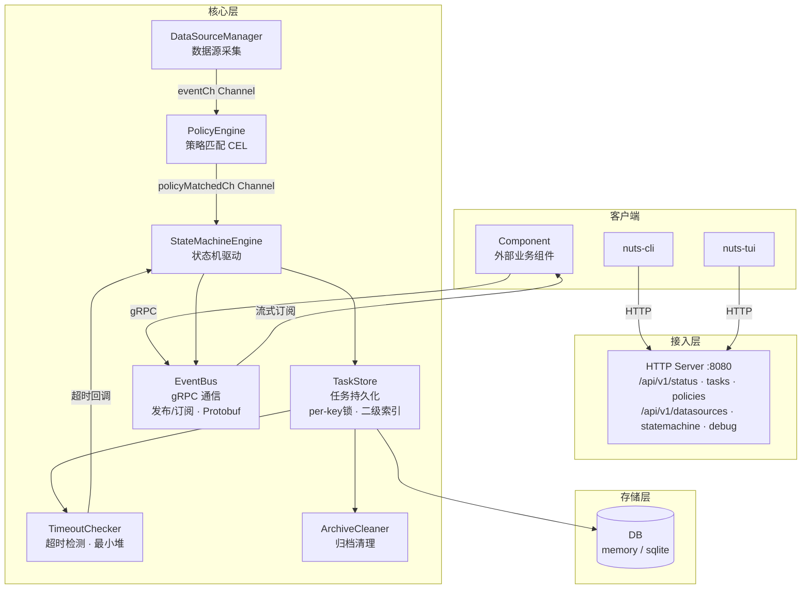
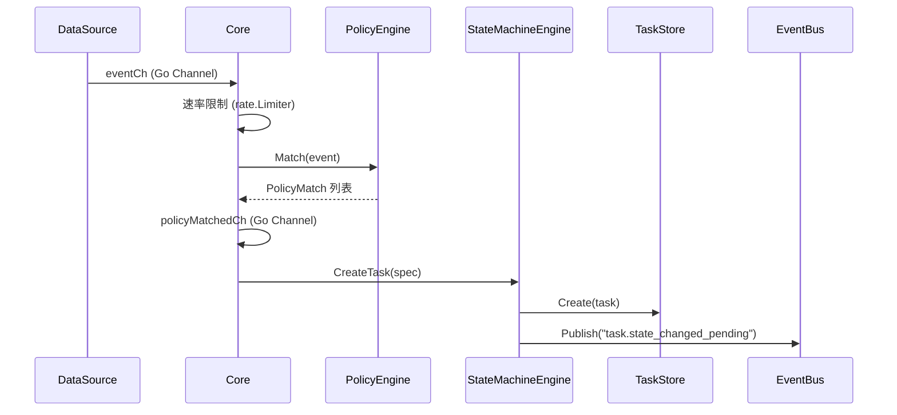
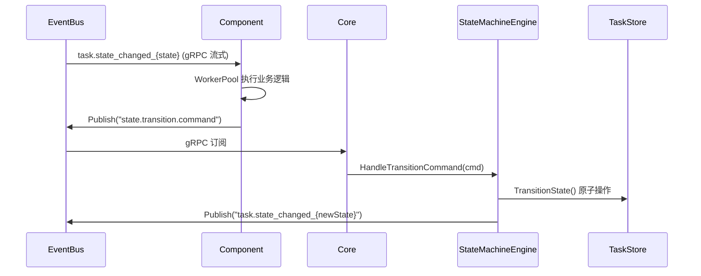
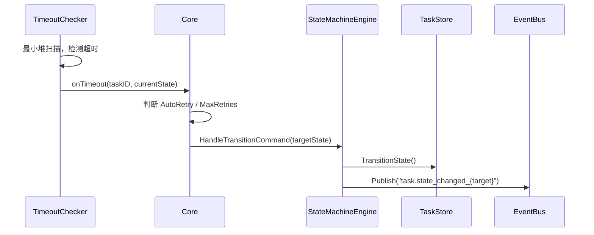

# NUTS 架构文档（phase-1实现）

> 版本: 1.0
> 更新日期: 2026-05-19
> 依据: `pkg/` 源码实现

---

## 目录

1. [系统概述](#一系统概述)
2. [整体架构](#二整体架构)
3. [核心数据结构](#三核心数据结构)
4. [模块详解](#四模块详解)
5. [启动与关闭流程](#五启动与关闭流程)
6. [数据流](#六数据流)
7. [HTTP API](#七http-api)
8. [配置体系](#八配置体系)
9. [并发模型与安全保障](#九并发模型与安全保障)
10. [目录结构](#十目录结构)
11. [与设计文档的差异](#十一与设计文档的差异)

---

## 一、系统概述

NUTS 是一个**云原生事件驱动任务编排平台**，采用服务端-客户端架构：

| 组件 | 可执行文件 | 角色 |
|------|-----------|------|
| 服务端 | `nuts` | 核心守护进程，负责事件采集、策略匹配、任务调度、状态机驱动 |
| CLI 客户端 | `nuts-cli` | 命令行管理工具，通过 HTTP API 与服务端通信 |
| TUI 客户端 | `nuts-tui` | 终端交互界面，提供可视化管理能力 |

**核心设计原则**：

1. **接口抽象优先**：所有核心组件通过接口定义，支持多种实现
2. **事件驱动架构**：基于 EventBus 实现组件间松耦合通信
3. **配置驱动**：状态机、策略规则通过配置文件定义，无需修改代码
4. **工厂模式**：EventBus、DB、IDGenerator 均通过工厂注册，支持动态扩展
5. **单进程部署**：数据源、策略引擎、任务调度在同一进程内，进程内 Channel 零拷贝通信

---

## 二、整体架构

### 2.1 整体架构图



### 2.2 系统分层

| 层级 | 组件 | 说明 |
|------|------|------|
| **客户端** | `nuts-cli` | 命令行工具，通过 HTTP API 通信 |
| | `nuts-tui` | 终端交互界面，通过 HTTP API 通信 |
| | `Component`（外部组件） | 通过 gRPC EventBus 订阅状态事件、发布转换命令 |
| **接入层** | HTTP Server (`:8080`) | RESTful API，Bearer Token 认证 |
| **核心层** | `Core` | 应用主控，协调所有组件的生命周期 |
| | `DataSourceManager` | 数据源管理，通过 `eventCh` Channel 输出事件 |
| | `PolicyEngine` | 策略匹配，通过 `policyMatchedCh` Channel 通知任务创建 |
| | `StateMachineEngine` | 状态机驱动，管理任务状态流转 |
| | `TaskStore` | 任务持久化，per-key 分段锁 + 乐观锁 |
| | `TimeoutChecker` | 超时检测，最小堆 + 动态唤醒间隔 |
| | `ArchiveCleaner` | 归档清理，按保留天数自动删除 |
| **通信层** | `EventBus` (gRPC) | 事件发布/订阅，Protobuf 序列化 |
| **存储层** | `DB` (memory / sqlite) | 通用 KV 存储抽象 |

### 2.3 数据流概览

**外部接入**：

| 来源 | 协议 | 目标 |
|------|------|------|
| `nuts-cli` / `nuts-tui` | HTTP | Core HTTP Server (`:8080`) |
| 外部 Component | gRPC | Core EventBus |

**Core 内部数据流**（自上而下）：

| 层级 | 组件 | 输出方式 | 下游组件 |
|------|------|---------|---------|
| L1 事件采集 | `DataSourceManager` | `eventCh` (Go Channel) | → L2 |
| L2 策略匹配 | `PolicyEngine` | `policyMatchedCh` (Go Channel) | → L3 |
| L3 任务调度 | `StateMachineEngine` | 方法调用 / EventBus Publish | → L4, L5 |
| L4 任务存储 | `TaskStore` | 方法调用 | → L5 |
| L5 辅助服务 | `TimeoutChecker` | 回调函数 | → L3 |
| | `ArchiveCleaner` | 方法调用 | → L4 |
| L6 事件通信 | `EventBus` (gRPC) | 流式订阅 | → Component |
| L7 HTTP 接入 | HTTP Server | RESTful API | → 客户端 |

### 2.4 组件通信方式

| 路径 | 方式 | 说明 |
|------|------|------|
| DataSource → PolicyEngine | Go Channel (`eventCh`) | 进程内零拷贝，带速率限制 |
| PolicyEngine → TaskStore | Go Channel (`policyMatchedCh`) | 策略匹配后直接通知创建任务 |
| StateMachine → Component | EventBus (gRPC) | 状态变更事件发布，外部组件订阅 |
| Component → StateMachine | EventBus (gRPC) | 组件发布 `state.transition.command` |
| TaskStore → TimeoutChecker | 内部方法调用 | 最小堆定时扫描超时任务 |

---

## 三、核心数据结构

### 3.1 Event (`pkg/common/event.go`)

统一事件结构，所有模块间传递的事件均使用此类型：

```go
type Event struct {
    ID            string                 // UUID
    Type          string                 // 事件类型，如 "ContainerStart", "policy.matched"
    Topic         string                 // EventBus 路由主题
    Timestamp     time.Time
    TraceID       string                 // 链路追踪 ID（从 context 自动提取）
    Source        string                 // 事件来源
    Version       string
    TypedPayload  any                    // 类型化 payload（Protobuf）
    Payload       map[string]interface{} // 非类型化 payload（兜底）
    Ctx           context.Context        // 不参与序列化
}
```

**TypedPayload 类型**（基于 Protobuf `api` 包）：

- `*api.Event_Pod` — 容器事件
- `*api.Event_Policy` — 策略匹配事件
- `*api.Event_Task` — 任务状态变更事件
- `*api.Event_Component` — 组件状态转换命令

### 3.2 Task (`pkg/task/interface.go`)

```go
type Task struct {
    ID              string
    Name            string
    Description     string
    Priority        int                    // 0-100，越大优先级越高
    Version         int                    // 乐观锁版本号
    RetryCount      int
    State           TaskState              // 当前状态
    Result          *TaskResult            // 执行结果
    Metadata        map[string]string
    CreatedAt       time.Time
    UpdatedAt       time.Time
    StartedAt       *time.Time
    CompletedAt     *time.Time
    StateHistory    []StateTransitionRecord // 状态转换历史
    StateUpdatedAt  time.Time              // 用于超时检测
    TimeoutAt       *time.Time             // 预计超时时间
    ArchiveEligible bool
    ArchivedAt      *time.Time             // 归档时间，非 nil 表示已归档
}
```

**TaskState 状态枚举**：

| 状态 | 说明 |
|------|------|
| `pending` | 待执行 |
| `processing` | 处理中 |
| `paused` | 已暂停 |
| `completed` | 已完成（终态） |
| `failed` | 执行失败（终态） |
| `cancelled` | 已取消（终态） |
| `timeout` | 超时（终态） |

状态的具体定义和转换规则由配置文件中的 `[statemachine]` 节决定，以上仅为内置常量。

### 3.3 StateMachineConfig (`pkg/task/sm_factory.go`)

```go
type StateMachineConfig struct {
    Name           string
    InitialState   string                  // 初始状态
    TerminalStates []string                // 终态列表
    States         map[string]StateConfig  // 所有状态定义
    Transitions    []TransitionConfig      // 允许的状态转换
    PayloadBuilder string
    MaxProcessTime string
}

type StateConfig struct {
    Description  string
    StateTimeout string  // 状态超时时间，如 "30s", "5m"
    AutoRetry    bool    // 超时后是否自动重试
    MaxRetries   int     // 最大重试次数
    RetryToState string  // 重试目标状态
}
```

### 3.4 APIResponse (`pkg/common/api.go`)

统一 HTTP API 响应格式：

```go
type APIResponse struct {
    Code      int         `json:"code"`       // 业务状态码，0=成功
    Message   string      `json:"message"`
    Data      interface{} `json:"data,omitempty"`
    RequestID string      `json:"request_id"`
    Timestamp time.Time   `json:"timestamp"`
}
```

---

## 四、模块详解

### 4.1 数据源层 (`pkg/datasource/`)

**接口定义**：

```go
type DataSource interface {
    ParseConfig(config map[string]interface{}) error
    Start(ctx context.Context, eventCh chan<- *common.Event) error
    Stop() error
    Health() error
    GetStats() *DataSourceStats
    Ready() <-chan struct{}
}
```

**核心组件**：

- `DataSourceManager` — 管理多个数据源的生命周期，提供 Init/Start/Stop/Close
- `DataSourceFactory` — 工厂模式注册和创建数据源实例
- `HTTPHandler` — 数据源 HTTP API 路由处理器

**内置实现**：`mock` 数据源（用于开发测试）

### 4.2 策略引擎层 (`pkg/policy/`)

**接口定义**：

```go
type PolicyEngine interface {
    Match(ctx context.Context, event *common.Event) ([]*PolicyMatch, error)
    Evaluate(policyID string, event *common.Event) (bool, error)
    ListPolicies() ([]*Policy, error)
    GetPolicy(policyID string) (*Policy, error)
    GetManager() PolicyManager
    Init(cfg config.ConfigManager) error
    Start(ctx context.Context) error
    Stop() error
    Health() error
    GetStats() EngineStats
}
```

**策略匹配流程**：

1. DataSource 通过 `eventCh` 发送事件
2. `Core.processEvents()` 从 channel 读取事件，调用 `PolicyEngine.Match()`
3. 匹配成功后构造 `PolicyMatchedEvent`，通过 `policyMatchedCh` 直接 channel 传递给任务调度
4. `policyMatchedCh` 满时丢弃事件并记录 warn 日志

**DSL 引擎**：通过 `DSLEngine` 接口抽象，支持 CEL 等实现，由 `DSLEngineFactory` 管理。

### 4.3 任务调度层 (`pkg/task/`)

#### 4.3.1 TaskStore (`engine_store.go`)

基于 `db.DB` 的任务存储实现，核心特性：

- **per-key 分段锁**：`sync.Map` 存储 `*sync.Mutex`，每个任务独立锁，避免全局锁竞争
- **乐观锁**：`Version` 字段每次写入递增，更新时校验版本一致性
- **二级索引 `stateIndex`**：`map[TaskState][]indexEntry`，按 `CreatedAt` 降序排序，支持 O(1) 按状态计数和高效分页
- **归档机制**：通过 `ArchivedAt` 字段标记归档，`List` 默认过滤已归档任务

```go
type TaskStore interface {
    Get(id string) (*Task, error)
    Create(task *Task) error
    Update(task *Task) error
    Delete(id string) error
    List(filter TaskFilter) ([]*Task, error)
    Count(filter TaskFilter) (int, error)
    UpdateState(id string, state TaskState) error
    UpdateStateWithRecord(id string, state TaskState, triggeredBy, reason string) error
    TransitionState(id string, newState TaskState, ...) (*Task, error)
    GetStateHistory(id string) ([]StateTransitionRecord, error)
    UpdateResult(id string, result *TaskResult) error
}
```

**TransitionState 原子操作**：在同一个锁周期内完成状态、历史、ArchivedAt、RetryCount 的更新，先持久化再发布事件（postCommit），store 是 source of truth。

#### 4.3.2 StateMachineEngine (`state_machine_engine.go`)

状态机引擎，负责任务创建和状态流转：

```go
type StateMachineEngine interface {
    CreateTask(ctx context.Context, spec TaskSpec) (*Task, error)
    HandleTransitionCommand(ctx context.Context, cmd TransitionCommand) error
    GetTaskState(taskID string) (TaskState, error)
    GetStateMachineConfig() *StateMachineConfig
    GetTaskHistory(taskID string) ([]StateTransitionRecord, error)
    SetMetrics(m common.MetricsRecorder)
}
```

**状态转换验证**：通过 `ValidateStateMachineConfig()` 校验配置合法性：
- 无不可达状态
- 无死循环（auto_retry 循环检测）
- 有终态可达
- 所有转换引用的状态必须在 States 中定义

#### 4.3.3 TimeoutChecker (`timeout_checker.go`)

超时检测器，基于**最小堆**实现：

- 按 `TimeoutAt` 时间排序，每次只检查堆顶元素
- 动态唤醒间隔：堆顶未超时则 sleep 到其超时时刻，避免无效轮询
- 超时后调用回调函数，由 Core 处理状态转换

```go
type TimeoutChecker struct {
    store    TaskStore
    config   *StateMachineConfig
    heap     *timeoutHeap           // 最小堆
    onTimeout func(taskID string, currentState TaskState)
}
```

#### 4.3.4 ArchiveCleaner (`archive.go`)

归档任务自动清理器：

- 按 `ArchivedAt` 时间过滤超过保留天数的已归档任务
- 支持配置保留天数和清理间隔
- 删除时同步清理 stateIndex

#### 4.3.5 IDGenerator (`pkg/common/id.go`)

ID 生成器接口，支持两种实现：

| 实现 | 说明 |
|------|------|
| `UUIDGenerator` | 基于 `github.com/google/uuid` v4 |
| `SnowflakeGenerator` | 雪花算法：41 位时间戳 + 10 位机器 ID + 12 位序列号 |

**时钟安全保障**：
- 时钟回拨：等待追上，最多 10ms，超时则用 `lastTime` 继续递增
- 时钟停顿 + 序列号耗尽：主动推进 `lastTime + 1`，不再 panic

### 4.4 EventBus 通信层 (`pkg/eventbus/`)

**接口定义**：

```go
type EventBus interface {
    Start(ctx context.Context) error
    Stop() error
    Publish(topic string, event *common.Event) error
    Subscribe(topic string) <-chan *common.Event
    Unsubscribe(topic string) error
    Close() error
    Health() error
}
```

**gRPC 实现 (`GRPCEventBus`)**：

- 服务端：gRPC Server + Protobuf 序列化
- 客户端：gRPC 流式订阅，指数退避重连
- 订阅管理：`sync.RWMutex` 保护 `subscribers` map
- 防护：`Subscriber.Close()` 使用 `sync.Once` 防止重复关闭 channel
- 丢弃计数：`atomic.Int64` 统计 channel 满时丢弃的事件数

**序列化器**：

```go
type EventSerializer interface {
    Serialize(event *common.Event) ([]byte, error)
    Deserialize(data []byte) (*common.Event, error)
    ContentType() string
}
```

实现：`ProtobufSerializer`（基于 `api` 包的 Protobuf 定义）

**工厂**：`eventbus.Factory` 支持注册和创建 EventBus 实例。

### 4.5 组件层 (`pkg/component/`)

**Component 接口**：

```go
type Component interface {
    Info() ComponentInfo
    Init(config ComponentConfig) error
    Start(ctx context.Context) error
    Stop() error
    Health() error
}
```

**BaseComponent 基础实现**：

- 订阅 `task.state_changed_{state}` 主题
- 通过 `WorkerPool` 并发处理事件
- 处理完成后通过 `PublishStateTransition()` 发布 `state.transition.command` 到 EventBus
- Core 的 `startTransitionCommandHandler()` 订阅此命令，调用 `StateMachineEngine.HandleTransitionCommand()`

**内置示例组件**（`pkg/component/examples/`）：

| 组件 | 处理状态 | 目标状态 |
|------|---------|---------|
| `ValidatingComponent` | pending | processing |
| `ProcessingComponent` | processing | completed |
| `PendingComponent` | (示例) | — |
| `FailoverComponent` | failed | pending (重试) |

### 4.6 配置管理 (`pkg/config/`)

**接口定义**：

```go
type ConfigManager interface {
    Load(path string) error
    Get(key string) interface{}
    GetString(key string) string
    GetInt(key string) int
    GetBool(key string) bool
    GetMap(key string) map[string]interface{}
    Set(key string, value interface{})
    Save(path string) error
    Close() error
}
```

**实现**：`TOMLConfigManager`（基于 TOML 格式）

### 4.7 存储层 (`pkg/db/`)

**接口定义**：

```go
type DB interface {
    Get(key string) ([]byte, error)
    Set(key string, value []byte) error
    Delete(key string) error
    List(prefix string) ([]string, error)
    Close() error
}
```

**实现**：

| 类型 | 说明 |
|------|------|
| `memory` | 内存存储（开发测试用） |
| `sqlite` | SQLite 持久化存储 |

通过 `db.DefaultFactory` 工厂创建实例。

### 4.8 日志 (`pkg/log/`)

**接口定义**：

```go
type Logger interface {
    Debug(msg string, fields ...Field)
    Info(msg string, fields ...Field)
    Warn(msg string, fields ...Field)
    Error(msg string, fields ...Field)
    Fatal(msg string, fields ...Field)
    With(fields ...Field) Logger
    Sync() error
}
```

**实现**：`ZapLogger`（基于 `go.uber.org/zap`），支持：
- 结构化日志（JSON/Console 格式）
- 动态日志级别（通过配置）
- 日志文件输出

---

## 五、启动与关闭流程

### 5.1 启动顺序 (`Core.Start()`)

```
1. initConfig()           — 加载 TOML 配置文件
2. initLogger()           — 初始化日志（从配置读取级别、格式、输出路径）
3. initMetrics()          — 初始化度量收集器（当前为 NoopMetricsRecorder）
4. initIDGenerator()      — 初始化 ID 生成器（UUID 或 Snowflake，从配置选择）
5. initDB()               — 初始化存储后端（memory 或 sqlite）
6. initEventBus()         — 初始化 EventBus（从配置创建，支持 noop/grpc）
7. initDataSources()      — 初始化数据源管理器（从配置加载数据源）
8. initPolicyEngine()     — 初始化策略引擎（加载策略规则和 DSL 引擎）
9. initTaskScheduler()    — 初始化任务调度器：
   ├── LoadStateMachineConfig()   — 加载状态机配置
   ├── ValidateStateMachineConfig() — 校验配置合法性
   ├── NewTaskStore()             — 创建任务存储
   ├── NewDefaultStateMachineEngine() — 创建状态机引擎
   ├── initArchiveCleaner()       — 初始化归档清理器
   ├── NewTimeoutChecker()        — 创建超时检查器
   └── recoverOrphanedTasks()     — 恢复异常重启后滞留的终态任务
10. Start()               — 按序启动各组件：
    ├── EventBus.Start()
    ├── startTaskEventHandler()         — 启动 policyMatchedCh 消费者
    ├── startTransitionCommandHandler() — 启动 EventBus 命令订阅者
    ├── timeoutChecker.Start()          — 启动超时检查 goroutine
    ├── PolicyEngine.Start()
    ├── startEventProcessor()           — 启动 eventCh 消费者
    ├── DataSourceManager.Start()
    ├── startHTTPServer()               — 启动 HTTP 服务
    └── archiveCleaner.Start()
```

### 5.2 关闭顺序 (`Core.Stop()`)

```
1. cancel()                    — 取消 context，通知所有 goroutine 退出
2. EventBus.Stop()             — 关闭所有订阅 channel
3. HTTPServer.Shutdown()       — 优雅关闭 HTTP（5s 超时）
4. wg.Wait()                   — 等待所有 goroutine 退出（可配置超时）
5. DataSourceManager.Close()
6. PolicyEngine.Stop()
7. archiveCleaner.Stop()
```

**防护机制**：
- `started/stopped` 使用 `atomic.Bool`，防止重复启动/关闭
- `wg.Wait()` 有超时保护，防止永久阻塞

---

## 六、数据流

### 6.1 事件驱动任务创建



### 6.2 组件驱动状态转换



### 6.3 超时处理



**超时决策逻辑**：

- `AutoRetry = true` 且未超过 `MaxRetries`：转换到 `RetryToState`（通常是 `pending`）
- `AutoRetry = false` 或超过 `MaxRetries`：转换到 `timeout` 终态

---

## 七、HTTP API

### 7.1 路由注册

| 路径 | 方法 | 说明 |
|------|------|------|
| `/api/v1/status` | GET | 服务端状态 |
| `/api/v1/tasks` | GET | 任务列表（默认过滤已归档） |
| `/api/v1/tasks/{id}` | GET | 任务详情 |
| `/api/v1/tasks/{id}/history` | GET | 任务状态历史 |
| `/api/v1/datasources` | GET | 数据源列表 |
| `/api/v1/datasources/{name}` | GET | 数据源详情 |
| `/api/v1/datasources/{name}/switch` | POST | 切换数据源 |
| `/api/v1/datasources/{name}/disable` | POST | 禁用数据源 |
| `/api/v1/policies` | GET | 策略列表 |
| `/api/v1/policies/{id}` | GET/DELETE | 策略详情/删除 |
| `/api/v1/policies` | POST | 创建策略 |
| `/api/v1/policies/validate` | POST | 校验策略 DSL |
| `/api/v1/policies/{id}/enable` | POST | 启用策略 |
| `/api/v1/policies/{id}/disable` | POST | 禁用策略 |
| `/api/v1/statemachine/config` | GET | 状态机配置 |
| `/api/v1/debug/vars` | GET | 运行时调试信息 |

### 7.2 认证

所有 `/api/v1/*` 接口需要 Bearer Token 认证：

- 优先使用 `NUTS_AUTH_TOKEN` 环境变量
- 未设置时自动生成随机 token（输出到日志）
- 非 `/api/v1/` 路径不需要认证

### 7.3 运行时调试 (`/api/v1/debug/vars`)

返回 JSON 格式的运行时状态：

```json
{
  "goroutines": 42,
  "num_cpu": 8,
  "go_version": "go1.21.0",
  "memory": {
    "alloc_bytes": 1234567,
    "total_alloc_bytes": 9876543,
    "sys_bytes": 5000000,
    "heap_alloc_bytes": 1234567,
    "heap_sys_bytes": 3000000,
    "gc_cycles": 15
  },
  "started": true,
  "stopped": false,
  "task_queue": {
    "pending": 5,
    "processing": 3,
    "completed": 100,
    "failed": 2,
    "active_total": 10,
    "archived_total": 95
  },
  "eventbus": {
    "has_subscribers": true
  }
}
```

任务队列统计从 `StateMachineConfig.States` 获取状态列表，逐状态调用 `Count()`（走 stateIndex 索引，O(1)），保证计数精确一致。

---

## 八、配置体系

### 8.1 配置文件格式

TOML 格式，默认路径 `configs/nuts.toml`。

### 8.2 配置节说明

```toml
[global]
log_level = "info"

[server]
address = "tcp://0.0.0.0:8080"
event_rate_limit = 10        # 事件速率限制（每秒）
event_burst = 10             # 事件突发容量

[log]
encoding = "console"         # console 或 json
output_path = ""             # 为空时输出到 stdout

[eventbus]
type = "grpc"                # noop 或 grpc

[eventbus.grpc]
address = "0.0.0.0:9090"

[datasource.mock]
event_interval_ms = 5000
event_types = ["ContainerStart", "ContainerStop"]

[policy]
type = "cel"
rule_path = "configs/rules.json"

[task]
db.type = "memory"           # memory 或 sqlite
db.path = ""
scheduler.timeout_check_interval = "30s"
archive.retention_days = 30
archive.cleanup_interval = "1h"

[id_generator]
type = "uuid"                # uuid 或 snowflake
# snowflake.machine_id = 1

[statemachine]
name = "task_lifecycle"
initial_state = "pending"
terminal_states = ["completed", "failed", "cancelled", "timeout"]

[statemachine.states.pending]
description = "待执行"
state_timeout = "5m"
auto_retry = false

[statemachine.states.processing]
description = "处理中"
state_timeout = "30m"

[statemachine.states.completed]
description = "已完成"

[statemachine.states.failed]
description = "执行失败"
auto_retry = true
max_retries = 3
retry_to_state = "pending"

[statemachine.states.timeout]
description = "超时"

[[statemachine.transitions]]
from = "pending"
to = "processing"
allowed = true

[[statemachine.transitions]]
from = "processing"
to = "completed"
allowed = true

[[statemachine.transitions]]
from = "processing"
to = "failed"
allowed = true

[[statemachine.transitions]]
from = "failed"
to = "pending"
allowed = true

[shutdown]
grace_period = 30            # 优雅关闭等待秒数
```

---

## 九、并发模型与安全保障

### 9.1 锁策略

| 资源 | 保护机制 | 说明 |
|------|---------|------|
| 单个 Task 读写 | `sync.Map` per-key `*sync.Mutex` | `getKeyLock(id)` 延迟创建，避免全局锁竞争 |
| stateIndex | `sync.RWMutex` | 读多写少场景，读操作用 RLock |
| EventBus subscribers | `sync.RWMutex` | Publish 用 RLock，Subscribe/Unsubscribe 用 Lock |
| Subscriber.Close() | `sync.Once` | 防止重复关闭 channel |
| Core 启动/停止 | `atomic.Bool` | `started/stopped` CAS 防重入 |

### 9.2 Goroutine 管理

所有 goroutine 通过 `sync.WaitGroup` 追踪：

```go
c.wg.Add(1)
go func() {
    defer func() {
        if r := recover(); r != nil { /* 记录日志 */ }
    }()
    defer c.wg.Done()
    // ... 业务逻辑
}()
```

- 每个 goroutine 通过 `ctx.Done()` 感知退出信号
- `Stop()` 调用 `wg.Wait()` + 超时保护，防止永久阻塞
- 所有 goroutine 均有 `recover()`，防止 panic 导致进程崩溃

### 9.3 Channel 安全

- `policyMatchedCh`：满时丢弃事件（`select default`），记录 warn 日志
- EventBus `Subscribe()` 返回的 channel：关闭后读取方通过 `ctx.Done()` 退出，不忙循环
- `Unsubscribe()` 使用 `sync.Once` 确保 channel 只关闭一次

### 9.4 事件速率限制

使用 `golang.org/x/time/rate` 令牌桶限流器：

```go
c.eventLimiter = rate.NewLimiter(rate.Limit(rateVal), burstVal)
```

配置项：`server.event_rate_limit`（每秒）、`server.event_burst`（突发容量）。

---

## 十、目录结构

| 目录 | 说明 |
|------|------|
| `api/` | Protobuf 定义和生成代码 |
| `cmd/nuts/` | 服务端入口 |
| `cmd/nuts-cli/` | CLI 客户端入口 |
| `cmd/nuts-tui/` | TUI 客户端入口 |
| `configs/nuts.toml` | 主配置文件 |
| `configs/rules.json` | 策略规则文件 |
| `docs/framework.md` | 设计文档（理想蓝图） |
| `docs/user-guide.md` | 使用手册 |
| `plans/architecture.md` | 本文档（基于实际实现） |
| `plans/production-readiness-standard.md` | 生产就绪标准 |
| `plans/production-readiness-audit.md` | 生产就绪审计报告 |
| `pkg/cli/` | CLI 客户端实现（cobra 命令） |
| `pkg/common/` | 公共类型：Event、APIResponse、IDGenerator、ErrorCode |
| `pkg/component/` | 组件框架：Component、BaseComponent、WorkerPool |
| `pkg/component/examples/` | 示例组件：Validating、Processing、Failover |
| `pkg/config/` | 配置管理：ConfigManager 接口、TOMLConfigManager 实现 |
| `pkg/core/` | 核心应用：Core 主控、HTTP 路由、生命周期管理 |
| `pkg/datasource/` | 数据源抽象：DataSource 接口、DataSourceManager、Factory |
| `pkg/db/` | 存储抽象：DB 接口、Factory、MemoryDB、SQLiteDB |
| `pkg/eventbus/` | 事件总线：EventBus 接口、GRPCEventBus、Serializer、Factory |
| `pkg/log/` | 日志抽象：Logger 接口、ZapLogger 实现 |
| `pkg/policy/` | 策略引擎：PolicyEngine、DSLEngine、PolicyManager |
| `pkg/task/` | 任务调度：TaskStore、StateMachineEngine、TimeoutChecker |
| `pkg/tui/` | TUI 客户端实现（bubbletea） |
| `go.mod` | Go 模块定义 |

---

## 十一、与设计文档的差异

`docs/framework.md` 是设计蓝图，本文档基于实际代码。主要差异：

| 项目 | 设计文档 | 实际实现 |
|------|---------|---------|
| EventBus 实现 | gRPC / Redis / Kafka | 仅 gRPC + Noop |
| DSL 引擎 | libdslgo / CEL / Rego | 仅 CEL |
| DB 后端 | 未明确 | memory + sqlite |
| CombinedStore | 设计中提到 | 不存在，使用单一 engineTaskStore + ArchivedAt |
| Metadata 结构 | 独立结构体嵌入 | 各结构体直接定义字段 |
| 任务状态 | 设计中有更多状态 | 配置驱动，内置 7 个常量 |
| Workflow DAG | 设计中有独立模块 | 未实现 |
| 热更新 | 设计中支持 | 未实现 |
| Prometheus 指标 | 设计中有详细定义 | 仅接口定义（NoopMetricsRecorder） |
| 动态日志级别 | 设计中支持 | 未实现 |
| TLS 加密 | 设计中支持 | 未实现 |

---

## 附录：接口清单

| 包 | 接口 | 文件 |
|----|------|------|
| `common` | `IDGenerator` | `pkg/common/id.go` |
| `common` | `MetricsRecorder` | `pkg/common/metrics.go` |
| `config` | `ConfigManager` | `pkg/config/interface.go` |
| `db` | `DB` | `pkg/db/interface.go` |
| `datasource` | `DataSource` | `pkg/datasource/interface.go` |
| `datasource` | `DataSourceConfig` | `pkg/datasource/interface.go` |
| `eventbus` | `EventBus` | `pkg/eventbus/interface.go` |
| `eventbus` | `EventSerializer` | `pkg/eventbus/interface.go` |
| `log` | `Logger` | `pkg/log/interface.go` |
| `policy` | `PolicyEngine` | `pkg/policy/interface.go` |
| `policy` | `PolicyStore` | `pkg/policy/interface.go` |
| `policy` | `PolicyManager` | `pkg/policy/interface.go` |
| `policy` | `DSLEngine` | `pkg/policy/interface.go` |
| `task` | `TaskStore` | `pkg/task/interface.go` |
| `task` | `StateMachineEngine` | `pkg/task/state_machine_engine.go` |
| `component` | `Component` | `pkg/component/framework.go` |
