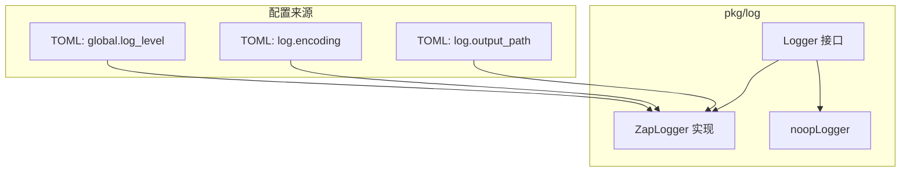
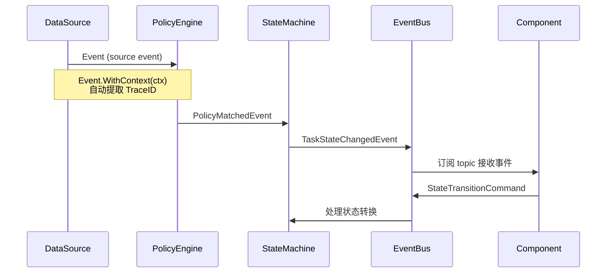
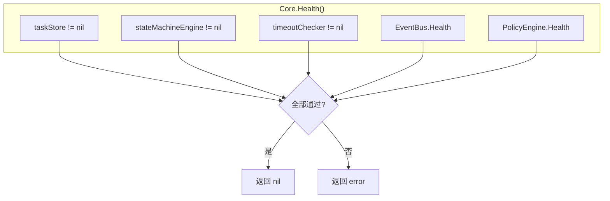
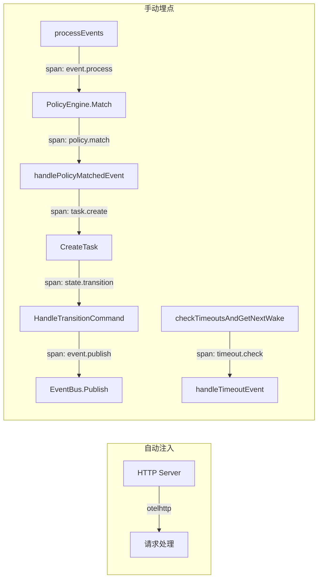
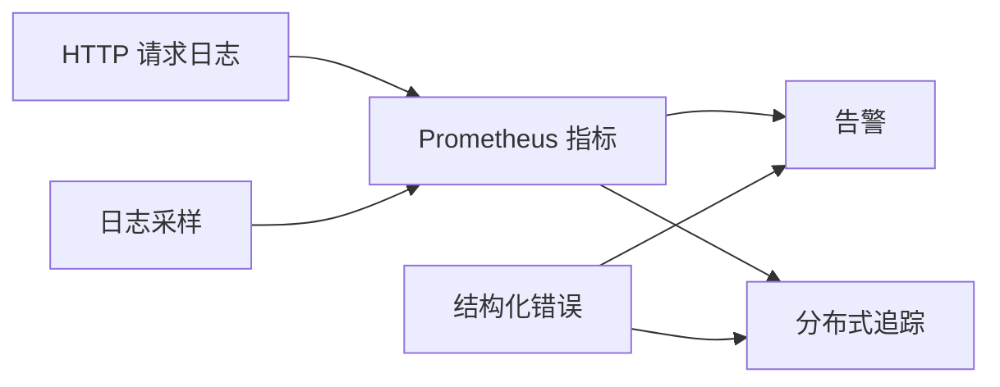

# Nuts 可观测性文档

基于现有代码实现，整理 Nuts 框架的日志、指标、追踪、健康检查、调试等可观测能力。

---

## 1. 概览

Nuts 提供以下可观测能力：

| 维度 | 能力 | 实现位置 |
|------|------|----------|
| 日志 | 结构化日志（Zap），支持 console/json 编码 | `pkg/log/` |
| 指标 | MetricsRecorder 接口（7 个计数器） | `pkg/common/metrics.go` |
| 追踪 | TraceID 上下文传播 | `pkg/common/event.go` |
| 健康检查 | Core/EventBus/DataSource/Component 多级检查 | 各模块 Health() 方法 |
| 调试 | `/api/v1/debug/vars` 运行时状态暴露 | `pkg/core/core.go:handleDebugVars` |
| 状态历史 | 任务状态转换全量记录 | `pkg/task/interface.go:StateTransitionRecord` |
| 事件总线 | EventBus 订阅者/丢弃计数/连接状态 | `pkg/eventbus/grpc.go` |
| CLI/TUI | `nuts-cli debug` 和 TUI Debug Tab | `pkg/cli/debug.go`, `pkg/tui/debug_view.go` |

---

## 2. 日志系统

### 2.1 架构



### 2.2 Logger 接口

文件：`pkg/log/interface.go`

```go
type Logger interface {
    Debug(msg string, fields ...Field)
    Info(msg string, fields ...Field)
    Warn(msg string, fields ...Field)
    Error(msg string, fields ...Field)
    Fatal(msg string, fields ...Field)
    With(fields ...Field) Logger
    Sync() error
}
```

### 2.3 日志字段类型

| 函数 | 类型 | 用途 |
|------|------|------|
| `log.String(key, val)` | string | 字符串字段 |
| `log.Int(key, val)` | int | 整数字段 |
| `log.Error(err)` | error | 错误字段（key 固定为 "error"） |
| `log.Any(key, val)` | any | 任意类型字段 |

### 2.4 日志配置

TOML 配置项：

```toml
[global]
log_level = "info"          # debug / info / warn / error

[log]
encoding = "console"        # console / json
output_path = ""            # 为空输出到 stdout，否则输出到文件
```

初始化流程（`pkg/core/core.go`）：

1. `initLogger()` — 使用默认配置（info + console）初始化
2. `initConfig()` — 加载 TOML 配置
3. `reconfigureLogger()` — 用配置重新创建 logger 并 `log.SetDefault()`

### 2.5 日志使用规范

各模块通过 `log.GetDefault()` 获取全局 logger，或通过 `SetLogger()` 注入：

```go
// 全局默认
logger := log.GetDefault()

// 模块注入
c.Logger = logger
grpcEventBus.SetLogger(c.Logger)
engine.SetLogger(c.Logger)
dataSourceManager.SetLogger(c.Logger)
```

### 2.6 关键日志点

| 模块 | 级别 | 场景 | 关键字段 |
|------|------|------|----------|
| Core | Info | 启动/停止各组件 | 组件名 |
| Core | Error | 策略匹配失败 | error |
| Core | Warn | policyMatchedCh 满丢弃 | - |
| Core | Error | 任务创建失败 | error |
| Core | Warn | 孤儿任务恢复 | task_id, state |
| Core | Error | 状态转换失败 | task_id, from, to, error |
| TimeoutChecker | Warn | 任务超时 | task_id, state, state_updated_at |
| TimeoutChecker | Info | 超时检查完成 | total_checked, timeout_count, next_wake |
| ArchiveCleaner | Info | 清理旧归档任务 | count, retention |
| ArchiveCleaner | Error | 清理失败 | task_id, error |
| EventBus | Warn | 事件丢弃（channel 满） | topic, subscriber_id, total_dropped |
| EventBus | Warn | gRPC 订阅重连 | topic, retry, error |
| EventBus | Info | 事件分发 | topic, subscribers |
| StateMachineEngine | Warn | PayloadBuilder 未找到 | builder |
| DataSourceManager | Info | 数据源启停 | name |
| TaskStore | Error | 读取/反序列化任务失败 | key/id, error |
| TaskStore | Warn | List 跳过错误任务 | skipped, total_keys, returned |

---

## 3. 指标系统

### 3.1 MetricsRecorder 接口

文件：`pkg/common/metrics.go`

```go
type MetricsRecorder interface {
    TaskCreated()                           // 任务创建计数
    TaskStateTransition(from, to string)    // 状态转换计数（带 from/to 标签）
    TaskTimeout()                           // 超时计数
    TaskRetry()                             // 重试计数
    TaskArchived()                          // 归档计数
    TaskDeleted()                           // 归档清理删除计数
    TaskError()                             // 错误计数
}
```

### 3.2 指标采集点

| 指标 | 触发位置 | 触发条件 |
|------|----------|----------|
| `TaskCreated` | `state_machine_engine.go:CreateTask` | 任务创建成功后 |
| `TaskStateTransition` | `state_machine_engine.go:HandleTransitionCommand` | 状态转换成功后 |
| `TaskTimeout` | `timeout_checker.go:checkTimeoutsAndGetNextWake` | 检测到任务超时 |
| `TaskRetry` | `state_machine_engine.go:HandleTransitionCommand` | 重试（clearArchived=true） |
| `TaskArchived` | `state_machine_engine.go:HandleTransitionCommand` | 归档（setArchivedAt!=nil） |
| `TaskDeleted` | `archive.go:cleanup` | 归档清理删除任务 |
| `TaskError` | `state_machine_engine.go:HandleTransitionCommand` | TransitionState 失败 |

### 3.3 当前实现

- **NoopMetricsRecorder**：默认空实现，所有方法为空操作
- 无内置 Prometheus/StatsD 适配器
- 通过 `SetMetrics()` 注入到 `StateMachineEngine`、`ArchiveCleaner`、`TimeoutChecker`

### 3.4 扩展方式

实现 `MetricsRecorder` 接口并注入：

```go
type PrometheusMetrics struct {
    taskCreated *prometheus.CounterVec
    // ...
}

func (p *PrometheusMetrics) TaskCreated() {
    p.taskCreated.WithLabelValues().Inc()
}

// 注入
core.Metrics = &PrometheusMetrics{...}
core.stateMachineEngine.SetMetrics(core.Metrics)
core.archiveCleaner.SetMetrics(core.Metrics)
core.timeoutChecker.SetMetrics(core.Metrics)
```

---

## 4. 链路追踪

### 4.1 TraceID 传播

文件：`pkg/common/event.go`

```go
// 存入 context
func ContextWithTraceID(ctx context.Context, traceID string) context.Context

// 从 context 提取
func TraceIDFromContext(ctx context.Context) string
```

### 4.2 Event 中的 TraceID

每个 Event 结构体包含 `TraceID` 字段：

```go
type Event struct {
    ID        string    `json:"id"`         // UUID
    Type      string    `json:"type"`       // 事件类型
    Topic     string    `json:"topic"`      // 路由主题
    TraceID   string    `json:"trace_id"`   // 链路追踪 ID
    Source    string    `json:"source"`     // 来源
    Timestamp time.Time `json:"timestamp"`
    // ...
}
```

### 4.3 TraceID 传播链路



### 4.4 使用方式

```go
// 创建带 TraceID 的 context
ctx := common.ContextWithTraceID(context.Background(), "trace-123")

// 创建事件时自动提取 TraceID
event := common.NewEvent("type", "topic", "source").WithContext(ctx)
// event.TraceID == "trace-123"
```

---

## 5. 健康检查

### 5.1 多级健康检查



### 5.2 各模块健康检查

| 模块 | 方法 | 检查内容 |
|------|------|----------|
| Core | `Health()` | taskStore/stateMachineEngine/timeoutChecker 非 nil + EventBus/PolicyEngine 健康 |
| GRPCEventBus | `Health()` | gRPC 连接状态 == Ready |
| NoopEventBus | `Health()` | 始终返回 nil |
| DataSourceManager | `Health(name)` | 指定数据源的 Health() |
| DataSourceManager | `HealthAll()` | 所有活跃数据源的健康状态 map |
| BaseComponent | `Health()` | EventBus 连接健康 |
| DataSource | `Health()` | 各数据源自检（如 NRI socket 连接） |

### 5.3 HTTP 状态端点

`GET /api/v1/status` 返回服务基本信息：

```json
{
    "code": 0,
    "data": {
        "status": "running",
        "version": "0.1.0",
        "address": "tcp://0.0.0.0:8080"
    }
}
```

---

## 6. 调试端点

### 6.1 `/api/v1/debug/vars`

文件：`pkg/core/core.go:handleDebugVars`

返回运行时状态，用于运维排障。需要 Bearer Token 认证。

**请求：**

```bash
curl -H "Authorization: Bearer <token>" http://localhost:8080/api/v1/debug/vars
```

**响应结构：**

```json
{
    "goroutines": 42,
    "num_cpu": 8,
    "go_version": "go1.21.0",
    "started": true,
    "stopped": false,
    "memory": {
        "alloc_bytes": 1048576,
        "total_alloc_bytes": 4194304,
        "sys_bytes": 8388608,
        "heap_alloc_bytes": 1048576,
        "heap_sys_bytes": 4194304,
        "gc_cycles": 5
    },
    "task_queue": {
        "pending": 3,
        "processing": 1,
        "completed": 10,
        "failed": 2,
        "active_total": 6,
        "archived_total": 10
    },
    "eventbus": {
        "has_subscribers": true
    }
}
```

### 6.2 字段说明

| 字段 | 类型 | 说明 |
|------|------|------|
| `goroutines` | int | 当前 goroutine 数量 |
| `num_cpu` | int | CPU 核心数 |
| `go_version` | string | Go 运行时版本 |
| `started` | bool | Core 是否已启动 |
| `stopped` | bool | Core 是否已停止 |
| `memory.alloc_bytes` | uint64 | 当前堆内存分配量 |
| `memory.total_alloc_bytes` | uint64 | 累计分配量 |
| `memory.sys_bytes` | uint64 | 从 OS 获取的内存 |
| `memory.heap_alloc_bytes` | uint64 | 堆分配量 |
| `memory.heap_sys_bytes` | uint64 | 堆系统内存 |
| `memory.gc_cycles` | uint32 | GC 次数 |
| `task_queue.<state>` | int | 各状态任务数量（从配置动态获取） |
| `task_queue.active_total` | int | 活跃任务总数 |
| `task_queue.archived_total` | int | 已归档任务总数 |
| `eventbus.has_subscribers` | bool | 是否有远程订阅者 |

### 6.3 任务队列统计逻辑

`task_queue` 的状态列表**从状态机配置动态获取**，非硬编码：

```go
smConfig := c.stateMachineEngine.GetStateMachineConfig()
for state := range smConfig.States {
    count, _ := c.taskStore.Count(task.TaskFilter{State: task.TaskState(state)})
    queueDepth[state] = count
}
```

`Count()` 对纯 State 过滤有 O(1) 快速路径（直接读 `stateIndex` 长度）。

---

## 7. 任务状态历史

### 7.1 StateTransitionRecord

文件：`pkg/task/interface.go`

```go
type StateTransitionRecord struct {
    From        TaskState `json:"from"`         // 源状态
    To          TaskState `json:"to"`           // 目标状态
    Timestamp   time.Time `json:"timestamp"`    // 转换时间
    TriggeredBy string    `json:"triggered_by"` // 触发来源（组件名/系统）
    Reason      string    `json:"reason"`       // 转换原因
    Attempt     int       `json:"attempt"`      // 当前状态尝试次数
}
```

### 7.2 记录时机

| 场景 | 方法 | TriggeredBy |
|------|------|-------------|
| 任务创建 | `UpdateStateWithRecord` | "system" |
| 组件状态转换 | `TransitionState` | 组件名称（如 "processing-handler"） |
| 超时重试 | `HandleTransitionCommand` | "timeout-handler" |
| 超时归档 | `HandleTransitionCommand` | "timeout-handler" |

### 7.3 查询方式

**HTTP API：**

```
GET /api/v1/tasks/{id}/history
```

返回 `[]StateTransitionRecord`，按时间顺序。

**代码调用：**

```go
history, err := stateMachineEngine.GetTaskHistory(taskID)
```

### 7.4 历史裁剪

`maxStateHistory` 控制最大保留条目数（默认 100），超限时裁剪旧记录：

```go
if s.maxStateHistory > 0 && len(task.StateHistory) > s.maxStateHistory {
    task.StateHistory = task.StateHistory[len(task.StateHistory)-s.maxStateHistory:]
}
```

---

## 8. EventBus 可观测

### 8.1 事件主题

| 主题格式 | 用途 | 示例 |
|----------|------|------|
| `task.state_changed_<state>` | 任务状态变更通知 | `task.state_changed_pending` |
| `state.transition.command` | 外部组件请求状态转换 | - |
| `policy.matched` | 策略匹配成功（内部 channel） | - |

### 8.2 EventBus 监控指标

| 指标 | 来源 | 说明 |
|------|------|------|
| `dropCount` | `GRPCEventBus` (atomic.Int64) | channel 满时丢弃的事件总数 |
| `HasSubscribers(topic)` | `GRPCEventBus` | 指定 topic 是否有订阅者 |
| `HasAnyRemoteSubscribers()` | `GRPCEventBus` | 是否有任何远程订阅者 |
| 连接状态 | `Health()` → `clientConn.GetState()` | gRPC 连接是否 Ready |

### 8.3 丢弃事件日志

当订阅者 channel 满时（100ms 超时），记录 Warn 日志：

```go
b.logger.Warn("GRPCEventBus: event dropped due to slow subscriber",
    log.String("topic", topic),
    log.String("subscriber_id", sub.ID),
    log.Int("total_dropped", int(count)))
```

日志采样策略：前 3 条全量记录，之后每 1000 条记录一次。

### 8.4 gRPC 重连日志

订阅断开后自动重连（指数退避 1s→2s→4s→...→60s max）：

```go
b.logger.Warn("gRPC subscribe stream broken, reconnecting...",
    log.String("topic", topic),
    log.Int("retry", retry),
    log.Error(err))
```

---

## 9. 数据源可观测

### 9.1 DataSourceStats

文件：`pkg/datasource/interface.go`

```go
type DataSourceStats struct {
    EventsReceived int64     // 接收事件总数
    EventsSent     int64     // 发送事件总数
    EventsDropped  int64     // 丢弃事件总数
    LastEventTime  time.Time // 最后事件时间
    Connected      bool      // 是否已连接
    Uptime         time.Duration // 运行时长
}
```

### 9.2 查询方式

```go
// 单个数据源
stats, err := dataSourceManager.GetStats("nri")

// 所有活跃数据源
allStats := dataSourceManager.GetAllStats()

// 健康状态
healthMap := dataSourceManager.HealthAll()
```

---

## 10. 错误码体系

文件：`pkg/common/errorcode.go`

| 范围 | 分类 | 示例 |
|------|------|------|
| 0 | 成功 | `CodeSuccess` |
| 1-99 | 系统级 | `CodeInternalError(1)`, `CodeInvalidParam(2)`, `CodeNotFound(5)` |
| 1000-1999 | 数据源 | `CodeDataSourceNotFound(1000)`, `CodeDataSourceConnectFail(1001)` |
| 2000-2999 | 策略引擎 | `CodePolicyNotFound(2000)`, `CodePolicyInvalidDSL(2001)` |
| 3000-3999 | 任务调度 | `CodeTaskNotFound(3000)`, `CodeTaskInvalidState(3001)` |
| 4000-4999 | EventBus | `CodeEventBusConnectFail(4000)`, `CodeEventPublishFail(4001)` |
| 5000-5999 | 配置 | `CodeConfigInvalid(5000)`, `CodeConfigMissing(5001)` |

错误码自动映射 HTTP 状态码：`ErrorCodeToHTTPStatus()`

---

## 11. CLI/TUI 调试工具

### 11.1 nuts-cli debug

文件：`pkg/cli/debug.go`

```bash
nuts-cli debug
```

调用 `GET /api/v1/debug/vars`，pretty-print JSON 输出。

### 11.2 TUI Debug Tab

文件：`pkg/tui/debug_view.go`

快捷键 `5` 进入 Debug 视图，展示：

- **Runtime**：Goroutines、CPUs、Go Version、Status
- **Memory**：Alloc、Total Alloc、Sys、Heap Alloc、Heap Sys、GC Cycles
- **Task Queue**：per-state 任务数、active total、archived total
- **EventBus**：Subscribers 状态

按 `r` 刷新数据。

---

## 12. 速率限制

### 12.1 事件速率限制

文件：`pkg/core/core.go:initEventLimiter`

```toml
[server]
event_rate_limit = 10    # 每秒事件处理速率
event_burst = 10         # 突发容量
```

使用 `golang.org/x/time/rate` 实现，`processEvents` 中通过 `eventLimiter.Wait(ctx)` 限流。

### 12.2 API 认证

所有 `/api/v1/` 端点需要 Bearer Token 认证：

- 优先读取 `NUTS_AUTH_TOKEN` 环境变量
- 未设置时自动生成随机 token（日志输出 Debug 级别）

---

## 13. 并发安全与可观测

### 13.1 乐观锁

`engineTaskStore` 使用 Version 字段做乐观锁：

```go
if task.Version != existing.Version {
    return fmt.Errorf("task %s: version conflict: expected %d, got %d", ...)
}
```

每次 `putLocked()` 自增 Version。

### 13.2 Per-Key 分段锁

`sync.Map` 存储 `*sync.Mutex`，保护单个任务的 Get→modify→Set 原子性：

```go
func (s *engineTaskStore) getKeyLock(id string) *sync.Mutex {
    v, _ := s.keyLocks.LoadOrStore(id, &sync.Mutex{})
    return v.(*sync.Mutex)
}
```

### 13.3 状态索引

`stateIndex` 二级索引（`map[TaskState][]indexEntry`）加速按状态查询：

- `Count()` O(1) 快速路径
- `listByState()` 索引层分页，避免全量反序列化
- `RWMutex` 保护读写

---

## 14. 配置参考

完整可观测相关配置项：

```toml
[global]
log_level = "info"                    # 日志级别

[log]
encoding = "console"                  # 编码格式
output_path = ""                      # 输出路径

[server]
event_rate_limit = 10                 # 事件速率限制
event_burst = 10                      # 突发容量

[shutdown]
grace_period = 30                     # 优雅关闭等待秒数

[task]
db.type = "memory"                    # 存储类型
db.path = ""                          # 存储路径

[task.scheduler]
timeout_check_interval = "30s"        # 超时检查间隔
policy_matched_buffer_size = 100      # 策略匹配 channel 缓冲

[task.archive]
retention_days = 7                    # 归档保留天数
cleanup_interval = "1h"               # 清理间隔

[eventbus]
type = "grpc"                         # EventBus 类型

[eventbus.grpc]
address = "tcp://0.0.0.0:9090"        # gRPC 地址

[statemachine]
name = "task_lifecycle"
initial_state = "pending"
terminal_states = ["completed", "failed", "cancelled", "timeout"]

[statemachine.states.pending]
description = "待执行"
state_timeout = "5m"
auto_retry = true
max_retries = 3
retry_to_state = "pending"
```

---

## 15. 待增强项方案

### 15.1 Prometheus 指标

**现状**：`MetricsRecorder` 接口已定义 7 个计数器，仅有 `NoopMetricsRecorder` 空实现。

**目标**：实现 Prometheus 适配器，在 HTTP Server 暴露 `/metrics` 端点。

#### 15.1.1 新增依赖

```go
require github.com/prometheus/client_golang v1.20.0
```

#### 15.1.2 实现方案

新建 `pkg/metrics/prometheus.go`：

```go
package metrics

import (
    "github.com/prometheus/client_golang/prometheus"
    "github.com/prometheus/client_golang/prometheus/promauto"
)

type PrometheusMetrics struct {
    taskCreated   *prometheus.CounterVec
    stateTrans    *prometheus.CounterVec
    taskTimeout   prometheus.Counter
    taskRetry     prometheus.Counter
    taskArchived  prometheus.Counter
    taskDeleted   prometheus.Counter
    taskError     prometheus.Counter
}

func NewPrometheusMetrics(namespace string) *PrometheusMetrics {
    reg := promauto.With(prometheus.DefaultRegisterer)
    return &PrometheusMetrics{
        taskCreated: reg.NewCounterVec(prometheus.CounterOpts{
            Namespace: namespace,
            Name:      "task_created_total",
            Help:      "Total number of tasks created",
        }, []string{}),
        stateTrans: reg.NewCounterVec(prometheus.CounterOpts{
            Namespace: namespace,
            Name:      "task_state_transition_total",
            Help:      "Total number of task state transitions",
        }, []string{"from", "to"}),
        taskTimeout: reg.NewCounter(prometheus.CounterOpts{
            Namespace: namespace,
            Name:      "task_timeout_total",
            Help:      "Total number of task timeouts",
        }),
        // ... 其余计数器类似
    }
}

func (p *PrometheusMetrics) TaskCreated() {
    p.taskCreated.WithLabelValues().Inc()
}

func (p *PrometheusMetrics) TaskStateTransition(from, to string) {
    p.stateTrans.WithLabelValues(from, to).Inc()
}

func (p *PrometheusMetrics) TaskTimeout()  { p.taskTimeout.Inc() }
func (p *PrometheusMetrics) TaskRetry()    { p.taskRetry.Inc() }
func (p *PrometheusMetrics) TaskArchived() { p.taskArchived.Inc() }
func (p *PrometheusMetrics) TaskDeleted()  { p.taskDeleted.Inc() }
func (p *PrometheusMetrics) TaskError()    { p.taskError.Inc() }
```

#### 15.1.3 注册端点

在 `pkg/core/core.go:startHTTPServer` 中添加：

```go
import "github.com/prometheus/client_golang/prometheus/promhttp"

mux.Handle("/metrics", promhttp.Handler())
```

#### 15.1.4 初始化流程

```go
// core.go:New() 中根据配置选择实现
metricsType := c.Config.GetString("metrics.type")
switch metricsType {
case "prometheus":
    c.Metrics = metrics.NewPrometheusMetrics("nuts")
default:
    c.Metrics = common.NoopMetricsRecorder{}
}
```

#### 15.1.5 配置

```toml
[metrics]
type = "prometheus"   # noop / prometheus
namespace = "nuts"    # Prometheus 指标前缀
```

#### 15.1.6 暴露的指标

| 指标名 | 类型 | 标签 | 说明 |
|--------|------|------|------|
| `nuts_task_created_total` | Counter | - | 任务创建总数 |
| `nuts_task_state_transition_total` | Counter | from, to | 状态转换总数 |
| `nuts_task_timeout_total` | Counter | - | 超时总数 |
| `nuts_task_retry_total` | Counter | - | 重试总数 |
| `nuts_task_archived_total` | Counter | - | 归档总数 |
| `nuts_task_deleted_total` | Counter | - | 归档清理删除总数 |
| `nuts_task_error_total` | Counter | - | 错误总数 |

#### 15.1.7 可选扩展：Gauge 指标

在 `handleDebugVars` 同周期上报 Gauge：

| 指标名 | 类型 | 说明 |
|--------|------|------|
| `nuts_goroutines` | Gauge | goroutine 数量 |
| `nuts_memory_alloc_bytes` | Gauge | 堆内存分配量 |
| `nuts_task_queue_depth` | Gauge | 各状态任务队列深度（带 state 标签） |
| `nuts_eventbus_dropped_total` | Counter | EventBus 丢弃事件总数 |

#### 15.1.8 文件变更

| 文件 | 变更 |
|------|------|
| `pkg/metrics/prometheus.go` | **新建** — PrometheusMetrics 实现 |
| `pkg/common/metrics.go` | 不变 — 接口已存在 |
| `pkg/core/core.go` | 修改 — 初始化 Metrics + 注册 `/metrics` 端点 |
| `go.mod` | 修改 — 新增 prometheus/client_golang 依赖 |

---

### 15.2 分布式追踪（OpenTelemetry）

**现状**：`Event.TraceID` 字段手动传播，无 span 自动注入。go.mod 已包含 `go.opentelemetry.io/otel v1.39.0`（间接依赖）。

**目标**：集成 OpenTelemetry，在关键路径自动创建 span。

#### 15.2.1 新增依赖

```go
require (
    go.opentelemetry.io/otel v1.39.0
    go.opentelemetry.io/otel/trace v1.39.0
    go.opentelemetry.io/otel/sdk v1.39.0
    go.opentelemetry.io/contrib/instrumentation/net/http/otelhttp v0.45.0
)
```

#### 15.2.2 Tracer 初始化

新建 `pkg/trace/provider.go`：

```go
package trace

import (
    "context"
    "go.opentelemetry.io/otel"
    "go.opentelemetry.io/otel/exporters/otlp/otlptrace/otlptracegrpc"
    "go.opentelemetry.io/otel/sdk/resource"
    sdktrace "go.opentelemetry.io/otel/sdk/trace"
    semconv "go.opentelemetry.io/otel/semconv/v1.26.0"
)

func InitTracer(ctx context.Context, endpoint, serviceName string) (*sdktrace.TracerProvider, error) {
    exporter, err := otlptracegrpc.New(ctx,
        otlptracegrpc.WithEndpoint(endpoint),
        otlptracegrpc.WithInsecure(),
    )
    if err != nil {
        return nil, err
    }

    tp := sdktrace.NewTracerProvider(
        sdktrace.WithBatcher(exporter),
        sdktrace.WithResource(resource.NewWithAttributes(
            semconv.SchemaURL,
            semconv.ServiceName(serviceName),
        )),
    )
    otel.SetTracerProvider(tp)
    return tp, nil
}
```

#### 15.2.3 关键埋点位置



#### 15.2.4 HTTP 服务埋点

将 `authMiddleware` 改为链式中间件：

```go
import "go.opentelemetry.io/contrib/instrumentation/net/http/otelhttp"

c.HTTPServer = &http.Server{
    Handler: otelhttp.NewHandler(
        authMiddleware(mux),
        "nuts-http",
        otelhttp.WithMessageEvents(otelhttp.ReadEvents, otelhttp.WriteEvents),
    ),
}
```

#### 15.2.5 业务逻辑埋点

在 `pkg/core/core.go` 关键方法中注入 span：

```go
func (c *Core) processEvents(eventCh <-chan *common.Event) {
    tracer := otel.Tracer("nuts-core")
    // ...
    case event := <-eventCh:
        ctx, span := tracer.Start(c.ctx, "event.process",
            trace.WithAttributes(
                attribute.String("event.type", event.Type),
                attribute.String("event.source", event.Source),
            ),
        )
        matches, err := c.PolicyEngine.Match(ctx, event)
        // ...
        span.End()
}
```

#### 15.2.6 TraceID 关联

将 OTel span 的 TraceID 写入 Event，保持与现有 TraceID 机制兼容：

```go
import "go.opentelemetry.io/otel/trace"

func eventWithSpan(ctx context.Context, event *common.Event) *common.Event {
    spanCtx := trace.SpanContextFromContext(ctx)
    if spanCtx.IsValid() {
        event.TraceID = spanCtx.TraceID().String()
    }
    return event.WithContext(ctx)
}
```

#### 15.2.7 配置

```toml
[tracing]
enabled = false
endpoint = "localhost:4317"     # OTLP gRPC collector 地址
service_name = "nuts"
sample_rate = 1.0               # 采样率 0.0~1.0
```

#### 15.2.8 文件变更

| 文件 | 变更 |
|------|------|
| `pkg/trace/provider.go` | **新建** — Tracer 初始化 |
| `pkg/core/core.go` | 修改 — processEvents/handlePolicyMatchedEvent/HandleTransitionCommand 等埋点 |
| `pkg/core/core.go` | 修改 — HTTP Server 包裹 otelhttp 中间件 |
| `pkg/common/event.go` | 不变 — TraceID 字段已存在，otel TraceID 写入即可 |
| `go.mod` | 修改 — 提升 otel 相关包为直接依赖 |

---

### 15.3 日志采样

**现状**：仅 EventBus 丢弃日志有手动采样（前 3 条全量，之后每 1000 条）。其他高频日志点无采样。

**目标**：利用 Zap 内置采样能力，对高频日志统一降频。

#### 15.3.1 Zap Sampling Core

Zap 自带 `zap.WrapCore` + `zap.NewSamplingCore`，无需新依赖：

```go
import "go.uber.org/zap/zapcore"

func NewSamplingZapLogger(cfg ZapConfig) (*ZapLogger, error) {
    logger, err := NewZapLoggerWithConfig(cfg)
    if err != nil {
        return nil, err
    }

    // 包裹 SamplingCore：同一日志每秒最多输出 1 条，每分钟记录一次摘要
    sampling := zap.WrapCore(func(core zapcore.Core) zapcore.Core {
        return zapcore.NewSamplingCore(core, zapcore.SamplingConfig{
            Initial:    3,              // 前 3 条全量输出
            Thereafter: 1000,           // 之后每 1000 条采样 1 条
            Tick:       time.Second,    // 每秒重置计数器
        })
    })

    zapLogger := logger.logger.WithOptions(sampling)
    return &ZapLogger{
        logger: zapLogger,
        sugar:  zapLogger.Sugar(),
    }, nil
}
```

#### 15.3.2 分级采样策略

对不同模块使用不同采样参数：

| 场景 | Initial | Thereafter | Tick | 说明 |
|------|---------|------------|------|------|
| EventBus 丢弃 | 3 | 1000 | 1s | 已有手动实现，可替换为 Zap Sampling |
| TaskStore 读取失败 | 5 | 100 | 1s | 存储异常需要更多上下文 |
| 策略匹配错误 | 3 | 50 | 1s | 匹配错误频率较低，全量有价值 |
| 超时检查 | 1 | 100 | 10s | 超时检查高频但每轮日志类似 |

#### 15.3.3 实现方式

方案 A — **全局采样**（简单）：

在 `reconfigureLogger` 中启用 SamplingCore，所有日志统一采样。

方案 B — **模块级采样**（精确）：

各模块通过 `logger.With()` 创建带采样参数的子 logger：

```go
// EventBus 使用采样 logger
samplingLogger := c.Logger.(interface {
    WithSampling(initial int, thereafter int, tick time.Duration) log.Logger
}).WithSampling(3, 1000, time.Second)
grpcEventBus.SetLogger(samplingLogger)
```

**建议**：采用方案 A，全局统一采样。EventBus 的手动采样逻辑可移除。

#### 15.3.4 配置

```toml
[log]
encoding = "console"
output_path = ""
sampling_enabled = true
sampling_initial = 3
sampling_thereafter = 1000
sampling_tick = "1s"
```

#### 15.3.5 文件变更

| 文件 | 变更 |
|------|------|
| `pkg/log/zap.go` | 修改 — NewZapLoggerWithConfig 增加采样配置 |
| `pkg/log/interface.go` | 修改 — ZapConfig 增加 Sampling 字段 |
| `pkg/core/core.go` | 修改 — reconfigureLogger 传递采样配置 |
| `pkg/eventbus/grpc.go` | 可选 — 移除手动 dropCount 采样逻辑 |

---

### 15.4 HTTP 请求日志中间件

**现状**：HTTP Server 仅有 `authMiddleware`，无请求日志。

**目标**：增加请求日志中间件，记录 method、path、status、latency。

#### 15.4.1 实现方案

新建 `pkg/core/middleware.go`：

```go
package core

import (
    "net/http"
    "time"
    "github.com/sig-cloudnative/nuts/pkg/log"
)

type responseWriter struct {
    http.ResponseWriter
    statusCode int
}

func (rw *responseWriter) WriteHeader(code int) {
    rw.statusCode = code
    rw.ResponseWriter.WriteHeader(code)
}

func loggingMiddleware(logger log.Logger) func(http.Handler) http.Handler {
    return func(next http.Handler) http.Handler {
        return http.HandlerFunc(func(w http.ResponseWriter, r *http.Request) {
            start := time.Now()
            rw := &responseWriter{ResponseWriter: w, statusCode: 200}

            next.ServeHTTP(rw, r)

            latency := time.Since(start)
            logger.Info("HTTP request",
                log.String("method", r.Method),
                log.String("path", r.URL.Path),
                log.Int("status", rw.statusCode),
                log.String("latency", latency.String()),
                log.String("remote", r.RemoteAddr),
            )
        })
    }
}
```

#### 15.4.2 中间件链

修改 `pkg/core/core.go:startHTTPServer`：

```go
c.HTTPServer = &http.Server{
    Handler: loggingMiddleware(c.Logger)(
        authMiddleware(mux),
    ),
}
```

完整链路：`loggingMiddleware → authMiddleware → mux`

#### 15.4.3 日志输出示例

```json
{
  "level": "info",
  "msg": "HTTP request",
  "method": "GET",
  "path": "/api/v1/tasks",
  "status": 200,
  "latency": "1.234ms",
  "remote": "127.0.0.1:54321"
}
```

#### 15.4.4 可选增强

| 增强项 | 说明 |
|--------|------|
| RequestID | 从请求头提取或自动生成，写入 response header |
| 跳过健康检查 | `/api/v1/status` 不记录日志 |
| 错误日志级别 | status >= 500 使用 Error 级别 |
| 慢请求告警 | latency > 阈值使用 Warn 级别 |

#### 15.4.5 文件变更

| 文件 | 变更 |
|------|------|
| `pkg/core/middleware.go` | **新建** — loggingMiddleware |
| `pkg/core/core.go` | 修改 — startHTTPServer 包裹 loggingMiddleware |

---

### 15.5 告警

**现状**：无告警机制，指标和日志仅用于事后排查。

**目标**：基于 MetricsRecorder 采集的指标，在运行时检测异常并输出告警日志。

#### 15.5.1 方案选型

| 方案 | 复杂度 | 说明 |
|------|--------|------|
| **日志告警** | 低 | 在指标回调中检测阈值，输出 Warn/Error 日志 |
| Prometheus Alertmanager | 中 | 配置 alerting rules，依赖外部组件 |
| Webhook 回调 | 中 | 告警发送到外部系统（Slack/钉钉/PagerDuty） |

**建议**：先实现日志告警（零依赖），后续按需集成 Alertmanager 或 Webhook。

#### 15.5.2 实现方案

新建 `pkg/metrics/alert.go`：

```go
package metrics

import (
    "sync/atomic"
    "time"
    "github.com/sig-cloudnative/nuts/pkg/log"
)

type AlertMetrics struct {
    inner    MetricsRecorder          // 被装饰的实际实现（Prometheus/Noop）
    logger   log.Logger
    config   AlertConfig

    // 滑动窗口计数器
    timeoutWindow  *slidingWindow
    errorWindow    *slidingWindow
}

type AlertConfig struct {
    TimeoutRateThreshold float64       // 超时率阈值（次/秒）
    ErrorRateThreshold   float64       // 错误率阈值（次/秒）
    WindowSize           time.Duration // 滑动窗口大小
    CheckInterval        time.Duration // 检查间隔
}

func NewAlertMetrics(inner MetricsRecorder, logger log.Logger, cfg AlertConfig) *AlertMetrics {
    return &AlertMetrics{
        inner:         inner,
        logger:        logger,
        config:        cfg,
        timeoutWindow: newSlidingWindow(cfg.WindowSize),
        errorWindow:   newSlidingWindow(cfg.WindowSize),
    }
}

func (a *AlertMetrics) TaskTimeout() {
    a.inner.TaskTimeout()
    a.timeoutWindow.Add(1)
    if rate := a.timeoutWindow.Rate(); rate > a.config.TimeoutRateThreshold {
        a.logger.Error("ALERT: task timeout rate exceeded threshold",
            log.Any("current_rate", rate),
            log.Any("threshold", a.config.TimeoutRateThreshold),
        )
    }
}

func (a *AlertMetrics) TaskError() {
    a.inner.TaskError()
    a.errorWindow.Add(1)
    if rate := a.errorWindow.Rate(); rate > a.config.ErrorRateThreshold {
        a.logger.Error("ALERT: task error rate exceeded threshold",
            log.Any("current_rate", rate),
            log.Any("threshold", a.config.ErrorRateThreshold),
        )
    }
}
```

#### 15.5.3 滑动窗口

```go
type slidingWindow struct {
    buckets []bucket
    size    time.Duration
}

type bucket struct {
    start time.Time
    count int64
}

func (w *slidingWindow) Add(n int)          { /* ... */ }
func (w *slidingWindow) Rate() float64      { return float64(total) / w.size.Seconds() }
```

#### 15.5.4 告警规则

| 告警 | 条件 | 级别 | 说明 |
|------|------|------|------|
| 超时率过高 | timeout_rate > 10/s | Error | 可能是状态机配置不合理或下游组件故障 |
| 错误率过高 | error_rate > 20/s | Error | 系统异常，需排查 |
| EventBus 丢弃率 | drop_rate > 100/s | Warn | 订阅者处理能力不足 |
| 队列深度积压 | pending > 1000 | Warn | 任务消费能力不足 |
| goroutine 泄漏 | goroutines > 10000 | Error | 可能存在 goroutine 泄漏 |

#### 15.5.5 配置

```toml
[metrics.alert]
enabled = false
timeout_rate_threshold = 10.0
error_rate_threshold = 20.0
window_size = "1m"
check_interval = "10s"
```

#### 15.5.6 文件变更

| 文件 | 变更 |
|------|------|
| `pkg/metrics/alert.go` | **新建** — AlertMetrics 装饰器 |
| `pkg/metrics/sliding_window.go` | **新建** — 滑动窗口计数器 |
| `pkg/core/core.go` | 修改 — 初始化时包裹 AlertMetrics |

---

### 15.6 结构化错误

**现状**：`ErrorCode` 仅用于 API 响应构造（`ErrorWithCode`），内部错误使用 `fmt.Errorf` 字符串。

**目标**：内部错误也携带 ErrorCode，便于日志分类统计和指标聚合。

#### 15.6.1 错误类型定义

新建 `pkg/common/app_error.go`：

```go
package common

import "fmt"

type AppError struct {
    Code    ErrorCode
    Message string
    Cause   error
}

func (e *AppError) Error() string {
    if e.Cause != nil {
        return fmt.Sprintf("[%d] %s: %v", e.Code, e.Message, e.Cause)
    }
    return fmt.Sprintf("[%d] %s", e.Code, e.Message)
}

func (e *AppError) Unwrap() error { return e.Cause }

func NewAppError(code ErrorCode, msg string) *AppError {
    return &AppError{Code: code, Message: msg}
}

func WrapError(code ErrorCode, cause error, msg string) *AppError {
    return &AppError{Code: code, Message: msg, Cause: cause}
}

// IsAppError 从 error 中提取 AppError
func IsAppError(err error) (*AppError, bool) {
    var appErr *AppError
    if As(err, &appErr) {
        return appErr, true
    }
    return nil, false
}
```

#### 15.6.2 使用场景

```go
// 之前
return fmt.Errorf("task not found: %w", err)

// 之后
return common.WrapError(common.CodeTaskNotFound, err, "get task")
```

#### 15.6.3 日志集成

在日志中自动提取 ErrorCode 字段：

```go
func ErrorWithCode(err error) Field {
    if appErr, ok := common.IsAppError(err); ok {
        return Field{Key: "error_code", Value: int(appErr.Code)}
    }
    return Field{Key: "error", Value: err}
}
```

日志输出：

```json
{
  "level": "error",
  "msg": "Failed to create task",
  "error": "[3000] get task: not found",
  "error_code": 3000
}
```

#### 15.6.4 指标集成

在 `PrometheusMetrics` 中增加按 ErrorCode 分类的错误计数：

```go
taskErrorByCode *prometheus.CounterVec

// 在 TaskError 中按 code 分类
func (p *PrometheusMetrics) TaskErrorWithCode(code ErrorCode) {
    p.taskErrorByCode.WithLabelValues(fmt.Sprintf("%d", code)).Inc()
}
```

#### 15.6.5 API 响应映射

`AppError` 可自动映射到 API 响应：

```go
func writeError(w http.ResponseWriter, err error) {
    if appErr, ok := common.IsAppError(err); ok {
        httpStatus := common.ErrorCodeToHTTPStatus(appErr.Code)
        w.WriteHeader(httpStatus)
        json.NewEncoder(w).Encode(common.Error(int(appErr.Code), appErr.Message))
    } else {
        w.WriteHeader(500)
        json.NewEncoder(w).Encode(common.Error(int(common.CodeInternalError), err.Error()))
    }
}
```

#### 15.6.6 ErrorCode 补充

当前 ErrorCode 缺少部分场景，建议补充：

```go
// 任务调度错误 (3000-3999) — 补充
CodeTaskStateMismatch  ErrorCode = 3004 // 状态不匹配
CodeTaskTransitionDenied ErrorCode = 3005 // 转换不允许
CodeTaskVersionConflict  ErrorCode = 3006 // 版本冲突

// EventBus错误 (4000-4999) — 补充
CodeEventBusTimeout    ErrorCode = 4002 // EventBus 超时
CodeEventSubscribeFail ErrorCode = 4003 // 订阅失败
```

#### 15.6.7 文件变更

| 文件 | 变更 |
|------|------|
| `pkg/common/app_error.go` | **新建** — AppError 类型 |
| `pkg/common/errorcode.go` | 修改 — 补充 ErrorCode 常量 |
| `pkg/core/core.go` | 修改 — 错误处理使用 AppError |
| `pkg/task/engine_store.go` | 修改 — 存储错误使用 AppError |
| `pkg/task/state_machine_engine.go` | 修改 — 引擎错误使用 AppError |
| `pkg/log/interface.go` | 修改 — ErrorWithCode 字段函数 |

---

### 15.7 实施优先级

| 优先级 | 项目 | 工作量 | 依赖 | 理由 |
|--------|------|--------|------|------|
| P0 | HTTP 请求日志 | 0.5d | 无 | 零依赖，立即可观测 API 调用 |
| P0 | 日志采样 | 0.5d | 无 | Zap 内置能力，防止日志风暴 |
| P1 | Prometheus 指标 | 1d | prometheus/client_golang | 标准化指标暴露，接入 Grafana |
| P1 | 结构化错误 | 1d | 无 | 提升排障效率，为告警奠基 |
| P2 | 告警 | 2d | P1（结构化错误）+ Prometheus | 依赖指标和错误码就绪 |
| P2 | 分布式追踪 | 2d | OTel SDK | 多组件部署时价值最大 |

#### 15.7.1 实施顺序



阶段 1（1 天）：HTTP 请求日志 + 日志采样 — 立即提升日志可观测性
阶段 2（2 天）：Prometheus 指标 + 结构化错误 — 指标体系和错误分类
阶段 3（4 天）：告警 + 分布式追踪 — 完整可观测闭环
